# CrusadeForceVersion

A `CrusadeForceVersion` is an immutable snapshot of a `CrusadeForce`'s Order of Battle at a moment in time. It is the v3.28 replacement for what was previously `RosterApproved` (an immutable, approved snapshot) and `RosterDraft` (work-in-progress before approval).

## Fields

```ts
CrusadeForceVersion {
  id, crusadeForceId,
  versionNumber,                     // monotonic integer per force (1, 2, 3, ...)
  blobId,                            // MinIO: raw NR "Export Crusade Force" JSON
  sourceParserVersion,               // e.g. 'bs-roster-parser@1.0.0'
  parserOutputJson,                  // output of the Python parser subprocess
  appParseOutputJson,                // output of the TS app-side parser pass
  totalSupplyLimit,                  // force-level supply limit (per NR data)
  totalRp,                           // requisition points at this version
  approvedAt?, approvedByUserId?,
  rejectedAt?, rejectionReason?,
  createdAt
}
```

## Lifecycle

```mermaid
stateDiagram-v2
    [*] --> parsing : upload NR Crusade Force export
    parsing --> pending_review : parse-job OK (includes v3.28 export-type validation)
    parsing --> failed : parse-job error
    pending_review --> pending_approval : player submits
    pending_review --> failed : rule-check-job error (terminal)
    pending_approval --> pending_review : CM requests changes
    pending_approval --> rejected : CM rejects
    pending_approval --> approved : CM approves
    approved --> [*] : immutable; force.currentVersionId advances
```



## Versioning semantics

- `versionNumber` is monotonic per `crusadeForceId`. v1, v2, v3, ... forever.
- Approved versions never change. Replacing requires a new version.
- A force's `currentVersionId` always points to the latest **approved** version, never a pending or rejected one.
- Battle updates and requisition approvals diff against `currentVersionId`.

## Battle-update gating

Per PRD-4 §6: a battle update can only be filed if the relevant `CrusadeForce` has a `currentVersionId` AND the force is in `deployed` status (not `pending_approval` or `withdrawn`).

# Cross-references

- [PRD-0 — Overview](/prds/prd-0-overview.md) — Schema definition
- [PRD-3 — Roster Import, Approval, & Rule Compliance](/prds/prd-3-army-export-versioning.md) — Upload pipeline; rule checks; supply-exceeded warn-only rule
- [PRD-5 — Approval System](/prds/prd-5-approval-system.md) — `crusade_force_update` ApprovalKind; revert (pending → new) and rollback (active → prior approved)
- [CrusadeForce](/concepts/crusade-force.md) — Parent entity
- [CrusadeArmy](/concepts/crusade-army.md) — Mustered from a `CrusadeForceVersion` for a battle
- [BattleReportForm](/concepts/battle-report-form.md) — Per-campaign JSON Schema for the post-battle update form
- [ChangesetGrouping](/concepts/changeset-grouping.md) — Groupings G1–G7 around version snapshots
- [HistoryEntry](/concepts/history-entry.md) — Generated on version approval
- [Rollback](/concepts/rollback.md) — Rolling the active version back to a prior approved one
- [New Recruit](/references/new-recruit-json.md) — Source of version data (Export Crusade Force)
- [bs-roster-parser](/references/bs-roster-parser.md) — Python parser producing the version summary