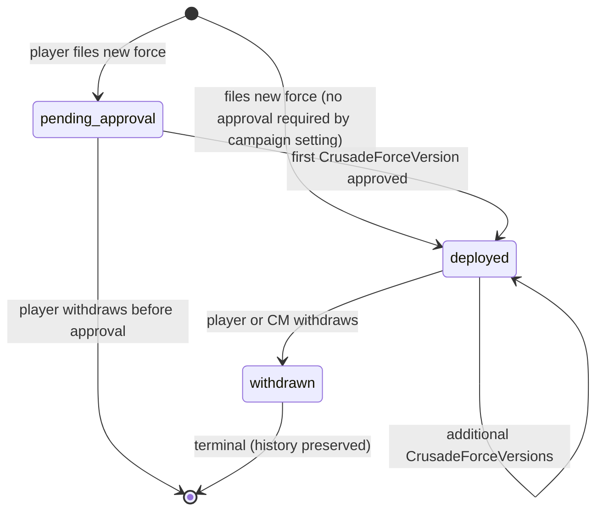

# CrusadeForce

A Crusade Force is a player's army in this campaign. It is their entire Order of Battle — every unit they own and have registered.

**v3.28 data model overhaul** replaces the prior `Roster / RosterDraft / RosterApproved` model with `CrusadeForce / CrusadeForceVersion / CrusadeArmy`. This change reflects how 40K Crusade actually works: a player's force (their full OoB) is distinct from a mustered army (the subset taken to a specific battle).

## Fields

```ts
CrusadeForce {
  id, campaignMemberId, teamId,
  name,                              // player-given, e.g. "Cadian 67th"
  factionId,                         // FK to Faction (per PRD-0 §4); immutable for force's lifetime
  status: 'pending_approval' | 'deployed' | 'withdrawn',
  createdAt,
  withdrawnAt?,
  currentVersionId?                  // FK to latest approved CrusadeForceVersion
}
```

## Lifecycle



## Multiple forces per player

Per `Campaign.maxCrusadeForcesPerPlayer` (default 2 in v3.28). A player can:
- Run multiple factions (one force per faction on different teams)
- Maintain separate forces on different teams in the same campaign
- Faction change is achieved by creating a new force on the desired team; the old force is withdrawn, history preserved

## Data retention (v3.28)

A `CrusadeForce` is never hard-deleted. Status transitions are reversible only in the sense that `withdrawn` force history is still queryable. All associated `CrusadeForceVersion`, `CrusadeArmy`, `HistoryEntry`, and `Battle` rows are preserved through any status change.

# Cross-references

- [PRD-0 — Overview](/prds/prd-0-overview.md) — Schema definition (CrusadeForce row)
- [PRD-1 — CM Administration](/prds/prd-1-crusade-master-admin.md) — CM authority to make force-level changes (manual edit, mass rebans)
- [PRD-2 — Player Sign-Up](/prds/prd-2-player-signup.md) — Player onboarding creates their first force
- [PRD-3 — Roster Import, Approval, & Rule Compliance](/prds/prd-3-army-export-versioning.md) — Upload pipeline creates new versions; rule checks fire
- [PRD-4 — Events, Submissions, & Timeline](/prds/prd-4-events-deltas.md) — Force lifecycle events; `CrusadeForce.withdrawn` event
- [PRD-5 — Approval System](/prds/prd-5-approval-system.md) — `crusade_force_update` and `crusade_force_creation` ApprovalKinds
- [New Recruit](/references/new-recruit-json.md) — Source of force OoB (Export Crusade Force)
- [bs-roster-parser](/references/bs-roster-parser.md) — Python parser that produces the force summary