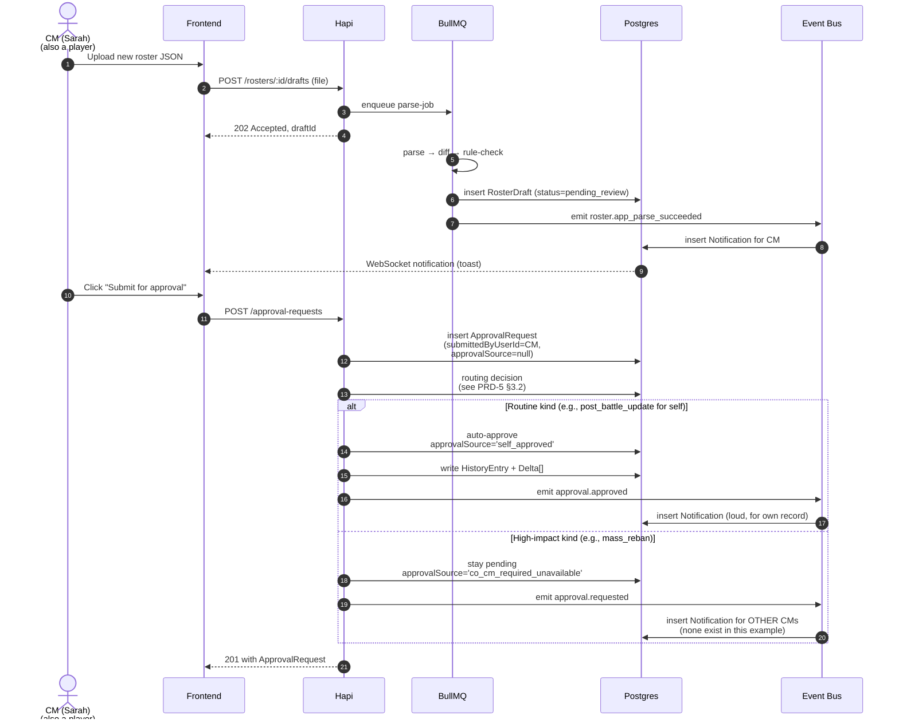

# Crusade Team Leader

## 5. CM-as-Player (v3.11: also covers Crusade Team Leader as Player)

A CM is allowed to be a player in their own campaign. **A Crusade Team Leader is by definition a player on their team** (per [PRD-0](/prds/prd-0-overview.md) §3b). The CM-as-player and Team-Leader-as-player patterns share most of this behavior.

- **CM-as-player:**
  - "Playing in your own campaign" badge shown next to their name
  - **All CM-as-player's deltas auto-approve, but still go through the full pipeline.** [PRD-0](/prds/prd-0-overview.md) §4b's approval-gating principle still applies — the system creates the `ApprovalRequest`, runs rule checks, persists the diff, fires events, and emits notifications. The only thing skipped is the wait for a human approver.
  - **High-impact kinds with CM-only authority** (`mass_reban`, `point_cap_change`, `roster_manual_edit`, `requisition_rp_override`, `campaign_announcement`, `team_switch`): the primary CM cannot self-approve these even as a player. They go to another CM if one exists (multiple-CM campaigns), or stay pending with `approvalSource: 'co_cm_required_unavailable'` (audit-logged, must be approved when another CM becomes available or by another CM at a later point). The CM can also configure team-leader authority for some of these per [PRD-1](/prds/prd-1-crusade-master-admin.md) §4.4 — by default team leaders cannot approve high-impact kinds.
  - Own battle filings, requisition purchases, team switches — auto-approve but go through the pipeline.

- **Team Leader as player:**
  - The team leader is a player on their team with the `crusade_team_leader` role. Their own roster/battle/requisition requests follow the same auto-approve pattern as CM-as-player (their own self-actions don't need approval from themselves).
  - The team leader is **not** auto-approved for OTHER players' requests on their team — they explicitly approve those, with the audit trail recording `approvalSource: 'cm_review'` and `reviewerUserId: teamLeader`.

**Conflict-of-interest rationale:** the principle is that the CM and Team Leader are *trusted actors in their scope* (campaign-wide for CM; team-scoped for Team Leader), not untrusted players. Auto-approve-with-pipeline preserves the audit trail without forcing trusted actors to wait for themselves. Scope-bounded authority prevents unilateral abuse outside their scope.

**CM-as-player approval flow (v3.23 sequence diagram):**

**Key invariants preserved by the flow:**
- Every kind still produces an `ApprovalRequest` row — the pipeline runs uniformly.
- `approvalSource` is the only field that varies by who submitted.
- Events fire regardless of auto-approve, so future Discord/inbox hooks work without special-casing.

---

## 5b. Campaign Teams (not 40K Factions — a distinct concept)

Campaign factions in the app's sense are **teams of players within a campaign**, *not* the 40K in-universe faction they play. The schema keeps these as two separate concepts to avoid the confusion in v3:

| Concept | Definition | Scope | Source |
|---------|-----------|-------|--------|
| `Faction` | 40K in-universe army (Astra Militarum, Space Marines, Orks, etc.) | Global, seeded | Wahapedia (26 rows) |
| `CampaignTeam` | Side of the narrative within a campaign | Per-campaign, nullable | CM-defined |

**Why this matters:**

In an Armageddon-style campaign, players on the same side of the war are typically **multiple 40K factions** — Space Marines, Astra Militarum, Sisters of Battle, and Adeptus Mechanicus might all fight under "Imperium Defenders." Conversely, Ork players might split across "Gorgutz's WAAAGH!" and "Skari's Kult." The "who is on my team" question is about narrative sides, not 40K factions.

Battles are scheduled both *intra-team* (rare, for narrative beat-battles between teammates) and *inter-team* (the main driver of campaign progress).

**Schema (in [PRD-0](/prds/prd-0-overview.md) §4):**

- Teams are **mandatory** for every campaign in v1. Free-for-all mode is out of scope.
- `CampaignTeam { id, campaignId, name, description, color, narrativeLogFilter }` — the `narrativeLogFilter` controls which events the team's players see (e.g., Defenders see all events; Invaders see only Inter-team battles + Inter-team events)
- `CampaignMember.teamId: CampaignTeam['id']` — required; every player belongs to exactly one team
- `Roster.teamId` — the roster is bound to the team directly; if the player switches teams, the CM decides whether the roster follows, freezes on the old team, or is replaced (per the team-switch approval flow below)
- A campaign must have at least one team at creation time. The minimum viable campaign is 1 team with 1 player (legal but pointless); the system doesn't prevent this but the UI nudges toward ≥2 teams.

**Armageddon team templates (v1):**

When the CM picks the Armageddon supplement during campaign creation, the system pre-fills 4 teams as suggestions, each with `expectedFactionIds` seeded from the Armageddon book's narrative:

1. **Helsreach Defenders** (Imperial players fighting in Hive Helsreach)
   - `expectedFactionIds: [Astra Militarum, Space Marines, Sisters of Battle, Adeptus Mechanicus, Imperial Knights, Imperial Agents, Adepta Sororitas]`
2. **Hades Defenders** (Imperial players fighting in Hive Hades)
   - `expectedFactionIds: [same Imperial list]`
3. **Gorgutz's WAAAGH!** (Ork players under Warlord Gorgutz Ironjaw)
   - `expectedFactionIds: [Orks]`
4. **Skari's Kult of Speed** (Ork players under Warlord Skari Bloodspear)
   - `expectedFactionIds: [Orks]`

The CM can use as-is, rename, merge, add, delete, or override `expectedFactionIds`.

**Narrative intent vs enforcement — the guiding light:**

`CampaignTeam.expectedFactionIds` is **narrative intent, not enforcement**. The user clarified the relationship:

- The **Armageddon book** (and other Crusade supplements) provide narrative reference — "Helsreach Defenders fight for the Imperium, so they typically play Imperial factions."
- The **CM has final approval** on every roster. If Sarah wants to play Orks on Helsreach Defenders for narrative reasons (a renegade Ork warband ambushing the hive), Mike can approve that.
- **The app surfaces the hint, never blocks.** A player picking a faction outside their team's expected list sees a soft warning but is not prevented from joining or submitting a roster. The CM's approval workflow is where narrative fit gets adjudicated.

How the hint surfaces:
1. **Team picker ([PRD-2](/prds/prd-2-player-signup.md))**: each team shows "typically plays Imperial factions" or "typically plays Orks" based on the expectedFactionIds count. If a player picks a mismatched faction, the picker shows: "Helsreach Defenders usually plays Imperial factions. Mike has final approval — you can proceed, but Mike may want to discuss the narrative fit."
2. **Roster rule check ([PRD-3](/prds/prd-3-army-export-versioning.md) §6.4)**: the `team-narrative-alignment` built-in rule runs on every RosterDraft. If `Roster.factionId ∉ CampaignTeam.expectedFactionIds`, the rule produces a **warn** (not a fail). The CM sees this in the approval inbox; if Mike wants to approve anyway, he clicks "Override & Approve" with a reason.
3. **Narrative log**: when the CM approves a roster with a narrative-alignment warn override, the audit log records the override reason. Players on the same team can see "Sarah's Helsreach roster (Orks) — approved by Mike with note: 'Ork renegade arc for narrative; conflict resolved in battle 4.'"

**Custom teams in v1.x (schema-ready now, UI deferred):**

The schema supports fully custom teams (a CM could create "Traitor Guard of the 83rd," "Skitarii of Forge World Mordax," etc.) from day one. The v1 UI exposes the Armageddon templates and standard CRUD (add/rename/delete/reorder/color/edit expectedFactionIds). A v1.x addition adds arbitrary team creation flows for non-Armageddon supplements and homebrew campaigns.

**Switching teams:**

When a player switches campaign teams (e.g., Helsreach → Hades), the change requires CM approval and creates a `team_switch` `ApprovalRequest` ([PRD-5](/prds/prd-5-approval-system.md)). On approval:

- `CampaignMember.teamId` updates
- The player's `Roster.teamId` follows by default (the roster moves with the player); the CM can choose to keep the roster on the old team (frozen) or create a new roster, captured in the approval decision
- An audit log event `roster.reassigned` is emitted
- The next roster approval will run `team-narrative-alignment` against the new team's expectedFactionIds (so a roster that was approved under Helsreach's Imperial narrative might warn under Hades's narrative — even though Hades has the same list, other teams might differ)

This keeps the "the books provide narrative reference, the CM has final approval" model honest: switching teams re-runs the narrative check against the new team's narrative intent.

**Battles across teams:**

- The CM schedules inter-team battles (playerA on Helsreach vs. playerB on Gorgutz) — the most common kind
- Intra-team battles are allowed but rare (e.g., a "fallen-internal" beat-battle where a team member fights their own teammate to settle a dispute)
- Battle pairings in the inbox ([PRD-1](/prds/prd-1-crusade-master-admin.md) §4.3.1) and battle scheduling ([PRD-4](/prds/prd-4-events-deltas.md)) use team as a first-class filter

**Per-team campaign metrics:**

The campaign dashboard shows team-level rollups alongside per-player:

- Team leaderboard by total victories (inter-team only)
- Per-team aggregate roster health (last approved roster date, % active)
- Per-team RP totals (visible to all players; CMs can hide if they prefer)
- Per-team requisition spend rate

These are aggregated views; the underlying events are per-player.

---

## 5c. Discord Integration (future, not in v1)

Webhook-based Discord integration is a high-value v2 feature (community runs most 40K conversation in Discord). The system will emit events that can be forwarded to Discord channels; the wiring lives in v2.

---

# Cross-references

- [ApprovalKind](/concepts/approval-kind.md)
- [CampaignTeam](/concepts/campaign-team.md)
- [PRD-1](/prds/prd-1-crusade-master-admin.md)
- [PRD-2](/prds/prd-2-player-signup.md)
- [PRD-5](/prds/prd-5-approval-system.md)
