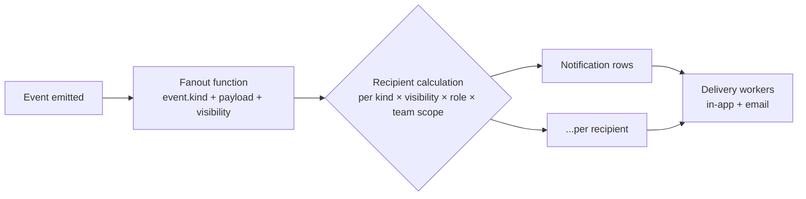

# Notification

A `Notification` is the user-facing materialization of a system `Event`. It's the row that shows up in the player's notification list, fires their email, and (future) forwards to Discord.

## Fields

```ts
Notification {
  id,
  recipientUserId,
  sourceEventId?,
  kind: NotificationKind,           // mirrors Event.kind with normalized presentation fields
  title,                           // short headline (e.g., "Battle approved by CM")
  summary,                         // 1-2 sentence description
  loudness: 'loud' | 'normal' | 'quiet',
  channels: { inApp: bool, email: bool, discord?: bool },
  deliveredAt?,
  readAt?,
  quietDeferredUntil?              // if user's quiet hours hit, queue until after
}
```

## Event → Notification fanout (v3.26)

Every `Event` doesn't necessarily produce a `Notification`. The fanout function (a pure function) decides per-recipient. Given an event, it computes the set of recipients + their loudness.



## Loudness defaults

By `Event.kind`:
- `loud` — approvals you must act on (`approval.requested` directed at you, `approval.rejected` for you)
- `normal` — approvals of your requests (`approval.approved` for you)
- `quiet` — ambient updates (`rule_check.run`, `campaign.phase_activated`)

User can override per kind in the account page (PRD-2 §5d).

# Cross-references

- [PRD-0 — Overview](/prds/prd-0-overview.md) — Schema definition
- [PRD-4 — Events, Submissions, & Timeline](/prds/prd-4-events-deltas.md) — §3.3 Event → Notification fanout
- [ApprovalKind](/concepts/approval-kind.md) — Source events for approvals
- [CampaignState](/concepts/campaign-state.md) — State changes trigger loud notifications