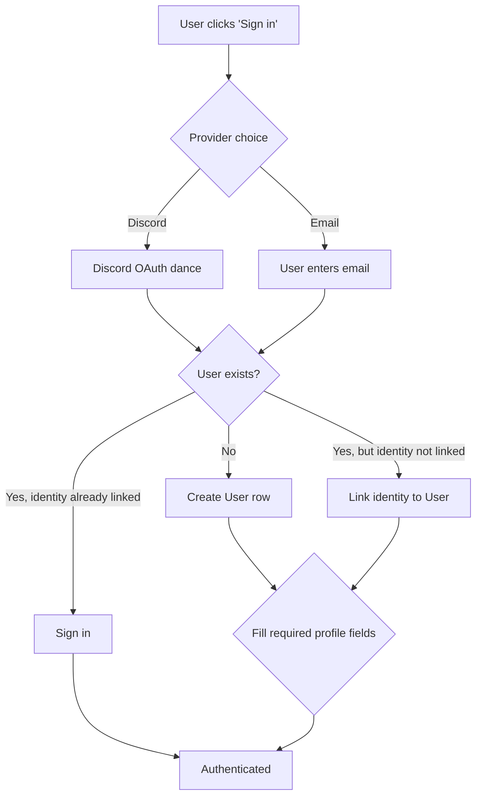
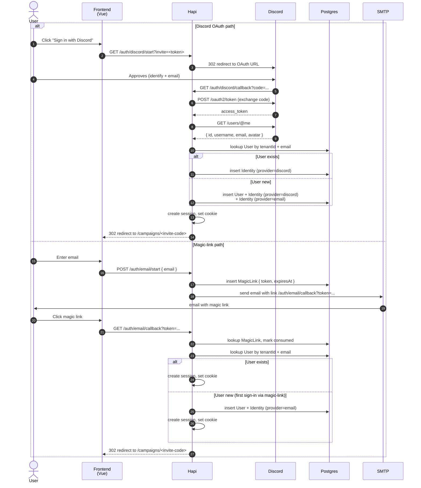

# PRD-2: Player Sign-Up (v3)

> Player onboarding within a tenant. v3: stack updated to Hapi/Node/TS; minor content changes.

---

## 0. Glossary (per [PRD-0](/prds/prd-0-overview.md) §3b)

- **Player** = a user with the `player` role for one campaign, on one team. Sees their own roster + their team's narrative log + their own data. **Cannot see other teams' data through the app.**
- **Crusade Team Leader** = a player who has also been granted the `crusade_team_leader` role for their team by the primary CM. They are still a player on that team; they additionally see their team's approval queue and can approve requests affecting their team for kinds the primary CM has enabled ([PRD-1](/prds/prd-1-crusade-master-admin.md) §4.4).
- **Primary CM** = the user with the `cm` role for the campaign. Sees everything; approves anything.

A player can also be a CM-as-player ([PRD-1](/prds/prd-1-crusade-master-admin.md) §5). A player can be a Crusade Team Leader. Roles stack.

---

## 1. Goals

Get a player from "I have an invite code" to "I'm a member of the campaign with no roster yet" in under 5 minutes.

**Success metric**: Median time from invite acceptance to first draft roster import attempt < 5 minutes.

---

## 2. User Stories

- **As a new player**, I can sign up with just an email address (magic-link auth).
- **As a player with an invite code**, I can enter it and land inside the campaign.
- **As a player**, I can pick my faction from a searchable list of all 26 Wahapedia factions.
- **As a returning player**, I can join additional campaigns in the same tenant via new invite codes.
- **As a player**, I get a guided first-tour explaining the async parse → review → approval flow.

---

## 3. Feature Modules

### 3.1 Account Creation (v3.15: OAuth + Magic-Link)

Per the user's direction, v1 uses external identity providers for authentication rather than building our own user system. Email magic-link remains a fallback. This is standard practice (Notion, Linear, Figma, Discord communities) and avoids us building password reset, MFA enrollment, OAuth refresh-token rotation, etc.

**v1 supported auth providers:**

1. **Discord OAuth2** (primary) — `identify` + `email` scopes. Returns: `id` (snowflake), `username`, `global_name`, `avatar` hash, `email`. See [Discord OAuth2 docs](https://docs.discord.com/developers/topics/oauth2).
2. **Email magic-link** (fallback) — user enters email, system sends a one-time-use link. Link expires in 15 min.

**v1.x / future providers:** Google, Microsoft, GitHub. Standard OAuth2 / OIDC; the abstraction is provider-agnostic so adding more is a config change, not a code change.

**Account creation flow:**



**Identity model (per-tenant):**

- A `User` row exists per tenant ([PRD-0](/prds/prd-0-overview.md) §3.4). A single person can have multiple `User` rows across tenants.
- Each `User` has one or more `Identity` rows linked to it:
  - `Identity { id, userId, provider, providerSubjectId, providerData, linkedAt }`
  - `provider`: `'discord' | 'email' | ...`
  - `providerSubjectId`: e.g., Discord snowflake id, or the email address for magic-link
  - `providerData`: provider-specific claims (avatar hash, username, etc., JSON)
- An identity is linked when the OAuth provider returns a verified email that matches an existing User's email (within the same tenant). If emails don't match (e.g., the user has no verified email), a new User is created.

**Identity linking at sign-in:**

1. User signs in via Discord OAuth. Discord returns `email: user@example.com` (verified).
2. System queries: `User` in this tenant where `email = user@example.com`?
3. If found: link the Discord identity to that User (add `Identity` row).
4. If not: create new `User` + `Identity` + magic-link identity (so user can also sign in via email later).
5. If the user has multiple `User` rows across tenants, they're prompted to switch tenants via the account page ([PRD-2](/prds/prd-2-player-signup.md) §5d) or sign in to a specific tenant via tenant-scoped invite links.

**Profile fields:**

| Field | Source | Editable? |
|---|---|---|
| Email | OAuth provider OR set during magic-link signup | Not directly editable (would require re-connecting OAuth provider or changing the magic-link identity) |
| Display name | OAuth `global_name` (Discord) or user-entered (magic-link) | ✅ Editable in account page (overrides provider value for in-app display) |
| Avatar | OAuth `avatar` hash (Discord) or user-uploaded | ✅ Editable in account page (override with custom upload) |
| Timezone | Auto-detected from browser | ✅ Editable in account page |
| Locale | Default `en` | ✅ Editable in account page |

**Multi-tenant considerations:**

- Each `User` is scoped to one tenant ([PRD-0](/prds/prd-0-overview.md) §3.4).
- Discord OAuth returns `email` but not tenant. The tenant is determined by **invite link domain** (e.g., `crusade.example.com/campaigns/aurelian` lands in the `example.com` tenant).
- If the invite is tenant-agnostic (a generic sign-in link), the user is prompted to select which tenant to sign in to (rare; usually users have one).
- Magic-link emails include the tenant slug in the link, so the magic link itself is tenant-scoped.

**Auth provider configuration ([PRD-0](/prds/prd-0-overview.md) §3.4 + tenant settings):**

- **Instance-level defaults**: an Instance Admin configures OAuth client id/secret at the instance level. Used by default for all tenants unless overridden.
- **Per-tenant override**: a tenant can configure its own Discord OAuth app (e.g., branded "Sign in with Discord" experience). Stored as `Tenant.oauthConfig: { discord: { clientId, clientSecret } }`.
- **Email magic-link**: SMTP credentials are tenant-level (per [PRD-0](/prds/prd-0-overview.md) §3.4).

**OAuth research notes (v3.15):**

Discord OAuth scopes used:
- `identify` — returns `/users/@me` user object (without email)
- `email` — adds the user's email to the user object (verified by Discord)

Discord user object fields we'll use:
- `id` — snowflake, stable per Discord user, used as `providerSubjectId`
- `username` — Discord handle
- `global_name` — display name (preferred over `username`)
- `avatar` — hash for building the Discord CDN avatar URL
- `email` — verified email address

Standard pattern for OAuth + magic-link hybrid auth (Linear, Notion):
1. OAuth is the primary auth (low friction, identity already established)
2. Magic-link is the fallback (for users without Discord, or for sensitive operations)
3. Identity linking: when OAuth returns a verified email that matches an existing magic-link account, the system links them. The user can then sign in via either method.
4. For sensitive operations (e.g., deleting account, changing email), the user must re-authenticate via the same method they used to create the account (or via a more secure method, e.g., re-do OAuth if they signed up via magic-link).

**Open questions (research notes — for v1.x refinement):**

- Should we support **account merging across tenants** (one human = one User across all tenants in the instance)? Current design: one User per tenant. Merging would require global user identity. **Defer to v1.x.**
- **OAuth refresh tokens**: Discord OAuth access tokens expire in 7 days; for ongoing sessions, we'd need refresh tokens. For MVP, re-auth after 7 days is acceptable; **consider refresh tokens for v1.x**.
- **Discord guild verification**: [PRD-5](/prds/prd-5-approval-system.md) §3 future Discord integration may want to verify a user is in a specific guild before granting CM roles. **Defer.**

**Tenant assignment**: every new account is tied to one tenant. If a player needs to be in multiple tenants, they sign up separately in each — the email can be the same; the `User` rows are per-tenant. The invite link carries the tenant slug, so the user is automatically routed to the right tenant.

**OAuth + magic-link sign-in sequence (v3.23):**



### 3.2 Join via Invite

- Single text field: "Paste invite code or link"
- Validation:
  - Code exists
  - Code belongs to a campaign in the same tenant the user is signed up in (no cross-tenant joins)
  - Code not expired
  - Code not used beyond its max-uses (CM-configurable; default 1)
- If valid: account binds to campaign as `CampaignMember.role = 'player'`
- If invalid: clear error ("Code not found", "Code expired", "Code already used", "Wrong tenant")

### 3.3 Faction + Team Picker (two distinct picks)

When a player joins a campaign, they pick two things — a 40K faction and a campaign team (always; every campaign has teams in v1).

**Faction picker:**
- Searchable dropdown of all 26 Wahapedia factions. Each option shows:
  - Faction logo (from Wahapedia)
  - One-line description
  - Linked Armageddon-specific content flag (if any)
- Sets `CampaignMember.factionId`

**Team picker (always shown):**
- List of `CampaignTeam` rows for the campaign
- Each team shown with: name, color, description, current player count
- Each team shows its `expectedFactionIds` as a hint: "typically plays Imperial factions" or "typically plays Orks" (derived from the count of expected factions; details behind a tooltip)
- Sets `CampaignMember.teamId`
- The picker does NOT filter the 40K faction picker — any player can pick any team regardless of faction
- Teams are mandatory in v1; there is no teamless mode (free-for-all is out of scope)
- A team can have multiple team leaders (v3.12). The campaign's `teamLeaderApprovalMode: 'any' | 'all'` setting ([PRD-1](/prds/prd-1-crusade-master-admin.md) §4.4) controls whether any one team leader or all of them must approve player requests. Players don't directly interact with this setting — it's CM-side — but it's worth noting that a team with multiple leaders doesn't slow down the player's filing process; only the approval process.

**Narrative-fit hint (when faction and team don't match expectedFactionIds):**

If a player picks a faction that's NOT in their chosen team's `expectedFactionIds`, the picker shows a soft warning before they submit:

> "Helsreach Defenders typically plays Imperial factions (per the Armageddon book). Mike has final approval — you can proceed, but Mike may want to discuss the narrative fit. Continue?"

The player can click "Continue anyway" or "Pick a different team." The app does **not block**. The CM's approval workflow is the enforcement point.

If `expectedFactionIds` is null (CM hasn't set any), no hint is shown.

If `CampaignTeam.expectedFactionIds` is set and the player's faction IS in the list, a green check is shown: "✓ fits Helsreach Defenders' Imperial narrative."

After both picks complete:
- Create empty `Roster` (no draft, no approved)
- Player is redirected to "Import your first roster" CTA

### 3.4 First-Time Onboarding

Modal flow shown on first login to a campaign:

1. **"Welcome"** — 1-line pitch + "Got it"
2. **"The flow"** — upload → BullMQ parse (a few seconds) → review the diff → CM approval → play
3. **"Async expectations"** — "imports take ~30 seconds; you'll get a notification when ready"
4. **"Roster gating"** — "you can't file battle results until your roster is CM-approved; submit early"
5. **"Import your roster"** — direct link to [PRD-3](/prds/prd-3-army-export-versioning.md) importer
6. **"You're set"** — dashboard with empty roster

---

## 4. User Flow

```mermaid
flowchart TD
    A[Player receives invite link] --> B[Lands on /join?code=XYZ]
    B --> C{Has account in this tenant?}
    C -->|No| D[Sign up: email + display name + tenant]
    C -->|Yes| E[Sign in via magic link]
    D --> F[Email magic link sent]
    E --> F
    F --> G[Click link in email]
    G --> H[Authenticated, back on /join]
    H --> I{Invite valid?}
    I -->|No| J[Show error]
    I -->|Yes| K{Pick faction (always)}
    K --> L[Pick team]
    L --> M[Create Roster shell]
    L --> M[Redirected to /campaigns/{id}]
    M --> N{First time in this campaign?}
    N -->|Yes| O[Onboarding tour]
    N -->|No| P[Standard dashboard]
    O --> Q[Import roster CTA → PRD-3]
```

### 4.1 Branch: Returning Player, New Campaign

Player signs in, opens dashboard, sees existing campaigns + "Join another campaign" button. Same flow as above from `I`.

### 4.2 Branch: Cross-Tenant Player

If a player is already in tenant A and gets an invite to tenant B, they must sign up separately. The UI explains this and offers a "create a new account in this tenant" link.

### 4.3 Branch: Invite Code Edge Cases

- **Expired**: CM controls expiry (default 14 days). Clear message with "Request new invite from your CM" button.
- **Used (max-uses reached)**: "This invite has been fully used."
- **Wrong tenant**: "This invite is for a different campaign group."

---

## 5. Faction + Team Picker Notes

**Faction:**
- 26 Wahapedia factions are the canonical list
- Picker does **not** filter to Armageddon-suitable factions
- Soft highlight: factions with documented Armageddon content get a small badge
- Legends / Forge World units are not in the picker; they're added during NR import

**Team:**
- Teams are CM-defined per campaign (see [PRD-1](/prds/prd-1-crusade-master-admin.md) §5b)
- Team picker is always shown — every campaign has teams in v1; free-for-all is out of scope
- Team picker never restricts 40K faction choice (multi-faction teams are the norm)
- Team switch mid-campaign requires CM approval (creates a "team_switch" `ApprovalRequest` per [PRD-5](/prds/prd-5-approval-system.md))

---

## 5b. Team-Scoped Data Isolation (v3.11)

Per [PRD-0](/prds/prd-0-overview.md) §3b: **a player on Team A cannot see Team B's data through this app.** This is enforced at the data layer (Postgres RLS), not just the UI, so no application bug can leak cross-team data.

What a player on Team A sees:
- Their own roster + their own battle reports + their own history
- Their team's narrative log (events with `visibility = 'team'` or `visibility = 'public'`)
- Their team's public-facing announcements (if the CM marks them public)
- Their team's active players list (so they know who they're playing with)

What a player on Team A does NOT see:
- Team B's rosters
- Team B's battle reports
- Team B's requisitions, history, approval queue
- Team B's narrative log (unless the CM marks an event `visibility = 'public'`)
- The names of players on Team B (they know Team B exists by its name; they don't see its roster)
- Search results that include Team B's data

What a player can do about cross-team data:
- Talk to players on Team B out-of-band (Discord, in-person, etc.)
- The app **does not** have a "share with other team" feature; players share on their own
- The app does not block or facilitate this; it just enforces isolation
- Exception: when the crusade is archived (`Campaign.status = 'archived'`), all players across teams see all data in read-only mode (post-crusade retrospective)

**Crusade Team Leader view (additional capabilities):**

A Team Leader on Team A additionally sees:
- Their team's full approval queue (filtered to kinds they're authorized to approve per [PRD-1](/prds/prd-1-crusade-master-admin.md) §4.4)
- Their team's full event log including `visibility = 'cm'` events that affect their team
- Their team's roster health overview

A Team Leader on Team A does NOT additionally see (compared to a regular player on Team A):
- Other teams' data (still isolated)
- Cross-team events that don't involve their team
- The primary CM's campaign-wide inbox (they see only their team's queue)
- Approval queue items for kinds they're not authorized to approve (those go to the primary CM)

**UI signals for isolation:**

- When a player views the campaign dashboard, the team-scoped narrative log is the default view. A "Public announcements only" tab shows cross-team events marked `visibility = 'public'`. There is no "All teams" view.
- When a player tries to navigate to a URL that would expose cross-team data (e.g., a teammate's roster id), the API returns 404 (per RLS) and the UI shows "Not found."
- The narrative log never suggests "X happened to Team B's player Y" — it only shows events on the player's own team.

---

## 5c. Player Dashboard UI (v3.13)

When a player (or Team Leader) signs in, they land on a campaign dashboard. The dashboard adapts based on role and team membership.

### 5c.1 Campaign dashboard — top-level surface

```
+---------------------------------------------------+
| HEADER: [Campaign Name] [User Menu]              |
+---------------------------------------------------+
| [ACTIVE PHASE BANNER — shown if a phase is active;  |
|  hidden entirely if no active phase, per v3.20]      |
+---------------------------------------------------+
| MY ROSTER CARD                                    |
|  Status: Approved (v17, 2026-08-29)               |
|  [Upload new NR JSON] [View roster]               |
|  Battle tally: 8  RP: 3  Supply: 1980/2000        |
+---------------------------------------------------+
| MY PENDING APPROVALS (1)                          |
|  - Last battle update pending CM review (2h ago)  |
+---------------------------------------------------+
| RECENT ACTIVITY (last 7 days)                     |
|  - 2h ago: Mike approved your battle update       |
|  - 1d ago: You filed Battle Update #8             |
|  - 3d ago: Mike triggered "Ork WAAAGH!"            |
+---------------------------------------------------+
| TEAM HUDSON'S PROGRESS                            |
|  Players: 4/6 active                              |
|  Recent: Mike rolled back Roster v16              |
+---------------------------------------------------+
| NAVIGATION: [Roster] [Battles] [Requisitions]    |
|             [Timeline] [Narrative Log] [Settings] |
+---------------------------------------------------+
```

### 5c.2 Card-by-card behavior

**MY ROSTER CARD** — the most important surface. Shows the player's current `RosterApproved` (or `pending_approval` if a new draft is in flight):
- "Upload new NR JSON" is the primary CTA. Big button. The async parse flow [PRD-2](/prds/prd-2-player-signup.md) §6 Flow 1 starts here.
- "View roster" links to the per-unit roster detail (the crusade card view, derived from `CrusadeForceState[unit]`).
- Battle tally, RP, supply are campaign-level metrics computed from the active roster.

**MY PENDING APPROVALS** — shows the player's own approvals that are awaiting review (their own roster drafts, their own battle updates). The player sees the status; they don't take action on these (the CM or Team Leader does).

**RECENT ACTIVITY** — a personalized feed of events affecting the player (their own events + events on their team that mention them). Filterable by kind. Each row links to the source event.

**TEAM HUDSON'S PROGRESS** — a per-team rollup ([PRD-4](/prds/prd-4-events-deltas.md) §7.1). Shows engagement health (active players count, days since last activity). Helps the player see "is my team active?"

### 5c.3 Empty states (v3.13)

Every card has a deliberate empty state with a CTA:

| State | Empty message | CTA |
|---|---|---|
| No roster yet (just joined) | "Welcome. Upload your first New Recruit JSON to get started." | [Upload roster] |
| Roster draft pending CM review | "Mike is reviewing your new roster. You'll be notified when it's approved." | (no CTA, info card) |
| Roster parse failed | "We couldn't parse your last upload. Common causes: corrupt download, NR's 'private list' feature, or a list built in BattleScribe. Try re-exporting from NR." | [Re-upload] [Contact CM] |
| No pending approvals | "You're all caught up. Nothing waiting for review." | (no CTA, info card) |
| No recent activity | "Your team has been quiet this week. Reach out to schedule a game." | [Team page] |
| No team progress data | "Your team hasn't started yet. Invite players to fill out the team." | [Invite link] (only if player has invite permission, rare) |

### 5c.4 Team Leader dashboard variant

A Team Leader on the same surface sees additional elements:

- **MY TEAM'S INBOX (3)** — the team leader's approval queue, filtered to kinds they're authorized to approve ([PRD-1](/prds/prd-1-crusade-master-admin.md) §4.4). Click to enter the inbox view ([PRD-5](/prds/prd-5-approval-system.md) §5).
- **TEAM HEALTH (expanded)** — per-player engagement table with one-click "nudge" (in-app + email) to inactive players. Available to Team Leaders.
- **NO CM INBOX** — the team leader does NOT see the primary CM's campaign-wide inbox; that's CM-only. The "Pending approvals" card on a Team Leader's dashboard is filtered to kinds they're authorized for.

### 5c.5 Player dashboard permissions matrix

| Element | Player (team X) | Team Leader (team X) | Primary CM | Player (team Y) seeing this URL |
|---|---|---|---|---|
| MY ROSTER CARD | ✅ their own | ✅ their own | ✅ any | ❌ (404) |
| MY PENDING APPROVALS | ✅ their own | ✅ their own | ✅ any | ❌ |
| RECENT ACTIVITY (team-scoped) | ✅ team X | ✅ team X (incl. cm-only events for team X) | ✅ any team | ❌ (sees team Y activity only) |
| TEAM HUDSON'S PROGRESS | ✅ | ✅ | ✅ any team | ❌ |
| MY TEAM'S INBOX | ❌ (no inbox) | ✅ (kinds authorized) | ✅ | ❌ |
| TEAM HEALTH with nudge | ❌ | ✅ | ✅ | ❌ |

The table makes explicit: the same URL accessed by different users shows different content based on role + team. RLS + the API filter ensure the data is correct; the UI uses the same components with role-aware data fetching.

### 5c.6 Per-role campaign home navigation

The bottom navigation differs by role:

- **Player**: [Roster] [Battles] [Requisitions] [Timeline] [Narrative Log] [Settings]
- **Team Leader**: [Roster] [Battles] [Requisitions] [Timeline] [Narrative Log] [Team Inbox] [Settings]
- **Primary CM**: [Roster] [Battles] [Requisitions] [Timeline] [Narrative Log] [CM Inbox] [Crusade Admin] [Settings]

The "CM Inbox" item is CM-only. The "Team Inbox" item is team-leader-only. The "Crusade Admin" item is CM-only.

---

## 5d. Account Page (per-user, v3.14)

Per-user settings that travel with the user across campaigns and tenants. Lives at `/account`. **Settings here apply to the user's experience everywhere**, not per-campaign.

```
+---------------------------------------------------+
| Account                                          |
| Sarah Kim <sarah@example.com>                    |
| Member since 2026-07-15                          |
+---------------------------------------------------+
| PROFILE                                          |
|   Display name: [Sarah Kim          ] [Save]    |
|   Avatar: [upload]                               |
|   Email: sarah@example.com                       |
|   [Change email]                                 |
+---------------------------------------------------+
| NOTIFICATIONS                                    |
|   Default loudness: ( ) loud (•) normal ( ) quiet |
|   Channels: [✓] In-app toast                     |
|             [✓] In-app notification list         |
|             [✓] Email (loud only)                |
|   Quiet hours: [22:00] to [08:00]                |
|     (suppresses loud notifications; queueing for after) |
|   [Save]                                         |
+---------------------------------------------------+
| SECURITY                                         |
|   Authentication: Magic link only                |
|   Active sessions:                               |
|     - Chrome / macOS · 2h ago                    |
|     - Safari / iOS · 3d ago           [Revoke]   |
|   MFA: [Enable TOTP]                             |
|   [Change password] (not applicable, magic link) |
+---------------------------------------------------+
| TENANTS & CAMPAIGNS                              |
|   You're a member of:                            |
|     - Aurelian Crusade (Helsreach Defenders)    |
|       [Open campaign] [Leave campaign]           |
|     - Baal Incursion (Wrecked Skulls)           |
|       [Open campaign] [Leave campaign]           |
|     - Internal Test Campaign (CM)               |
|       [Open campaign]                            |
+---------------------------------------------------+
| DANGER ZONE                                      |
|   [Export all my data]   (per PRD-0 §3 GDPR)     |
|   [Delete account]   (requires email confirmation)|
+---------------------------------------------------+
```

### 5d.1 Account page sections in detail

**IDENTITIES** — the auth providers linked to this `User` account ([PRD-2](/prds/prd-2-player-signup.md) §3.1 v3.15). Shows:

- Discord: linked or "Link Discord" button. If linked, shows Discord username + avatar (from OAuth). Unlink option.
- Email: shows the linked email address. "Send magic link to verify" button if not yet verified; "Change email" is via re-verification with the new email.

The user MUST have at least one identity at all times. If they unlink their only identity, they're prompted to add another before completing the action. This prevents accidental lockout.

**PROFILE** — display name (overrides the OAuth provider's `global_name` for in-app display), avatar (overrides the OAuth avatar if the user uploaded a custom one to MinIO), timezone, locale.

**NOTIFICATIONS** — per-user notification loudness defaults. Three channels: in-app toast, in-app notification list, email. Email is loud-only (you only get emails for `loud` notifications; this prevents email spam for routine events).

**Quiet hours** — suppresses `loud` notifications during a window (e.g., 22:00–08:00). `normal` and `quiet` notifications still arrive. `loud` notifications fired during quiet hours queue for delivery at the end of the window. The user can override per-campaign (per §5e).

**SECURITY** — session management (revoke active sessions), OAuth re-auth for sensitive operations, recent login activity. **MFA (TOTP) opt-in** is v1; **MFA enforcement** (mandatory for CM roles) is v1.x.

**TENANTS & CAMPAIGNS** — list of all campaigns the user is a member of, across all tenants they're a member of. Each row shows the campaign name, role, team (if applicable), and the join date. Actions: open campaign, leave campaign.

**DANGER ZONE** — data export (JSON dump of all the user's data) and account deletion. Account deletion requires re-auth (proves the user owns the account) and CM approval for any active campaigns (per [PRD-1](/prds/prd-1-crusade-master-admin.md) §4.2: when a user requests deletion, all their `CampaignMember` rows are soft-archived; pending approvals they filed are auto-withdrawn; their rosters are soft-archived for 30 days then hard-deleted).

**Per v3.15 data model:** nothing is hard-deleted unless explicitly required (account deletion after the 30-day archive window). Team leader grants, audit log entries, history entries — all soft-delete via timestamp columns (`revokedAt`, `archivedAt`). The system preserves history.

### 5d.2 Per-role settings visibility

- **Player** sees all sections above.
- **Crusade Team Leader** sees all sections PLUS a "Team Leader preferences" section (e.g., "receive notifications when a player on my team files a roster approval" — on by default).
- **Primary CM** sees all sections PLUS "CM preferences" (e.g., "default bulk-approve cap," "default team-leader authority for new campaigns").

These role-specific sections are sub-pages, not sections crammed into the main account page — they live at `/account/team-leader` and `/account/cm` respectively.

### 5d.3 Settings hierarchy (per-user vs per-campaign)

| Setting | Scope | Lives in |
|---|---|---|
| Display name, avatar | Per-user | Account page |
| Email + verification | Per-user | Account page |
| Authentication, MFA, sessions | Per-user | Account page |
| Default notification loudness + channels | Per-user | Account page |
| Quiet hours (default) | Per-user | Account page |
| **Campaign quiet hours override** | Per-campaign | Campaign player page (§5e) |
| **Default team-leader authority (CM-only)** | Per-user (CM default) | Account page CM section |
| **Bulk-approve cap default (CM-only)** | Per-user (CM default) | Account page CM section |
| **Notification subscription to specific campaigns** | Per-user | Account page |
| **Role display preference** | Per-campaign | Campaign player page |

Per-campaign overrides live on the campaign-scoped player page, not the account page. This avoids "I changed my account setting and now every campaign behaves differently" surprises.

---

## 5e. Campaign-Scoped Player Page (v3.14)

Per-campaign context. The player's profile within this specific campaign — their role, team, faction, and per-campaign prefs. Lives at `/campaigns/{id}/me`.

```
+-----------------------------------------------------+
| Aurelian Crusade — Your Role                        |
| You're a Player on Helsreach Defenders             |
| Joined 2026-07-15 · Last active 2h ago              |
+-----------------------------------------------------+
| YOUR IDENTITY                                      |
|   Display name in this campaign: Sarah Kim         |
|   Team: Helsreach Defenders (color: blue)          |
|     [Switch team] (requires CM approval)            |
|   Faction: Astra Militarum (Cadian)                 |
|     [Switch faction] (requires CM approval)        |
+-----------------------------------------------------+
| YOUR CRUSADE STATS                                 |
|   Active roster: v17 (approved 2026-08-29)         |
|   Battles played: 8  Victories: 5  Losses: 3       |
|   RP balance: 3                                    |
|   Requisitions purchased: 2                        |
+-----------------------------------------------------+
| NOTIFICATIONS (this campaign)                      |
|   (•) Loud  ( ) Normal  ( ) Quiet   (overrides account default) |
|   Quiet hours override: [none]                     |
|     (When set, suppresses loud notifications during window)   |
+-----------------------------------------------------+
| DISPLAY                                            |
|   Show handle publicly in narrative log: [✓]       |
|   Show on team leaderboard: [✓]                    |
|     (Anonymous toggle for shy players)             |
+-----------------------------------------------------+
| DANGER ZONE                                        |
|   [Leave this campaign]                            |
|     (auto-withdraws pending approvals; archives rosters)       |
+-----------------------------------------------------+
```

### 5e.1 Sections

**YOUR IDENTITY** — current role + team + faction. The role is shown but not editable (CM controls role assignment). Team and faction have "switch" actions that create `team_switch` / `faction_switch` `ApprovalRequest`s ([PRD-5](/prds/prd-5-approval-system.md)).

**YOUR CRUSADE STATS** — at-a-glance: active roster version, battles tally, RP balance, requisitions count. Derived from current `RosterApproved` + history. Read-only display; if numbers look wrong, the player can click through to the timeline view to see the events.

**NOTIFICATIONS (this campaign)** — per-campaign override of the user's default notification loudness. If a player wants `normal` instead of `loud` for this campaign specifically, they set it here. Quiet hours can also be overridden per-campaign.

**DISPLAY** — visibility toggles within this campaign. The "show handle publicly" toggle controls whether the player's name appears in the narrative log or as "anonymous." The "show on team leaderboard" controls whether they appear in the team's roster health overview. Both default to visible.

**DANGER ZONE** — leave campaign. Requires confirmation. Triggers: auto-withdraw pending approvals the player filed, archive rosters (per [PRD-1](/prds/prd-1-crusade-master-admin.md) §4.2 retention), send notifications to the CM.

### 5e.2 Role badges

Top of the page shows the role badge:
- **Player**: no badge
- **Crusade Team Leader of Helsreach Defenders**: a "Team Leader" badge with team color
- **Primary CM**: a "Campaign Master" badge

The role badge is read-only here; it's set by the CM via the Crusade Administration panel → Members section.

### 5e.3 Permissions matrix

| Action | Player | Team Leader | Primary CM |
|---|---|---|---|
| View this page | ✅ own | ✅ own | ✅ own |
| Switch team (creates approval) | ✅ | ✅ | ✅ |
| Switch faction (creates approval) | ✅ | ✅ | ✅ |
| Change per-campaign notification loudness | ✅ | ✅ | ✅ |
| Change quiet hours override | ✅ | ✅ | ✅ |
| Show/hide handle publicly | ✅ | ✅ | ✅ |
| Show/hide on team leaderboard | ✅ | ✅ | ✅ |
| Leave campaign | ✅ | ✅ (with handoff prompt — see §5e.4) | ❌ (CM cannot leave own campaign; must transfer or archive) |

### 5e.4 Team Leader leave-campaign flow

When a Team Leader attempts to leave, they get a warning: "You are the only team leader on Helsreach Defenders. The CM must promote a replacement before you can leave." If the team has other team leaders, the warning is gentler: "Other team leaders will continue your team's approval queue."

---

## 5f. Roster Page (per-roster, v3.14)

The army view. Lives at `/campaigns/{id}/rosters/{rosterId}`. **The roster page is one of the load-bearing surfaces** — players spend a lot of time here. The user said "specialized views for their generated crusade cards" — that's what comes next (§5g), but first the parent surface.

```
+----------------------------------------------------------+
| Cadian 67th Legion (Astra Militarum) · v17 · Approved  |
| Owner: Sarah Kim · Helsreach Defenders · 2026-08-29    |
+----------------------------------------------------------+
| HEADER STATS                                            |
|   Points: 1980 / 2000  |  Battles: 8  |  RP: 3         |
|   [Upload new NR JSON]  [Print Order of Battle]         |
+----------------------------------------------------------+
| UNITS (13)                                              |
|   [+ Add unit]  (CM-gifted requisition only — see §5g)  |
|   Filter: [All] [HQ] [Troops] [Elites] [FA] [HS] [Flyer] |
|                                                          |
|   ★ Castellan (Character, HQ, Battle-hardened)         |
|      XP 18/50  · 2 Battle Honours · 1 Battle Scar      |
|      [View crusade card →]                              |
|                                                          |
|   Cadian Shock Troops × 3 (Battle-line, Troops)         |
|      XP 12/50  · 0 Battle Honours · 2 Battle Scars      |
|      [View crusade card →]                              |
|                                                          |
|   ... 10 more units ...                                 |
+----------------------------------------------------------+
| REQUISITIONS (3 available, 2 used)                     |
|   [Replace Destroyed Unit: 1 RP] — 1 slot available    |
|   [Add Wargear: 2 RP]                                  |
|   [Reinforce Unit: 2 RP]                               |
|   (These are NR-side actions per PRD-4 §7b.2; the      |
|    roster updates when you re-import your NR list.)    |
+----------------------------------------------------------+
| HISTORY (this roster)                                   |
|   Timeline view of all changes — see PRD-4 §6           |
|   [Open timeline →]                                     |
+----------------------------------------------------------+
```

### 5f.1 Sections

**HEADER STATS** — points (current / cap), battles tally, RP balance. Computed from the active `RosterApproved`.

**Upload CTA** — the most important button on the page. When the player has an approved roster and wants to update it, they upload a new NR JSON. The async parse flow ([PRD-3](/prds/prd-3-army-export-versioning.md)) starts here.

**UNITS table** — the army list. Each row is a unit summary; click → crusade card view (§5g). Filter chips for role.

**REQUISITIONS** — for v3.14 these are an NR-side history view (per [PRD-4](/prds/prd-4-events-deltas.md) §7b.2: player does requisitions in NR, re-imports). The roster page shows what requisitions are available and how many she's used. The "purchase" action lives in NR, not here.

**HISTORY** — a link to the per-roster timeline view ([PRD-4](/prds/prd-4-events-deltas.md) §6). [PRD-4](/prds/prd-4-events-deltas.md) §7b has the 6-grouping model; the roster page links into the per-roster-version view (G2 grouping).

### 5f.2 State variants

| Roster state | What the page shows |
|---|---|
| **Approved** (current) | Full content as above |
| **Pending approval** (a draft was submitted) | "Mike is reviewing your new roster v18. You'll be notified when approved." with [View pending draft] |
| **Superseded** (a newer draft is pending) | "This roster (v17) is no longer active. The newer v18 is pending review. [View v18]" |
| **Rolled back** | "This roster was rolled back on YYYY-MM-DD by Mike. [View reason] [Re-import your NR list]" |
| **Empty** (just joined) | "Welcome. Upload your first New Recruit JSON to get started." with prominent upload CTA |

### 5f.3 Empty states

Already covered in §5c.3 (Player Dashboard empty states) for the dashboard card. The roster page itself has the "empty" variant as above.

### 5f.4 Print Order of Battle

The roster page has a "Print Order of Battle" button that generates a printable view of the army — name, points, units table, supply, RP. This is what players bring to the table. The output is a printable HTML page (and a "Save as PDF" via browser print). It mirrors the `ArmageddonBlankOrderOfBattle.pdf` template the user provided ([PRD-4](/prds/prd-4-events-deltas.md) §4.1 disambiguation), auto-generated from the active `RosterApproved`.

---

## 5g. Crusade Card View (per-unit, v3.14)

The specialized per-unit view. Lives at `/campaigns/{id}/rosters/{rosterId}/units/{unitId}`. This is the **army card view** — derived from the unit's state in NR (read-only display per [PRD-0](/prds/prd-0-overview.md) §4b.2).

```
+----------------------------------------------------------+
| Castellan (Character, HQ)                               |
| Custom name: Captain Jurgen · Battle-hardened          |
| XP 18/50 · 2 Battle Honours · 1 Battle Scar            |
| Owner: Sarah Kim · Helsreach Defenders                 |
+----------------------------------------------------------+
| MODEL COUNT              | POINTS                       |
| Current: 1/1             | 75 (base) + 0 (wargear) = 75 |
| Battles survived: 6/8    |                              |
+----------------------------------------------------------+
| WARGEAR                                                |
|   • Laspistol            • Power sword                  |
|   • Frag grenades                                         |
+----------------------------------------------------------+
| BATTLE HONOURS (2)                                      |
|   ★ Slayer of Monsters                                  |
|     Gained 2026-08-22, Battle 14 vs. mike_t             |
|     [View battle report]                                |
|   ★ Skilled Rider                                       |
|     Gained 2026-07-30, Battle 9 vs. jake42              |
|     [View battle report]                                |
+----------------------------------------------------------+
| BATTLE SCARS (1)                                        |
|   ✗ Lost in the Fog                                      |
|     Acquired 2026-08-22, Battle 14 OoA test failed      |
|     [View battle report]                                |
+----------------------------------------------------------+
| BATTLE TALLY                                           |
|   Battles played: 8                                     |
|   Battles survived: 6                                   |
|   Enemy units destroyed: 11                             |
+----------------------------------------------------------+
| UNIT TIMELINE (PRD-4 §6)                               |
|   2026-08-01 added (Battle-ready)                       |
|   2026-07-15 +3 XP · Battle 1                           |
|   2026-07-22 +3 XP · Battle 3 · Promotion to Blooded    |
|   2026-07-30 +3 XP, gained honour "Skilled Rider" · Battle 9 |
|   2026-08-15 +3 XP, +1 kill, Promotion to Battle-hardened · Battle 12 |
|   2026-08-22 +3 XP, gained honour "Slayer of Monsters", |
|              gained scar "Lost in the Fog" · Battle 14   |
|   ...                                                    |
+----------------------------------------------------------+
| (Read-only display. To edit unit state, update in NR    |
|  and re-import your roster.)                           |
+----------------------------------------------------------+
```

### 5g.1 Sections (mirroring the ArmageddonCrusadeCards.pdf template)

The user provided this template as reference ([PRD-4](/prds/prd-4-events-deltas.md) §4.1). The crusade card view is the in-app equivalent — auto-generated from the unit's state in NR.

- **Header**: unit name, role, custom name (if any), current rank, XP counter, battle honour + scar counts
- **Model count + points**: current vs starting, points breakdown
- **Wargear**: list from NR
- **Battle honours**: list with provenance (battle + date), expandable to view the originating battle report
- **Battle scars**: list with provenance (OoA test + date), expandable to view the originating battle report
- **Battle tally**: cumulative stats across the campaign
- **Unit timeline**: chronological events for this unit ([PRD-4](/prds/prd-4-events-deltas.md) §6)

### 5g.2 Read-only contract

Per [PRD-0](/prds/prd-0-overview.md) §4b.2, this view is **read-only display data** sourced from NR. The page surfaces a clear notice at the bottom: "To edit unit state (XP, honours, scars, wargear), update in New Recruit and re-import your roster." No in-app edit surface for unit state.

### 5g.3 Per-unit timeline link

The "Unit timeline" section is the same surface as [PRD-4](/prds/prd-4-events-deltas.md) §6 (per-unit timeline view). It's embedded here for context; clicking events takes you to the full timeline with all 6 groupings ([PRD-4](/prds/prd-4-events-deltas.md) §7b).

### 5g.4 When state diverges from NR

If the player has an older roster version approved but a newer NR list they've been editing locally, the crusade card view shows what the **approved** version has. The "Pending upload" badge on the roster page (§5f.2) signals there's a newer draft in flight.

### 5g.5 Multi-unit display for shared wargear

Some players run "Cadian Shock Troops × 3" — three units of the same type with different custom names. The roster page (§5f) shows them as separate rows. The crusade card view is one unit at a time, so each gets its own page. The unit's custom name disambiguates them.

---

---

## 6. Critical User Flows — Player (Sarah)

**Persona — Sarah, the player:**
Late 20s, software engineer, plays Astra Militarum. Has been in the hobby for 2 years. In Mike's 8-player campaign. Uses New Recruit on her laptop to build lists (she likes the auto-cost-calc). Plays about 2 games per week, usually on Wednesday nights and one weekend afternoon. Spends ~30 minutes/week on Crusade admin in her current tool (Administratum free tier + Discord + a paper roster).

Sarah's pain points with current tools:
- She forgets which roster version is "active" — the one she plays with vs. the one Mike approved.
- She filed a battle update last week and isn't sure if it was approved; the only signal is Mike saying "good game" in Discord.
- She wants to see her Cadian Shock Troops' journey: from "Battle-ready" to "Battle-hardened" with each battle's contribution. Right now this is mental math across a paper sheet.

Sarah's success criteria for this app:
- She can see, at any time, the current state of her roster (active, approved, with current XP/rank for every unit).
- She can file a post-battle update in under 5 minutes and see the result reflected in her roster.
- The system tells her when something needs her attention (roster pending review, requisition available, etc.) without her having to chase Mike.

### Flow 1: First roster import + approval (the most complex flow)

**Trigger:** Sarah finished her NR list and wants to play. She's been added to the campaign by Mike; she got an invite link in Discord. She clicks the link.

**Why this matters:** First-time experience determines whether Sarah recommends the tool to her other 40K friends. If it's confusing, she tells the group "it's too much work" and the campaign quietly goes back to Discord-only.

**UI requirements:**

- **Invite link lands her on a sign-up page** with the campaign name pre-filled ("Aurelian Crusade"). She sees: campaign CM (Mike), campaign rules preview, member count.
- **Sign-up is one email + one display name.** No password to remember; magic-link auth.
- **Onboarding tour is 4 modals** (per §3.4). The first 2 explain the flow; the last 2 are about the upload process.
- **The upload zone is the dominant element on the empty-roster page.** Big drop target, "Upload your New Recruit JSON" in 24pt, "We parse it in ~30 seconds" subtext. No "browse files" button hidden in a corner.
- **Upload latency is the single biggest UX risk.** When Sarah drops the file:
  - File validates client-side (size, .json extension, basic structure)
  - Status changes to "Parsing… 5s" with a live timer
  - If parsing hits 30s, the timer turns amber; at 60s, red, with a "still working" message
  - When ready, the screen transitions to the diff view
- **The diff view is player-first.** Even with no prior roster, Sarah sees: "We found 13 units. Here's the list. Tap any to see details." She can review the parse result before submitting.
- **Rule check results appear below the diff.** If everything's green, "All clear. Submit for CM approval?" with a single button. If there's a warn, the player must acknowledge before the button enables.
- **Submission is irreversible** (a new draft is required to change anything). The button text says "Submit for Mike's review" not "Submit" — names the CM, makes the human loop visible.
- **After submission, the screen shows a status card**: "Submitted 2 minutes ago. Mike usually reviews within 4 hours. You'll get a notification."
- **When Mike approves (or rejects), Sarah gets a notification** (in-app toast + email). On the campaign page, her roster now shows "Active since 2 hours ago" with a green badge.

**Critical moment:** The parsing latency. Sarah is anxious — "did it work?" — and 30 seconds of a spinner is uncomfortable. Mitigation: (a) live timer so she knows it's not stuck, (b) clear copy explaining what's happening ("Extracting units from your New Recruit file…", "Comparing to last approved roster…", "Running campaign rules…"), (c) at 60s, a "still working — this is unusual, you can wait or contact your CM" message with a "contact CM" link.

**Edge case:** The parser fails. Sarah sees a clear error: "We couldn't read your file. Common causes: corrupt download, NR's 'private list' feature, or a list built in BattleScribe (not NR). Try re-exporting from NR or contact Mike." The retry button re-runs the same blob; the re-upload button lets her pick a different file.

**Edge case:** Sarah drops the wrong file (e.g., a list from a different campaign). The parse succeeds, but the diff against her current (empty) Roster shows units from a different faction. The rule check flags "Faction mismatch: roster is Tyranids, your campaign faction is Astra Militarum." Sarah cancels, re-exports the right list from NR, re-uploads.

### Flow 2: Filing a post-battle update

**Trigger:** Sarah just played a 2000-pt game against Mike's Tyranids and won. She's at home, tired. She already updated her NR list with the battle's effects (XP, honours, scars, etc.) and re-exported the JSON; the post-battle roster is now visible in her army view. She wants to file the campaign-level update.

**Why this matters:** This is the moment where the campaign's narrative moves forward. The form is intentionally lighter than per-unit data entry because, per [PRD-0](/prds/prd-0-overview.md) §4b.2, **unit data lives in NR** — Sarah already did the per-unit work in NR. The form here is for the campaign-level record: what happened, who won, what agendas were achieved.

**UI requirements:**

- **The "File Battle Update" button is on the campaign dashboard, prominent, never more than 2 clicks from the campaign home.**
- **Form is auto-generated from `Campaign.battleReportSchema`** ([PRD-4](/prds/prd-4-events-deltas.md) §4.1) and is **campaign-level only**. Per-unit XP/honour/scar/relic fields are deliberately absent.
- **Form is pre-filled with what the system can infer:**
  - Opponent: a member-list dropdown filtered to her campaign, sorted by "recently played" (Mike is at the top)
  - Date: today
  - Result: a single "I won" / "I lost" / "Draw" toggle
  - Mission: text input, with autocomplete from prior missions this campaign
  - Source roster: defaulted to Sarah's currently approved roster. A dropdown lets her pick a different one if she used an older roster for this battle.
- **Agendas section is explicit:** Armageddon agendas (e.g., "Extermination Targets" for Astra Militarum) appear in a checklist. Sarah ticks which she attempted, then ticks which she achieved. The system doesn't compute the agenda outcome — that's the CM's verification job.
- **Battle report is a markdown textarea** with a "min 200 chars" hint if the campaign's `require_battle_report` is on. Sarah types 3-4 sentences; the form shows a live char count.
- **Side panel: read-only roster diff.** The form shows the diff between `sourceRosterApprovedId` and Sarah's most recently uploaded post-battle roster (if any). This is the visual proof of what happened to her units in this battle — but it's **read-only display**, sourced from NR. Sarah can't edit per-unit fields here; she goes to NR if she needs to fix something.
- **"Save as draft" and "Submit" are both available.** If Sarah runs out of time, she saves and comes back.
- **On submit, the form transitions to a "Pending Mike's review" card** with the timestamp, the campaign-level deltas that will be applied, and a "view what will change" expander showing agenda outcomes and roster diff.

**Critical moment:** The "did Sarah actually re-import her NR list with the post-battle roster?" question. The form's side panel shows a warning if the source roster is older than the player's most recent upload: "Your post-battle roster hasn't been imported yet. The unit diff shown is based on your last approved roster. Re-import your NR list to see the post-battle state." This nudges Sarah to upload first, then file the report — getting the order right matters for the audit trail.

**Edge case:** Sarah wins, files the update, then realizes she made a mistake. The update is "pending." Sarah clicks "withdraw" and starts over. Mike never sees the broken version.

**Edge case:** Sarah and Mike disagree on the result. Mike files his own update saying he won. The system flags `BattleUpdate.disputed`; both updates are in the inbox with the other's as context. Mike (as CM) adjudicates.

**Edge case:** Sarah files a battle update referencing a roster that's been superseded. The system warns: "Your referenced roster is no longer your active roster (you uploaded a newer version 2 days ago). Update the reference, or proceed with the original?" Sarah can either pick the newer roster or confirm the older one — explicit user choice.

### Flow 3: Requisitions — done in NR, shown as history

**Trigger:** Sarah's Leman Russ was destroyed in a game. The OoA test failed; she chose to remove the unit. She wants to bring it back next week.

**Why this matters:** Per [PRD-0](/prds/prd-0-overview.md) §4b.2 and [PRD-4](/prds/prd-4-events-deltas.md) §7b.2, **requisitions are done in New Recruit**, not in this app's UI. Sarah marks the requisition in NR (spends RP, adds the unit, marks "Requisition: Replaced Destroyed Unit" on the unit's crusade card), exports JSON, and uploads to this app. The requisition shows up as a history entry — visible in Sarah's requisition history, on the unit's per-unit timeline, and on the campaign's narrative log.

**What this app DOES surface (read-only display, sourced from NR):**

- **Requisition history view** — a tab on Sarah's roster page. Lists past requisitions with date, type, RP cost, the unit affected. Each row links to the per-unit timeline (G1 grouping).
- **"What this does" preview at roster import time** — when Sarah uploads a new NR list, the diff view highlights the requisition: "Requisition: Replaced Destroyed Unit — Leman Russ added, -3 RP." The preview is informational; Sarah doesn't "buy" anything in our app.
- **Per-requisition grouping in the campaign timeline (G4)** — the CM and Sarah can filter the campaign timeline to show only requisitions, which is useful for the "what did my army look like at any point in time" use case.

**What this app does NOT do for routine requisitions:**

- No "buy requisition" button. No RP deduction UI. No CM approval workflow for routine purchases.
- The `requisition_purchase` `ApprovalRequest` kind ([PRD-5](/prds/prd-5-approval-system.md) §3.2) is reserved for **CM-gifted or narrative-driven** requisitions — e.g., Mike grants Sarah a free Leman Russ replacement as a narrative reward at end-of-session. That kind of requisition goes through normal approval; routine player-bought ones don't.

**Workflow:**

1. Sarah plays a battle; her Leman Russ is destroyed.
2. Sarah opens NR, marks the unit as destroyed, applies "Requisition: Replaced Destroyed Unit" (NR-side flow), adds the new Leman Russ to her list, marks the RP cost. NR's requisition mechanic handles the rest.
3. Sarah exports NR JSON, uploads to this app.
4. App parses the new roster, sees the new unit + the requisition marker, generates a `HistoryEntry` row (G4 grouping: per-requisition).
5. The requisition history view shows it. The unit's per-unit timeline shows it. The campaign narrative log shows it.
6. CM doesn't need to approve — this happened in NR, the app just displays it.

**Critical moment:** When Sarah uploads the new NR list, the roster diff view should clearly call out the requisition so Sarah can verify "yes, that's the Leman Russ I bought in NR." Without that confirmation, Sarah might wonder if the upload caught the requisition correctly. The diff UI gets a "Requisitions in this upload" section that lists each requisition with its NR-derived details.

**Edge case:** Sarah uploads a new NR list but the requisition marker isn't visible (e.g., NR's requisition field is in a position the parser doesn't extract yet). The diff UI shows: "This upload has a new Leman Russ but no requisition marker detected. If you applied a requisition in NR, double-check the export." Helps Sarah catch export mistakes before they pollute the history.

**Edge case:** Sarah has a CM-gifted requisition (`requisition_purchase` approval) AND a routine NR-bought requisition in the same campaign. The history view shows both with different icons/badges so Sarah can distinguish "free gift from Mike" vs "bought in NR." The CM-gifted one has a CM note attached ("narrative reward for winning the Helsreach arc").

### Flow 4: Checking her timeline

**Trigger:** Sarah wants to see what happened to her Cadian Shock Troops. They were Battle-ready, then Battle-hardened, and now have a Battle Scar "Lost in the Fog." How did that happen?

**Why this matters:** This is Sarah's army's *story*. The timeline is the payoff for every approval, every battle, every requisition. It must be beautiful, because it's the reason Sarah cares about the app.

**UI requirements:**

- **Per-unit timeline view** on the roster page. Click a unit, see its event history.
- **Each event is a 1-line narrative card** with an icon (XP gain, rank promotion, honour gained, OoA test, requisition added) and a date. Most events are sourced from NR roster diffs — "this unit went from 5 XP to 8 XP because you re-imported on YYYY-MM-DD" — with the linked battle report inline. Per [PRD-0](/prds/prd-0-overview.md) §4b.2, the timeline shows NR state changes as read-only display; it doesn't try to record per-unit changes that aren't in NR.
- **Filter by event kind.** "Show me all my OoA tests" or "Show me every rank promotion."
- **Battle reports are expandable in-line** so Sarah can re-read what happened in the battle that caused this event.
- **Compare to active vs. archived timelines.** If a unit was destroyed and Sarah bought a replacement, the destroyed unit's timeline is preserved separately; the new unit starts fresh.
- **Export as markdown.** Sarah can paste her army's story into a Discord channel or a print-out for the table.

**Critical moment:** The very first time Sarah opens a unit's timeline and sees "Battle-ready → Battle-hardened on 2026-08-15 (Battle vs. Mike's Tyranids, +3 XP). Battle Scar 'Lost in the Fog' gained 2026-08-22 (OoA test failed in Battle 22, honour-scar swap)." That's the moment she tells her friends about the app. The "Lost in the Fog" entry is shown because Sarah's NR list says the unit has that scar — the timeline is reading NR state, not app-side data.

**Edge case:** A unit from a NR list that was rejected and re-imported has two timelines. The current unit is the latest; the previous one is in the audit log. Sarah can drill in but the UI surfaces "this is the second version of this unit; the first was rejected on YYYY-MM-DD."

**Edge case:** A unit was destroyed in NR (player removed it from the list) but never re-imported into the app. The app still shows the unit's last-known state. The timeline surfaces: "this unit was last seen in your YYYY-MM-DD NR import; you haven't re-imported since." Sarah can either re-import the latest NR (which won't have the unit) or upload a roster with the unit back in (a `requisition_purchase` was probably involved).

---

## 8. Out of Scope

- Cross-tenant single sign-on
- Player-to-player direct messaging
- Spectator sign-up (spectators are public-link-based)
- OAuth login (env-var OIDC config possible but out of MVP)

---

## 9. Dependencies

- **[PRD-0](/prds/prd-0-overview.md)**: `User`, `Tenant`, `Campaign`, `CampaignMember`, `Roster`
- **[PRD-1](/prds/prd-1-crusade-master-admin.md)**: CM-side invite generation
- **[PRD-3](/prds/prd-3-army-export-versioning.md)**: army import handoff
- **Auth infra**: SMTP, magic-link delivery
- **Wahapedia data** ([PRD-0](/prds/prd-0-overview.md) infra): faction list, descriptions

---

## 10. Success Metrics

| Metric | Target |
|--------|--------|
| Invite-to-roster-imported time | < 5 min median |
| Drop-off at faction picker | < 10% |
| Players completing onboarding tour | > 80% |
| Magic-link delivery success | > 99% |

---

## 11. Edge Cases

1. **Two players pick same display name in same campaign**: append `#2`, `#3` etc. Non-blocking warning.
2. **Player joins, then CM removes them**: player loses access; roster data retained for 30 days, then hard-deleted.
3. **Player wants to switch faction mid-campaign**: requires CM approval (per [PRD-5](/prds/prd-5-approval-system.md)), creates a new Roster while keeping the old one as a snapshot.
4. **Email bounces**: account marked `email_unverified`; cannot file battle updates until resolved.
5. **Player tries to join with code from a tenant they have no account in**: error with a "create an account in this tenant" link.


# Cross-references

- [CampaignTeam](/concepts/campaign-team.md)
- [Crusade Team Leader](/concepts/crusade-team-leader.md)
- [Hapi](/references/hapi.md)
- [New Recruit](/references/new-recruit-json.md)
- [PRD-0](/prds/prd-0-overview.md)
- [PRD-1](/prds/prd-1-crusade-master-admin.md)
- [PRD-3](/prds/prd-3-army-export-versioning.md)
- [PRD-4](/prds/prd-4-events-deltas.md)
- [PRD-5](/prds/prd-5-approval-system.md)
- [PostgreSQL](/references/postgres.md)
- [Wahapedia](/references/wahapedia.md)
