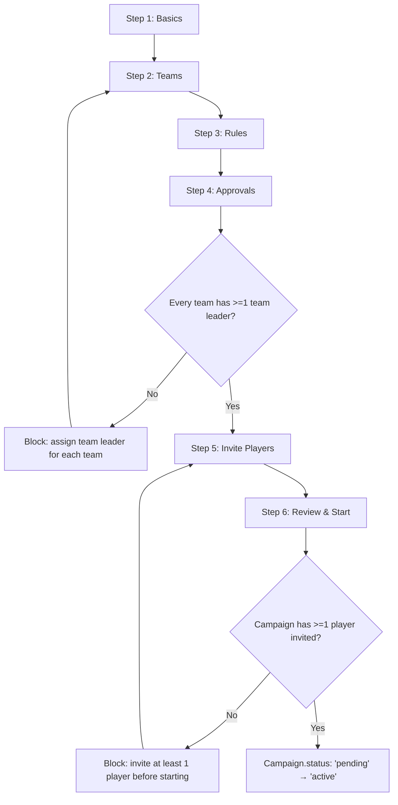
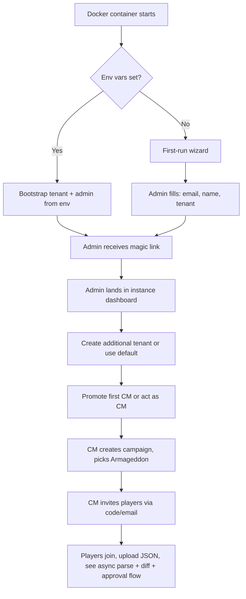

# PRD-1: Instance Admin & Crusade Master Administration (v3)

> Instance administration (Docker-first-run, tenant provisioning) plus the CM-facing campaign lifecycle and member management. v3: stack updated to Hapi/Node/TS.

---

## 0. Glossary

Per PRD-0 §3b. The roles in this app:

| Role | What they are | Scope |
|---|---|---|
| **Primary CM** | A user with the `cm` role for a specific campaign. The top authority on that campaign. | Full campaign authority, sees all teams' data. |
| **Crusade Team Leader** | A user with the `crusade_team_leader` role for **one specific team** (a team can have multiple team leaders per v3.12). They are also a player on that team. **They are not a co-CM; do not refer to them as such in the UI.** | **Their team only.** Sees their team's data; can approve `ApprovalRequest`s affecting their team for kinds the primary CM has enabled for them; cannot see other teams. |
| **Player** | A user with the `player` role. On exactly one team. | Their own roster + their team's narrative log + their own data. Cannot see other teams. |
| **Spectator** | Read-only public-link user. | Sees what the campaign's `publicVisibility` setting exposes. |

**Team leaders are not co-CMs.** Calling them "co-CM," "co-Crusade Master," or any phrase that implies they share the CM's role is wrong. They are players with delegated team-scoped approval authority. The role grants limited, scoped authority — it is not a promotion.

**Setting team leaders before campaign start:** by default, team leaders are assigned **before the campaign starts** (during campaign creation in the Crusade Administration panel). Once the campaign is started, a team must always have at least one active team leader — the CM cannot remove the only team leader on a team without first promoting a replacement.

**Multi-team-leader on a team:** a team can have multiple team leaders (v3.12). Default approval semantics: any one of them can approve (`teamLeaderApprovalMode: 'any'`). The CM can switch to `'all'` (every team leader must approve) per campaign, but `'any'` is the default and matches typical team-leadership workflows. With multi-leader + `'all'`, the request stays pending until every team leader has approved (or one has rejected).

**Only the CM can grant or revoke the team leader role** for any team (policy). Players cannot self-promote, and team leaders cannot promote other players to team leader. The CM does this from the Crusade Administration panel → Approvals section.

**Co-approval (in PRD-5) means:** an `ApprovalRequest` requires two distinct approvers. The pair is either Primary CM + second Primary CM (if the campaign has multiple CMs) or Primary CM + Crusade Team Leader (if the kind allows team-leader approval and the request is within that leader's team scope). Per-kind team-leader authority is configured by the primary CM.

**Data isolation:** teams cannot see each other's data through the app (RLS-enforced). Players share out-of-band if they want; the app doesn't facilitate it. Exception: when the crusade ends (`Campaign.status = 'archived'`), all data is read-only-visible to all players.

---

## 1. Goals

- New Docker instance bootstrapped in < 5 minutes
- New tenant created in < 2 minutes
- A CM can launch a fully-configured Armageddon campaign with 8 players in < 15 minutes

---

## 2. User Stories

### Instance Admin
- Bootstrap the instance via env-var config or a first-run wizard
- Create / disable / delete tenants
- See system-wide metrics
- Moderate abuse

### Crusade Master
- Create a new campaign, choose *Crusade: Armageddon*, configure house rules
- Generate an invite code/link scoped to my tenant
- See all rosters, with the approval queue highlighted
- Pause, archive, or end a campaign
- Override any data the system holds, with audit trail
- Be a player in my own campaign

---

## 3. Instance Administration

### 3.1 First-Run Bootstrap

Two paths:

**Path A: Env-var bootstrap** (recommended for production):
```bash
ADMIN_EMAIL=admin@example.com
ADMIN_DISPLAY_NAME="Jane Admin"
SMTP_HOST=smtp.example.com
SMTP_PORT=587
SMTP_USER=...
SMTP_PASS=...
PUBLIC_BASE_URL=https://crusade.example.com
DEFAULT_TENANT_SLUG=default
```

On first boot, the Hapi process:
- Creates the default Tenant
- Creates the Instance Admin User with magic-link login
- Bootstraps the BullMQ workers (parse-job, diff-job, rule-check-job, etc.)

**Path B: First-run wizard** (recommended for local dev):
- First visitor to the URL is offered a setup form: email, display name, tenant name
- After submit, the setup form is permanently removed

### 3.2 Tenant Management

| Field | Type | Notes |
|-------|------|-------|
| name | string | 3-60 chars |
| slug | string | URL-safe, unique within instance |
| settings | jsonb | tenant-level config (see below) |

**Tenant settings:**
- `allow_cross_tenant_spectators: bool` (default false)
- `default_supplement: string` (default `'armageddon'`)
- `max_campaigns_per_cm: int` (default 10)
- `max_members_per_campaign: int` (default 32)

### 3.3 Instance-Wide Metrics

The instance admin sees:
- Active tenants (last-30-day activity)
- Total campaigns / rosters / approvals
- Storage: Postgres size, MinIO bucket size
- BullMQ queue depths and failure rates
- Worker health (last successful parse timestamp, etc.)

### 3.4 Moderation

- Suspend a tenant: blocks all logins for users in that tenant; data retained
- Hard-delete a tenant: 30-day grace period, then cascade
- Suspend a user globally: blocks login across all tenants; data retained

---

## 4. CM Administration

### 4.1 Campaign Creation

The campaign-creation flow is a **multi-step wizard**, not a single form. Steps in order:



**Step 1: Basics**

| Field | Type | Notes |
|-------|------|-------|
| name | string | 3-60 chars |
| supplement | enum | `armageddon` for MVP |
| point_cap | int | Default 2000, range 500–3000 |
| max_games_per_player_per_week | int | Default 2 |
| ooa_test_variant | enum | `standard` (D6 ≤ 3 fails) or `lenient` (D6 ≤ 2 fails) |
| require_approved_roster_for_battles | bool | Default **true** |
| allow_manual_roster_edits | bool | Default false (JSON import is canonical) |
| custom_house_rules | markdown | Free text |

**Step 2: Teams** (mandatory, v3.12)

The CM creates the campaign's teams. For Armageddon, the system pre-fills the 4 template teams (Helsreach Defenders, Hades Defenders, Gorgutz's WAAAGH!, Skari's Kult) with their `expectedFactionIds` seeded from the book (PRD-1 §5b). The CM can use as-is, edit, delete, or add custom teams.

**Within Step 2 — Team leader assignment is required.** For each team, the CM must assign at least one player as a team leader before the wizard proceeds. The UI:

- Shows the team's player list (initially empty since no players have joined yet — players invite happens in Step 5)
- **However**, the CM can pre-assign players by email: the CM types a player's email, the system creates a `PendingTeamLeaderInvite` row tied to the team, and when the player accepts their campaign invite, they automatically become a team leader.
- A team cannot proceed to Step 3 without at least one **active** team leader OR at least one pending team leader invite.
- The UI surfaces a clear warning: "This team has no team leader. Assign one now, or invite a player to be team leader."
- This is a hard block — the wizard's "Next" button is disabled until every team has a leader or pending invite.

**Step 3: Rules** — enable/disable `RulePack`s per campaign (PRD-3 §6). Default packs: `builtin-core`, `armageddon-narrative`. CM can disable packs they don't want.

**Step 4: Approvals** — per-kind team-leader authority (PRD-1 §4.4 defaults), `teamLeaderApprovalMode: 'any' | 'all'` (default `'any'`), bulk-approve cap (default 50), `auto_approve_routine_battle_updates` (default false), `require_battle_report` (default true).

**Step 5: Invite Players** — CM invites by email or shareable link. Each invite is a single use or multi-use (CM-configurable). The invite email includes the campaign name + CM name + a magic-link-style auth URL.

**Step 6: Review & Start** — summary of all settings. CM clicks "Start campaign" to flip `Campaign.status: 'pending' → 'active'`. **Hard gate:** if any team still has no team leader (the pending invites haven't been accepted), the system blocks Start with: "Team X has no team leader. Either assign one or wait for invites to be accepted."

**Pre-campaign state (`Campaign.status: 'pending'`):** the campaign exists but is not yet active. Players can join via invite but cannot file approvals or play in battles. The CM can still edit settings. The state transitions to `active` when the CM clicks Start (and the team-leader gate passes).
| start_date | date | When battles can begin being filed |

**Output**: campaign record, unique 8-char invite code, tenant-scoped shareable URL.

### 4.2 Member Management

- CM sees: `displayName, faction, joinedAt, status, lastActivityAt, currentRosterStatus (parsing|pending_review|pending_approval|approved|failed)`
- CM can: invite (via email or link), remove, suspend
- **Crusade Team Leader management (CM-only, per v3.12):**
  - **Only the CM can add or update the team leader list for any team.** Players cannot self-promote, and existing team leaders cannot promote other players. This is policy, not a setting.
  - A team can have **multiple team leaders** (v3.12). The CM promotes a player to team leader by adding them to `TeamLeader` join table (PRD-0 §4) with `grantedAt` and `grantedByUserId`. The player must be a member of that team (via `CampaignMember`).
  - Default promotion timing: during campaign creation/setup, before the campaign starts. The Crusade Administration panel prompts the CM to assign at least one team leader per team.
  - Once the campaign is started, **every team must have at least one active team leader at all times.** The CM cannot remove the only team leader on a team without first promoting a replacement.
- **Team leader removal workflow (v3.12):**
  - The CM opens the team's team leader list in the Crusade Administration panel.
  - Clicks "Remove" next to a team leader.
  - The system checks: "Is this team leader the last active one on this team?" If yes, the CM is required to pick a replacement from the team's players before the removal can proceed. The replacement is added to `TeamLeader` atomically with the removal — both succeed or both fail.
  - If no, the removal proceeds and the team continues with the remaining team leaders.
  - The audit log records: "CM removed User X from team leadership; replaced by User Y" (or "no replacement needed").
  - The removed team leader loses the `crusade_team_leader` role for that team immediately. Their in-flight approvals (if any) are reassigned: pending approvals where they were the sole reviewer fall back to the primary CM (auto-reroute per PRD-5 §3.3 logic).
- Players can self-serve removal (leave the campaign entirely).
- **Crusade Team Leaders** are scoped to their team: they see their team's data, can approve `ApprovalRequest`s affecting their team for kinds the primary CM has enabled, but **cannot see or approve anything for other teams**.
- **Multiple CMs (rare):** if a campaign has more than one user with the `cm` role, they have full campaign authority each. Co-approval between them is configurable per kind (PRD-5 §3.2). This is **distinct** from Crusade Team Leaders, who are scoped to a team.

### 4.3 Dashboard

CM dashboard surfaces:
1. **Pending approvals count** (clickable → PRD-5 inbox)
2. **Active campaigns** (cards: # players, # battles, # pending updates, # pending roster approvals)
3. **Recent activity feed** (last 20 events)
4. **Roster health overview** — per player: "last approved roster date", "draft pending review", "no roster yet", "parse failed"
5. **BullMQ health** — queue depth, recent failures (so the CM knows if a stuck import is a real player issue vs. infra)
6. **Narrative log preview**
7. **Errata alert** — banner when Wahapedia refresh affected units in this campaign

### 4.3.1 The Inbox (clarified per user direction)

The CM inbox is the load-bearing surface of the dashboard. The user clarified what the inbox must show:

- **Requested approvals** (all kinds, not just battle updates) with their **deltas**
- **Battle reports** that accompany the approvals

That's the inbox. The user explicitly said the inbox does not need to compute every detail — just enough for the CM to make approval decisions, with battle reports + deltas giving the agenda context the CM needs to verify claims.

**Inbox content (v1):**
- For each `ApprovalRequest`:
  - Submitter name + campaign
  - Kind + age
  - Status of related entity (e.g., active roster version, battle id)
  - **Delta preview**: for `roster_approval`, the structural diff; for `post_battle_update`, the per-unit XP/honour/scar changes; for `requisition_purchase`, the unit being added/removed
  - **Battle report** (when applicable): the player's markdown report
  - Rule check results (PRD-3): pass/warn/fail with details
  - Quick actions: Approve / Reject / Request Changes / Override & Approve

**Inbox content NOT in v1:**
- Full event timeline (lives in the campaign's narrative log view)
- Per-unit historical diff (lives in the player's roster view)
- AI-generated agenda verification (v2+)
- Discord previews of battle reports (v2+ via Discord integration)

The inbox is the operational surface. The campaign timeline is the storytelling surface. Different jobs, different UIs.

**Per-role inbox views (v3.11):**

- **Primary CM inbox**: every `ApprovalRequest` in the campaign, all teams. The CM can approve anything (their authority is global).
- **Crusade Team Leader inbox**: only `ApprovalRequest`s affecting their team, AND only for kinds the primary CM has enabled for team-leader authority (PRD-1 §4.4). The team leader cannot see or act on requests from other teams, and cannot see requests from their own team for kinds they're not authorized for. The UI surfaces a clear "this is not in your authority; ask the primary CM" message for any request they can't approve.
- **Player view**: no inbox. Players file approvals; they don't review them.

**Cross-team visibility (v3.11):**

- A team leader looking at their team queue sees requests from players on their team only.
- The primary CM's view is the only one that crosses team boundaries.
- A team leader cannot see a request that was filed by a player who switched to their team after the request was filed (the request is bound to the team at filing time, not at approval time).
- When the crusade is archived (`Campaign.status = 'archived'`), all inboxes become read-only and every player across teams sees the full history (per PRD-0 §3b post-crusade relaxation).

### 4.4 The Crusade Administration Panel (v3.12)

The CM's campaign-administration surface. Sections:

- **General** — point cap, max games/week, OoA variant, house rules
- **Teams** — add/rename/delete/reorder/color teams; manage team leaders per team (per PRD-1 §4.2)
- **Rules** — enable/disable `RulePack`s per campaign
- **Approvals** — per-kind team-leader authority; rule-pack enforcement per kind; team-leader approval mode (`any` vs `all`); bulk-approve cap
- **Archive** — soft-archive or hard-delete the campaign

Editable: point cap, max games/week, OoA variant, house rules.

**Supplement changes are locked** for MVP. Switching supplements would invalidate active approved rosters; not supported.

**Approvals sub-section (v3.12):**

The CM opens the Approvals section to configure:

1. **Per-kind Team Leader authority** (`Campaign.teamLeaderAuthority`): per `ApprovalKind`, whether Crusade Team Leaders can approve requests in their team's scope. Defaults:

| Kind | Default team-leader authority |
|---|---|
| `roster_approval` | ✅ enabled |
| `roster_revert` | ✅ enabled |
| `requisition_purchase` (CM-gifted) | ❌ disabled (CM-only; routine player requisitions are NR-side per PRD-4 §7b.2) |
| `post_battle_update` | ✅ enabled |
| `rp_adjustment` | ✅ enabled |
| `roster_rollback` | ✅ enabled (per user's v3.11 confirmation) |
| `history_rollback` | ✅ enabled |
| `team_switch` | ❌ disabled (cross-team, CM-only) |
| `faction_switch` | ✅ enabled (the player's own faction) |
| `roster_manual_edit` | ❌ disabled (high-impact, CM-only) |
| `requisition_rp_override` | ❌ disabled (high-impact, CM-only) |
| `mass_reban` | ❌ disabled (high-impact, CM-only) |
| `campaign_announcement` | ❌ disabled (cross-team, CM-only) |
| `point_cap_change` | ❌ disabled (cross-team, CM-only) |
| `custom` | ❌ disabled (CM-only) |

The CM can flip any of these on/off per campaign. The reasoning for defaults: actions affecting only the player's own team and not cross-team-broad are team-leader-eligible; actions that affect the campaign as a whole or other teams are CM-only.

2. **Team-leader approval mode** (`Campaign.teamLeaderApprovalMode: 'any' | 'all'`): when a team has multiple team leaders, do all of them need to approve (`'all'`), or does any one suffice (`'any'`)? Default `'any'`. The `'all'` mode is a stronger check, used rarely. The audit log records which team leaders approved, in order.

3. **Bulk-approve cap** (`Campaign.bulk_approve_max_batch_size`): cap on how many approvals the CM or a team leader can act on in one bulk action. Default 50.

4. **Per-kind rule-pack enforcement** (`Campaign.rulePackEnforcement: { [kind]: { ruleKeys: string[] } }`): per kind, which rules are in enforcement. E.g., "the team-narrative-alignment rule is enforced at warn severity for `roster_approval` and disabled for `post_battle_update`." Defaults: rules apply to all kinds they were registered for; CM can selectively disable per kind.

**Active rule packs:** which `RulePack`s (PRD-3 §6) are enabled for this campaign. The CM toggles these on/off in the Rules section.

**Save behavior — re-assessment warning (v3.16):**

When the CM clicks "Save" on the Approvals section, the system evaluates: would any pending `ApprovalRequest` in this campaign change eligible-approvers under the new settings?

If yes: the warning modal described in PRD-5 §5.4 fires. The CM must explicitly confirm. The warning lists:
- The settings being changed (e.g., "disable team leader authority for `roster_approval`")
- The count of pending approvals that would be re-assessed (e.g., "4 × roster_approval")
- After-change state (e.g., "only actionable by you")
- Explicit note: past approvals are NOT affected; the change is difficult to rollback because the audit log will show the ruleset change

If no pending approvals would be affected: the change saves silently without a warning.

The same warning pattern applies to the Rules section (rule pack toggle / per-kind enforcement changes) — any settings change that affects pending approvals fires the warning.

Deletable: archive (soft) or hard-delete (typed confirmation required). Archive is the post-crusade state where all data becomes read-only-visible to all players across teams (per PRD-0 §3b data-isolation relaxation).

### 4.5 Override Tool

CMs can edit any field on any record, with required reason text. Every override writes to the audit log and surfaces in the affected player's notification.

### 4.6 Audit Log Viewer (v3.13)

A dedicated surface for the CM to inspect the campaign's audit trail. Lives under Crusade Administration panel → Audit.

**Layout:**

```
+----------------------------------------------------------------+
| Audit Log                                [Filter ▾] [Export ▾] |
+----------------------------------------------------------------+
| Time      | Actor     | Action              | Target   | Reason|
| 14:32:01  | mike_t    | approval.override   | Roster v17| "Castellan needed for arc" |
| 14:28:55  | system    | roster.parsed       | jake42/v18| —      |
| 14:25:10  | sarah_k   | post_battle.filed   | Battle 14 | —      |
| 14:20:00  | mike_t    | team_leader.grant    | helsreach| —      |
| 14:18:33  | system    | notification.email.sent| sarah_k| —      |
| ...                                                              |
+----------------------------------------------------------------+
```

**Filters:** by actor, by action kind, by target type, by date range, by campaign, by tenant. The default view is "this campaign, last 7 days."

**Click a row** → opens the underlying record: the `ApprovalRequest`, the `Event`, the `AuditLog` entry payload. From here the CM can navigate to the source data (the affected roster, the player, the battle).

**Export:** the audit log can be exported as CSV or JSON. Useful for post-crusade review, dispute resolution, or sharing with co-players.

**Why this matters:** when a player disputes "I never approved that," the CM opens the audit log and shows the player the exact timestamp + actor + payload of the approval. When Mike needs to remember "why did I override that rule 3 weeks ago?" the audit log shows his reason text. The audit log is the campaign's institutional memory.

**Retention:** audit log is retained for the lifetime of the campaign + 1 year after archival. Even after `Campaign.status = 'archived'`, the audit log is read-only accessible for the retention window. Hard-delete is only available to the Instance Admin and is logged separately (with a stronger audit trail).

**Per-role visibility:**
- **Primary CM**: full audit log for their campaign.
- **Crusade Team Leader**: audit entries scoped to their team (player joins/leaves, team leader grants, approvals they participated in). They do NOT see CM-only actions on other teams.
- **Player**: limited audit view scoped to their own actions + actions affecting them ("show me everything that happened to my roster"). Accessible from their settings page.

---

## 5. CM-as-Player (v3.11: also covers Crusade Team Leader as Player)

A CM is allowed to be a player in their own campaign. **A Crusade Team Leader is by definition a player on their team** (per PRD-0 §3b). The CM-as-player and Team-Leader-as-player patterns share most of this behavior.

- **CM-as-player:**
  - "Playing in your own campaign" badge shown next to their name
  - **All CM-as-player's deltas auto-approve, but still go through the full pipeline.** PRD-0 §4b's approval-gating principle still applies — the system creates the `ApprovalRequest`, runs rule checks, persists the diff, fires events, and emits notifications. The only thing skipped is the wait for a human approver.
  - **High-impact kinds with CM-only authority** (`mass_reban`, `point_cap_change`, `roster_manual_edit`, `requisition_rp_override`, `campaign_announcement`, `team_switch`): the primary CM cannot self-approve these even as a player. They go to a co-CM if one exists (multiple-CM campaigns), or stay pending with `approvalSource: 'co_cm_required_unavailable'` (audit-logged, must be approved when a co-CM becomes available or by CM at a later point). The CM can also configure team-leader authority for some of these per PRD-1 §4.4 — by default team leaders cannot approve high-impact kinds.
  - Own battle filings, requisition purchases, team switches — auto-approve but go through the pipeline.

- **Team Leader as player:**
  - The team leader is a player on their team with the `crusade_team_leader` role. Their own roster/battle/requisition requests follow the same auto-approve pattern as CM-as-player (their own self-actions don't need approval from themselves).
  - The team leader is **not** auto-approved for OTHER players' requests on their team — they explicitly approve those, with the audit trail recording `approvalSource: 'cm_review'` and `reviewerUserId: teamLeader`.

**Conflict-of-interest rationale:** the principle is that the CM and Team Leader are *trusted actors in their scope* (campaign-wide for CM; team-scoped for Team Leader), not untrusted players. Auto-approve-with-pipeline preserves the audit trail without forcing trusted actors to wait for themselves. Scope-bounded authority prevents unilateral abuse outside their scope.

---

## 5b. Campaign Teams (not 40K Factions — a distinct concept)

Campaign factions in the app's sense are **teams of players within a campaign**, *not* the 40K in-universe faction they play. The schema keeps these as two separate concepts to avoid the confusion in v3:

| Concept | Definition | Scope | Source |
|---------|-----------|-------|--------|
| `Faction` | 40K in-universe army (Astra Militarum, Space Marines, Orks, etc.) | Global, seeded | Wahapedia (26 rows) |
| `CampaignTeam` | Side of the narrative within a campaign | Per-campaign, nullable | CM-defined |

**Why this matters:**

In an Armageddon-style campaign, players on the same side of the war are typically **multiple 40K factions** — Space Marines, Astra Militarum, Sisters of Battle, and Adeptus Mechanicus might all fight under "Imperium Defenders." Conversely, Ork players might split across "Gorgutz's WAAAGH!" and "Skari's Kult." The "who is on my team" question is about narrative sides, not 40K factions.

Battles are scheduled both *intra-team* (rare, for narrative beat-battles between teammates) and *inter-team* (the main driver of campaign progress).

**Schema (in PRD-0 §4):**

- Teams are **mandatory** for every campaign in v1. Free-for-all mode is out of scope.
- `CampaignTeam { id, campaignId, name, description, color, narrativeLogFilter }` — the `narrativeLogFilter` controls which events the team's players see (e.g., Defenders see all events; Invaders see only Inter-team battles + Inter-team events)
- `CampaignMember.teamId: CampaignTeam['id']` — required; every player belongs to exactly one team
- `Roster.teamId` — the roster is bound to the team directly; if the player switches teams, the CM decides whether the roster follows, freezes on the old team, or is replaced (per the team-switch approval flow below)
- A campaign must have at least one team at creation time. The minimum viable campaign is 1 team with 1 player (legal but pointless); the system doesn't prevent this but the UI nudges toward ≥2 teams.

**Armageddon team templates (v1):**

When the CM picks the Armageddon supplement during campaign creation, the system pre-fills 4 teams as suggestions, each with `expectedFactionIds` seeded from the Armageddon book's narrative:

1. **Helsreach Defenders** (Imperial players fighting in Hive Helsreach)
   - `expectedFactionIds: [Astra Militarum, Space Marines, Sisters of Battle, Adeptus Mechanicus, Imperial Knights, Imperial Agents, Adepta Sororitas]`
2. **Hades Defenders** (Imperial players fighting in Hive Hades)
   - `expectedFactionIds: [same Imperial list]`
3. **Gorgutz's WAAAGH!** (Ork players under Warlord Gorgutz Ironjaw)
   - `expectedFactionIds: [Orks]`
4. **Skari's Kult of Speed** (Ork players under Warlord Skari Bloodspear)
   - `expectedFactionIds: [Orks]`

The CM can use as-is, rename, merge, add, delete, or override `expectedFactionIds`.

**Narrative intent vs enforcement — the guiding light:**

`CampaignTeam.expectedFactionIds` is **narrative intent, not enforcement**. The user clarified the relationship:

- The **Armageddon book** (and other Crusade supplements) provide narrative reference — "Helsreach Defenders fight for the Imperium, so they typically play Imperial factions."
- The **CM has final approval** on every roster. If Sarah wants to play Orks on Helsreach Defenders for narrative reasons (a renegade Ork warband ambushing the hive), Mike can approve that.
- **The app surfaces the hint, never blocks.** A player picking a faction outside their team's expected list sees a soft warning but is not prevented from joining or submitting a roster. The CM's approval workflow is where narrative fit gets adjudicated.

How the hint surfaces:
1. **Team picker (PRD-2)**: each team shows "typically plays Imperial factions" or "typically plays Orks" based on the expectedFactionIds count. If a player picks a mismatched faction, the picker shows: "Helsreach Defenders usually plays Imperial factions. Mike has final approval — you can proceed, but Mike may want to discuss the narrative fit."
2. **Roster rule check (PRD-3 §6.4)**: the `team-narrative-alignment` built-in rule runs on every RosterDraft. If `Roster.factionId ∉ CampaignTeam.expectedFactionIds`, the rule produces a **warn** (not a fail). The CM sees this in the approval inbox; if Mike wants to approve anyway, he clicks "Override & Approve" with a reason.
3. **Narrative log**: when the CM approves a roster with a narrative-alignment warn override, the audit log records the override reason. Players on the same team can see "Sarah's Helsreach roster (Orks) — approved by Mike with note: 'Ork renegade arc for narrative; conflict resolved in battle 4.'"

**Custom teams in v1.x (schema-ready now, UI deferred):**

The schema supports fully custom teams (a CM could create "Traitor Guard of the 83rd," "Skitarii of Forge World Mordax," etc.) from day one. The v1 UI exposes the Armageddon templates and standard CRUD (add/rename/delete/reorder/color/edit expectedFactionIds). A v1.x addition adds arbitrary team creation flows for non-Armageddon supplements and homebrew campaigns.

**Switching teams:**

When a player switches campaign teams (e.g., Helsreach → Hades), the change requires CM approval and creates a `team_switch` `ApprovalRequest` (PRD-5). On approval:

- `CampaignMember.teamId` updates
- The player's `Roster.teamId` follows by default (the roster moves with the player); the CM can choose to keep the roster on the old team (frozen) or create a new roster, captured in the approval decision
- An audit log event `roster.reassigned` is emitted
- The next roster approval will run `team-narrative-alignment` against the new team's expectedFactionIds (so a roster that was approved under Helsreach's Imperial narrative might warn under Hades's narrative — even though Hades has the same list, other teams might differ)

This keeps the "the books provide narrative reference, the CM has final approval" model honest: switching teams re-runs the narrative check against the new team's narrative intent.

**Battles across teams:**

- The CM schedules inter-team battles (playerA on Helsreach vs. playerB on Gorgutz) — the most common kind
- Intra-team battles are allowed but rare (e.g., a "fallen-internal" beat-battle where a team member fights their own teammate to settle a dispute)
- Battle pairings in the inbox (PRD-1 §4.3.1) and battle scheduling (PRD-4) use team as a first-class filter

**Per-team campaign metrics:**

The campaign dashboard shows team-level rollups alongside per-player:

- Team leaderboard by total victories (inter-team only)
- Per-team aggregate roster health (last approved roster date, % active)
- Per-team RP totals (visible to all players; CMs can hide if they prefer)
- Per-team requisition spend rate

These are aggregated views; the underlying events are per-player.

---

## 5c. Discord Integration (future, not in v1)

Webhook-based Discord integration is a high-value v2 feature (community runs most 40K conversation in Discord). The system will emit events that can be forwarded to Discord channels; the wiring lives in v2.

---

## 6. User Flow: First-Run → First Campaign



---

## 6b. Critical User Flows — Campaign Master (Mike)

**Persona — Mike, the CM:**
Mid-30s, IT professional, runs a local gaming group's Wednesday night sessions. Has run 3 campaigns over 4 years. Used Administratum for the last one but quit over the Patreon paywall for the campaign-management tier. Plays Tyranids, Aeldari, Necrons — whatever the narrative needs. Spends ~3 hours/week on CM work: pre-session prep, post-battle processing, narrative writing. Goal: cut that to 90 minutes/week.

Mike's pain points with current tools:
- Administratum is a roster tracker, not a referee. Players file roster changes that violate his house rules; he catches them only after the fact.
- He runs a Discord server for the group; the in-app notifications live in a different tool from the conversation.
- PDF rosters he exports for the table are always slightly out of date by the time the game starts.

Mike's success criteria for this app:
- Every approval request shows him what changed AND the player's justification (battle report or rule acknowledgement), so he can decide in <30 seconds for routine ones.
- He can see, at a glance, which players are engaged and which have gone quiet.
- He can write a campaign event ("Orks WAAAGH!") and the system shows the impact before he commits.

### Flow 1: Campaign setup (the first impression)

**Trigger:** Mike decides to start a new campaign. He clicks "New Campaign" from the dashboard.

**Why this matters:** First impressions. If setup takes 20 minutes, Mike will tell his group "this tool is too much work." The user goal is <5 minutes from "New Campaign" click to "ready to invite players."

**UI requirements:**

- **Form is pre-filled with sensible defaults** (2000 pts, max 2 games/week, standard OoA test, require-approved-roster ON, JSON-only mode ON). Mike edits what he wants, ignores the rest.
- **House rules markdown editor with live preview** — Mike writes "Allied Detachments not allowed except in narrative missions." This is the most subjective field; a preview pane lets him see what the player will see.
- **"Copy settings from another campaign" button** — Mike has run campaigns before. The fastest setup is reusing the last one's config.
- **Settings explainer tooltips** — "What does OoA test variant do? What's require-approved-roster?" — short, plain language, no wiki dive.
- **The "Invite Players" step happens on the success page**, not a separate screen. The campaign exists, the invite link is the headline, "Copy link" is the primary action.

**Critical moment:** The house rules field. Mike's house rules are the soul of his campaign. A 4KB textarea with no preview is hostile. Live preview = "what the player sees when they join."

**Edge case:** Mike wants to run two campaigns simultaneously (one for veterans, one for newcomers) with different house rules. The setup flow should support that without forcing him to re-enter settings; "Clone campaign" is the fast path.

### Flow 2: The inbox triage day (the most-used flow)

**Trigger:** It's Wednesday. Mike logs in. Six players filed battle updates over the weekend. One player uploaded a new roster. The inbox shows 7 pending items.

**Why this matters:** This is Mike's weekly 90-minute task. If the inbox is slow or noisy, the task grows. If it's fast and clean, the task shrinks.

**UI requirements:**

- **Inbox loads in <2 seconds** for up to 50 pending items. Indexes on `(tenantId, campaignId, status, submittedAt)`.
- **Default sort: oldest first** (FIFO). Mike processes in submission order.
- **Filter chips at the top**: by campaign, by kind, by submitter, by age. Mike filters to one campaign to focus.
- **Each row is scannable in <2 seconds**: submitter + kind + age + a 1-line summary of the diff ("+2 units, -1 unit, 3 wargear swaps") + rule check status (green/yellow/red dot).
- **Bulk-approve routine battle updates**: a checkbox per row; "Approve 4 selected" is one click. Per the auto-approve rules in PRD-5, the bulk action refuses if any selected item is non-routine (a failed OoA, a requisition, etc.). Mike gets a clear refusal: "2 items skipped (manual review needed): see details."
- **Click into a row to expand** — does NOT navigate. The detail view is inline (right pane or modal). Mike can decide without leaving the inbox list.
- **Live updates** — if a player files a new approval while Mike is reviewing, the new row appears at the bottom with a subtle animation. No full reload.
- **Recently-decided items stay visible for 24 hours** under a "Recently decided" tab, so Mike can undo if needed.

**Critical moment:** The bulk-approve. If it accidentally approves something non-routine, Mike loses trust in the tool. The refusal-when-non-routine behavior is the safety net. The UI must make it obvious *why* an item is being skipped.

**Edge case:** Mike approves a roster, but 30 seconds later the player uploads a new version because they realized they forgot to add a unit. The new RosterDraft is "pending_review" again. Mike's inbox now shows a new item. The previously approved roster is no longer "active" (it was superseded by the new pending draft). The UI must show this clearly — "Approved 2 minutes ago, superseded by new draft 30 seconds ago." This is a subtle UI problem; v1 handles it with a "superseded" badge on the older approved item.

### Flow 3: Roster approval with rule override

**Trigger:** Mike clicks into a pending roster approval. The diff shows: 1 unit added (a Rogal Dorn tank, 320 pts), 1 unit unchanged, 0 removals. Rule checks: 1 warn (point cap is 2000, this roster is 2120, 120 over). The player has acknowledged the warn.

**Why this matters:** Roster approvals are the most common decision Mike makes. The UI has to support fast yes/no on the typical case AND a confident override when the player has a good reason.

**UI requirements:**

- **Three-pane layout**: roster diff (left), rule check results (center), approve/reject controls (right). All visible without scrolling on a 1440x900 display.
- **Rule check report is human-readable**: "**Over point cap by 120.** Cap: 2000. Roster total: 2120. Largest contributors: Rogal Dorn (320), Cadian Castellan (75), Hellhound (180)."
- **Override & Approve button** is prominent, requires a reason text field (mandatory, min 10 chars), and shows the rule severity with a color tag.
- **The reason is recorded in the audit log and shown to the player** when they see the approval. Mike is held accountable for overrides.
- **A "preview timeline" link** in the diff pane shows the events that will be added if Mike approves (the approval creates events). This is a "what happens if I click yes" affordance.
- **If Mike previously approved this player**, the prior decisions are visible in a small "history" pane — did Mike override the same rule for this player last time? That's a signal.

**Critical moment:** The override reason. Mike needs to type something. "I know what I'm doing" is not a good reason; "Rogal Dorn is a special character for this narrative arc" is. The text field placeholder should be helpful: "Why is this rule being overridden? (visible to the player)".

**Edge case:** Mike opens a roster, scrolls around, and a player uploads a new version of the same roster while he's reviewing. Drift detection (PRD-5 §6) flags it; Mike sees "Drift detected — player uploaded new version 2 minutes ago. Approve original or re-validate?" The original approval is the older draft; Mike chooses to wait for the player to re-submit the new one.

### Flow 4: Triggering a narrative event

**Trigger:** Mike wants to inject drama. He picks "Ork WAAAGH!" from the narrative event templates.

**Why this matters:** Narrative events are the storytelling centerpiece. Mike is a story-teller; this is his moment. The UI must show him the *impact* before he commits, and make the event feel weighty.

**UI requirements:**

- **Templates gallery**: 3 Armageddon templates ship in v1 ("Yarrick's Broadcast", "Ork WAAAGH!", "Armageddon Stands"). Each shows a 1-line description and a sample message.
- **Preview before commit**: "This will affect 8 of 12 players. Each non-Ork faction loses 1 RP. Current RP: 0-5 across affected players. Will not go negative."
- **Optional message**: Mike types a 280-character narrative flourish that gets attached to the event. ("The sky darkened over Hades Hive. WAAAGH!")
- **Apply to which players**: by default, all eligible players per the template's filter; Mike can deselect specific players.
- **Confirm screen** with a summary; apply is irreversible except via rollback.
- **Post-apply**: a notification-job fires to all affected players, the event appears in the public narrative log, and the affected RosterApproved's RP field updates.

**Critical moment:** The preview. Mike needs to know "if I do this, Sarah loses 1 RP and is now at 0. Should I instead apply it only to Ork factions as a bounty?" Preview → adjust → apply.

**Edge case:** A narrative event that would push a player below 0 RP. The system clamps to 0 and emits a warning event. Mike sees the warning before he applies; if he applies anyway, the audit log records "CM applied X despite Y warnings."

### Flow 5: Monitoring campaign health

**Trigger:** Mike's been busy. It's been 3 weeks since he logged in. He opens the dashboard to see how the campaign is doing.

**Why this matters:** Campaigns die from neglect, not from rules. The #1 challenge per Tabletop Battles' roundtable is "keeping people active and engaged right up to the end." Mike needs a health view that surfaces the soft signals.

**UI requirements:**

- **Engagement heatmap**: per player, days since last battle filing, days since last login, days since last roster update. Color-coded (green / yellow / red).
- **Soft warnings**: "Player X has not filed an update in 21 days. Send a nudge?" with a one-click "send nudge" button (in-app + email).
- **Recent activity feed**: the last 20 events, with filters (battles / roster changes / events / system).
- **Pending actions for Mike**: not just approvals, but also "3 players have drafts in `parsing` state for over 5 minutes — BullMQ health might be off, or these are stuck."
- **Narrative log**: a view of the campaign's story so far, derived from public-visibility events. Mike can copy text from here to post in Discord.

**Critical moment:** The engagement heatmap. Mike sees Sarah hasn't filed an update in 18 days. He clicks on her row, sees she logged in yesterday (so she's not gone, just not playing battles). Mike sends a one-line nudge: "Hey Sarah, free for a game this week?" The tool made the nudge possible; without it, Mike wouldn't have noticed.

**Edge case:** A player who's been gone 60+ days. Mike can mark them as "AWOL" — their Roster is frozen, their requisition shop is locked, but their data is retained. If they come back, the AWOL is reversible. v1 handles this with a single "Mark AWOL" button on the member row.

---

## 7. Out of Scope (PRD-1)

- Cross-tenant campaign discovery
- Public campaign marketplace
- CM analytics dashboards beyond v2 metrics
- Multi-supplement campaign migration

---

## 8. Dependencies

- **PRD-0**: `Tenant`, `User`, `Campaign`, `CampaignMember`, `CrusadeSupplement`
- **PRD-5**: approval inbox link
- **PRD-3**: roster approval status surfaces in dashboard
- **PRD-4**: event feed surfaces in dashboard
- **Auth infra**: SMTP for magic-link delivery
- **Infra**: Docker Compose file, MinIO bucket provisioning, Postgres RLS policies, BullMQ workers

---

## 9. Success Metrics

| Metric | Target |
|--------|--------|
| Instance bootstrap time | < 5 min |
| Tenant creation time | < 2 min |
| Campaign creation time (with 8 invites sent) | < 15 min |
| Campaigns per active CM | > 1 |
| CM override usage rate | < 5% of unit changes |

---

## 10. Edge Cases

1. **Instance Admin lost access**: env-var path stores admin email; recovery requires re-running the bootstrap block, which is idempotent and resets the admin user.
2. **CM is also a player, no co-CM**: own deltas auto-approve via `approvalSource: 'self_approved'` (per PRD-5 §3.3) and the **full pipeline still runs** — ApprovalRequest created, rule checks fire, events emit, audit trail recorded. Future team view pages and event hooks work without special-casing the CM-as-player.
3. **All players leave a campaign**: dormant; auto-archive after 90 days.
4. **Two CMs edit settings concurrently**: last-write-wins with 5s debounce; second writer sees "someone else just edited" toast.
5. **Tenant suspended mid-campaign**: all in-flight approvals auto-rejected with reason "tenant suspended"; campaigns frozen.
6. **BullMQ worker dies mid-parse**: BullMQ job times out, re-queued; `RosterDraft.status` stays `parsing`; player notified after timeout.
