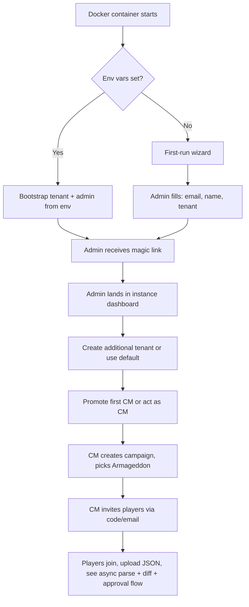

# PRD-1: Instance Admin & Crusade Master Administration (v3)

> Instance administration (Docker-first-run, tenant provisioning) plus the CM-facing campaign lifecycle and member management. v3: stack updated to Hapi/Node/TS.

---

## 1. Goals

- New Docker instance bootstrapped in < 5 minutes
- New tenant created in < 2 minutes
- A CM can launch a fully-configured Armageddon campaign with 8 players in < 15 minutes

---

## 2. User Stories

### Instance Admin
- Bootstrap the instance via env-var config or a first-run wizard
- Create / disable / delete tenants
- See system-wide metrics
- Moderate abuse

### Crusade Master
- Create a new campaign, choose *Crusade: Armageddon*, configure house rules
- Generate an invite code/link scoped to my tenant
- See all rosters, with the approval queue highlighted
- Pause, archive, or end a campaign
- Override any data the system holds, with audit trail
- Be a player in my own campaign

---

## 3. Instance Administration

### 3.1 First-Run Bootstrap

Two paths:

**Path A: Env-var bootstrap** (recommended for production):
```bash
ADMIN_EMAIL=admin@example.com
ADMIN_DISPLAY_NAME="Jane Admin"
SMTP_HOST=smtp.example.com
SMTP_PORT=587
SMTP_USER=...
SMTP_PASS=...
PUBLIC_BASE_URL=https://crusade.example.com
DEFAULT_TENANT_SLUG=default
```

On first boot, the Hapi process:
- Creates the default Tenant
- Creates the Instance Admin User with magic-link login
- Bootstraps the BullMQ workers (parse-job, diff-job, rule-check-job, etc.)

**Path B: First-run wizard** (recommended for local dev):
- First visitor to the URL is offered a setup form: email, display name, tenant name
- After submit, the setup form is permanently removed

### 3.2 Tenant Management

| Field | Type | Notes |
|-------|------|-------|
| name | string | 3-60 chars |
| slug | string | URL-safe, unique within instance |
| settings | jsonb | tenant-level config (see below) |

**Tenant settings:**
- `allow_cross_tenant_spectators: bool` (default false)
- `default_supplement: string` (default `'armageddon'`)
- `max_campaigns_per_cm: int` (default 10)
- `max_members_per_campaign: int` (default 32)

### 3.3 Instance-Wide Metrics

The instance admin sees:
- Active tenants (last-30-day activity)
- Total campaigns / rosters / approvals
- Storage: Postgres size, MinIO bucket size
- BullMQ queue depths and failure rates
- Worker health (last successful parse timestamp, etc.)

### 3.4 Moderation

- Suspend a tenant: blocks all logins for users in that tenant; data retained
- Hard-delete a tenant: 30-day grace period, then cascade
- Suspend a user globally: blocks login across all tenants; data retained

---

## 4. CM Administration

### 4.1 Campaign Creation

| Field | Type | Notes |
|-------|------|-------|
| name | string | 3-60 chars |
| supplement | enum | `armageddon` for MVP |
| point_cap | int | Default 2000, range 500–3000 |
| max_games_per_player_per_week | int | Default 2 |
| ooa_test_variant | enum | `standard` (D6 ≤ 3 fails) or `lenient` (D6 ≤ 2 fails) |
| require_approved_roster_for_battles | bool | Default **true** |
| allow_manual_roster_edits | bool | Default false (JSON import is canonical) |
| custom_house_rules | markdown | Free text |
| start_date | date | When battles can begin being filed |

**Output**: campaign record, unique 8-char invite code, tenant-scoped shareable URL.

### 4.2 Member Management

- CM sees: `displayName, faction, joinedAt, status, lastActivityAt, currentRosterStatus (parsing|pending_review|pending_approval|approved|failed)`
- CM can: invite (via email or link), remove, suspend, promote to co-CM
- Players can self-serve removal
- Co-CMs have all CM rights except: deleting the campaign, transferring ownership, changing the supplement

### 4.3 Dashboard

CM dashboard surfaces:
1. **Pending approvals count** (clickable → PRD-5 inbox)
2. **Active campaigns** (cards: # players, # battles, # pending updates, # pending roster approvals)
3. **Recent activity feed** (last 20 events)
4. **Roster health overview** — per player: "last approved roster date", "draft pending review", "no roster yet", "parse failed"
5. **BullMQ health** — queue depth, recent failures (so the CM knows if a stuck import is a real player issue vs. infra)
6. **Narrative log preview**
7. **Errata alert** — banner when Wahapedia refresh affected units in this campaign

### 4.3.1 The Inbox (clarified per user direction)

The CM inbox is the load-bearing surface of the dashboard. The user clarified what the inbox must show:

- **Requested approvals** (all kinds, not just battle updates) with their **deltas**
- **Battle reports** that accompany the approvals

That's the inbox. The user explicitly said the inbox does not need to compute every detail — just enough for the CM to make approval decisions, with battle reports + deltas giving the agenda context the CM needs to verify claims.

**Inbox content (v1):**
- For each `ApprovalRequest`:
  - Submitter name + campaign
  - Kind + age
  - Status of related entity (e.g., active roster version, battle id)
  - **Delta preview**: for `roster_approval`, the structural diff; for `post_battle_update`, the per-unit XP/honour/scar changes; for `requisition_purchase`, the unit being added/removed
  - **Battle report** (when applicable): the player's markdown report
  - Rule check results (PRD-3): pass/warn/fail with details
  - Quick actions: Approve / Reject / Request Changes / Override & Approve

**Inbox content NOT in v1:**
- Full event timeline (lives in the campaign's narrative log view)
- Per-unit historical diff (lives in the player's roster view)
- AI-generated agenda verification (v2+)
- Discord previews of battle reports (v2+ via Discord integration)

The inbox is the operational surface. The campaign timeline is the storytelling surface. Different jobs, different UIs.

### 4.4 Campaign Settings

Editable: point cap, max games/week, OoA variant, house rules.

**Supplement changes are locked** for MVP. Switching supplements would invalidate active approved rosters; not supported.

Deletable: archive (soft) or hard-delete (typed confirmation required).

### 4.5 Override Tool

CMs can edit any field on any record, with required reason text. Every override writes to the audit log and surfaces in the affected player's notification.

---

## 5. CM-as-Player

A CM is allowed to be a player in their own campaign:
- "Playing in your own campaign" badge shown next to their name
- Own roster approvals must be approved by a co-CM (or auto-approve with audit if no co-CM)
- Own battle filings subject to the same submission gating

Default behavior; CM cannot opt out (conflicts of interest require a co-CM, not a setting).

---

## 5b. Custom Factions (future, schema-ready now)

The user wants the option for CMs to define custom factions later (homebrew chapters, custom Imperial Guard regiments, narrative-only factions). The schema is built to support this from day one:

- `Faction` is a database table, not a hard-coded enum
- Wahapedia's 26 factions ship as the seed data
- `Campaign.factionWhitelist: string[] | null` controls which factions are selectable in the campaign
- A CM creating a custom faction is a v1.x feature (UI for it is out of scope for v1; data model + APIs are ready)

The faction picker (PRD-2) shows seeded factions only in v1. CMs who want custom factions in v1 can edit the seed list via a future admin tool; otherwise v1.x ships the full UI.

---

## 5c. Discord Integration (future, not in v1)

Webhook-based Discord integration is a high-value v2 feature (community runs most 40K conversation in Discord). The system will emit events that can be forwarded to Discord channels; the wiring lives in v2.

---

## 6. User Flow: First-Run → First Campaign



---

## 6b. Critical User Flows — Campaign Master (Mike)

**Persona — Mike, the CM:**
Mid-30s, IT professional, runs a local gaming group's Wednesday night sessions. Has run 3 campaigns over 4 years. Used Administratum for the last one but quit over the Patreon paywall for the campaign-management tier. Plays Tyranids, Aeldari, Necrons — whatever the narrative needs. Spends ~3 hours/week on CM work: pre-session prep, post-battle processing, narrative writing. Goal: cut that to 90 minutes/week.

Mike's pain points with current tools:
- Administratum is a roster tracker, not a referee. Players file roster changes that violate his house rules; he catches them only after the fact.
- He runs a Discord server for the group; the in-app notifications live in a different tool from the conversation.
- PDF rosters he exports for the table are always slightly out of date by the time the game starts.

Mike's success criteria for this app:
- Every approval request shows him what changed AND the player's justification (battle report or rule acknowledgement), so he can decide in <30 seconds for routine ones.
- He can see, at a glance, which players are engaged and which have gone quiet.
- He can write a campaign event ("Orks WAAAGH!") and the system shows the impact before he commits.

### Flow 1: Campaign setup (the first impression)

**Trigger:** Mike decides to start a new campaign. He clicks "New Campaign" from the dashboard.

**Why this matters:** First impressions. If setup takes 20 minutes, Mike will tell his group "this tool is too much work." The user goal is <5 minutes from "New Campaign" click to "ready to invite players."

**UI requirements:**

- **Form is pre-filled with sensible defaults** (2000 pts, max 2 games/week, standard OoA test, require-approved-roster ON, JSON-only mode ON). Mike edits what he wants, ignores the rest.
- **House rules markdown editor with live preview** — Mike writes "Allied Detachments not allowed except in narrative missions." This is the most subjective field; a preview pane lets him see what the player will see.
- **"Copy settings from another campaign" button** — Mike has run campaigns before. The fastest setup is reusing the last one's config.
- **Settings explainer tooltips** — "What does OoA test variant do? What's require-approved-roster?" — short, plain language, no wiki dive.
- **The "Invite Players" step happens on the success page**, not a separate screen. The campaign exists, the invite link is the headline, "Copy link" is the primary action.

**Critical moment:** The house rules field. Mike's house rules are the soul of his campaign. A 4KB textarea with no preview is hostile. Live preview = "what the player sees when they join."

**Edge case:** Mike wants to run two campaigns simultaneously (one for veterans, one for newcomers) with different house rules. The setup flow should support that without forcing him to re-enter settings; "Clone campaign" is the fast path.

### Flow 2: The inbox triage day (the most-used flow)

**Trigger:** It's Wednesday. Mike logs in. Six players filed battle updates over the weekend. One player uploaded a new roster. The inbox shows 7 pending items.

**Why this matters:** This is Mike's weekly 90-minute task. If the inbox is slow or noisy, the task grows. If it's fast and clean, the task shrinks.

**UI requirements:**

- **Inbox loads in <2 seconds** for up to 50 pending items. Indexes on `(tenantId, campaignId, status, submittedAt)`.
- **Default sort: oldest first** (FIFO). Mike processes in submission order.
- **Filter chips at the top**: by campaign, by kind, by submitter, by age. Mike filters to one campaign to focus.
- **Each row is scannable in <2 seconds**: submitter + kind + age + a 1-line summary of the diff ("+2 units, -1 unit, 3 wargear swaps") + rule check status (green/yellow/red dot).
- **Bulk-approve routine battle updates**: a checkbox per row; "Approve 4 selected" is one click. Per the auto-approve rules in PRD-5, the bulk action refuses if any selected item is non-routine (a failed OoA, a requisition, etc.). Mike gets a clear refusal: "2 items skipped (manual review needed): see details."
- **Click into a row to expand** — does NOT navigate. The detail view is inline (right pane or modal). Mike can decide without leaving the inbox list.
- **Live updates** — if a player files a new approval while Mike is reviewing, the new row appears at the bottom with a subtle animation. No full reload.
- **Recently-decided items stay visible for 24 hours** under a "Recently decided" tab, so Mike can undo if needed.

**Critical moment:** The bulk-approve. If it accidentally approves something non-routine, Mike loses trust in the tool. The refusal-when-non-routine behavior is the safety net. The UI must make it obvious *why* an item is being skipped.

**Edge case:** Mike approves a roster, but 30 seconds later the player uploads a new version because they realized they forgot to add a unit. The new RosterDraft is "pending_review" again. Mike's inbox now shows a new item. The previously approved roster is no longer "active" (it was superseded by the new pending draft). The UI must show this clearly — "Approved 2 minutes ago, superseded by new draft 30 seconds ago." This is a subtle UI problem; v1 handles it with a "superseded" badge on the older approved item.

### Flow 3: Roster approval with rule override

**Trigger:** Mike clicks into a pending roster approval. The diff shows: 1 unit added (a Rogal Dorn tank, 320 pts), 1 unit unchanged, 0 removals. Rule checks: 1 warn (point cap is 2000, this roster is 2120, 120 over). The player has acknowledged the warn.

**Why this matters:** Roster approvals are the most common decision Mike makes. The UI has to support fast yes/no on the typical case AND a confident override when the player has a good reason.

**UI requirements:**

- **Three-pane layout**: roster diff (left), rule check results (center), approve/reject controls (right). All visible without scrolling on a 1440x900 display.
- **Rule check report is human-readable**: "**Over point cap by 120.** Cap: 2000. Roster total: 2120. Largest contributors: Rogal Dorn (320), Cadian Castellan (75), Hellhound (180)."
- **Override & Approve button** is prominent, requires a reason text field (mandatory, min 10 chars), and shows the rule severity with a color tag.
- **The reason is recorded in the audit log and shown to the player** when they see the approval. Mike is held accountable for overrides.
- **A "preview timeline" link** in the diff pane shows the events that will be added if Mike approves (the approval creates events). This is a "what happens if I click yes" affordance.
- **If Mike previously approved this player**, the prior decisions are visible in a small "history" pane — did Mike override the same rule for this player last time? That's a signal.

**Critical moment:** The override reason. Mike needs to type something. "I know what I'm doing" is not a good reason; "Rogal Dorn is a special character for this narrative arc" is. The text field placeholder should be helpful: "Why is this rule being overridden? (visible to the player)".

**Edge case:** Mike opens a roster, scrolls around, and a player uploads a new version of the same roster while he's reviewing. Drift detection (PRD-5 §6) flags it; Mike sees "Drift detected — player uploaded new version 2 minutes ago. Approve original or re-validate?" The original approval is the older draft; Mike chooses to wait for the player to re-submit the new one.

### Flow 4: Triggering a narrative event

**Trigger:** Mike wants to inject drama. He picks "Ork WAAAGH!" from the narrative event templates.

**Why this matters:** Narrative events are the storytelling centerpiece. Mike is a story-teller; this is his moment. The UI must show him the *impact* before he commits, and make the event feel weighty.

**UI requirements:**

- **Templates gallery**: 3 Armageddon templates ship in v1 ("Yarrick's Broadcast", "Ork WAAAGH!", "Armageddon Stands"). Each shows a 1-line description and a sample message.
- **Preview before commit**: "This will affect 8 of 12 players. Each non-Ork faction loses 1 RP. Current RP: 0-5 across affected players. Will not go negative."
- **Optional message**: Mike types a 280-character narrative flourish that gets attached to the event. ("The sky darkened over Hades Hive. WAAAGH!")
- **Apply to which players**: by default, all eligible players per the template's filter; Mike can deselect specific players.
- **Confirm screen** with a summary; apply is irreversible except via rollback.
- **Post-apply**: a notification-job fires to all affected players, the event appears in the public narrative log, and the affected RosterApproved's RP field updates.

**Critical moment:** The preview. Mike needs to know "if I do this, Sarah loses 1 RP and is now at 0. Should I instead apply it only to Ork factions as a bounty?" Preview → adjust → apply.

**Edge case:** A narrative event that would push a player below 0 RP. The system clamps to 0 and emits a warning event. Mike sees the warning before he applies; if he applies anyway, the audit log records "CM applied X despite Y warnings."

### Flow 5: Monitoring campaign health

**Trigger:** Mike's been busy. It's been 3 weeks since he logged in. He opens the dashboard to see how the campaign is doing.

**Why this matters:** Campaigns die from neglect, not from rules. The #1 challenge per Tabletop Battles' roundtable is "keeping people active and engaged right up to the end." Mike needs a health view that surfaces the soft signals.

**UI requirements:**

- **Engagement heatmap**: per player, days since last battle filing, days since last login, days since last roster update. Color-coded (green / yellow / red).
- **Soft warnings**: "Player X has not filed an update in 21 days. Send a nudge?" with a one-click "send nudge" button (in-app + email).
- **Recent activity feed**: the last 20 events, with filters (battles / roster changes / events / system).
- **Pending actions for Mike**: not just approvals, but also "3 players have drafts in `parsing` state for over 5 minutes — BullMQ health might be off, or these are stuck."
- **Narrative log**: a view of the campaign's story so far, derived from public-visibility events. Mike can copy text from here to post in Discord.

**Critical moment:** The engagement heatmap. Mike sees Sarah hasn't filed an update in 18 days. He clicks on her row, sees she logged in yesterday (so she's not gone, just not playing battles). Mike sends a one-line nudge: "Hey Sarah, free for a game this week?" The tool made the nudge possible; without it, Mike wouldn't have noticed.

**Edge case:** A player who's been gone 60+ days. Mike can mark them as "AWOL" — their Roster is frozen, their requisition shop is locked, but their data is retained. If they come back, the AWOL is reversible. v1 handles this with a single "Mark AWOL" button on the member row.

---

## 7. Out of Scope (PRD-1)

- Cross-tenant campaign discovery
- Public campaign marketplace
- CM analytics dashboards beyond v2 metrics
- Multi-supplement campaign migration

---

## 8. Dependencies

- **PRD-0**: `Tenant`, `User`, `Campaign`, `CampaignMember`, `CrusadeSupplement`
- **PRD-5**: approval inbox link
- **PRD-3**: roster approval status surfaces in dashboard
- **PRD-4**: event feed surfaces in dashboard
- **Auth infra**: SMTP for magic-link delivery
- **Infra**: Docker Compose file, MinIO bucket provisioning, Postgres RLS policies, BullMQ workers

---

## 9. Success Metrics

| Metric | Target |
|--------|--------|
| Instance bootstrap time | < 5 min |
| Tenant creation time | < 2 min |
| Campaign creation time (with 8 invites sent) | < 15 min |
| Campaigns per active CM | > 1 |
| CM override usage rate | < 5% of unit changes |

---

## 10. Edge Cases

1. **Instance Admin lost access**: env-var path stores admin email; recovery requires re-running the bootstrap block, which is idempotent and resets the admin user.
2. **CM is also a player, no co-CM**: own approvals auto-apply with audit log entry `self_approved: true`.
3. **All players leave a campaign**: dormant; auto-archive after 90 days.
4. **Two CMs edit settings concurrently**: last-write-wins with 5s debounce; second writer sees "someone else just edited" toast.
5. **Tenant suspended mid-campaign**: all in-flight approvals auto-rejected with reason "tenant suspended"; campaigns frozen.
6. **BullMQ worker dies mid-parse**: BullMQ job times out, re-queued; `RosterDraft.status` stays `parsing`; player notified after timeout.
