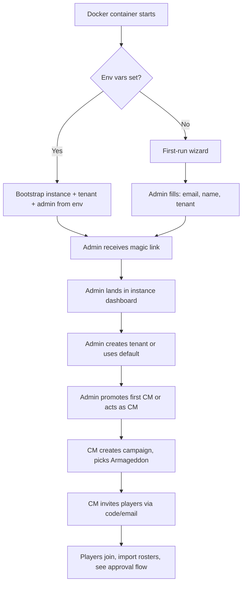

# PRD-1: Instance Admin & Crusade Master Administration (v2)

> Instance administration (Docker-first-run, tenant provisioning, global settings) plus the CM-facing campaign lifecycle and member management.

---

## 1. Goals

Enable a single Instance Admin to bootstrap a self-hosted Docker instance and provision tenants. Within each tenant, enable a Crusade Master to run one or more campaigns end-to-end without depending on a third-party service.

**Success metrics:**
- A new Docker instance can be bootstrapped in < 5 minutes
- A new tenant can be created in < 2 minutes
- A CM can launch a fully-configured campaign with 8 players in < 15 minutes

---

## 2. User Stories

### Instance Admin
- I can bootstrap the instance via env-var config or a first-run wizard.
- I can create / disable / delete tenants.
- I can see system-wide metrics (tenants, campaigns, storage, error rates).
- I can moderate abuse (suspend a tenant, suspend a user globally).

### Crusade Master
- I can create a new campaign within my tenant, choose Armageddon, configure house rules.
- I can generate an invite code/link scoped to my tenant.
- I can see all rosters in my campaign at a glance, with the approval queue highlighted.
- I can pause, archive, or end a campaign.
- I can override any data the system holds, with audit trail.
- I can be a player in my own campaign.

---

## 3. Instance Administration (NEW in v2)

### 3.1 First-Run Bootstrap

Two paths, configurable at deploy time:

**Path A: Env-var bootstrap** (recommended for production):
```bash
ADMIN_EMAIL=admin@example.com
ADMIN_DISPLAY_NAME="Jane Admin"
SMTP_HOST=smtp.example.com
SMTP_PORT=587
SMTP_USER=...
SMTP_PASS=...
PUBLIC_BASE_URL=https://crusade.example.com
```

On first boot, the app creates:
- One Tenant with `slug = 'default'`
- One User with `role = 'instance_admin'` and `tenantId = 'default'`
- Magic-link login flow with the configured SMTP

**Path B: First-run wizard** (recommended for local dev):
- Server starts with no admin user
- First visitor to the URL is offered a setup form: email, display name, tenant name
- After submit, the setup form is permanently removed

### 3.2 Tenant Management

| Field | Type | Notes |
|-------|------|-------|
| name | string | 3-60 chars |
| slug | string | URL-safe, unique within instance |
| settings | jsonb | tenant-level config (see below) |

**Tenant settings:**
- `allow_cross_tenant_spectators: bool` (default false)
- `default_supplement: string` (default `'armageddon'`)
- `max_campaigns_per_cm: int` (default 10)
- `max_members_per_campaign: int` (default 32)

### 3.3 Instance-Wide Metrics

The instance admin sees:
- Active tenants (last-30-day activity)
- Total campaigns / total rosters / total approved rosters / total pending approvals
- Storage: Postgres size, MinIO bucket size
- Error rate from FastAPI logs
- Background job health (Wahapedia refresh, NR import queue)

### 3.4 Moderation

- Suspend a tenant: blocks all logins for users in that tenant; data retained
- Hard-delete a tenant: 30-day grace period, then cascade (campaigns, rosters, events)
- Suspend a user globally: blocks login across all tenants; data retained

---

## 4. CM Administration

### 4.1 Campaign Creation

| Field | Type | Notes |
|-------|------|-------|
| name | string | 3-60 chars |
| supplement | enum | `armageddon` for MVP (other 4 deferred) |
| point_cap | int | Default 2000, range 500–3000 |
| max_games_per_player_per_week | int | Default 2 |
| ooa_test_variant | enum | `standard` (D6 ≤ 3 fails) or `lenient` (D6 ≤ 2 fails) |
| require_approved_roster_for_battles | bool | Default **true** (hard gate, per user direction) |
| allow_manual_roster_edits | bool | Default false (JSON import is the canonical path) |
| custom_house_rules | markdown | Free text, rendered on campaign page |
| start_date | date | When battles can begin being filed |

**Output**: campaign record, unique 8-char invite code, tenant-scoped shareable URL.

### 4.2 Member Management

- CM sees: `displayName, faction, joinedAt, status, lastActivityAt, currentRosterStatus (draft/pending/approved)`
- CM can: invite (via email or link), remove, suspend, promote to co-CM
- Players can self-serve removal
- Co-CMs have all CM rights except: deleting the campaign, transferring ownership, changing the supplement

### 4.3 Dashboard

CM dashboard surfaces:
1. **Pending approvals count** (clickable → PRD-5 inbox)
2. **Active campaigns** (cards: # players, # battles, # pending updates, # pending roster approvals)
3. **Recent activity feed** (last 20 events across CM's campaigns)
4. **Roster health overview** — for each player: "last approved roster date", "draft pending review", "no roster yet"
5. **Narrative log preview** (auto-aggregated from approved battle events)
6. **Errata alert** — banner when Wahapedia refresh affected units in this campaign

### 4.4 Campaign Settings

Editable: point cap, max games/week, OoA variant, house rules.

**Supplement changes are locked** for MVP. Switching supplements mid-campaign would invalidate active approved rosters; not supported in v1. If a CM wants to retire a campaign and start a new one with a different supplement, they archive + create new.

Deletable: archive (soft delete) or hard-delete. Hard-delete requires typed confirmation of campaign name and is logged to instance audit.

### 4.5 Override Tool

CMs can edit any field on any record, with required reason text. Every override writes to the audit log and shows in the affected player's notification.

---

## 5. CM-as-Player

A CM is allowed to be a player in their own campaign. When they do:

- A "playing in your own campaign" badge is shown next to their name in all member lists
- Their own roster approvals must be approved by a co-CM (if one exists) or auto-approved with audit-log entry (if no co-CM)
- Their own battle filings are subject to the same submission gating as everyone else

This is the default behavior; the CM cannot opt out (avoiding conflicts of interest requires a co-CM, not a setting).

---

## 6. User Flow: First-Run → First Campaign



---

## 7. Out of Scope (PRD-1)

- Cross-tenant campaign discovery
- Public campaign marketplace
- CM analytics dashboards beyond v2 metrics
- Multi-supplement campaign migration

---

## 8. Dependencies

- **PRD-0**: `Tenant`, `User`, `Campaign`, `CampaignMember`, `CrusadeSupplement`
- **PRD-5**: approval inbox link
- **PRD-3**: roster approval status surfaces in CM dashboard
- **PRD-4**: event feed surfaces in CM dashboard
- **Auth infra**: magic-link email delivery (SMTP), role gating
- **Infra**: Docker Compose file, MinIO bucket provisioning, Postgres RLS policies

---

## 9. Success Metrics

| Metric | Target |
|--------|--------|
| Instance bootstrap time | < 5 min (env-var path) |
| Tenant creation time | < 2 min |
| Campaign creation time (with 8 invites sent) | < 15 min |
| Campaigns per active CM | > 1 |
| CM override usage rate | < 5% of unit changes (otherwise approval flow is broken) |

---

## 10. Edge Cases

1. **Instance Admin deleted / lost access**: the env-var path stores admin email but no password. Recovery requires re-running the bootstrap env-var block, which is idempotent and resets the admin user.
2. **CM is also a player, no co-CM**: own roster / battle approvals auto-apply with an audit-log entry marked `self_approved: true`.
3. **All players leave a campaign**: campaign goes dormant; auto-archive after 90 days.
4. **Two CMs edit settings concurrently**: last-write-wins with 5s debounce; second writer sees "someone else just edited" toast.
5. **Tenant suspended mid-campaign**: all in-flight approvals auto-rejected with reason "tenant suspended"; campaigns frozen.
6. **CMs running campaigns across two tenants** (e.g., moves between jobs): CM must be re-invited to the new tenant; campaigns don't migrate.
