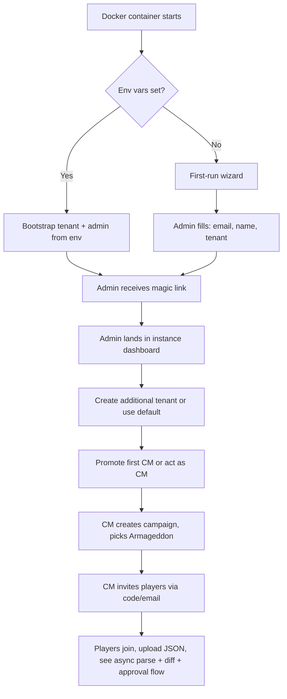

# PRD-1: Instance Admin & Crusade Master Administration (v3)

> Instance administration (Docker-first-run, tenant provisioning) plus the CM-facing campaign lifecycle and member management. v3: stack updated to Hapi/Node/TS.

---

## 1. Goals

- New Docker instance bootstrapped in < 5 minutes
- New tenant created in < 2 minutes
- A CM can launch a fully-configured Armageddon campaign with 8 players in < 15 minutes

---

## 2. User Stories

### Instance Admin
- Bootstrap the instance via env-var config or a first-run wizard
- Create / disable / delete tenants
- See system-wide metrics
- Moderate abuse

### Crusade Master
- Create a new campaign, choose *Crusade: Armageddon*, configure house rules
- Generate an invite code/link scoped to my tenant
- See all rosters, with the approval queue highlighted
- Pause, archive, or end a campaign
- Override any data the system holds, with audit trail
- Be a player in my own campaign

---

## 3. Instance Administration

### 3.1 First-Run Bootstrap

Two paths:

**Path A: Env-var bootstrap** (recommended for production):
```bash
ADMIN_EMAIL=admin@example.com
ADMIN_DISPLAY_NAME="Jane Admin"
SMTP_HOST=smtp.example.com
SMTP_PORT=587
SMTP_USER=...
SMTP_PASS=...
PUBLIC_BASE_URL=https://crusade.example.com
DEFAULT_TENANT_SLUG=default
```

On first boot, the Hapi process:
- Creates the default Tenant
- Creates the Instance Admin User with magic-link login
- Bootstraps the BullMQ workers (parse-job, diff-job, rule-check-job, etc.)

**Path B: First-run wizard** (recommended for local dev):
- First visitor to the URL is offered a setup form: email, display name, tenant name
- After submit, the setup form is permanently removed

### 3.2 Tenant Management

| Field | Type | Notes |
|-------|------|-------|
| name | string | 3-60 chars |
| slug | string | URL-safe, unique within instance |
| settings | jsonb | tenant-level config (see below) |

**Tenant settings:**
- `allow_cross_tenant_spectators: bool` (default false)
- `default_supplement: string` (default `'armageddon'`)
- `max_campaigns_per_cm: int` (default 10)
- `max_members_per_campaign: int` (default 32)

### 3.3 Instance-Wide Metrics

The instance admin sees:
- Active tenants (last-30-day activity)
- Total campaigns / rosters / approvals
- Storage: Postgres size, MinIO bucket size
- BullMQ queue depths and failure rates
- Worker health (last successful parse timestamp, etc.)

### 3.4 Moderation

- Suspend a tenant: blocks all logins for users in that tenant; data retained
- Hard-delete a tenant: 30-day grace period, then cascade
- Suspend a user globally: blocks login across all tenants; data retained

---

## 4. CM Administration

### 4.1 Campaign Creation

| Field | Type | Notes |
|-------|------|-------|
| name | string | 3-60 chars |
| supplement | enum | `armageddon` for MVP |
| point_cap | int | Default 2000, range 500–3000 |
| max_games_per_player_per_week | int | Default 2 |
| ooa_test_variant | enum | `standard` (D6 ≤ 3 fails) or `lenient` (D6 ≤ 2 fails) |
| require_approved_roster_for_battles | bool | Default **true** |
| allow_manual_roster_edits | bool | Default false (JSON import is canonical) |
| custom_house_rules | markdown | Free text |
| start_date | date | When battles can begin being filed |

**Output**: campaign record, unique 8-char invite code, tenant-scoped shareable URL.

### 4.2 Member Management

- CM sees: `displayName, faction, joinedAt, status, lastActivityAt, currentRosterStatus (parsing|pending_review|pending_approval|approved|failed)`
- CM can: invite (via email or link), remove, suspend, promote to co-CM
- Players can self-serve removal
- Co-CMs have all CM rights except: deleting the campaign, transferring ownership, changing the supplement

### 4.3 Dashboard

CM dashboard surfaces:
1. **Pending approvals count** (clickable → PRD-5 inbox)
2. **Active campaigns** (cards: # players, # battles, # pending updates, # pending roster approvals)
3. **Recent activity feed** (last 20 events)
4. **Roster health overview** — per player: "last approved roster date", "draft pending review", "no roster yet", "parse failed"
5. **BullMQ health** — queue depth, recent failures (so the CM knows if a stuck import is a real player issue vs. infra)
6. **Narrative log preview**
7. **Errata alert** — banner when Wahapedia refresh affected units in this campaign

### 4.4 Campaign Settings

Editable: point cap, max games/week, OoA variant, house rules.

**Supplement changes are locked** for MVP. Switching supplements would invalidate active approved rosters; not supported.

Deletable: archive (soft) or hard-delete (typed confirmation required).

### 4.5 Override Tool

CMs can edit any field on any record, with required reason text. Every override writes to the audit log and surfaces in the affected player's notification.

---

## 5. CM-as-Player

A CM is allowed to be a player in their own campaign:
- "Playing in your own campaign" badge shown next to their name
- Own roster approvals must be approved by a co-CM (or auto-approve with audit if no co-CM)
- Own battle filings subject to the same submission gating

Default behavior; CM cannot opt out (conflicts of interest require a co-CM, not a setting).

---

## 6. User Flow: First-Run → First Campaign



---

## 7. Out of Scope (PRD-1)

- Cross-tenant campaign discovery
- Public campaign marketplace
- CM analytics dashboards beyond v2 metrics
- Multi-supplement campaign migration

---

## 8. Dependencies

- **PRD-0**: `Tenant`, `User`, `Campaign`, `CampaignMember`, `CrusadeSupplement`
- **PRD-5**: approval inbox link
- **PRD-3**: roster approval status surfaces in dashboard
- **PRD-4**: event feed surfaces in dashboard
- **Auth infra**: SMTP for magic-link delivery
- **Infra**: Docker Compose file, MinIO bucket provisioning, Postgres RLS policies, BullMQ workers

---

## 9. Success Metrics

| Metric | Target |
|--------|--------|
| Instance bootstrap time | < 5 min |
| Tenant creation time | < 2 min |
| Campaign creation time (with 8 invites sent) | < 15 min |
| Campaigns per active CM | > 1 |
| CM override usage rate | < 5% of unit changes |

---

## 10. Edge Cases

1. **Instance Admin lost access**: env-var path stores admin email; recovery requires re-running the bootstrap block, which is idempotent and resets the admin user.
2. **CM is also a player, no co-CM**: own approvals auto-apply with audit log entry `self_approved: true`.
3. **All players leave a campaign**: dormant; auto-archive after 90 days.
4. **Two CMs edit settings concurrently**: last-write-wins with 5s debounce; second writer sees "someone else just edited" toast.
5. **Tenant suspended mid-campaign**: all in-flight approvals auto-rejected with reason "tenant suspended"; campaigns frozen.
6. **BullMQ worker dies mid-parse**: BullMQ job times out, re-queued; `RosterDraft.status` stays `parsing`; player notified after timeout.
