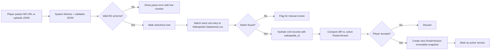
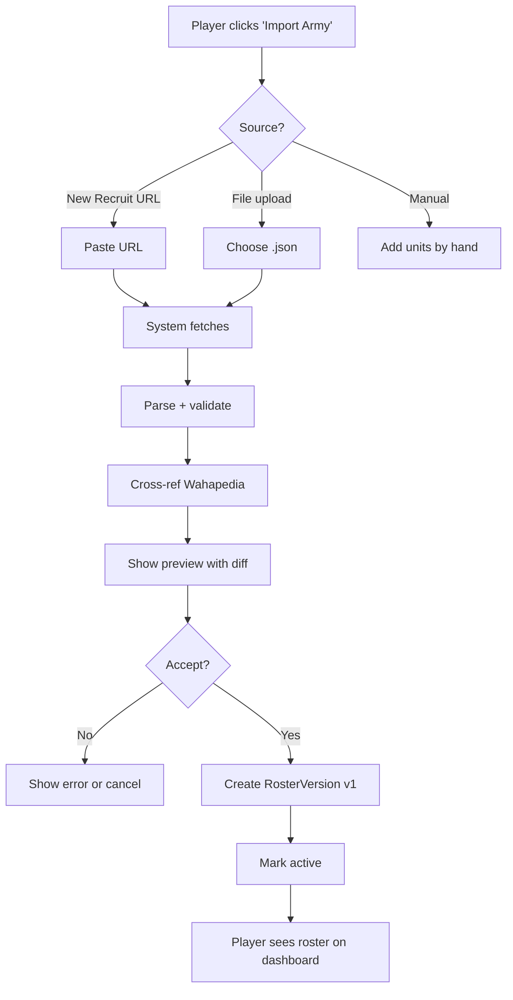

# PRD-3: Army Export & Versioning

> Import New Recruit JSON exports, version rosters over time, cross-reference with Wahapedia datasheets, and track changes between game sessions.

---

## 1. Goals

Let a player import their army list from New Recruit and have it instantly become a versioned, queryable Crusade roster. Every import creates a new immutable `RosterVersion`; the active version is what gets used in battles.

**Success metric**: 90% of NR exports import without manual fixup. The remaining 10% get a clear, actionable error or partial-import state.

---

## 2. User Stories

- **As a player**, I can paste a New Recruit JSON export URL (e.g. `newrecruit.eu/app/list/PYK7z`) and the system fetches and parses it.
- **As a player**, I can also upload the JSON file directly.
- **As a player**, I see a side-by-side diff of my new roster vs. the active version, highlighting which units were added, removed, or had wargear changes.
- **As a player**, I can name my roster versions ("Pre-Nachmund update", "After losses at Vigilus").
- **As a CM**, I can see the full version history of a player's roster.
- **As a player**, I can manually edit my roster (add/remove units, swap wargear) for cases where I haven't used NR.

---

## 3. New Recruit Import Pipeline



### 3.1 JSON Validation

Accept the BattleScribe XML-as-JSON schema. Validation rules:

- Root must have `roster` key
- `roster.forces[0].selections` must be present
- Each unit must have a unique `id` (BS entry id)
- Costs must be present and non-negative
- Nested entries (`Order of Battle`, faction upgrades) parsed but kept separate from the unit list

### 3.2 Wahapedia Cross-Reference

Wahapedia's `Datasheets.csv` exposes `id`, `name`, `faction_id`, `role`, and other fields. The match strategy:

1. **By entry id** (preferred): NR preserves BattleScribe catalogue entry ids. If a matching id exists in `Datasheets.csv`, use it directly.
2. **By name + faction fallback**: fuzzy-match on name string within the player's selected faction. Confidence > 90% auto-accepts; 70-90% requires player confirmation; < 70% flags for manual review.

When Wahapedia data is refreshed (nightly cron), the cross-reference IDs are re-resolved; unmatched units from prior imports are re-attempted with the new data.

### 3.3 Crusade Metadata

NR exports often include Crusade-specific entries (Order of Battle, Supply Limit, Battle Tally, etc.). These are parsed into a structured `CrusadeForceState` separate from the unit list:

```ts
interface CrusadeForceState {
  supplement: string;             // 'armageddon' etc.
  supplyLimit?: number;           // Nachmund
  logisticsPoints?: number;       // Nachmund
  battleTally: number;
  victories: number;
  alignment?: 'guardians' | 'despoilers' | 'marauders' | null;  // Nachmund
  requisitions: RequisitionState[];
  // etc.
}
```

This is overlaid on the active RosterVersion, not the unit snapshot. Updates to it happen via the post-battle update flow (PRD-4).

---

## 4. Versioning

Every import creates an immutable `RosterVersion`. A roster is a logical entity; versions are concrete snapshots.

```ts
interface Roster {
  id: string;
  ownerUserId: string;
  campaignId: string;
  factionId: string;
  name: string;
  activeVersionId: string;
  versions: string[];   // ordered list of RosterVersion ids, oldest first
}

interface RosterVersion {
  id: string;
  rosterId: string;
  versionNumber: int;       // 1, 2, 3, ...
  createdAt: timestamp;
  createdByUserId: string;
  sourceImportId?: string;  // links back to the Import record
  snapshot: {
    units: Unit[];
    crusade: CrusadeForceState;
    pointLimit: int;
    totalPoints: int;
  };
  label?: string;           // optional player-supplied name
}
```

**Versioning rules:**
- Versions are never modified after creation.
- The `activeVersionId` is the only one consulted for battle filings.
- A new version becomes active only after player confirmation.
- Players can roll back: revert `activeVersionId` to an earlier version (creates a new version that is a copy of the old one — does not destroy history).

---

## 5. Diff View

Side-by-side or unified diff showing:

| Change | Visualization |
|--------|--------------|
| Unit added | Green left-arrow in unified, full row in side-by-side |
| Unit removed | Red right-arrow in unified, full row in side-by-side |
| Wargear swapped | Yellow highlight on changed field |
| Stats changed (after Wahapedia refresh) | Blue info icon with timestamp |
| Crusade state changed (RP, supply limit, etc.) | Inline numeric delta |

The diff is computed in two layers:
1. **Structural diff**: units and wargear, ignoring cosmetic metadata
2. **Crusade diff**: XP, ranks, honours, scars, requisitions

---

## 6. Manual Editing

Players can add/remove units and swap wargear without going through NR. Use cases:
- Player hasn't built a list in NR yet, just wants to start
- Player is on mobile and NR is desktop-only
- Player wants to use a unit NR doesn't have (e.g., Legends units)

Manual edits create a new `RosterVersion` with `sourceImportId = null` and `createdByUserId = user.id`. The system tags the version as "manually edited" so CMs can review.

---

## 7. Wahapedia Data Refresh

Nightly cron:
1. Fetch `https://wahapedia.ru/wh40k10ed/Factions.csv` and the other Wahapedia CSVs
2. Compute diff vs. cached data
3. For each changed datasheet, find affected RosterVersions and re-resolve unit data
4. If a unit was deleted from Wahapedia, mark the corresponding `Unit.wahapia_id` as `deprecated` and surface a banner
5. If a unit had a points change, write a system Delta to affected RosterVersions (visible in PRD-4 timeline)

The cache key includes edition; when 11th-ed lands, the cache rotates and old data is preserved under `wh40k10ed.*` so the app continues to serve 10th-ed campaigns.

---

## 8. User Flow: First Import



---

## 9. Out of Scope

- BattleScribe XML import (defer; NR JSON covers 90% of use cases)
- TTS (Tabletop Simulator) export
- 3D-printed proxy generation
- Real-time sync with NR (must be a manual re-import)

---

## 10. Dependencies

- **PRD-0**: `Roster`, `RosterVersion`, `Unit`, `User` types
- **Wahapedia CSV cache** (infra): nightly refresh job
- **PRD-4**: diffs feed into the battle event timeline
- **PRD-5**: manual edits may require CM approval for crusade state changes

---

## 11. Success Metrics

| Metric | Target |
|--------|--------|
| NR import success rate (no manual fixup) | > 90% |
| Average import time | < 10s |
| Manual-edit rate | < 10% of all imports |
| Wahapedia refresh lag | < 24h |
| Wahapedia cross-ref match rate | > 95% (by entry id), > 90% (by name fallback) |

---

## 12. Edge Cases

1. **Import with custom unit names ("Brother Tyler's Veterans")**: stored as `Unit.customName`; preserves the lore name while keeping `wahapedia_id` for stats lookup.
2. **Import with a unit not in Wahapedia** (e.g., a Forge World Legends unit): stored with `wahapedia_id = null`; player can manually enter stats or use a generic stat block.
3. **Two players share a NR list URL** (copy-paste mistake): system detects duplicate `sourceImportId` and prompts to clone vs. import-as-new.
4. **Importing during a pending battle update** (PRD-5): the new version is staged; pending update refers to the previous version. Approval flow re-checks against the new version before applying.
5. **Corrupt JSON**: show "Could not parse file" with a "Send to support" link that emails the raw file (with user consent).
