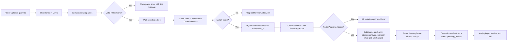
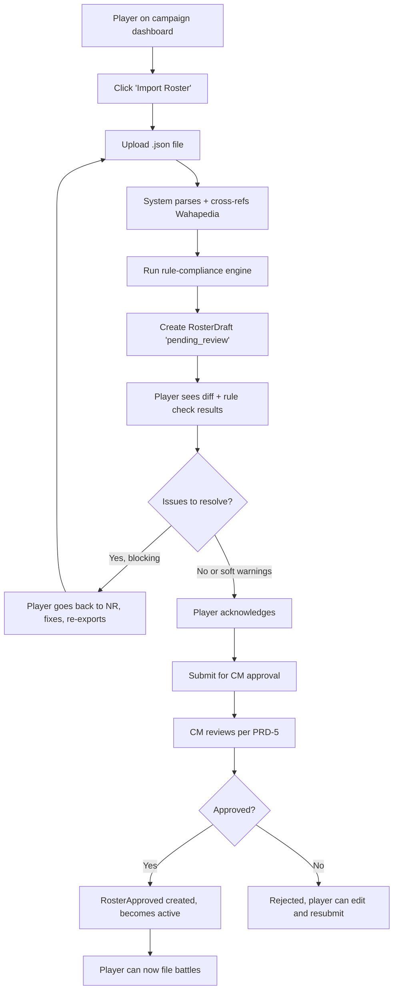

# PRD-3: Roster Import, Approval, & Rule Compliance (v2)

> The roster state machine, the diff surfaced to the player before approval, and the automated rule-compliance engine. The central piece of v2.

---

## 1. Goals

Let a player import their NR-shaped JSON, see exactly what changed vs. the last approved roster, and submit it for CM approval. The system runs a rule-compliance check on every import and surfaces violations to both the player and the CM.

**Success metric**: 90% of NR-shaped JSON imports parse and produce a draft without manual fixup. 85% of submitted drafts pass CM approval on first review (the rest are caught by either the player or the CM as rule violations).

---

## 2. The Roster State Machine (KEY CONCEPT)

```
                        ┌──────────────────────┐
                        │   (no Roster yet)    │
                        └──────────┬───────────┘
                                   │ player uploads JSON
                                   ▼
                        ┌──────────────────────┐
                        │  RosterDraft         │
                        │  status:             │
                        │   'pending_review'   │   player sees diff
                        └──────────┬───────────┘
                          ack by   │
                          player   │   player submits for approval
                                   ▼
                        ┌──────────────────────┐
                        │  RosterDraft         │
                        │  status:             │
                        │   'pending_approval' │   CM reviews
                        └──────────┬───────────┘
                          approved │
                          by CM    │   rejected
                                   ▼                  ▼
                        ┌──────────────────────┐  ┌─────────────────────┐
                        │  RosterApproved      │  │  RosterDraft         │
                        │  (immutable)         │  │  status:             │
                        │  becomes "active"    │  │   'rejected'         │
                        └──────────┬───────────┘  │  with CM feedback    │
                                   │              └─────────────────────┘
                                   │
                                   │  player uploads NEW JSON
                                   ▼
                        ┌──────────────────────┐
                        │  RosterDraft (v2)    │   diff is vs. RosterApproved v1
                        │  status:             │
                        │   'pending_review'   │
                        └──────────┘
```

**Hard rule**: a player can only file a battle update, requisition, or any other event (PRD-4) if the most recent state of their Roster is `RosterApproved`. The "active" Roster at any timestamp is the most recent RosterApproved up to that timestamp.

---

## 3. Import Pipeline



### 3.1 JSON Validation

Standard New Recruit / BattleScribe JSON schema. Validation rules:

- Root must have `roster` key
- `roster.forces[0].selections` present
- Each unit has a unique `id` (BattleScribe entry id)
- Costs present and non-negative
- Nested entries (`Order of Battle`, faction upgrades) parsed into `CrusadeForceState` (separate from unit list)

Validation errors include line numbers and human-readable reasons. Parse errors are fatal (no draft created).

### 3.2 Wahapedia Cross-Reference

Match strategy:
1. **By entry id** (preferred): NR preserves BattleScribe entry ids. Direct lookup in `Datasheets.csv`.
2. **By name + faction fallback**: fuzzy match within the player's selected faction. Confidence > 90% auto-accepts; 70-90% requires player confirmation; < 70% flags for manual review.

Unmatched units become `Unit.wahapia_id = null` and display a warning in the draft. They're still importable (player can manually enter stats) but require CM override to be approved.

### 3.3 Crusade Metadata

NR exports may include Crusade-specific entries under `Order of Battle` (Supply Limit, Battle Tally, Victories, etc.). These are parsed into `CrusadeForceState` and shown in the draft but **not** auto-applied — they only become canonical when the Roster is approved. This is important because:

- If the player is wrong about their RP balance, the CM catches it at approval
- A re-import can show the player "your Supply Limit dropped from 2800 to 2400 — did you spend LP?"

---

## 4. Rule Compliance Engine (THE REFEREE)

Every import runs a set of checks. Each check produces a `RuleCheck` record with `status: 'pass' | 'warn' | 'fail'`.

| Check | Severity | What it catches |
|-------|----------|-----------------|
| Point cap | fail | Total roster points > `campaign.point_cap` |
| Faction lock | fail | Unit has a faction keyword not in the player's selected faction |
| Unit cap (Crusade rules) | warn | More than 3 of the same datasheet (universal Crusade rule) |
| Requisition provenance | warn | Unit in roster but not in any prior RosterApproved AND no `requisition_purchase` event since the prior approval |
| Wargear legality | warn | Wargear option not present in the matching datasheet's Wahapedia options |
| Legends unit | warn | Unit flagged as Legend in Wahapedia (CMs can override per campaign setting) |
| Removed unit | warn | Unit in prior RosterApproved but not in new draft (could be intentional; could be forgotten requisition) |
| Honour / scar consistency | warn | Unit has a Battle Honour in the new draft that wasn't earned via a prior approved battle event |
| XP / rank consistency | fail | Unit's XP / rank in new draft doesn't match what the prior battles would produce |
| Supply limit (Nachmund) | fail | Roster units + reinforcements > Supply Limit *(deferred; MVP is Armageddon)* |
| Logistics points (Nachmund) | warn | Implied LP spend exceeds available *(deferred; MVP is Armageddon)* |

**Configurable per campaign**:
- `rule_compliance_mode`: `soft` (warn, player acknowledges) | `hard` (fail blocks draft submission) | `off`
- Default: `soft` with `hard` on the two `fail`-severity checks (point cap, faction lock, XP/rank consistency)

**Output of the engine**: a list of `RuleCheck` records attached to the `RosterDraft`. Surfaced to:
1. The player when they view the draft (must explicitly acknowledge before submitting for approval)
2. The CM when they review the draft for approval (PRD-5)

### 4.1 Acknowledgment UX

If any check is `warn` or `fail`, the player sees a modal:
- List of issues, each with: severity, what's wrong, how to fix
- "I understand, submit anyway" button (only enabled if no `fail`-severity issues, or the campaign is in `soft` mode)
- "Cancel and re-export from NR" button (recommended path)

---

## 5. Diff View (Player-First)

The diff is **for the player, not just the CM**. The player must explicitly review and acknowledge it before submitting for approval.

| Change | Visualization |
|--------|--------------|
| Unit added | Green left-arrow in unified, full row in side-by-side |
| Unit removed | Red right-arrow in unified, full row in side-by-side |
| Wargear swapped | Yellow highlight on changed field |
| Crusade state changed (RP, supply limit, etc.) | Inline numeric delta |
| Honours/scars added | Inline with reason "earned via Battle #X (approved YYYY-MM-DD)" or "unearned — will require CM override" |
| Stats changed (after Wahapedia refresh) | Blue info icon with timestamp |

The diff is two layers:
1. **Structural diff**: units and wargear
2. **Crusade diff**: XP, ranks, honours, scars, requisitions, supply limit

---

## 6. CM Approval

When the player submits the draft (status: `pending_review` → `pending_approval`), it enters the CM's approval inbox (PRD-5).

CM sees:
- The same diff the player saw
- The full rule-check report
- Player's optional notes
- The currently-active RosterApproved (if any) for context
- A diff between the new draft and the currently-active approved (re-using §5)

CM's options:
- **Approve**: creates a new RosterApproved, becomes active. The previous RosterApproved is retained in history.
- **Reject with feedback**: draft goes back to `rejected` status with CM's notes. Player can edit and resubmit.
- **Request changes**: same as reject, but with structured change requests.
- **Override a specific rule**: per campaign, CM can mark a `fail` as `pass_with_override` with a reason.

Approval creates a `roster_approved` event (PRD-4) with a `Delta` capturing the change from the previous approved snapshot.

---

## 7. Rollback

A CM can roll back a RosterApproval within a configurable window (default 7 days). Rollback:
- Marks the RosterApproved as `superseded`
- Re-activates the previous one
- Emits a `roster_rolled_back` event
- Inverts any deltas that were applied as a consequence (e.g., if a requisition was purchased in the rolled-back window and the new roster included that unit, the unit is removed)

For destructive approvals (rare, since approval is mostly additive), rollback requires typed confirmation.

---

## 8. Cron: Wahapedia Refresh

Nightly job:
1. Fetch `https://wahapedia.ru/wh40k10ed/*.csv` and the export spec XLSX
2. Compute diff vs. cached
3. For each changed datasheet, find affected RosterApproved snapshots and re-resolve unit data
4. If a unit was deleted from Wahapedia, mark `Unit.wahapia_id = deprecated` and surface a banner
5. If a unit's points changed, emit a `points_updated` system event per affected RosterApproved
6. Cache key includes edition; when 11th-ed data appears on Wahapedia, the cache rotates and 10th-ed is preserved under `wh40k10ed.*`

---

## 9. User Flow: First-Time Import



---

## 10. Out of Scope

- NR URL fetch / scraping
- Manual unit editing in the UI (JSON import is the canonical path; CMs have an override tool for emergency fixes per PRD-1)
- Multiple approval-required documents (e.g., a "list of changes" that needs separate sign-off)
- Auto-rollback if CM is also the submitter (CM-as-player already requires a co-CM per PRD-1)

---

## 11. Dependencies

- **PRD-0**: `Roster`, `RosterDraft`, `RosterApproved`, `CrusadeForceState`, `RuleCheck`
- **PRD-4**: every approval creates an event; timeline is the source of truth for what was active when
- **PRD-5**: approval workflow is unified
- **Wahapedia CSV cache** (infra): nightly refresh, shared across tenants

---

## 12. Success Metrics

| Metric | Target |
|--------|--------|
| NR-shaped JSON import success rate (no manual fixup) | > 90% |
| First-try approval rate | > 85% |
| Rule-check catch rate (catches violations CM would otherwise catch manually) | > 95% |
| Time from JSON upload to first RosterApproved | < 30 min median |
| Wahapedia cross-ref match rate | > 95% (by entry id), > 90% (by name fallback) |

---

## 13. Edge Cases

1. **Two players share the same NR list URL** (copy-paste mistake): system detects duplicate import blob and prompts to use the existing roster vs. import-as-new.
2. **Import with a custom unit name** ("Brother Tyler's Veterans"): stored as `Unit.customName`; `wahapedia_id` retained for stats lookup.
3. **Import with a Legends / Forge World unit**: stored with `wahapedia_id = null`; rule engine flags `warn`; player acknowledges; CM approves with override.
4. **Corrupt JSON**: show "Could not parse file" with a "Send to support" link that emails the raw file (with user consent).
5. **Player imports during a pending approval**: the new draft is staged separately; pending approval refers to the older draft. The CM's approval workflow handles drift (PRD-5).
6. **CM switches the campaign's `point_cap` after a roster is approved**: existing approved rosters are retroactively checked; if a roster now exceeds the cap, the player is notified and must re-import.
