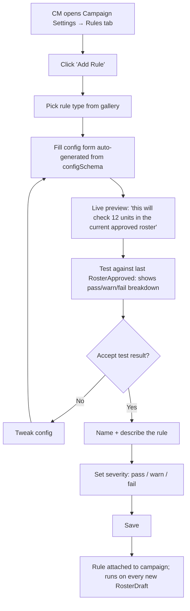
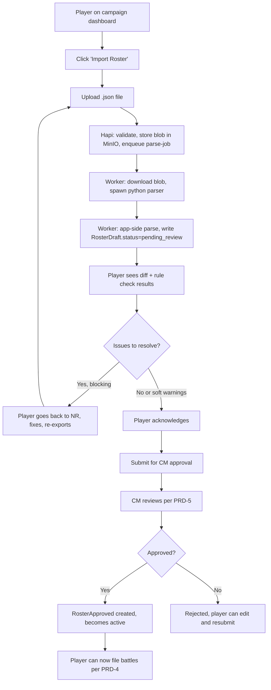

# PRD-3: CrusadeForce Import, Approval, & Rule Compliance (v3)

> BullMQ-driven async parsing pipeline, integration with the user's `bs-roster-parser` Python library, and a configurable rule engine that CMs and crusade settings can extend. **v3.28** overhauls the data model to use `CrusadeForce / CrusadeForceVersion / CrusadeArmy` instead of `Roster / RosterDraft / RosterApproved`.

**Terminology note (v3.28 — avoids conflation):** this PRD uses four related concepts:
- **`CrusadeForce`** — a player's army in this campaign. Each force has metadata (campaignMemberId, teamId, factionId, name), a status (`pending_approval` | `deployed` | `withdrawn`), and a pointer to its current approved version. A player may have multiple forces per campaign (up to `Campaign.maxCrusadeForcesPerPlayer`).
- **`CrusadeForceVersion`** — an immutable, monotonically-numbered snapshot of a force's Order of Battle at a moment in time. Created from a player upload; goes through `parsing → pending_review → pending_approval → approved | rejected | failed`. Many versions can exist per force (one per import attempt).
- **`CrusadeArmy`** — the subset of units mustered from a `CrusadeForceVersion` for a specific battle (or saved for later). Distinct from the force itself: a 3000pt force can muster 2000pt armies.
- **`Battle`** — a single match between two armies. References the `CrusadeArmy` (or `CrusadeForceVersion` if no specific muster was filed) used.

The relationship: `CrusadeForce` is the parent; `CrusadeForceVersion` is what was approved and when; `CrusadeArmy` is what was actually taken to a battle. Don't say "the force is in pending_approval" — say "the latest CrusadeForceVersion is in pending_approval; the force's current approved version is unchanged." This distinction matters for battle-update gating (PRD-4 §6: a battle update requires a current approved `CrusadeForceVersion` on the relevant force).

---

## 1. Goals

Get a player from "uploaded JSON" to "RosterDraft ready for review" in under 30 seconds. Surface the diff vs. the last approved roster to the player first. Run a configurable rule-check engine on every draft and gate submission by an approved roster.

**Success metrics:**
- 90% of NR-shaped JSON imports parse and produce a draft without manual fixup
- 85% of submitted drafts pass CM approval on first review
- Parse pipeline p95 latency: < 30s

---

## 2. The CrusadeForce / Version State Machine (v3.28)

There are two intertwined state machines: the **CrusadeForce** lifecycle (the parent entity) and the **CrusadeForceVersion** lifecycle (each imported snapshot).

### 2a. CrusadeForce lifecycle

```mermaid
stateDiagram-v2
    [*] --> pending_approval : player files new force<br/>(if Campaign.requireApprovalForNewForce = true)
    [*] --> deployed : player files new force<br/>(if Campaign.requireApprovalForNewForce = false)
    pending_approval --> deployed : first CrusadeForceVersion approved
    pending_approval --> [*] : player withdraws before approval
    deployed --> withdrawn : player or CM withdraws
    withdrawn --> [*] : terminal (history preserved)
    deployed --> deployed : player files additional CrusadeForceVersions<br/>(creates v2, v3, ...; currentVersionId advances)
    pending_approval --> pending_approval : player files a newer version<br/>while old is still pending (replaces it)

    note right of pending_approval
        Force is created but no version yet approved
        Cannot be mustered for battles
        Force becomes deployed only on first approval
    end note

    note right of deployed
        At least one approved CrusadeForceVersion
        currentVersionId points to latest
        Eligible for mustering CrusadeArmies
    end note

    note right of withdrawn
        Historical record intact
        Cannot muster new armies
        Visible in retrospective view
    end note
```



### 2b. CrusadeForceVersion lifecycle

```mermaid
stateDiagram-v2
    [*] --> parsing : player uploads NR Crusade Force export
    parsing --> pending_review : parse-job OK (includes v3.28 export-type validation)
    parsing --> failed : parse-job error (bad export type, malformed JSON, etc.)
    failed --> parsing : player retries (re-uses MinIO blob if valid)
    pending_review --> pending_approval : player submits
    pending_review --> failed : rule-check-job error (terminal; player re-uploads)
    pending_approval --> pending_review : CM requests changes
    pending_approval --> rejected : CM rejects
    pending_approval --> approved : CM approves
    approved --> [*] : immutable; CrusadeForce.currentVersionId advances
    rejected --> parsing : player fixes issues, re-uploads

    note right of approved
        Immutable snapshot
        versionNumber is monotonic per force
        Battle updates gate on currentVersionId
    end note
```

**Hard rule (v3.28)**: a player can only file a battle update, requisition, or any other event (PRD-4) if their relevant `CrusadeForce` has a `currentVersionId` at the relevant timestamp, AND the force is in `deployed` status (not `pending_approval` or `withdrawn`).

## 3. The Parser Integration Contract

The user's existing `bs-roster-parser` Python library does BattleScribe / New Recruit JSON parsing. We invoke it as a subprocess from a Node/TS worker. The contract is the boundary.

### 3.0 Export type validation (v3.28 — Change 8)

**Before any parsing begins**, the worker validates that the uploaded JSON is a New Recruit **Crusade Force export** (not a matched-play list, a points-optimized list, or any other NR export type).

Validation runs at the very start of `parse-job`, before the blob is stored in MinIO. If validation fails, the job fails immediately with `parseError: 'NOT_CRUSADE_FORCE_EXPORT'` and a user-facing message:

> "This doesn't look like a Crusade Force export. In New Recruit, use the 'Export Crusade Force' option from your Order of Battle screen."

**Detection logic (v3.28 — implemented and validated):** the worker checks three signals, in order of strength:

1. **PRIMARY** — top-level force name is `"Crusade Force"`. New Recruit labels its Crusade Force exports this way; non-Crusade exports have `force.name === "Army Roster"` (e.g., the comp list).

2. **SECONDARY** — presence of a sub-force named `"Crusade Army"` inside the main force. Crusade exports wrap the musterable subset in a sub-force with this exact name.

3. **TERTIARY** — Crusade rank markers in selection names. Known markers: `Battle-ready`, `Battle-hardened`, `Heroic`, `Legendary` (and `Blooded` for Cadian Shock Troops). Suggestive but weak alone (could appear in custom narrative lists).

**Decision matrix:**
- Signal 1 OR 2 fires → **CRUSADE**
- Signal 3 only fires → **UNCERTAIN** (the worker surfaces this to a human reviewer rather than auto-rejecting)
- None fire → **NON_CRUSADE**

**Validation against 4 reference files** (`validators/nr-exports/`):
- `haan-crusade-10th.json` (T'au Empire, 10th ed) → crusade ✓
- `cadian-67-crusade-10th.json` (Astra Militarum, 10th ed) → crusade ✓
- `comp-list-non-crusade.json` (Astra Militarum comp list, 10th ed) → non_crusade ✓
- `cadian-67th-legion-11th-ed.json` (Astra Militarum, 11th ed) → crusade ✓ (11th ed has the same structure as 10th)

**Reference implementations:**
- Python: `validators/is_crusade_force_export.py` (reference, used for local validation)
- TypeScript: `validators/isCrusadeForceExport.ts` (the actual worker port)
- Test fixtures: `validators/nr-exports/*.json`

**11th edition compatibility:** the Cadian 67th Legion 11th ed reference file (provided by the user) shows the same structural shape as 10th edition — top-level force named `Crusade Force`, sub-force named `Crusade Army`, same rank markers. The detection logic works for both editions without modification. If a future edition changes the structure, the validator will return UNCERTAIN and a human reviewer can update the detection logic.

**Worker integration (parse-job step 0):**
```ts
import { assertCrusadeForceExport, NON_CRUSADE_ERROR_MESSAGE } from './validators/isCrusadeForceExport';

async function parseJob(blobId: string) {
  const raw = await minIO.getObject(blobId);
  let json: unknown;
  try {
    json = JSON.parse(raw.toString());
  } catch (e) {
    throw Object.assign(new Error('Invalid JSON'), { parseError: 'INVALID_JSON' });
  }
  try {
    assertCrusadeForceExport(json);
  } catch (e) {
    if (e.parseError === 'NOT_CRUSADE_FORCE_EXPORT') {
      throw e;  // surfaced to user with NON_CRUSADE_ERROR_MESSAGE
    }
    throw e;
  }
  // ... continue with parser subprocess invocation
}
```

The validation runs **before the blob is stored in MinIO** so a bad upload never persists.

**One NR Crusade Force export = one `CrusadeForceVersion` update.** The parser does not need to handle multiple lists in a single file.

**After validation passes, the parser produces:**
1. **Force-level delta** — changes to the Order of Battle (units added/removed, XP/rank/honour/scar changes, supply limit, RP)
2. **Army-level data** — any named mustered armies present in the export, extracted as `CrusadeArmy` records

Both are surfaced in the CM's approval inbox as a unified changeset.

### 3.1 What's in scope of the Python parser

`bs-roster-parser` produces a `RosterSummary` (per its README) with:
- `roster_name`, `game_system`, `points_limit`, `faction`
- `units[]` — each with `name`, `type`, `pts`, `cp`, `model_count`, `breakdown[]` (per-variant with weapons)
- Aggregate totals: `total_pts`, `total_cp`, `unit_count`, `total_models`

### 3.2 What the app must parse separately (Python parser gaps)

The parser does **not** currently extract:
- Crusade state from `Order of Battle` (Supply Limit, Battle Tally, Victories, alignment, etc.)
- Requisitions already purchased (in the Nachmund example: Logistics Points, Surplus/Deficiency entries)
- Unit-level honours / scars / rank / XP
- Custom unit names that come from BSApp `customName` (parser handles this, but other NR-specific fields may not be)

These are parsed by a **TypeScript pass** over the raw JSON (in the worker, after the Python parser returns). This pass is a separate module (`app-side-parser.ts`) and is testable independently of the Python subprocess.

**Read-only display contract (per PRD-0 §4b.2):** every field the parser extracts — units, costs, models, weapons, requisitions, honours, scars, rank, XP, custom names — is **read-only display data** in this app. The app never writes unit data back to NR and never offers an in-app surface to mutate it. Players edit unit data in NR, re-export, re-upload; the diff between two RosterApproved snapshots is how the app represents "what happened to your units between battles."

### 3.3 The contract

**Input** (worker → Python subprocess):
- Stdin: the raw roster JSON string
- Or argv: `--file <path>` for large rosters (worker writes to a temp file)

**Output** (Python → worker stdout):
- Single JSON object, schema = `RosterSummary.to_dict()` (already supported)
- On parse error: non-zero exit code + stderr containing the error message

**Invocation pattern** (in the worker, pseudo-TS):
```ts
import { spawn } from 'node:child_process';

async function parseRoster(rawJson: string): Promise<RosterSummary> {
  return new Promise((resolve, reject) => {
    const proc = spawn('python', ['-m', 'bs_roster_parser'], {
      stdio: ['pipe', 'pipe', 'pipe'],
    });
    let stdout = '';
    let stderr = '';
    proc.stdout.on('data', (d) => stdout += d);
    proc.stderr.on('data', (d) => stderr += d);
    proc.on('close', (code) => {
      if (code !== 0) return reject(new Error(`parser exit ${code}: ${stderr}`));
      resolve(JSON.parse(stdout));
    });
    proc.stdin.write(rawJson);
    proc.stdin.end();
  });
}
```

The worker then runs `app-side-parser.ts` on the same raw JSON to fill the gaps, and merges the two outputs.

### 3.4 Deployment

The worker container must have:
- Node 22 + the worker code
- Python 3.10+ in the same image
- The `bs-roster-parser` package installed (`pip install git+https://git.damascusfront.net/kaykayyali/bs-roster-parser.git`)

Or, alternatively, a separate Python image with the parser installed, called via HTTP from the worker. Subprocess is simpler; promote to sidecar if parse latency becomes a bottleneck.

---

## 4. The BullMQ Pipeline (DETAILED)

### 4.1 Job types

| Job | Trigger | Inputs | Outputs |
|-----|---------|--------|---------|
| `parse-job` | Player uploads JSON, or new draft from manual edit | `rosterId`, `draftId`, `blobId` (MinIO) | Writes `RosterDraft.parserOutputJson` + `appParseOutputJson`; updates status |
| `diff-job` | After `parse-job` succeeds | `draftId` | Writes `Delta[]` records into the draft's diff summary |
| `rule-check-job` | After `diff-job` succeeds | `draftId` | Writes `RuleCheck[]` records; updates `RosterDraft.status` |
| `notification-job` | Status change requiring user-visible event | `userId`, `kind`, `payload` | Sends in-app toast + email |
| `wahapedia-refresh-job` | Nightly cron | n/a | Updates cached CSVs, emits `system.errata_applied` events for affected units |

### 4.2 Failure handling

- Each job has a max attempt count (default 3) with exponential backoff
- On final failure: `RosterDraft.status = 'failed'`, `parseError` field populated, user notified with retry option
- The blob in MinIO is the source of truth — any job can be re-queued by the player ("retry import") without re-uploading

### 4.3 Throughput

- One worker process handles one parse at a time (Python subprocess is synchronous)
- For higher throughput, run multiple worker containers
- Backpressure: BullMQ concurrency limit per worker (default 4) prevents OOM

---

## 5. The App-Side Parser (TypeScript)

Fills the gaps the Python parser leaves:

```ts
interface AppParseOutput {
  crusadeState: {
    supplement: string;             // e.g. 'Nachmund Gauntlet', 'Armageddon'
    supplyLimit?: number;
    logisticsPoints?: number;
    battleTally: number;
    victories: number;
    alignment?: 'guardians' | 'despoilers' | 'marauders';
    requisitionsPurchased: RequisitionRef[];
  };
  unitMetadata: {
    [bsEntryId: string]: {
      customName?: string;
      rank?: 'Blooded' | 'Battle-ready' | 'Battle-hardened' | 'Heroic' | 'Legendary';
      xp?: number;
      honours: string[];
      scars: string[];
    };
  };
  warnings: string[];                  // e.g. "Order of Battle node 'X' not recognized"
}
```

Implementation: walk the same `roster.forces[0].selections` tree that the Python parser walks, but focus on the `Order of Battle` subtree and the `unit.upgrades` tree (which holds honours/scars). This is a relatively shallow walk; no fancy recursion needed.

---

## 6. The Rule Engine (CONFIGURABLE)

**Scope of rule engine — campaign-level only (per PRD-0 §4b.2):**

The rule engine enforces **campaign-level rules** — point caps, faction locks, unit caps by catalog name, wargear restrictions applied across the whole army, unit whitelist/blacklist, team narrative alignment. It does NOT enforce unit-level rules like "this character can't take that relic" or "this honour isn't on the unit's crusade card" — those are Games Workshop's rules and live in New Recruit. This app never tries to be a rules adjudicator for unit data.

### 6.1 Architecture

A rule is a TypeScript module implementing this interface:

```ts
interface RuleDefinition {
  id: string;                          // stable identifier
  ruleKey: string;                      // e.g. 'point-cap', 'faction-lock', 'unit-provenance'
  name: string;                         // display name
  description: string;                  // shown to player/CM
  defaultConfig: Record<string, any>;
  configSchema?: JSONSchema;            // for CM UI to render config form
  appliesTo: 'roster' | 'unit' | 'crusade';
  evaluate: (input: RuleInput, config: RuleConfig) => RuleResult;
}

interface RuleInput {
  draft: RosterDraft;
  previousApproved: RosterApproved | null;
  campaign: Campaign;
  crusadeState: CrusadeForceState;
  delta: Delta[];
}

interface RuleResult {
  status: 'pass' | 'warn' | 'fail';
  details?: string;                    // human-readable
  context?: Record<string, any>;       // for UI
}
```

### 6.2 Built-in rules (v1 ship list)

All built-in rules are **campaign-level only** (per PRD-3 §6 + PRD-0 §4b.2). The v3.21 audit removed three unit-level rules that violated the principle (see §6.5). The v3.28 audit renamed `point-cap` → `supply-exceeded` and changed it from `fail` to `warn` (see Change 7).

| Rule key | Default severity | Description |
|----------|------------------|-------------|
| `supply-exceeded` | warn | Force's total points exceed the force's own supply limit (an OoB concept from NR). The campaign `point_cap` is informational only — players manage their mustered armies within the cap at muster time, which NR enforces natively. The CM gets a warning so they're informed, but the OoB approval is not blocked. |
| `faction-lock` | fail | Unit has a faction keyword not in player's faction |
| `unit-cap-universal` | warn | More than 3 of the same datasheet (universal Crusade rule) |
| `unit-provenance` | warn | Unit in roster not in prior `CrusadeForceVersion` AND no requisition event since |
| `legends-unit` | warn | Unit flagged as Legend in Wahapedia |
| `removed-unit` | warn | Unit in prior approved but not in new draft (could be intentional) |

**Why `supply-exceeded` is warn-only (v3.28):**

A player's Crusade Force can legitimately exceed the campaign point cap as it grows — that's expected and intended by the GW Crusade rules. The point cap applies to the *mustered army* for a specific battle (a 2000pt army from a 3000pt force), not to the full OoB. NR already enforces this at muster time. Strict enforcement at OoB approval creates friction for a legitimate play pattern: a player maintaining a 3000pt force that always musters 2000pt armies would have every OoB update fail rule checks even though their actual battle mustering is always legal.

The warning message reads:

> "This force's supply limit is exceeded. New Recruit will also flag this. The CM has been notified but no action is required."

The campaign `point_cap` field remains in the schema and is displayed on the campaign dashboard as a reference value. It is not enforced by any rule.

### 6.3 Configurable rules (per-CM, per-crusade)

A rule can be **instantiated** with custom config at three scopes:
- `builtin` — system default, applies to all campaigns
- `cm` — a CM defines it for one of their campaigns (e.g., "max 2 units of any one type")
- `crusade` — the campaign's supplement defines it (e.g., Nachmund's Logistics Points constraints)

The user said: "These rules need to also be configurable later by the cm and by crusade." So the data model must support:
- A CM creating a new rule instance with a config
- The campaign settings referencing rule instances to apply
- A future crusade supplement shipping new built-in rules that auto-attach when a campaign is created with that supplement

**Storage** (PRD-0 shared model):
```ts
RuleDefinition {
  id, tenantId,
  scope: 'builtin' | 'cm' | 'crusade',
  authorUserId?,           // null for builtin
  campaignId?,             // null for builtin or system-wide cm rules
  ruleKey,                 // matches a built-in ruleKey
  config,                  // JSON; merged with builtin defaults
  enabled,
  severity,                // override default severity per-instance
  createdAt,
}
```

**Evaluation order**: builtin rules → crusade rules (if supplement ships them) → CM rules (per-campaign). The campaign's `enabledRuleIds` list is the final gate; nothing outside the enabled set is evaluated.

### 6.4 UI for CM rule editing (v1 IN SCOPE)

CM-definable rules ship in v1. **Built-in rule types only** for v1; no custom DSL or sandboxed JS. Same data model + engine; the UI is the v1 addition.

**v1 built-in rule types (the "rule pack gallery"):**

| Type | Description | Config fields |
|------|-------------|---------------|
| `max-n-of-type` | No more than N units with the same canonical name | `n: integer` |
| `max-x-pct-of-role` | Role can have at most X% of total points | `role: enum(HQ, Troops, Elites, Fast Attack, Heavy Support, Flyer, Dedicated Transport)`, `max_pct: number 0-100` |
| `max-points-per-unit` | Any single unit can be at most N points | `n: integer` |
| `wargear-restriction` | Wargear only allowed in specific unit names | `wargear: string`, `allowed_in: string[]` (unit names) |
| `unit-whitelist` | Only these units may be in the roster | `units: string[]` (catalog names) |
| `unit-blacklist` | These units may not be in the roster | `units: string[]` (catalog names) |
| `custom-name-pattern` | Custom unit names must match a regex | `pattern: string` (regex), `flags: string` (e.g. 'i') |
| `total-xp-cap` | No unit may have more than N XP at approval time | `n: integer` |
| `crusade-rp-floor` | Player must have at least N RP at approval time | `n: integer` |
| `team-narrative-alignment` | Roster's 40K faction should fit the team's narrative (per `CampaignTeam.expectedFactionIds`); **warn only — never fail**. The CM has final approval on roster fit (PRD-1 §5b). | `expected_faction_ids: string[]` (auto-populated from the team's `expectedFactionIds`, editable per-rule-instance) |

**Adding a custom rule (CM flow):**



**UI requirements:**

- The rule gallery shows each type with a one-line description and a sample config (so CMs understand what they're picking without reading docs)
- The config form is auto-generated from `configSchema` (JSON Schema → form fields) — same engine regardless of which rule type
- Live preview shows the count of units/changes the rule will inspect against the most recent `RosterApproved` ("this rule would inspect 12 units, 1 requisition")
- Test mode runs the rule against the actual current data and shows the result without persisting — so CMs can iterate without affecting players
- Naming + describing is required (the rule shows up in the player's rule check report; needs a human-readable name)
- Severity override is per-instance (the rule's default severity comes from its pack, but a CM can dial it up or down per their campaign)
- Drag-to-reorder rules in the campaign's rule list (order matters when multiple rules produce different verdicts on the same data)

**Where the rule-builder UI lives:**

- PRD-1 (CM dashboard): new "Rules" tab in Campaign Settings
- The rule pack gallery is also accessible from the Roster Approval detail view (CM can add a rule on the fly while reviewing a roster that triggered no rule but they want to enforce going forward)

**Future (v2+):** custom rule logic via a sandboxed JS expression language, or uploaded rule packs. Data model and engine already support it (the `RuleDefinition` could carry an `expression` field); v1 just doesn't expose it.

### 6.5 Rules removed in v3.21 (audit cleanup)

Per v3.21 cross-PRD audit: three rules from the v1 ship list violated the campaign-level-only principle (PRD-0 §4b.2, PRD-3 §6). These rules were removed:

- **`wargear-legality`** (was: warn) — checked if a wargear option was legal for a unit's datasheet. This is unit-level (per-datasheet) and lives in NR + Wahapedia, not in the campaign management layer. Removed.
- **`honour-provenance`** (was: warn) — checked if a new honour in the draft was earned via prior approved event. Unit-level (which honours are legal for which units) and assumes the app tracks unit-level state — which it doesn't per PRD-0 §4b.2. Removed.
- **`xp-consistency`** (was: fail) — checked if unit XP/rank in the draft matches what prior events would produce. The app doesn't compute XP arithmetic; XP lives in NR. Removed.

The remaining v1 ship list (`point-cap`, `faction-lock`, `unit-cap-universal`, `unit-provenance`, `legends-unit`, `removed-unit`) is all campaign-level: they check properties of the roster-as-a-whole or campaign-configured rules, not unit-by-unit legality per GW datasheets.

---

## 7. The Diff (Player-First)

The diff is **for the player, not just the CM**. The player must explicitly review and acknowledge it before submitting for approval.

| Change | Visualization |
|--------|--------------|
| Unit added | Green left-arrow in unified, full row in side-by-side |
| Unit removed | Red right-arrow in unified, full row in side-by-side |
| Wargear swapped | Yellow highlight on changed field |
| Crusade state changed (RP, supply limit, etc.) | Inline numeric delta |
| Honours/scars added | Inline with reason "earned via Battle #X" or "unearned — CM override needed" |
| Stats changed (after Wahapedia refresh) | Blue info icon with timestamp |

The diff is two layers:
1. **Structural diff** — units and wargear
2. **Crusade diff** — XP, ranks, honours, scars, requisitions, supply limit

### 7.1 Diff implementation

The diff runs in the worker (TS) against two `RosterSummary` objects + the `AppParseOutput`:

```ts
function diffRosters(prev: RosterSummary | null, next: RosterSummary, prevApp: AppParseOutput | null, nextApp: AppParseOutput): Delta[] {
  const deltas: Delta[] = [];
  // ... unit-level match by canonical name or entry id
  // ... wargear-level match per model variant
  // ... crusade state diff (RP, supply, honours, scars)
  return deltas;
}
```

Key detail: unit matching across two rosters must handle:
- Same unit, different number of models (e.g., 5 → 10 Intercessors)
- Custom name changes
- Entry-id changes (e.g., player re-imported a fresh NR list)

Strategy:
1. **By entry id** (most reliable)
2. **By canonical name + faction** (fallback)
3. **Flag unmatched** as separate "added" / "removed" deltas

---

## 8. CM Approval

When the player submits the draft (status: `pending_review` → `pending_approval`), it enters the CM's approval inbox (PRD-5).

CM sees:
- The same diff the player saw
- The full rule-check report
- Player's optional notes
- The currently-active RosterApproved for context
- "Override & approve" option for specific rule-check fails

CM's options:
- **Approve** → creates `RosterApproved`, becomes active, emits `roster.approved` event
- **Reject with feedback** → draft goes to `rejected`, player can edit and resubmit
- **Request changes** → same as reject, with structured change requests
- **Override a specific rule** → marks a `fail` as `pass_with_override` with a reason

---

## 9. Rollback

A CM can roll back a RosterApproval within a configurable window (default 7 days). Rollback inverts the deltas that the rolled-back Roster introduced. Since the Timeline (PRD-4) is the source of truth, the rollback is just a new event in the timeline that says "RosterApproved X is superseded by Y."

For destructive approvals (rare, since approval is mostly additive), rollback requires typed confirmation.

---

## 10. User Flow: First-Time Import



---

## 11. Out of Scope

- NR URL fetch / scraping
- Manual unit editing in the UI (JSON import is the canonical path; CMs have an override tool per PRD-1)
- ~~Rule builder UI for CMs (data model + engine ready; UI deferred to v1.x)~~ **MOVED INTO SCOPE for v1: built-in rule types only, see §6.4**
- Custom DSL or sandboxed JS for rule logic (data model supports; v2+)
- Diff in real-time while player edits (diff runs at parse-job time only)

---

## 12. Dependencies

- **PRD-0**: `Roster`, `RosterDraft`, `RosterApproved`, `CrusadeForceState`, `RuleDefinition`, `RuleCheck`
- **PRD-4**: every approval creates an event
- **PRD-5**: approval workflow consumes rule-check results
- **`bs-roster-parser`** Python package: must be installed in the worker container
- **BullMQ + Redis**: async job infrastructure
- **Wahapedia CSV cache** (infra): nightly refresh, shared across tenants

---

## 13. Success Metrics

| Metric | Target |
|--------|--------|
| Parse pipeline p95 latency | < 30s |
| First-try approval rate | > 85% |
| Rule-check catch rate | > 95% |
| Wahapedia cross-ref match rate | > 95% (by entry id), > 90% (by name) |
| Parse pipeline throughput | > 30 imports/min/worker |
| Retry-after-failure recovery rate | > 99% (i.e., the parser either succeeds first time or succeeds on retry) |

---

## 14. Edge Cases

1. **Two players share the same NR list URL** (copy-paste mistake): system detects duplicate import blob and prompts to use the existing roster vs. import-as-new.
2. **Import with a custom unit name** ("Brother Tyler's Veterans"): stored as `Unit.customName`; `wahapedia_id` retained for stats lookup.
3. **Import with a Legends / Forge World unit**: stored with `wahapedia_id = null`; rule engine flags `warn`; player acknowledges; CM approves with override.
4. **Corrupt JSON**: parse fails, `RosterDraft.status = 'failed'` with `parseError`. Player sees clear error, can re-upload.
5. **Player imports during a pending approval**: the new draft is staged separately; pending approval refers to the older draft. Drift handled by PRD-5.
6. **CM switches the campaign's `point_cap` after a roster is approved**: existing approved rosters are retroactively checked; if a roster now exceeds the cap, the player is notified and must re-import.
7. **Parser subprocess crashes (OOM, segfault)**: BullMQ job fails; `RosterDraft.status = 'failed'` with stderr in `parseError`; player can retry; no zombie state.
8. **Worker runs on a different host than Hapi**: BullMQ + MinIO + Postgres are all networked services; the worker is a separate container with no special affinity.
