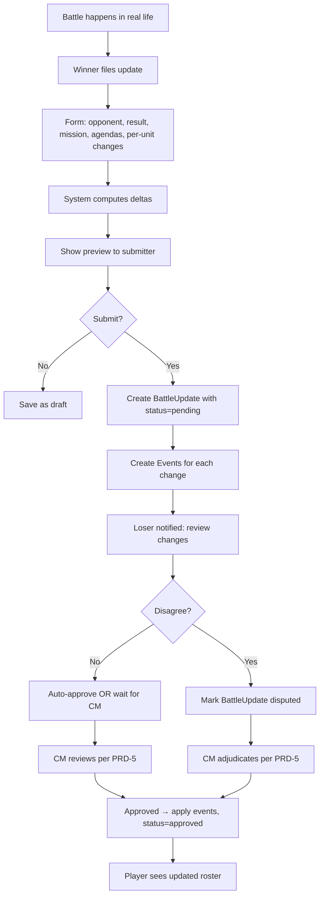

# PRD-4: Events & Deltas

> Battle event generation, the post-battle update pipeline, and the change-tracking layer that records every state change to a roster over the life of a campaign.

---

## 1. Goals

Capture every meaningful state change in a campaign as a structured, queryable **Event**, and produce a human-readable **Delta** for each change so players and CMs can see what happened and when.

**Success metric**: 100% of state changes produce an event; 100% of those events produce a delta visible in the relevant UI within 1 second.

---

## 2. User Stories

- **As a player**, after a battle I can submit a post-battle update with: opponent, result, agendas attempted, and per-unit changes (XP, ranks, honours, scars, requisitions).
- **As a player**, I see a delta of what my submission will change before confirming.
- **As a CM**, I see a timeline of all events in my campaign.
- **As a CM**, I can trigger narrative events that affect all players (e.g., a planet-wide plague, a supply convoy, a campaign-wide rank promotion).
- **As a spectator**, I see a public, scrubbed narrative log of major events.
- **As a player**, I can request a requisition (e.g., "Replace Destroyed Unit") which produces a delta after CM approval (PRD-5).

---

## 3. Event Taxonomy

```ts
type EventKind =
  // Roster lifecycle
  | 'roster.imported'              // new RosterVersion created
  | 'roster.version_activated'     // player switched active version
  | 'roster.version_reverted'      // player rolled back
  | 'roster.manually_edited'       // manual edit by player or CM

  // Battle lifecycle
  | 'battle.scheduled'             // two players agreed to play
  | 'battle.filed'                 // post-battle update submitted
  | 'battle.approved'              // CM approved a post-battle update
  | 'battle.rejected'              // CM rejected a post-battle update
  | 'battle.disputed'              // one or both players disagree with result

  // Unit state changes
  | 'unit.xp_gained'
  | 'unit.xp_lost'
  | 'unit.rank_promoted'
  | 'unit.rank_demoted'            // rare, only via OoA fail
  | 'unit.honour_gained'
  | 'unit.honour_lost'             // when OoA fail swaps a honour for a scar
  | 'unit.scar_gained'
  | 'unit.scar_removed'            // via Requisition
  | 'unit.destroyed'               // removed from active roster
  | 'unit.replaced'                // via Requisition

  // Crusade state changes
  | 'crusade.rp_gained'            // requisition points earned
  | 'crusade.rp_spent'             // requisition points spent
  | 'crusade.req_purchased'        // a Requisition was bought
  | 'crusade.supply_changed'       // Nachmund: supply limit delta
  | 'crusade.logistics_changed'    // Nachmund: LP delta
  | 'crusade.alignment_changed'     // Nachmund: 3-alignment switch

  // Campaign-wide
  | 'campaign.member_joined'
  | 'campaign.member_left'
  | 'campaign.member_removed'
  | 'campaign.narrative_event'     // CM-triggered
  | 'campaign.supplement_changed'  // CM switched supplement
  | 'campaign.settings_updated'

  // System
  | 'system.errata_applied'        // Wahapedia refresh affected a unit
  | 'system.crusade_update'        // schema migration
  ;

interface Event {
  id: string;
  campaignId: string;
  kind: EventKind;
  occurredAt: timestamp;
  actorUserId: string | null;   // null for system events
  targetType: 'roster' | 'unit' | 'battle' | 'campaign' | 'crusade';
  targetId: string;
  payload: Record<string, unknown>;  // kind-specific
  delta: Delta | null;          // for state-changing events
  visibility: 'public' | 'cm_only' | 'private';
}

interface Delta {
  id: string;
  eventId: string;
  entityType: 'unit' | 'crusade' | 'roster';
  entityId: string;
  field: string;
  beforeValue: any;
  afterValue: any;
  reason: string;     // human-readable e.g. "Battle vs. Space Wolves (W)"
}
```

---

## 4. Post-Battle Update Flow



### 4.1 Battle Update Form

Fields:
- Opponent (auto-fill from campaign member list)
- Mission played (free text or pick from PRD-0 mission list)
- Result (win / loss / draw)
- Agendas attempted (checklist from active supplement)
- Agendas achieved (subset of attempted)
- Per-unit: XP gained (default 3, per Crusade rules)
- Per-unit: OoA test result (if any units were destroyed)
- Per-unit: honours / scars gained (from supplement-defined list)
- Requisitions purchased
- Free-text battle report (markdown)

### 4.2 Per-Unit Change Entry

Two paths:
1. **Quick entry**: "Did any units gain XP? Lose XP? Get destroyed? Take OoA test?" — system applies universal rules
2. **Manual entry**: select specific unit, edit rank, add honour, etc.

The system warns when a proposed change violates a Crusade rule (e.g., spending RP the player doesn't have, applying a honour that doesn't exist in the active supplement).

---

## 5. Delta Computation

When a `BattleUpdate` is approved, the system:

1. Iterates over the proposed changes in payload
2. For each, writes a `Delta` with `beforeValue` (current state) and `afterValue` (proposed state)
3. On approval, applies them transactionally — if any step fails, the entire update rolls back
4. Emits `Event` records with `delta` linkage

This makes the timeline:

```
2026-07-12 14:00  jake42 imported roster v1 (2,000 pts, Cadian 67th)
2026-07-15 19:00  jake42 won vs. Space Wolves (W) → BattleUpdate #12
                 ├─ Cadian Shock Troops: XP 0→3
                 ├─ Cadian Castellan: rank Blooded→Battle-ready
                 ├─ Hellhound: destroyed → OoA: failed → −6 XP, +1 Scar (Cowardly)
                 └─ Crusader: +5 RP
2026-07-16 10:00  cm_jane approved BattleUpdate #12
2026-07-18 14:00  jake42 purchased Requisition: Reinforcements (+5 Cadian Shock Troops, −3 RP)
```

---

## 6. Narrative Event Generation (CM-only)

The CM can trigger campaign-wide narrative events that affect all or specific rosters. Each event produces a structured payload that translates to deltas.

```ts
interface NarrativeEventTemplate {
  code: string;                  // 'plague_outbreak', 'supply_convoy', 'rank_promotion'
  name: string;
  description: string;           // narrative
  effect:
    | { type: 'rp_grant', amount: number, filter?: FilterExpr }
    | { type: 'supply_change', amount: number, filter?: FilterExpr }
    | { type: 'rank_grant', rank: Rank, filter?: FilterExpr }
    | { type: 'unit_destroyed', filter: FilterExpr }
    | { type: 'custom', payload: Record<string, unknown> };
  filter?: FilterExpr;           // which rosters/units it applies to
}
```

Examples (Armageddon-themed):
- **"Ork Waagh!"** — all players with 5+ victories gain 1 RP; all players with 0 victories lose 1 RP (campaign-wide upheaval)
- **"Yarrick's Broadcast"** — all Imperial players gain 1 RP (morale boost)
- **"Supply Convoy Arrives"** — Armageddon: Supply Limit +200 for all players
- **"Planet-wide Plague"** — all units with Nurgle keyword take 1 Battle Scar; all other players with 10+ units lose 1 random unit to a new Battle Scar "Plague-Ridden"

CM selects a template, customizes the parameters (or uses defaults), previews the impact ("will affect 8 of 12 players"), and applies. The application produces one `Event` per affected entity, batched under a single `campaign.narrative_event` parent.

---

## 7. Public Narrative Log

A scrubbed, readable narrative view of the campaign, derived from public-visibility events. Each entry shows:
- Date
- Player handle (or "anonymous" if user opted out)
- Action summary (1-2 lines, generated from event payload)
- Optional battle report excerpt

This is what spectators see and what CMs share on social media.

---

## 8. Out of Scope

- Real-time push notifications (PRD-0 future)
- Battle result photo / video upload
- Detailed per-die roll audit (too noisy for MVP)
- AI-generated battle reports from data (future, PRD-7+)

---

## 9. Dependencies

- **PRD-0**: `Battle`, `BattleUpdate`, `Event`, `Delta`, `RosterVersion`
- **PRD-3**: roster versioning makes deltas well-defined
- **PRD-5**: approval is the trigger for delta application
- **PRD-1**: CM event generation UI lives in the CM dashboard

---

## 10. Success Metrics

| Metric | Target |
|--------|--------|
| Time to file a post-battle update | < 5 min (median) |
| Update approval time (CM) | < 2 min (median) |
| Per-update events generated | complete (no missing changes) |
| Public narrative log freshness | < 5 min after approval |
| Narrative event templates available at launch | >= 4 Armageddon-specific |

---

## 11. Edge Cases

1. **Both players file conflicting updates** (one says they won, the other says they won): system detects the conflict, flags as `disputed`, requires CM adjudication.
2. **Player files update for a battle against someone who is not in the campaign**: rejected at form level; player must pick from member list.
3. **Update applied to a now-stale RosterVersion** (player imported a new version while update was pending): approval flow forces re-confirmation against the new version.
4. **CM-triggered event would bankrupt a player** (e.g., −10 RP when they have 3): event is applied, RP clamps to 0; the system emits a warning event for the CM audit log.
5. **Player attempts to add an honour not in the active supplement**: form-level validation blocks; if a CM-override allows it, the honour is tagged `supplement_out_of_scope = true`.
