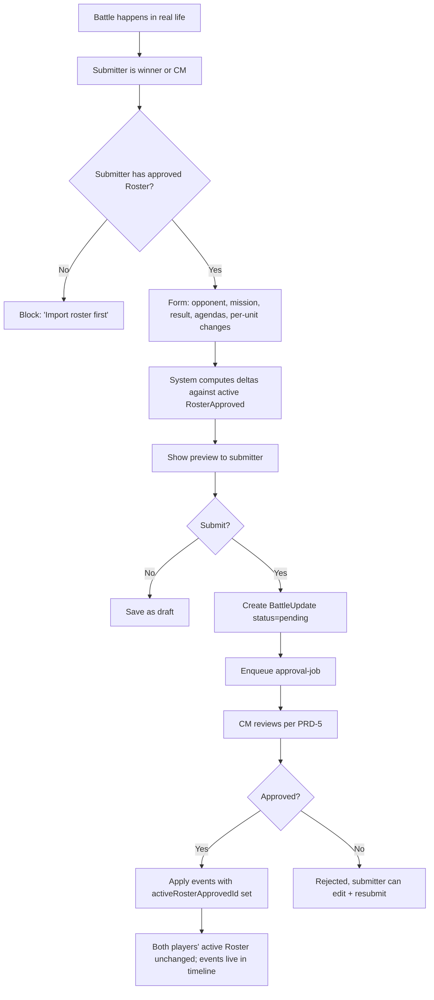
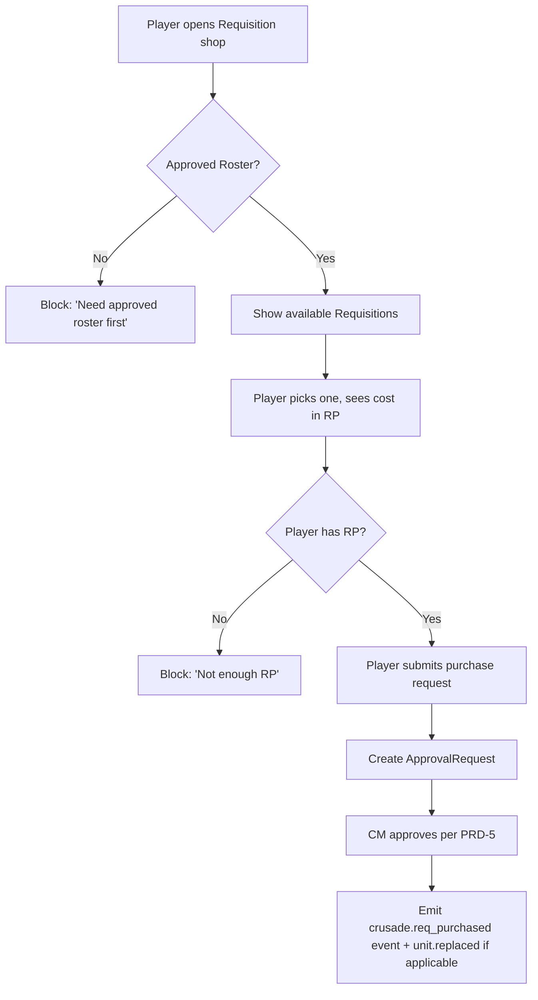
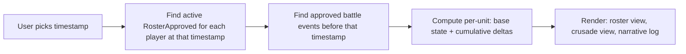

# PRD-4: Events, Submissions, & Timeline (v3)

> Every meaningful state transition is an Event. The Timeline is the source of truth for "what was the army's state when this battle happened?" Submission gating ensures every event links to an approved roster.

> v3: async pipeline acknowledged; the same event model applies, with a few new event kinds tied to the parse pipeline.

---

## 1. Goals

Capture every state transition in a campaign as a structured, queryable Event. Build a Timeline that lets a CM (or a spectator) reconstruct any moment.

**Success metric**: 100% of state transitions produce an event. Any timestamp is queryable as "show me the campaign state at that moment" with < 200ms response.

---

## 2. Submission Gating

**No event of any kind can be filed unless the submitter's Roster is in `RosterApproved` state at the relevant timestamp.**

- Battle update for a battle on 2026-08-15 → submitter must have a `RosterApproved` whose `approvedAt <= 2026-08-15`
- Requisition purchase today → submitter must have a `RosterApproved` whose `approvedAt <= now`
- CM-triggered narrative event affecting a player → that player must have a `RosterApproved`

The gating check is a single SQL query on every form submit. The UI surfaces the gating check pre-submit.

---

## 3. Event Taxonomy (v3 additions)

```ts
type EventKind =
  // === Roster lifecycle (v3 async pipeline additions) ===
  | 'roster.import_enqueued'            // BullMQ parse-job created
  | 'roster.parse_started'
  | 'roster.parse_succeeded'
  | 'roster.parse_failed'              // parseError populated
  | 'roster.app_parse_succeeded'        // app-side Order of Battle extraction
  | 'roster.diff_computed'
  | 'roster.rule_check_run'
  | 'roster.draft_reviewed'            // player opened the diff
  | 'roster.draft_acknowledged'        // player acknowledged rule check issues
  | 'roster.draft_submitted'           // player submitted for CM approval
  | 'roster.approved'
  | 'roster.rejected'
  | 'roster.override_applied'
  | 'roster.rolled_back'
  | 'roster.points_updated'            // system: Wahapedia errata

  // === Battle lifecycle ===
  | 'battle.scheduled'
  | 'battle.filed'
  | 'battle.approved'
  | 'battle.rejected'
  | 'battle.disputed'

  // === Unit state changes ===
  | 'unit.xp_gained'
  | 'unit.xp_lost'
  | 'unit.rank_promoted'
  | 'unit.honour_gained'
  | 'unit.honour_lost'
  | 'unit.scar_gained'
  | 'unit.scar_removed'
  | 'unit.destroyed'
  | 'unit.replaced'

  // === Crusade state changes ===
  | 'crusade.rp_gained'
  | 'crusade.rp_spent'
  | 'crusade.req_purchased'
  | 'crusade.supply_changed'
  | 'crusade.logistics_changed'
  | 'crusade.alignment_changed'

  // === Rule compliance ===
  | 'rule_check.run'
  | 'rule_check.warn_acknowledged'
  | 'rule_check.fail_overridden'

  // === Campaign-wide ===
  | 'campaign.created'
  | 'campaign.settings_updated'
  | 'campaign.member_joined'
  | 'campaign.member_left'
  | 'campaign.narrative_event'
  | 'campaign.archived'

  // === System ===
  | 'system.errata_applied'
  | 'system.parse_pipeline_alert'      // v3: BullMQ queue health degraded
  ;

interface Event {
  id: string;
  tenantId: string;
  campaignId: string | null;
  kind: EventKind;
  occurredAt: timestamp;
  actorUserId: string | null;     // null for system events
  targetType: 'roster' | 'unit' | 'battle' | 'crusade' | 'rule_check' | 'campaign';
  targetId: string;
  payload: Record<string, unknown>;
  delta: Delta | null;
  visibility: 'public' | 'campaign' | 'cm_only' | 'private';
  activeRosterApprovedId: string | null;
}

interface Delta {
  id: string;
  eventId: string;
  entityType: 'unit' | 'crusade' | 'roster';
  entityId: string;
  field: string;
  beforeValue: any;
  afterValue: any;
  reason: string;
}
```

Every Event has `activeRosterApprovedId` — the linchpin of the Timeline.

---

## 4. Post-Battle Update Flow



### 4.1 Battle Update Form

Fields:
- Opponent (must be valid `CampaignMember`)
- Mission played (free text or pick from a campaign-specific list)
- Result (win / loss / draw)
- Agendas attempted (checklist from active supplement)
- Agendas achieved (subset)
- Per-unit: XP gained (default 3)
- Per-unit: OoA test result (if any units were destroyed)
- Per-unit: honours / scars
- Requisitions purchased
- Free-text battle report (markdown)

### 4.2 Per-Unit Change Entry

Two paths:
1. **Quick entry**: "Did any units gain XP? Lose XP? Get destroyed? Take OoA test?" — system applies universal rules
2. **Manual entry**: select specific unit, edit rank, add honour, etc.

System warnings:
- Spending RP the player doesn't have
- Applying a honour that doesn't exist in the active supplement
- Changing unit XP / rank in ways that don't match what prior events would produce

### 4.3 Battle Approval

When approved, events are written. The **active RosterApproved is NOT modified** — events live in the timeline as the source of truth. This is important because:
- Multiple battles between roster approvals accumulate in the timeline
- A future re-import shows the player "your Castellan should be Battle-ready by now based on Battle 12"
- The Timeline reconstructs state at any timestamp

---

## 5. Requisition Purchase



---

## 6. Timeline View

A dedicated UI surface: "show me the campaign state at this moment."



**Performance**: single SQL query against events table, indexed on `occurredAt` and `(targetType, targetId)`. Materialize `CampaignStateSnapshot` per timestamp on demand.

---

## 7. CM-Triggered Narrative Events

Minimal v3 — focus is enforcement, not narrative flavor.

```ts
type NarrativeEventEffect =
  | { type: 'rp_grant', amount: number, filter?: FilterExpr }
  | { type: 'rp_deduct', amount: number, filter?: FilterExpr }
  | { type: 'campaign_announcement', message: string };

// FilterExpr can match on:
//   - teamId:    affects only one campaign team (e.g., "Helsreach Defenders")
//   - factionId: affects only one 40K faction (e.g., "Orks")
//   - memberIds: explicit player list
//   - (combinations of the above with AND/OR)
```

Armageddon templates:
- **"Yarrick's Broadcast"** — all Imperial factions +1 RP (faction filter)
- **"Ork WAAAGH!"** — all non-Ork factions −1 RP (faction filter, inverted)
- **"Armageddon Stands"** — campaign announcement, no state change

For team-based campaigns (PRD-1 §5b), CMs can target events to a specific campaign team (e.g., "Helsreach Defenders gain +1 RP for holding the wall this week"). The filter expression supports `teamId` as a first-class axis alongside `factionId` — these are distinct dimensions and both are honored by the filter engine.

---

## 8. Public Narrative Log

A scrubbed, readable narrative view of the campaign, derived from public-visibility events. Each entry shows:
- Date
- Player handle (or "anonymous" if user opted out)
- Action summary (1-2 lines generated from event payload)
- Optional battle report excerpt

---

## 9. Out of Scope (PRD-4)

- AI-generated battle reports from data
- Real-time push notifications (email + in-app only for MVP)
- Battle result photo / video upload
- Cross-campaign event correlation

---

## 10. Dependencies

- **PRD-0**: `Event`, `Delta`, `Battle`, `BattleUpdate`
- **PRD-3**: roster approval state machine feeds into `activeRosterApprovedId`
- **PRD-5**: approval pipeline triggers event application
- **PRD-1**: CM dashboard surfaces the timeline + event feed
- **BullMQ**: the approval-job for battle updates is async; same queue infrastructure as the parse pipeline

---

## 11. Success Metrics

| Metric | Target |
|--------|--------|
| Time to file a post-battle update | < 5 min median |
| CM approval time per battle update | < 2 min median |
| Submission-gating block rate (false positives) | < 1% |
| Timeline query response (any timestamp) | < 200ms |
| Public narrative log freshness | < 5 min after approval |

---

## 12. Edge Cases

1. **Both players file conflicting updates** (one says they won): flagged as `disputed`, CM adjudicates.
2. **Player files update for a battle against someone not in the campaign**: rejected at form level.
3. **Battle update filed while a new RosterDraft is in `pending_review`**: the update goes through (the draft isn't approved yet, so it doesn't gate). After the new roster is approved, the events in the timeline apply retroactively to the new state.
4. **CM-triggered RP grant fails (player already at cap)**: clamped, system emits a warning event for the audit log.
5. **Player attempts to add an honour not in the active supplement**: form-level warning; CM override at approval time.
6. **Submitter loses their active RosterApproved mid-approval** (e.g., CM rolls it back): pending BattleUpdate fails the gating check; CM is notified to reject.
