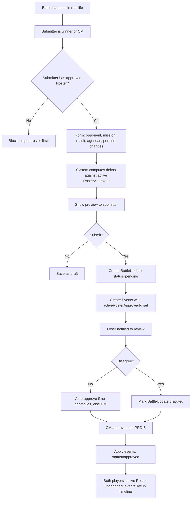
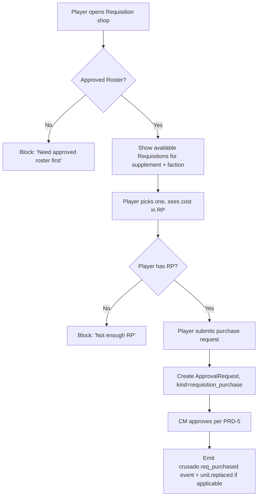
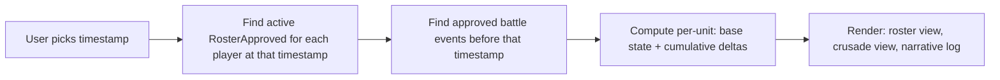

# PRD-4: Events, Submissions, & Timeline (v2)

> Every meaningful state transition is an Event. The Timeline is the source of truth for "what was the army's state when this battle happened?" Submission gating ensures every event links to an approved roster.

---

## 1. Goals

Capture every state transition in a campaign as a structured, queryable Event. Build a Timeline that lets a CM (or a spectator) reconstruct any moment: "what was Player A's roster when they fought Player B in Battle 12, and what was the crusade state at that time?"

**Success metric**: 100% of state transitions produce an event. Any approved RosterApproved timestamp is queryable as "show me the campaign state at that moment" with < 200ms response.

---

## 2. Submission Gating (KEY INVARIANT)

**No event of any kind can be filed unless the submitter's Roster is in `RosterApproved` state at the relevant timestamp.**

This is the hard rule. Concretely:

- A player wants to file a post-battle update for a battle on 2026-08-15 → they must have a `RosterApproved` whose `approvedAt <= 2026-08-15`
- A player wants to purchase a Requisition today → they must have a `RosterApproved` whose `approvedAt <= now`
- A CM wants to trigger a narrative event affecting a player → that player must have a `RosterApproved`

The gating check is a single SQL query on every form submit. The UI surfaces the gating check pre-submit ("You need an approved roster to file this; [import now]").

**Why this matters**: without this invariant, the Timeline is meaningless because you can't trust that "this battle was fought with this army." The whole point of the app is to be the referee that makes the timeline trustworthy.

---

## 3. Event Taxonomy

```ts
type EventKind =
  // === Roster lifecycle ===
  | 'roster.imported'                  // new RosterDraft created from JSON
  | 'roster.draft_reviewed'            // player opened the diff
  | 'roster.draft_acknowledged'        // player acknowledged rule check issues
  | 'roster.draft_submitted'           // player submitted for CM approval
  | 'roster.approved'                  // CM approved → RosterApproved created
  | 'roster.rejected'                  // CM rejected
  | 'roster.override_applied'          // CM override on a rule check
  | 'roster.rolled_back'               // within rollback window
  | 'roster.points_updated'            // system: Wahapedia errata

  // === Battle lifecycle ===
  | 'battle.scheduled'
  | 'battle.filed'                     // post-battle update submitted
  | 'battle.approved'
  | 'battle.rejected'
  | 'battle.disputed'

  // === Unit state changes (within a battle) ===
  | 'unit.xp_gained'
  | 'unit.xp_lost'
  | 'unit.rank_promoted'
  | 'unit.honour_gained'
  | 'unit.honour_lost'
  | 'unit.scar_gained'
  | 'unit.scar_removed'
  | 'unit.destroyed'                   // OoA test failed and player chose remove
  | 'unit.replaced'                    // via Requisition

  // === Crusade state changes ===
  | 'crusade.rp_gained'
  | 'crusade.rp_spent'
  | 'crusade.req_purchased'
  | 'crusade.supply_changed'           // Nachmund
  | 'crusade.logistics_changed'        // Nachmund
  | 'crusade.alignment_changed'        // Nachmund

  // === Rule compliance ===
  | 'rule_check.run'                   // engine ran on a draft
  | 'rule_check.warn_acknowledged'     // player acknowledged
  | 'rule_check.fail_overridden'       // CM overrode

  // === Campaign-wide ===
  | 'campaign.created'
  | 'campaign.settings_updated'
  | 'campaign.member_joined'
  | 'campaign.member_left'
  | 'campaign.narrative_event'         // CM-triggered
  | 'campaign.archived'

  // === System ===
  | 'system.errata_applied'
  | 'system.crusade_update'
  ;

interface Event {
  id: string;
  tenantId: string;
  campaignId: string | null;
  kind: EventKind;
  occurredAt: timestamp;
  actorUserId: string | null;     // null for system events
  targetType: 'roster' | 'unit' | 'battle' | 'crusade' | 'rule_check' | 'campaign';
  targetId: string;
  payload: Record<string, unknown>;
  delta: Delta | null;
  visibility: 'public' | 'campaign' | 'cm_only' | 'private';
  // Submission-gating context: which RosterApproved was active when this event was created
  activeRosterApprovedId: string | null;
}

interface Delta {
  id: string;
  eventId: string;
  entityType: 'unit' | 'crusade' | 'roster';
  entityId: string;
  field: string;
  beforeValue: any;
  afterValue: any;
  reason: string;
}
```

**Critical**: every Event has `activeRosterApprovedId`. This is the linchpin of the Timeline.

---

## 4. Post-Battle Update Flow



### 4.1 Battle Update Form

Fields:
- Opponent (auto-fill from campaign member list, must be valid `CampaignMember`)
- Mission played (free text or pick from a campaign-specific list)
- Result (win / loss / draw)
- Agendas attempted (checklist from active supplement)
- Agendas achieved (subset)
- Per-unit: XP gained (default 3)
- Per-unit: OoA test result (if any units were destroyed)
- Per-unit: honours / scars (from supplement-defined list, or custom with CM override)
- Requisitions purchased
- Free-text battle report (markdown)

### 4.2 Per-Unit Change Entry

Two paths:
1. **Quick entry**: "Did any units gain XP? Lose XP? Get destroyed? Take OoA test?" — system applies universal rules
2. **Manual entry**: select specific unit, edit rank, add honour, etc.

System warnings on:
- Spending RP the player doesn't have
- Applying a honour that doesn't exist in the active supplement
- Changing unit XP / rank in ways that don't match what prior events would produce

### 4.3 Battle Approval

When approved, the events are written. The **active RosterApproved is NOT modified** — the events live in the timeline as the source of truth for what happened. This is important because:

- Multiple battles between roster approvals accumulate in the timeline
- A future re-import (PRD-3) shows the player "your Castellan should be Battle-ready by now based on Battle 12"
- The Timeline reconstructs state at any timestamp

---

## 5. Requisition Purchase

Separate flow, but uses the same event + approval model.



---

## 6. Timeline View

A dedicated UI surface: "show me the campaign state at this moment."



**Performance**: this is a single SQL query against the events table, indexed on `occurredAt` and `(targetType, targetId)`. The implementation can materialize a `CampaignStateSnapshot` per timestamp on demand.

**Use cases**:
- "What was everyone's army on Day 30 of the campaign?"
- "Did Player A have a Battle Honour at the time of Battle 12?"
- Spectator view: "Show me the campaign arc from start to now"

---

## 7. CM-Triggered Narrative Events (v2 — simplified from v1)

CMs can trigger campaign-wide narrative events. Per v2 user direction, the focus is **enforcement and timeline** — not pure narrative flavor. So v2's narrative events are minimal:

```ts
type NarrativeEventEffect =
  | { type: 'rp_grant', amount: number, filter?: FilterExpr }
  | { type: 'rp_deduct', amount: number, filter?: FilterExpr }
  | { type: 'campaign_announcement', message: string };  // pure flavor, no state change
```

Armageddon-specific templates (v1 had a long list; v2 ships just these three):
- **"Yarrick's Broadcast"** — all Imperial factions +1 RP (morale boost)
- **"Ork WAAAGH!"** — all non-Ork factions −1 RP (campaign-wide upheaval)
- **"Armageddon Stands"** — campaign announcement, no state change

Future expansions: when more supplements are supported, additional templates ship with them.

---

## 8. Public Narrative Log

A scrubbed, readable narrative view of the campaign, derived from public-visibility events. Each entry shows:
- Date
- Player handle (or "anonymous" if user opted out)
- Action summary (1-2 lines generated from event payload)
- Optional battle report excerpt

This is what spectators see and what CMs share on social media.

---

## 9. Out of Scope (PRD-4)

- AI-generated battle reports from data (future)
- Real-time push notifications (email + in-app only for MVP)
- Battle result photo / video upload
- Cross-campaign event correlation

---

## 10. Dependencies

- **PRD-0**: `Event`, `Delta`, `Battle`, `BattleUpdate`
- **PRD-3**: roster approval state machine feeds into `activeRosterApprovedId`
- **PRD-5**: approval pipeline triggers event application
- **PRD-1**: CM dashboard surfaces the timeline + event feed

---

## 11. Success Metrics

| Metric | Target |
|--------|--------|
| Time to file a post-battle update | < 5 min median |
| CM approval time per battle update | < 2 min median |
| Submission-gating block rate (false positives) | < 1% |
| Timeline query response (any timestamp) | < 200ms |
| Public narrative log freshness | < 5 min after approval |

---

## 12. Edge Cases

1. **Both players file conflicting updates** (one says they won): flagged as `disputed`, CM adjudicates.
2. **Player files update for a battle against someone not in the campaign**: rejected at form level.
3. **Battle update filed while a new RosterDraft is in `pending_review`**: the update goes through (the draft isn't approved yet, so it doesn't gate). After the new roster is approved, the events in the timeline apply retroactively to the new state.
4. **CM-triggered RP grant fails (player already at cap)**: clamped, system emits a warning event for the audit log.
5. **Player attempts to add an honour not in the active supplement**: form-level warning; CM override at approval time.
6. **Submitter loses their active RosterApproved mid-approval** (e.g., CM rolls it back): pending BattleUpdate fails the gating check; CM is notified to reject.
