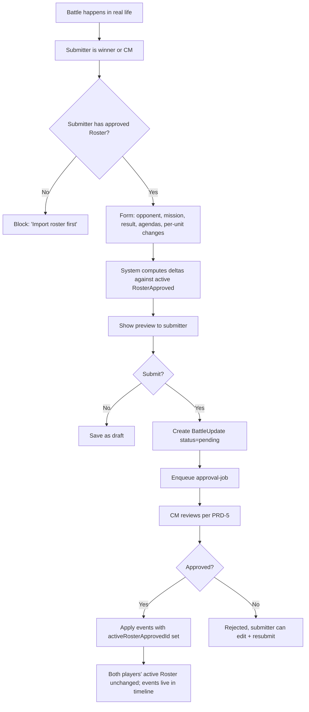
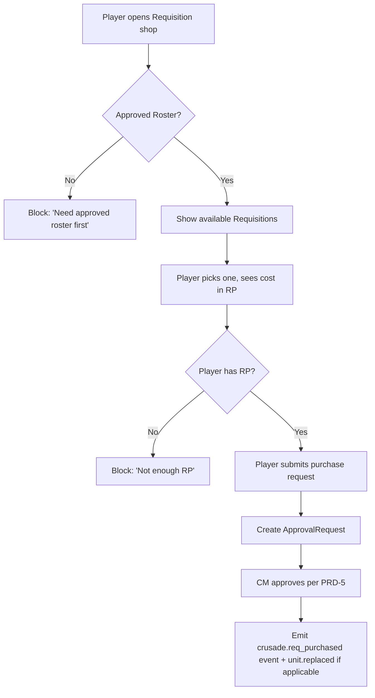
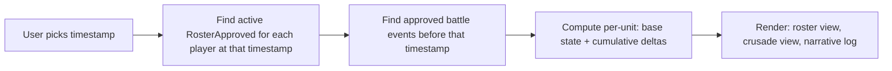

# PRD-4: Events, Submissions, & Timeline (v3)

> Every meaningful state transition is an Event. The Timeline is the source of truth for "what was the army's state when this battle happened?" Submission gating ensures every event links to an approved roster.

> v3: async pipeline acknowledged; the same event model applies, with a few new event kinds tied to the parse pipeline.

---

## 1. Goals

Capture every state transition in a campaign as a structured, queryable Event. Build a Timeline that lets a CM (or a spectator) reconstruct any moment.

**Success metric**: 100% of state transitions produce an event. Any timestamp is queryable as "show me the campaign state at that moment" with < 200ms response.

---

## 2. Submission Gating

**No event of any kind can be filed unless the submitter's Roster is in `RosterApproved` state at the relevant timestamp.**

- Battle update for a battle on 2026-08-15 → submitter must have a `RosterApproved` whose `approvedAt <= 2026-08-15`
- Requisition purchase today → submitter must have a `RosterApproved` whose `approvedAt <= now`
- CM-triggered narrative event affecting a player → that player must have a `RosterApproved`

The gating check is a single SQL query on every form submit. The UI surfaces the gating check pre-submit.

---

## 3. Event Taxonomy (v3 additions)

```ts
type EventKind =
  // === Roster lifecycle (v3 async pipeline additions) ===
  | 'roster.import_enqueued'            // BullMQ parse-job created
  | 'roster.parse_started'
  | 'roster.parse_succeeded'
  | 'roster.parse_failed'              // parseError populated
  | 'roster.app_parse_succeeded'        // app-side Order of Battle extraction
  | 'roster.diff_computed'
  | 'roster.rule_check_run'
  | 'roster.draft_reviewed'            // player opened the diff
  | 'roster.draft_acknowledged'        // player acknowledged rule check issues
  | 'roster.draft_submitted'           // player submitted for CM approval
  | 'roster.approved'
  | 'roster.rejected'
  | 'roster.override_applied'
  | 'roster.rolled_back'
  | 'roster.points_updated'            // system: Wahapedia errata

  // === Battle lifecycle ===
  | 'battle.scheduled'
  | 'battle.filed'
  | 'battle.approved'
  | 'battle.rejected'
  | 'battle.disputed'

  // === Unit state changes ===
  | 'unit.xp_gained'
  | 'unit.xp_lost'
  | 'unit.rank_promoted'
  | 'unit.honour_gained'
  | 'unit.honour_lost'
  | 'unit.scar_gained'
  | 'unit.scar_removed'
  | 'unit.destroyed'
  | 'unit.replaced'

  // === Crusade state changes ===
  | 'crusade.rp_gained'
  | 'crusade.rp_spent'
  | 'crusade.req_purchased'
  | 'crusade.supply_changed'
  | 'crusade.logistics_changed'
  | 'crusade.alignment_changed'

  // === Rule compliance ===
  | 'rule_check.run'
  | 'rule_check.warn_acknowledged'
  | 'rule_check.fail_overridden'

  // === Campaign-wide ===
  | 'campaign.created'
  | 'campaign.settings_updated'
  | 'campaign.member_joined'
  | 'campaign.member_left'
  | 'campaign.narrative_event'
  | 'campaign.archived'

  // === System ===
  | 'system.errata_applied'
  | 'system.parse_pipeline_alert'      // v3: BullMQ queue health degraded
  ;

interface Event {
  id: string;
  tenantId: string;
  campaignId: string | null;
  kind: EventKind;
  occurredAt: timestamp;
  actorUserId: string | null;     // null for system events
  targetType: 'roster' | 'unit' | 'battle' | 'crusade' | 'rule_check' | 'campaign';
  targetId: string;
  payload: Record<string, unknown>;
  delta: Delta | null;
  visibility: 'public' | 'campaign' | 'cm_only' | 'private';
  activeRosterApprovedId: string | null;
}

interface Delta {
  id: string;
  eventId: string;
  entityType: 'unit' | 'crusade' | 'roster';
  entityId: string;
  field: string;
  beforeValue: any;
  afterValue: any;
  reason: string;
}
```

Every Event has `activeRosterApprovedId` — the linchpin of the Timeline.

---

## 4. Post-Battle Update Flow



### 4.1 Battle Update Form — Supplement-Specific, Campaign-Level Only

Each player in a battle files **their own** `BattleUpdate`. A 1v1 battle = 2 BattleUpdates (one per player); a 4-player free-for-all = 4 BattleUpdates. Each becomes its own `ApprovalRequest { kind: 'post_battle_update' }` (PRD-5 §3.2). The CM bulk-approves routine ones via the inbox; disputes (e.g., both players claim victory) surface as a `disputed` flag on both.

**Form is campaign-level only (per PRD-0 §4b.2):**

Per the architectural principle that **unit/roster data lives in NR**, this app's battle update form collects only **campaign-level** data. Per-unit XP gains, honour assignments, scar acquisitions, relic pickups, OoA test rolls — all of that happens in New Recruit. The player updates their NR list after the battle, exports JSON, and uploads it. The diff between the pre-battle and post-battle NR rosters is how the app represents unit changes from a battle; this is **read-only display data**, not a form field.

What this app's form DOES collect:
- **Opponent** (must be a valid `CampaignMember`)
- **Mission** (free text or pick from a campaign-specific list)
- **Result** (win / loss / draw)
- **Agendas attempted** (checklist from the active supplement's agenda list)
- **Agendas achieved** (subset)
- **Free-text battle report** (markdown; min chars per `Campaign.require_battle_report_chars`)
- **Source roster reference** (`sourceRosterApprovedId` — the NR roster the player used for this battle)
- **Reference to the new roster** (if the player re-imported mid-flow, the new `RosterDraft` id; this is what shows the post-battle unit state)

What this app's form does NOT collect (per PRD-0 §4b.2):
- Per-unit XP, honours, scars, relics, wargear changes — those happen in NR
- OoA test results — those are in NR (the player rolls the D6, marks the result)
- Unit roster mutations of any kind

**Form schema is per `Campaign` (pinned at creation):**

`Campaign.battleReportSchema: JSONSchema | null` is **set at campaign creation** by copying `CrusadeSupplement.battleReportSchema` at that moment. Once pinned, the schema does not change for the campaign's lifetime — even if the underlying supplement later updates its schema. This guarantees a campaign's form is stable. Custom schemas per campaign are possible in principle (CM homebrew) but v1 has no UI to author them; v1.x may add a schema editor.

**v1 ships defaults per supplement:**
- **Armageddon (v1)**: standard Crusade form — opponent, mission, result, agendas attempted/achieved, free-text battle report, sourceRosterApprovedId.
- **Nachmund Gauntlet (v1.x)**: multi-player form — same fields plus per-player Crusade Blessings.
- The system default covers Armageddon v1 without bespoke UI.

**Form UX behavior:**
- The form is auto-generated from the pinned `Campaign.battleReportSchema` at runtime.
- Validation rules from the schema (e.g., "exactly 1 result", "1-3 agendas attempted") fire on submit.
- Required fields surface inline before submit.
- Players see a preview of the resulting campaign-level delta ("Sarah's Helsreach Defenders: agenda 'Extermination Targets' achieved, +1 RP") before submitting. Per-unit deltas are NOT in the form; they show up as a side-by-side roster diff (read-only display) sourced from the linked roster versions.

**Disambiguation: 3 different per-Crusade PDFs:**

| PDF the user linked | What it represents in the app |
|---|---|
| `ArmageddonCrusadeCards.pdf` | Per-unit tracking card — derived from NR roster's unit state. UI: per-unit timeline view (PRD-2 §6 Flow 4). Auto-generated, **read-only display**. No form to fill. |
| `ArmageddonBlankOrderOfBattle.pdf` | Roster-level snapshot — derived from `RosterApproved`. UI: printable roster view (auto-generated, read-only). No form to fill. |
| `MissionRecordSheet.pdf` (Nachmund) | Per-battle form — the supplement-specific piece. UI: post-battle update form. JSON Schema-driven, campaign-level only. |

### 4.2 Per-Unit Change Entry

Two paths:
1. **Quick entry**: "Did any units gain XP? Lose XP? Get destroyed? Take OoA test?" — system applies universal rules
2. **Manual entry**: select specific unit, edit rank, add honour, etc.

System warnings:
- Spending RP the player doesn't have
- Applying a honour that doesn't exist in the active supplement
- Changing unit XP / rank in ways that don't match what prior events would produce

### 4.3 Battle Approval

When approved, events are written. The **active RosterApproved is NOT modified** — events live in the timeline as the source of truth. This is important because:
- Multiple battles between roster approvals accumulate in the timeline
- A future re-import shows the player "your Castellan should be Battle-ready by now based on Battle 12"
- The Timeline reconstructs state at any timestamp

---

## 5. Requisition Purchase



---

## 6. Timeline View

A dedicated UI surface: "show me the campaign state at this moment."



**Performance**: single SQL query against events table, indexed on `occurredAt` and `(targetType, targetId)`. Materialize `CampaignStateSnapshot` per timestamp on demand.

---

## 7. CM-Triggered Narrative Events

Minimal v3 — focus is enforcement, not narrative flavor.

```ts
type NarrativeEventEffect =
  | { type: 'rp_grant', amount: number, filter?: FilterExpr }
  | { type: 'rp_deduct', amount: number, filter?: FilterExpr }
  | { type: 'campaign_announcement', message: string };

// FilterExpr can match on:
//   - teamId:    affects only one campaign team (e.g., "Helsreach Defenders")
//   - factionId: affects only one 40K faction (e.g., "Orks")
//   - memberIds: explicit player list
//   - (combinations of the above with AND/OR)
```

Armageddon templates:
- **"Yarrick's Broadcast"** — all Imperial factions +1 RP (faction filter)
- **"Ork WAAAGH!"** — all non-Ork factions −1 RP (faction filter, inverted)
- **"Armageddon Stands"** — campaign announcement, no state change

For team-based campaigns (PRD-1 §5b), CMs can target events to a specific campaign team (e.g., "Helsreach Defenders gain +1 RP for holding the wall this week"). The filter expression supports `teamId` as a first-class axis alongside `factionId` — these are distinct dimensions and both are honored by the filter engine.

### 7.1 Team Rollups via Events (Future Team View Pages)

Every event has a `targetId` (e.g., a `RosterApproved`, `BattleUpdate`, `CampaignMember`). For team-based rollups, the join path is:

```
Event.targetId (e.g., RosterApproved.id)
  → RosterApproved.teamId  (snapshotted at approval time per PRD-0)
    → CampaignTeam.id (PRD-0 schema)
      → rollup aggregates per team
```

This is the data path the v1.x **team view page** will use: a per-team dashboard showing aggregate progress, recent events, active rosters, RP totals, requisition spend. Because every delta (including CM-as-player deltas per PRD-5 §3.3) fires the same events, the rollup naturally includes CM-as-player's contributions without special-casing.

**v1 design choice:** `Event` does NOT carry a denormalized `teamId` — rollups join through the target. v2 may denormalize for query speed if the join cost becomes a bottleneck, but v1 keeps the schema normalized to avoid drift bugs (e.g., a denormalized `teamId` going stale after a `team_switch`).

**CM-as-player in team rollups:** Mike is on Helsreach Defenders. When he updates his Cadian Shock Troops list (auto-approved per PRD-1 §5), the `roster.approved` event fires with `targetId = RosterApproved.id`. The team view joins through to find `RosterApproved.teamId = helsreach`. Helsreach's rollup shows Mike's deltas. This works because PRD-5 §3.3 keeps the pipeline uniform — no special case for CM-as-player.

---

## 7b. History & Changeset Groupings (v3.10)

Per the user's clarification: every approved changeset generates **history objects** that surface as a **timeline over the campaign**. Multiple grouping dimensions are supported on the same data so different views (per-unit, per-battle, per-requisition) all read from one underlying event store.

### 7b.1 History generation

When an `ApprovalRequest` is approved (by CM, by self-approval per PRD-1 §5, or by auto-approve per PRD-5 §9), the system materializes `HistoryEntry` rows:

- One entry per **primary grouping** (configurable; v1 default: `unit` for roster changes, `battle` for battle updates, `requisition` for requisition purchases).
- Cross-grouping indexes on `HistoryEntryIndex` so a single entry is queryable from multiple grouping dimensions.
- The `approvalRequestId` ties every entry back to its authorization (G5 grouping; PRD-5 §3.2).
- Tombstoned entries (after rollback) are hidden from timeline views but retained in the audit log.

**History is only computed once the changeset is approved.** Drafts and pending approvals do not generate history. This keeps the audit trail aligned with what actually happened in the campaign.

### 7b.2 Requisitions in NR (read-only history)

Per the user's clarification: requisitions are **done in New Recruit**. The player adds the unit, marks the requisition in NR, exports JSON, and uploads to this app. The app parses the new roster, sees the new unit + the requisition marker, and shows the requisition as a **history entry** — not as an in-app action. The player's requisition shop history view (PRD-2) lists past requisitions from these history entries.

Implication: the `requisition_purchase` `ApprovalRequest` kind (PRD-5 §3.2) is reserved for **CM-gifted or narrative-driven** requisitions (e.g., a CM grants a free Leman Russ replacement as a narrative reward). Routine player-bought requisitions don't go through approval — they show up in the history when the player re-imports their NR list with the new unit.

### 7b.3 Changeset grouping proposals (review and approve)

The user requested proposed groupings. v1 ships G1–G6 (derived from the data; G6 is the base layer that G1–G5 group over). G7 (per-narrative-arc) deferred to v2.

| # | Grouping | One history entry covers | Primary use | Ship in v1? |
|---|---|---|---|---|
| **G1** | **Per-Unit** | All field changes to one unit within a single approval | PRD-2 §6 Flow 4 — Sarah's per-unit timeline | **Yes — default for roster changes** |
| **G2** | **Per-Roster-Version** | All changes from one NR import (lumps all units + roster meta) | "What changed in this import" — CM inbox row, audit log | **Yes — default for roster approvals** |
| **G3** | **Per-Battle** | All changes attributable to one battle (roster diff + agenda outcomes + RP delta) | "What happened in Battle 22" — narrative log | **Yes — default for battle updates** |
| **G4** | **Per-Requisition** | RP cost + unit addition/removal + any wargear swap from one requisition | Requisition history view | **Yes — default for requisitions** |
| **G5** | **Per-ApprovalRequest** | All changes that were authorized by one approval (broadest grouping; ties history to its authorization) | Audit log, rollback targets, "show me everything from approval X" | **Yes — always stored as a metadata field** |
| **G6** | **Per-State-Field** | One field change = one entry (e.g., "Unit X XP: 5→8" + "Unit X kills: 1→2") | Granular audit log, debugging, technical drill-down | **Yes — base layer that G1–G5 group over** |
| **G7** | **Per-Narrative-Arc** | Manually-tagged changesets that form an arc | End-of-campaign summary, long-form narrative log | **No — v2+ (manual tagging is open-ended)** |

**Time-bucketed rollups** (Per-Day, Per-Week, Per-Session) are computed on read from G3 + G4 — not stored separately. The campaign progress dashboard groups by week by default.

### 7b.4 Rollback mechanics

When a roster update was bad, or a player changes their mind, the player (or CM) can request to **rollback** a changeset. Per the user, rollback is a **CM-approved action**.

**New `ApprovalRequest` kinds:**

- **`roster_rollback`** — player or CM requests rollback of a specific `RosterApproved`. On approval, all `HistoryEntry` rows tied to that approval's `approvalRequestId` (G5) get `tombstoned = true`, hidden from timeline views, retained in the audit log. A compensating history entry is created: "Roster v17 rolled back on YYYY-MM-DD." The active roster reverts to the prior `RosterApproved`.
- **`history_rollback`** — finer-grained rollback. Targets one or more `HistoryEntry` rows by their id (e.g., "rollback just Unit X's XP gain from Battle 22, keep everything else"). Same tombstoning + compensating entry pattern.

**Why tombstone instead of delete:** the audit log must record what happened (CM approved, then later CM approved a rollback). Hard-deleting history entries would lose that trail. Tombstoning preserves both: timelines show only the rolled-back state, audit logs show the full chronology including the rollback event.

**Co-approval rule:** `roster_rollback` requires CM approval (the actor might be the player, in which case CM reviews). If the actor is the CM themselves (CM-as-player rollback), auto-approve per PRD-1 §5. `history_rollback` follows the same rule.

**Cascading invalidation (UI behavior, not data):** when a roster rollback is approved, any battle reports that referenced the rolled-back roster are surfaced with a "referenced roster was rolled back" badge. The battle report itself remains approved (it was a real event), but the unit-level diff shown to the player is now empty (the post-battle state was rolled back). This is a UI affordance, not a data mutation.

### 7b.5 Example: Sarah's Cadian Castellan across the campaign

Timeline view (per-unit, G1) — what Sarah sees:

```
2026-08-01 — Unit added (Battle-ready)
  (Roster v1 approved)
2026-08-15 — Battle 1: +3 XP (Battle-ready → Blooded)
  (Roster v3 approved; Battle 1 report approved)
2026-08-22 — Battle 2: +3 XP, +1 kill, Battle Scar "Lost in the Fog"
  (Roster v5 approved; Battle 2 report approved)
2026-08-29 — Requisition: Replaced destroyed Leman Russ (-3 RP, +1 unit)
  (Roster v6 approved; requisition reflected via NR re-import)
2026-09-05 — Roster v7 rolled back (history entries 2026-08-29 tombstoned)
  (Rollback approved by Mike)
```

Same history, viewed per-battle (G3):
```
Battle 1 (2026-08-15) — Helsreach vs. Gorgutz, win, +1 RP, +3 XP on 4 units
Battle 2 (2026-08-22) — Helsreach vs. Skari, loss, +1 kill, Battle Scar on Castellan
```

Same history, viewed per-requisition (G4):
```
2026-08-29 — Replaced Leman Russ, -3 RP
  (rolled back 2026-09-05)
```

---

## 8. Public Narrative Log

A scrubbed, readable narrative view of the campaign, derived from public-visibility events. Each entry shows:
- Date
- Player handle (or "anonymous" if user opted out)
- Action summary (1-2 lines generated from event payload)
- Optional battle report excerpt

---

## 9. Out of Scope (PRD-4)

- AI-generated battle reports from data
- Real-time push notifications (email + in-app only for MVP)
- Battle result photo / video upload
- Cross-campaign event correlation

---

## 10. Dependencies

- **PRD-0**: `Event`, `Delta`, `Battle`, `BattleUpdate`
- **PRD-3**: roster approval state machine feeds into `activeRosterApprovedId`
- **PRD-5**: approval pipeline triggers event application
- **PRD-1**: CM dashboard surfaces the timeline + event feed
- **BullMQ**: the approval-job for battle updates is async; same queue infrastructure as the parse pipeline

---

## 11. Success Metrics

| Metric | Target |
|--------|--------|
| Time to file a post-battle update | < 5 min median |
| CM approval time per battle update | < 2 min median |
| Submission-gating block rate (false positives) | < 1% |
| Timeline query response (any timestamp) | < 200ms |
| Public narrative log freshness | < 5 min after approval |

---

## 12. Edge Cases

1. **Both players file conflicting updates** (one says they won): flagged as `disputed`, CM adjudicates.
2. **Player files update for a battle against someone not in the campaign**: rejected at form level.
3. **Battle update filed while a new RosterDraft is in `pending_review`**: the update goes through (the draft isn't approved yet, so it doesn't gate). After the new roster is approved, the events in the timeline apply retroactively to the new state.
4. **CM-triggered RP grant fails (player already at cap)**: clamped, system emits a warning event for the audit log.
5. **Player attempts to add an honour not in the active supplement**: form-level warning; CM override at approval time.
6. **Submitter loses their active RosterApproved mid-approval** (e.g., CM rolls it back): pending BattleUpdate fails the gating check; CM is notified to reject.
