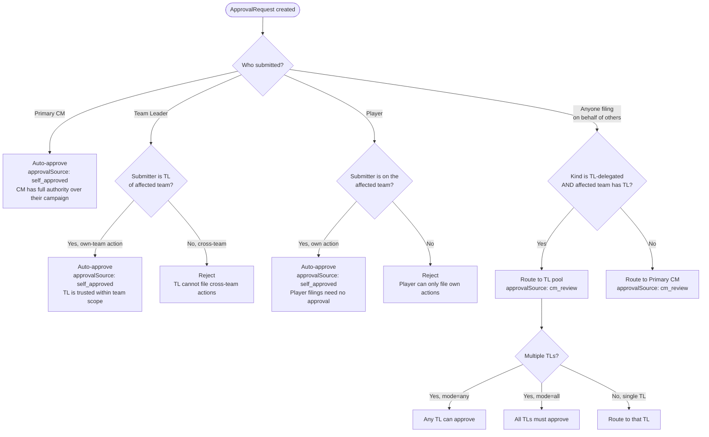
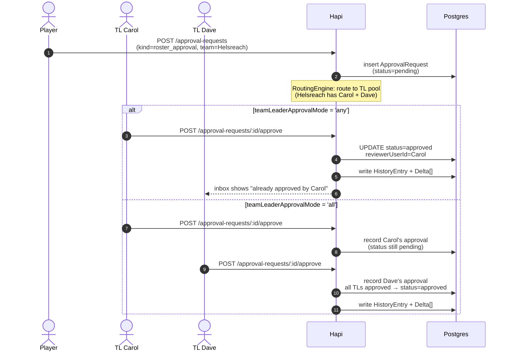
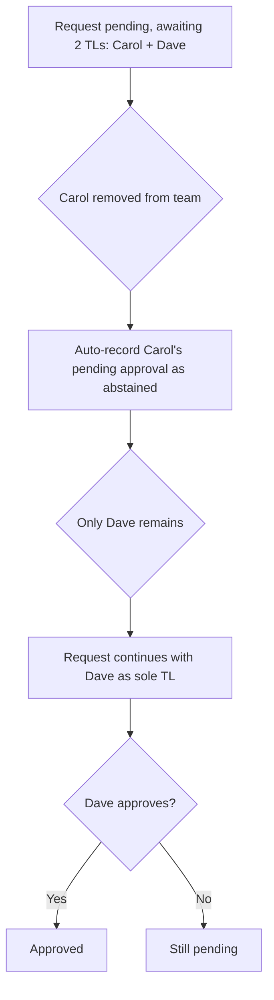
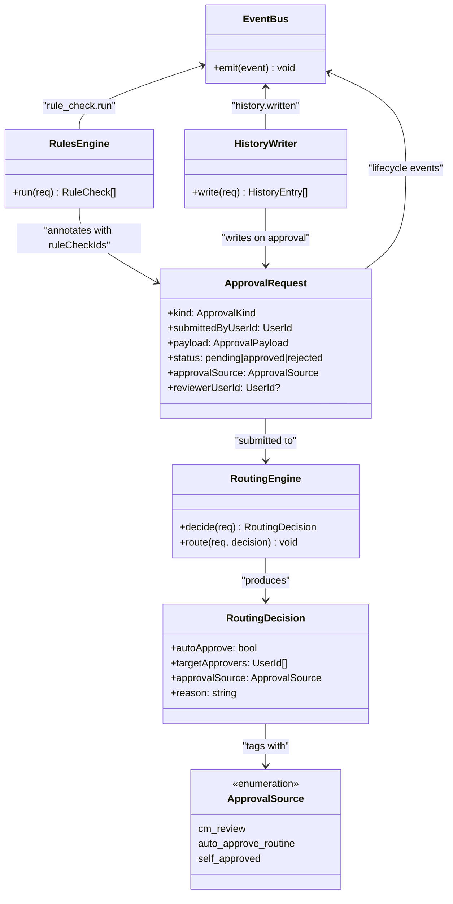
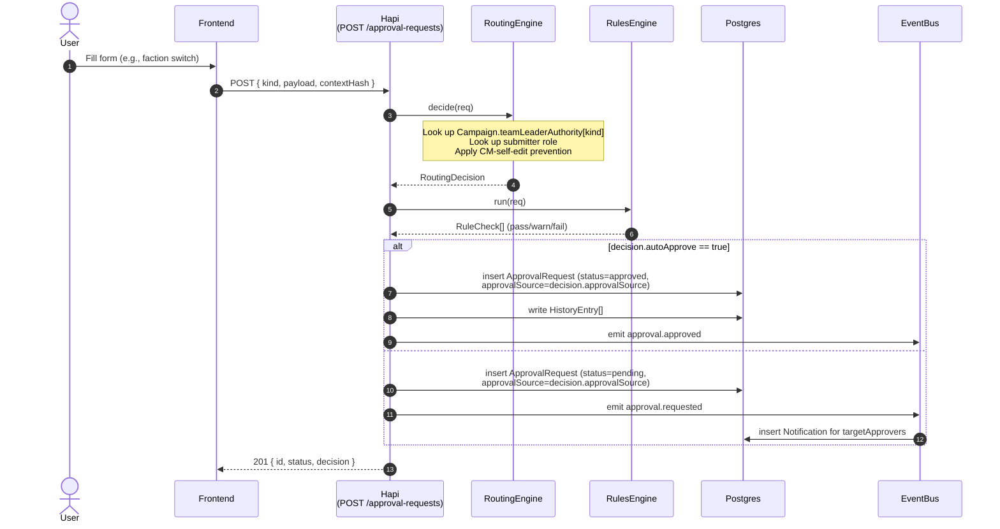
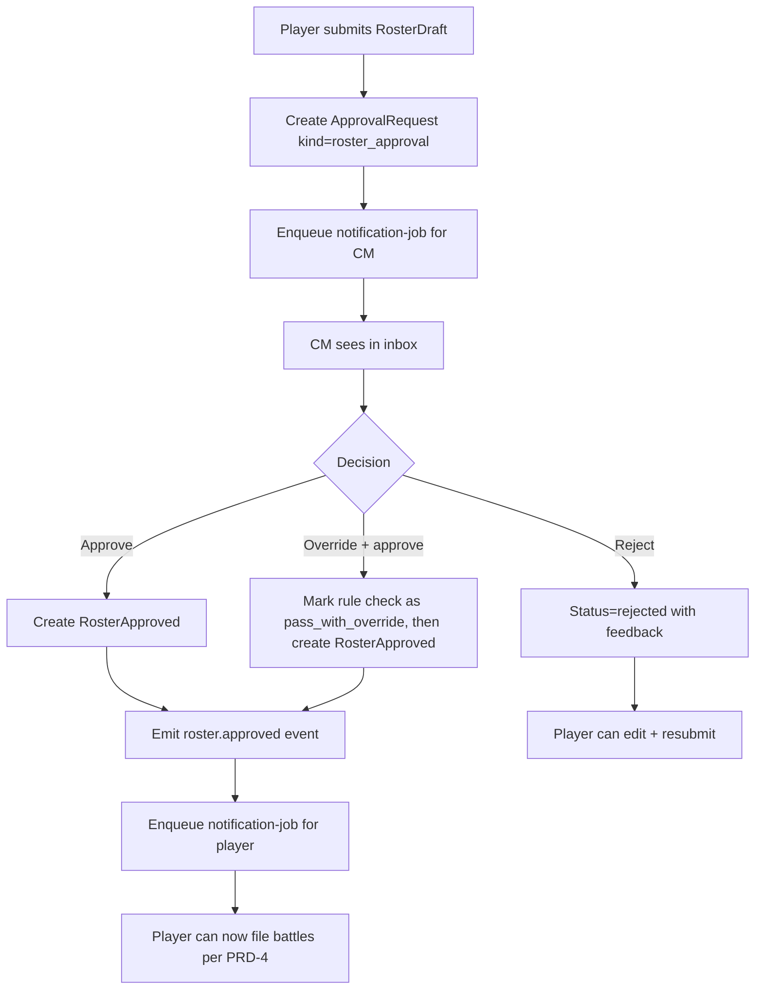

# PRD-5: Approval System (v3)

> Unified approval pipeline. v3: feeds from rule-check results emitted by the worker; first-class `roster_approval` kind.

---

## 0. Glossary (per PRD-0 §3b)

- **Primary CM**: full campaign authority; the only role that can approve cross-team / campaign-wide actions.
- **Crusade Team Leader**: a player on a team who has been granted `crusade_team_leader` for that team by the primary CM. Sees their team's data; can approve `ApprovalRequest`s affecting their team for kinds the primary CM has enabled.

---

## 1. Goals

One consistent pipeline for every approval-worthy action. The CM's inbox is the single view of "what needs my attention."

**Success metric**: 95% of approval decisions made within 24 hours of submission.

---

## 2. Approval-Routed Actions

### 2.1 Approval-Gating Principle

Per PRD-0 §4b: any operation that mutates shared campaign state or affects the narrative **must be gateable by CM approval**. The approval system is the load-bearing mechanism for narrative integrity in this app. Auto-approve is a per-campaign CM choice, never the default; the *capability* is what's required.

### 2.2 Action Categories

The v1 categories of narrative-affecting actions routed through the approval queue:

| Category | Concrete actions | Approval required? | Approver |
|---|---|---|---|
| **Army roster changes** | Player submits RosterDraft; manual roster edit; requisition purchase; roster revert | **Yes** | Primary CM; **Crusade Team Leader** of the affected team (if enabled per PRD-1 §4.4) |
| **Crusade points** | RP grants/deducts from narrative events; requisition costs; manual RP adjustments | **Yes** | Primary CM; **Crusade Team Leader** (team-scoped) |
| **All-player effects** | Campaign-wide announcements; mass narrative events; point-cap changes; rule pack promotion | **Yes** | Primary CM only (cross-team) |
| **Battle updates** | Per-unit XP, honours, scars, OoA tests, agenda ticks | **Yes** | Primary CM; **Crusade Team Leader** (team-scoped) |
| **Team / faction changes** | Team switch (cross-team); faction switch (player-level) | **Yes** | Primary CM only (team switch); Primary CM + **Team Leader** (faction switch) |

### 2.3 Self-Serve (Not Approval-Gated)

Some actions are player-internal and don't enter the approval queue:

| Action | Self-served by | Why no approval |
|---|---|---|
| Player imports RosterDraft (upload JSON) | Player | Draft is private until submitted |
| BullMQ parse completes | System | Idempotent state transition |
| Player acknowledges rule-check issues | Player | Per-player decision, no shared state mutation |
| Player edits draft before submission | Player | Draft is private to the player |
| Player UI preferences | Player | No shared state |
| Player per-unit cosmetics (paint color, custom name draft) | Player | No shared state |

### 2.4 Full Action × Approval Matrix

| Action | Approval required? | Approver |
|---|---|---|
| Player imports RosterDraft (upload JSON) | No (player self-serves upload) | n/a — draft becomes `parsing` |
| BullMQ parse completes | No (system) | n/a — draft becomes `pending_review` |
| Player acknowledges rule-check issues | No (player self-serves) | n/a — draft becomes `pending_approval` |
| **Player submits RosterDraft for approval** | **Yes** | Primary CM; **Crusade Team Leader** (team-scoped, if enabled) |
| Player files post-battle update | Yes | CM |
| Player files manual roster edit | Yes | CM |
| Player purchases Requisition | Yes | CM |
| Player requests roster revert | Yes | CM |
| Player switches faction mid-campaign | Yes | CM |
| Player switches team mid-campaign | Yes | CM |
| CM edits campaign settings | No (CM is authority) | n/a |
| CM triggers narrative event (single-team scope) | No (CM is authority) | n/a |
| CM triggers narrative event (campaign-wide, RP-affecting) | No (CM is authority on the trigger side) | n/a — fires events; team leaders see the result on their team log |
| CM mass-rebans a unit mid-campaign | Yes (CM-only) | Primary CM |
| CM edits `CampaignTeam.expectedFactionIds` | No (CM is authority) | Audit-logged |
| CM rolls back a RosterApproval | No (CM is authority) | n/a |
| CM overrides a rule check | No (CM is authority) | n/a |
| CM grants or strips the `crusade_team_leader` role for a team | No (primary CM only) | n/a |

A campaign setting `auto_approve_routine_battle_updates: bool` (default false) auto-approves battle updates with no anomalies. Anomalies that always require approval:
- OoA test failed
- Requisition purchased
- Honours / scars added beyond supplement's universal list
- Manual edits outside NR import
- Submitter is a new account (< 7 days)
- Submitter is the CM themselves (CM-as-player; auto-approves per PRD-1 §5 — no second approver required, see §3.3 v3.27)

---

## 3. ApprovalRequest Schema

**Terminology note (avoids conflation):** this PRD uses several similar-sounding terms with distinct meanings:
- **`ApprovalRequest`** (the table row) — a record representing one decision lifecycle. Created when a player files something requiring approval; transitions through `pending → approved | rejected | withdrawn`.
- **`ApprovalKind`** (the enum value) — *what kind* of action is being approved (`roster_approval`, `post_battle_update`, `mass_reban`, etc.).
- **`approvalSource`** (a field on `ApprovalRequest`) — *how* the request was decided (`cm_review`, `auto_approve_routine`, `self_approved`). This field distinguishes human-approved from auto-approved. The prior `co_cm_required_unavailable` value (v3.26 and earlier) is removed in v3.27; the CM has full authority and no second approver is required.
- **"approval"** (the act) — a verb describing the decision; we say "Mike approved the request" or "Mike filed for approval."

Don't conflate these. PRD-5 is about `ApprovalRequest` records; the kind comes from `ApprovalKind`; the audit trail records `approvalSource`.

The `kind` enum is the canonical contract for narrative-affecting actions routed through the approval queue. Each kind maps to one of the categories in §2.2; new categories extend this enum (per PRD-0 §4b).

```ts
// v3.5 — canonical ApprovalKind enum. New categories extend this list;
// every addition MUST include a corresponding payload type below.
type ApprovalKind =
  // === Army roster changes (v3.28 — data model overhaul) ===
  // v3.28 renames `roster_approval` → `crusade_force_update` and adds
  // `crusade_force_creation`. The data model is now CrusadeForce/CrusadeForceVersion
  // (see PRD-0 §4); `roster_*` kinds refer to those entities. v3.28 also splits
  // revert and rollback into distinct kinds (different semantics, see §3.1):
  //   - `crusade_force_revert` — player has a draft pending approval and wants to
  //     replace it with another draft (i.e., abort the pending one, file a new one)
  //   - `crusade_force_rollback` — player wants to go from one existing approved
  //     version to another previously approved version (e.g., v3 → v1)
  | 'crusade_force_creation'       // player creates a new CrusadeForce (subject to Campaign.requireApprovalForNewForce)
  | 'crusade_force_update'         // player submits a new CrusadeForceVersion for CM approval (most common)
  | 'crusade_force_manual_edit'    // CM-initiated ad-hoc change to a player's force (e.g., dispute resolution)
  | 'crusade_force_revert'         // replace a pending-approval draft with a new one
  | 'crusade_force_rollback'       // roll the active version back to a previously approved one
  | 'history_rollback'             // finer-grained rollback targeting specific HistoryEntry rows (per PRD-4 §7b.4)

  // === Team changes (v3.28: faction_switch removed — see §3.1 note) ===
  | 'team_switch'                  // player requests to switch campaign teams
  // faction_switch: REMOVED in v3.28. Faction change is achieved by creating a new
  // CrusadeForce on the desired team (see PRD-0 §4, PRD-2 §5e flow).

  // === Battle updates ===
  | 'post_battle_update'           // per-unit XP, honours, scars, OoA tests, agenda ticks

  // === Crusade points ===
  | 'rp_adjustment'                // CM-initiated manual RP grant/deduct (e.g., narrative reward, dispute resolution)
  | 'requisition_rp_override'      // CM waives the RP cost of a requisition (narrative gift)

  // === All-player effects (CM-only, cross-team) ===
  | 'mass_reban'                   // CM bans/unbans a unit catalog-wide mid-campaign
  | 'campaign_announcement'        // CM posts a campaign-wide narrative announcement that persists in the timeline
  | 'point_cap_change'             // CM changes the campaign's point cap mid-campaign

  // === Extension point ===
  | 'custom';                      // v2+ — for campaign-defined ad-hoc approval categories

interface ApprovalRequest {
  id: string;
  tenantId: string;
  campaignId: string;
  kind: ApprovalKind;
  submittedByUserId: string;
  submittedAt: timestamp;
  payload: Record<string, unknown>;  // typed per-kind via §3.1
  status: 'pending' | 'approved' | 'rejected' | 'changes_requested' | 'withdrawn';
  reviewerUserId: string | null;
  decidedAt: timestamp | null;
  decisionReason: string | null;
  contextHash: string;                // drift detection
  ruleCheckIds: string[];            // v3: rule checks attached at submission
  activeRosterApprovedId: string | null; // gating context

  // v3.7 (updated v3.11) — records HOW the request was approved. Required so future event
  // hooks (team view pages, narrative analytics) can filter or
  // count self-approved vs human-approved vs routine-auto-approved deltas.
  approvalSource:
    | 'cm_review'                   // routed to a Primary CM or Crusade Team Leader (within team scope); covers both pending and approved
    | 'auto_approve_routine'        // campaign's auto-approve-routine-battle-updates setting fired
    | 'self_approved';              // submitter's own action; auto-approved at the submitter's authority level (player / TL / CM)
}
// Note (v3.27): the previous `co_cm_required_unavailable` value is gone. The CM has full
// authority over their campaign and can unilaterally approve any kind, including
// CM-only kinds like `mass_reban` or `point_cap_change`. There is no "second approver"
// requirement; co-approval is not a concept in this app.
// 'pending'/'approved' is ApprovalRequest.status; approvalSource is the routing-decision lineage.
```

### 3.1 Per-Kind Payloads

Every `ApprovalKind` has a typed payload. The payload is the *contract* — the inbox UI and the application logic both consume it.

#### `crusade_force_creation` (v3.28 — new CrusadeForce)
```ts
{
  crusadeForceId: string,            // the new force row (created at filing time)
  crusadeForceVersionId: string,     // initial version pending approval
  factionId: string,
  teamId: string,
  name: string,
  diffSummary: { added: int, removed: int, wargearChanged: int, crusadeChanged: int },
  ruleCheckIds: string[],            // from PRD-3 parse pipeline
  playerNote: string | null,
}
```
Filed when a player creates a new force via import (subject to `Campaign.requireApprovalForNewForce`).

#### `crusade_force_update` (v3.28 — new CrusadeForceVersion on existing force)
```ts
{
  crusadeForceId: string,
  crusadeForceVersionId: string,     // the new version pending approval
  previousVersionId: string | null,  // for the diff view
  diffSummary: { added: int, removed: int, wargearChanged: int, crusadeChanged: int },
  ruleCheckIds: string[],
  playerNote: string | null,
}
```

#### `crusade_force_manual_edit` (v3.28 — CM-initiated force change)
```ts
{
  crusadeForceId: string,
  newCrusadeForceState: object,      // the new state after edit
  previousCrusadeForceState: object, // for the diff view
  reason: string,                    // mandatory; visible to the player
}
```

#### `crusade_force_revert` (v3.28 — replace pending draft with new draft)
```ts
{
  crusadeForceId: string,
  newCrusadeForceVersionId: string,  // the new draft replacing the pending one
  previousPendingVersionId: string,  // the pending draft being replaced
  reason: string,
}
```
Player files this when they have a `crusade_force_update` pending approval and want to abort it and file a different draft instead. The previously pending version is auto-rejected with reason `superseded_by_revert`.

#### `crusade_force_rollback` (v3.28 — roll active version back to a prior approved one)
```ts
{
  crusadeForceId: string,
  targetCrusadeForceVersionId: string, // the previously approved version to restore
  reason: string,
}
```
Player or CM files this to roll the force's `currentVersionId` back to a previously approved version. The rolled-back intervening versions are tombstoned. A compensating `HistoryEntry` is created recording the rollback.

#### `requisition_purchase` (Army roster changes — costs RP)
```ts
{
  requisitionRuleKey: string,        // e.g., 'replace_destroyed_unit'
  currentRP: int,
  cost: int,
  affectedRosterId: string,
  previewDelta: object,              // what the roster will look like after purchase
}
```

#### `roster_revert` (Army roster changes)
```ts
{
  rosterId: string,
  targetRosterApprovedId: string,    // the prior version to revert to
  reason: string,                    // why revert
}
```

#### `roster_rollback` (Rollback — see PRD-4 §7b.4)
```ts
{
  rosterApprovedId: string,          // the version to roll back
  reason: string,                    // mandatory; visible in audit log
  cascadingInvalidationsAck: boolean,// player acknowledges battle reports referencing this roster will show a "rolled back" badge
}
```

#### `history_rollback` (Finer-grained rollback — see PRD-4 §7b.4)
```ts
{
  historyEntryIds: string[],         // specific entries to roll back
  reason: string,
}
```

#### `team_switch` (Team/faction changes)
```ts
{
  fromTeamId: string,
  toTeamId: string,
  rosterDisposition: 'follow' | 'freeze_old' | 'create_new',
  reason: string,                    // narrative justification
}
```

// v3.28: `faction_switch` removed from the enum. There is no in-app mechanism
// for a player to switch their 40K faction in place. To change faction, a player
// creates a new `CrusadeForce` on the same or a different team with the new
// faction (see PRD-0 §4 for the data model and PRD-2 §5e for the UX flow).
// The old force retains its original faction forever; the player's identity
// (`CampaignMember`) and history are preserved.

#### `post_battle_update` (Battle updates)
```ts
{
  battleId: string,
  battleUpdateId: string,
  // Per-player form data — one BattleUpdate per player per battle.
  // A 1v1 game produces 2 BattleUpdates; a 4-player game produces 4.
  // Each is its own ApprovalRequest, batchable in the CM inbox.
  // Per PRD-0 §4b.2 + PRD-4 §4.1, form is campaign-level only:
  // opponent, mission, result, agendas attempted/achieved, narrative.
  // Per-unit XP/honour/scar/relic changes live in NR (PRD-3 §3) — not here.
  formData: object,                  // supplement-specific payload from Campaign.battleReportSchema
  agendasAttempted: string[],
  agendasAchieved: string[],
  battleReport: string,              // markdown

  // Reference to the NR roster the player used for this battle.
  // The diff between this and the next roster import is how the app
  // represents per-unit changes from the battle (read-only display,
  // not a form field).
  sourceRosterApprovedId: string,

  // Optional: if the player re-imported their NR list mid-flow (post-battle),
  // this references the resulting RosterDraft. The CM sees the diff inline.
  postBattleRosterDraftId: string | null,

  ruleCheckIds: string[],
  // Auto-detected if this player's BattleUpdate conflicts with another
  // player's for the same battle (e.g., both claim victory).
  disputed: boolean,
}
```

#### `rp_adjustment` (Crusade points — CM-initiated)
```ts
{
  targetUserId: string,
  amount: int,                       // positive = grant, negative = deduct
  reason: string,                    // mandatory; visible to the player and the team's narrative log
}
```

#### `requisition_rp_override` (Crusade points — CM gift)
```ts
{
  requisitionPurchaseApprovalId: string,  // the related requisition_purchase
  waiveFullCost: boolean,
  reason: string,
}
```

#### `mass_reban` (All-player effects — CM-only)
```ts
{
  catalogUnitIds: string[],
  action: 'ban' | 'unban',
  reason: string,
  effectiveImmediately: boolean,     // if false, applies to future roster approvals only
}
```

#### `campaign_announcement` (All-player effects — CM-only)
```ts
{
  message: string,                   // markdown, ≤ 2 KB
  pinnedToTimeline: boolean,
  visibility: 'all' | 'team' | 'private_to_cm',
  targetTeamId: string | null,       // when visibility = 'team'
}
```

#### `point_cap_change` (All-player effects — CM unilateral approval)
```ts
{
  fromCap: int,
  toCap: int,
  effectiveAt: timestamp,
  reason: string,
}
```

#### `custom` (Extension point)
```ts
{
  schemaRef: string,                 // URI to a JSON Schema describing the rest of the payload
  data: Record<string, unknown>,
  reason: string,
}
```

### 3.2 Routing Per Kind (v3.11, simplified v3.27)

**Authority hierarchy (v3.27 — replaces prior "co-CM" concept):**

| Authority level | Can file | Can approve (others) | Notes |
|---|---|---|---|
| **Player** | Yes (own actions) | No | Player filings auto-approve at the player level — no approval gate |
| **Team Leader** | Yes (own actions + own team) | Yes (within team scope, for kinds CM has delegated) | TL filings of own-team actions auto-approve at the TL level |
| **Primary CM** | Yes (anything) | Yes (anything) | CM has full authority over their campaign; no second approver required for any kind |

**Routing decision flow (v3.27):**



**Per-kind routing table (v3.27):**

Per-kind routing now reflects the **authority hierarchy** (v3.27): CM has full authority over their campaign; TL has delegated authority scoped to their team; Player has no approval authority. **There is no concept of "co-approval" or "second approver"** — the CM can unilaterally approve any kind.

The CM can also delegate any kind to team leaders via `Campaign.teamLeaderAuthority` (per PRD-1 §4.4). The defaults below reflect a sensible starting point; the CM can flip any of these on/off per campaign.

| Kind | Primary CM | Team Leader (default) | Notes |
|---|---|---|---|
| `crusade_force_creation` | ✅ | ✅ enabled by default — TL can approve for their team | Subject to `Campaign.requireApprovalForNewForce` |
| `crusade_force_update` | ✅ | ✅ enabled by default — TL can approve for their team | Most common kind |
| `crusade_force_manual_edit` | ✅ (CM is the actor) | ❌ disabled by default — CM-only | CM can edit any player's force directly |
| `requisition_purchase` | ✅ (CM-gifted or narrative) | ❌ disabled — routine player requisitions are NR-side per PRD-4 §7b.2 | |
| `crusade_force_revert` | ✅ | ✅ enabled by default — TL can approve for their team | Replace pending draft with a new one |
| `crusade_force_rollback` | ✅ | ✅ enabled by default — TL can approve for their team (per user's v3.11 confirmation) | Roll back to a previously approved version |
| `history_rollback` | ✅ | ✅ enabled — TL can approve for their team | |
| `team_switch` | ✅ | ❌ disabled — TL cannot approve cross-team changes | |
| `post_battle_update` | ✅ | ✅ enabled — TL can approve for their team | |
| `rp_adjustment` | ✅ | ✅ enabled — TL can approve for their team | |
| `requisition_rp_override` | ✅ | ❌ disabled by default — CM-only | |
| `mass_reban` | ✅ | ❌ disabled by default — CM-only | |
| `campaign_announcement` | ✅ | ❌ disabled by default — CM-only | |
| `point_cap_change` | ✅ | ❌ disabled by default — CM-only | |
| `custom` | ✅ | ❌ disabled by default — CM-only | Per `schemaRef` |

**CM unilateral approval (v3.27 — replaces prior "CM self-edit prevention"):**

The CM has full authority over their campaign. They can approve any kind, including kinds where they themselves are the actor (e.g., `roster_manual_edit` of their own roster, `mass_reban` of an opposing player). **No second approver is required.** The audit log records the CM as both submitter and approver; the action is reversible via the standard rollback flow (PRD-5 §7) but is otherwise final.

This is a deliberate trust model: a CM who has been entrusted with their campaign is trusted to wield full authority over it. If a CM abuses this, the recourse is at the Instance Admin level (PRD-1 §3.1), not at the data-model level.

**Team scope enforcement:**

When a team leader approves a request, the request's `teamId` (inferred from the affected entity: `Roster.teamId`, `CampaignMember.teamId`, etc.) must match the team leader's team. A team leader of Helsreach Defenders cannot approve a `roster_approval` for a Gorgutz WAAAGH! player — the RLS policy and the API both enforce this, returning 403.

**Multi-team-leader approval semantics (v3.12):**

When a team has multiple team leaders, the campaign's `teamLeaderApprovalMode` setting controls the OR/AND semantics:
- `'any'` (default): any one team leader on the affected team can approve the request. Approval is recorded in the audit log with `reviewerUserId: teamLeader`. Other team leaders see "already approved by [name]" in their inbox.
- `'all'`: every active team leader on the affected team must approve before the request is decided. The request stays `pending` until all have approved or any one has rejected. If a team leader is removed mid-flight, their pending approval on an `'all'`-mode request is auto-recorded as `abstained` (the request continues; the remaining leaders suffice).

The CM can switch modes at any time. Mid-flight requests follow the mode that was set when the request was filed, not when it was approved.

**Multi-team-leader approval flow (v3.26):**



**Edge case (TL removed mid-flight in 'all' mode):**



**Per-kind rule-pack enforcement (v3.11):**

The CM's configuration of which rules fire on which kinds (PRD-1 §4.4) is enforced at approval time: when an `ApprovalRequest` is created, the rule engine runs the rules configured for that kind. The CM can, e.g., make `team-narrative-alignment` fire on `roster_approval` but not on `post_battle_update`.


### 3.3 Submitter Auto-Approval (v3.27 — was "CM-as-Player Auto-Approval")

**Per the authority hierarchy (v3.27):** every submission auto-approves at the submitter's authority level. The CM has full authority; TL has delegated authority within their team; Player has no approval authority. There is **no second approver** for any kind — the CM can unilaterally approve anything.

The `approvalSource` field records which path fired:

| Scenario | `approvalSource` value |
|---|---|
| Primary CM or Crusade Team Leader (within team scope) reviewed and approved someone else's request | `cm_review` |
| Campaign's `auto_approve_routine_battle_updates` setting fired (no anomalies) | `auto_approve_routine` |
| Submitter's own action auto-approved at their authority level (Player / TL / CM filing on themselves) | `self_approved` |

**v3.27 simplification:** the prior `co_cm_required_unavailable` value is gone. A CM who files `mass_reban`, `point_cap_change`, or any other kind — even one where they're the actor — auto-approves at the CM level (`self_approved`). No second approver required. The audit log records both submitter and approver as the same CM user; the action is reversible via the standard rollback flow (PRD-5 §7) but is otherwise final.

**Architectural rule:** auto-approval ≠ pipeline bypass. Every auto-approved request still:
1. Creates the `ApprovalRequest` row (with `approvalSource` populated)
2. Runs rule checks (including `team-narrative-alignment`, which gives the CM-as-player the same narrative-fit warn as any other player)
3. Creates the downstream state (`RosterApproved`, `BattleUpdate`, `CampaignMember` updates, etc.)
4. Emits the same events (`roster.approved`, `battle_update.filed`, `member.team_switched`, etc.)
5. Fires the same notifications (in-app toast + email + Discord when a team webhook is subscribed per PRD-8)

This guarantees future event hooks (team view pages, narrative analytics, the audit trail itself) all work uniformly — and confirms PRD-8's Discord delivery works without special-casing. The team view page example from PRD-1 §5 — Mike's deltas to Helsreach Defenders show up in the team's rollup because the events fired, not because the system special-cased Mike.

**Why this matters:** if the system special-cased CM-as-player to bypass the pipeline (e.g., directly mutating `RosterApproved` without an `ApprovalRequest`), every downstream consumer would have to special-case CM-as-player too. That's a permanent tax on every future feature. By keeping the pipeline uniform and varying only the `approvalSource`, the system stays clean.

**Auto-approval decision class diagram (v3.23):**



**Per-kind request flow (sequence diagram):**



---

## 4. Roster Approval Specifics

The most-used approval. Special handling:

- **CM sees**: the diff, the rule-check report, the player's optional note, the previously active RosterApproved for context
- **CM's options**:
  - **Approve** → creates RosterApproved, becomes active, emits `roster.approved` event
  - **Reject with feedback** → RosterDraft → `rejected` with CM notes; player can edit and resubmit (creates a new RosterDraft)
  - **Request changes** → same as reject, with structured change requests
  - **Override a specific rule** → marks a `fail` as `pass_with_override` with a reason. The override is itself an event (`rule_check.fail_overridden`)

### 4.1 Approval as the Source of Truth

When a roster is approved, `RosterApproved.snapshot` becomes the canonical state. Future imports diff against this snapshot. The Timeline (PRD-4) records what was approved when.

---

## 5. Inbox UX (v3.15: campaign-scoped, authority-filtered)

Per user: **the inbox for a team is not scoped to a user — it's scoped to the campaign.** Events and deltas are campaign-scoped. The UI for any user is the same campaign inbox, filtered by the user's authority at the API level. The system tracks the user at every approval point (`reviewerUserId`); past approvals stand even if the user's role changes.

**One inbox, many views:**

There is a single campaign inbox — the queue of all `ApprovalRequest` rows for the campaign where `status = 'pending'`. Every user with access to the campaign sees this queue, filtered by their authority:

- **Primary CM**: sees the entire queue (all teams, all kinds). Filter UI is for narrowing, not gating.
- **Crusade Team Leader**: sees the queue filtered to items affecting their team (per PRD-5 §3.2 team-scope enforcement). Filter UI for narrowing further.
- **Player**: no inbox access (read-only access is on the player dashboard's "MY PENDING APPROVALS" card — PRD-2 §5c.2). Players file approvals; they don't review them.

**Authority filtering is enforced at the API level.** Every API call to the inbox queries the queue and applies the user's authority filter before returning rows. The UI cannot bypass this — if Alice (Helsreach TL) somehow tricks the UI into requesting Hades items, the API returns 403.

**Soft-delete + tracking principle:** nothing is hard-deleted. When a TL is removed (PRD-1 §4.2) or changes teams, their past approvals stand and reference them by userId. The system tracks the user at every approval point. Audit log entries are immutable (PRD-1 §4.6).

**Inbox layout (unified, with per-user filtering at the API):**

```
┌─────────────────────────────────────────────────────────────┐
│ Inbox (Aurelian Crusade)     [Filter ▾] [Bulk ▾] [⚙]    │
├─────────────────────────────────────────────────────────────┤
│ 13 pending · 0 claimed by you                                │
│ Filters: [Authority: All ▼] [Team ▼] [Kind ▼] [Player ▼]   │
│          [Age: Today ▼] [Status: Pending ▼]                 │
│ Tabs: [All (13)] [Roster (5)] [Battle (3)] [Requisition (1)]│
│        [Rollback (0)] [Settings (2)] [Cross-team (1)]       │
├─────────────────────────────────────────────────────────────┤
│ ☐ Roster approval — jake42 (Helsreach Defenders)            │
│   Submitted 1h ago · Diff: +2 units, −1 unit, 3 wargear   │
│   Rule checks: 1 warn (Legends unit — needs override)       │
│   [View Diff] [Approve] [Reject] [Override & Approve]      │
├─────────────────────────────────────────────────────────────┤
│ ☐ Post-battle update — sarah_k vs. mike_t                    │
│   Submitted 2h ago · Battle 12 · Helsreach Defenders         │
│   Result: W · 1 unit promoted, 1 OoA test                   │
│   Battle report: 200 chars [Expand]                         │
│   [View] [Approve] [Reject] [Request Changes]              │
├─────────────────────────────────────────────────────────────┤
│ ☐ Roster rollback — sarah_k                                  │
│   Submitted 30m ago · Helsreach Defenders                    │
│   "Imported wrong NR file, want to revert to v16"            │
│   [View Diff] [Approve] [Reject]                            │
└─────────────────────────────────────────────────────────────┘
```

**Crusade Team Leader inbox layout:**

Identical structure but filtered. A Helsreach Defenders team leader sees:

- Only Helsreach Defenders' requests
- Only kinds the CM has enabled (e.g., `roster_approval` ✓, `mass_reban` ✗)
- The team name and color appear in the row header for visual confirmation
- A non-enabled request that arrived before the CM toggled the setting stays in their queue if already claimed; otherwise it auto-routes to the CM with a note "this kind is not in your authority; routing to CM"

**Bulk approve UX (v3.13):**

When the CM selects multiple rows + clicks "Approve N selected":

1. A **bulk approve modal** opens (not a single confirm button).
2. The modal groups the selected rows by kind, showing:
   - 4 × `post_battle_update` (all routine)
   - 2 × `roster_approval` (1 routine, 1 has a rule warn)
3. The modal surfaces the **safety check**: "Approving 5 of 7 selected. 2 will be skipped: see details."
4. The skipped items are listed with their reason: "Roster approval for jake42 has a Legends-unit rule warning; not eligible for bulk approve. Approve individually."
5. The CM sees the consequence preview: "Approving 5 routine battle updates will: send 5 in-app + email notifications, fire 5 `battle_update.approved` events, mark 5 BattleUpdates as approved."
6. Two confirmation buttons:
   - **Approve 5 routine** (primary, with the consequence preview above)
   - **Cancel**
7. After confirm: a 5-second "undo" banner appears at the top of the inbox ("5 approvals just applied. Undo?"); clicking undo reverses them in batch.

The 5-second undo is a safety net for accidental bulk-approves. The cap on batch size is `Campaign.bulk_approve_max_batch_size` (default 50; PRD-1 §4.4). If the CM selects more than 50, the modal refuses: "Bulk actions are capped at 50 selections. Approve in two batches."

**Filter chips:**

- By campaign (when CM manages multiple)
- By kind
- By team (CM-only; team leaders see their team only)
- By submitter
- By age: "Today" / "This week" / "Older"
- By status: "Pending" / "Recently decided" (last 24h, allow undo)

**Sort:** oldest first by default (FIFO). CM can switch to "newest first" or "by submitter."

**Claim (optional):** a CM can claim a row to mark "I'm reviewing this." Other CMs see "claimed by Mike" and don't double-approve. Auto-release after 30 min of inactivity.

### 5.1 Detail View (expanded v3.13)

Click a row → opens a **right-side detail panel** (does not navigate away from the inbox). Three tabs:

**Tab 1: Diff** — the proposed change with deltas highlighted.
- For `roster_approval`: full diff (units added, removed, modified; wargear changes; crusade state changes). Side-by-side: previous RosterApproved vs. new draft.
- For `post_battle_update`: formData preview (the campaign-level fields) + linked roster diff as a side panel (read-only display, per PRD-0 §4b.2).
- For `requisition_purchase`: the unit being added/removed + the RP cost delta + the CM's note.
- For `roster_rollback`: the RosterApproved being rolled back + the diff that will be reverted + the player's reason text.

**Tab 2: Rule Checks** — the rule engine's report. For each rule that fired:
- Rule name + description
- Status: pass / warn / fail
- For warn/fail: details (what specifically failed, on what entity)
- Severity override (if the CM has dialed it)
- For `team-narrative-alignment`: a clear note "this is a guiding-light warn; you can override with a reason"

**Tab 3: Context** — the surrounding state:
- Submitter's name + team + role (player / team leader / CM-as-player)
- Campaign settings summary (point cap, OoA variant, key house rules)
- Recent related events on this player / this unit / this battle
- For battle updates: the linked battle (opponent, mission, when played)
- For requisitions: the player's current RP balance + supply

**Action buttons** (in the detail panel header, sticky):
- Approve (green, primary)
- Reject (red, with required reason text)
- Request Changes (yellow, with structured change list)
- Override & Approve (only shown when a rule has warn/fail; requires reason text)
- For `roster_rollback`: Approve / Reject (simpler — no rule checks typically)

**Quick-approve keyboard shortcut:** when the detail panel is open, pressing `A` approves, `R` rejects. Useful for routine battle updates. Disabled when the row has anomalies (must use mouse).

### 5.2 Empty States (v3.13)

| State | Message | CTA |
|---|---|---|
| No pending approvals | "Inbox zero. Your team is up to date." | (no CTA, info card) |
| Filter returns nothing | "No approvals match this filter." | [Clear filters] |
| All routine battle updates auto-approved | "Nothing pending — all routine updates were auto-approved. Recent decided items shown below." | [Show recent] |
| Team leader inbox empty | "Your team's queue is clear." | (no CTA) |

### 5.3 Notification indicator in inbox header

The inbox header shows a count of unread notifications from the campaign's recent activity feed (PRD-5 §6). Clicking the bell opens a side panel with the recent activity; the inbox itself stays focused on approvals.

### 5.4 Worked Example — Campaign Inbox (v3.15: campaign-scoped)

Concrete walkthrough showing the campaign-scoped inbox + authority-filtering in action.

**Setup:**

- **Campaign**: Aurelian Crusade (Armageddon, primary CM Mike)
- **Teams**:
  - **Helsreach Defenders** — Alice is Team Leader (only one), 4 players
  - **Hades Defenders** — Bob is Team Leader, 4 players
  - **Gorgutz's WAAAGH!** — Carol is Team Leader (with one co-leader Dave), 2 players
  - **Skari's Kult of Speed** — no team leader yet (pending invite)
- **`Campaign.teamLeaderAuthority`** (per PRD-1 §4.4 defaults):
  - ✅ enabled for TLs: `roster_approval`, `roster_revert`, `roster_rollback`, `history_rollback`, `faction_switch`, `post_battle_update`, `rp_adjustment`
  - ❌ disabled for TLs: `requisition_purchase` (CM-gifted), `team_switch`, `roster_manual_edit`, `requisition_rp_override`, `mass_reban`, `campaign_announcement`, `point_cap_change`, `custom`
- **`Campaign.teamLeaderApprovalMode`**: `'any'` (default — any one team leader on a team can approve)

**The campaign has 13 pending `ApprovalRequest`s.** The campaign inbox is a single queue. Different users see different subsets, filtered at the API by their authority. Past approvals are tracked by user — if Alice approves something and then loses her TL role, her past approvals stand and reference her userId in `reviewerUserId`.

**Inbox state (the underlying queue):**

| # | Kind | Submitter | Affected team | Age |
|---|---|---|---|---|
| 1 | `roster_approval` | jake42 (Helsreach) | Helsreach | 1h |
| 2 | `roster_approval` | sarah_k (Helsreach) | Helsreach | 2h |
| 3 | `roster_approval` | tom_h (Helsreach) | Helsreach | 4h |
| 4 | `post_battle_update` | jake42 (Helsreach) | Helsreach | 30m |
| 5 | `post_battle_update` | sarah_k (Helsreach) | Helsreach | 1h |
| 6 | `post_battle_update` (routine) | jake42 (Helsreach) | Helsreach | 6h |
| 7 | `requisition_purchase` (CM-gifted) | sarah_k (Helsreach) | Helsreach | 3h |
| 8 | `team_switch` (Hades → Helsreach) | mike_h (Hades) | cross-team | 2h |
| 9 | `roster_approval` | zara_b (Hades) | Hades | 1h |
| 10 | `faction_switch` | zara_b (Hades) | Hades | 3h |
| 11 | `mass_reban` | Mike | cross-team | 12h |
| 12 | `campaign_announcement` | Mike | cross-team | 1d |
| 13 | `rp_adjustment` | tom_h (Helsreach) | Helsreach | 5h |

### Alice's view (Helsreach Team Leader)

API applies two filters:
1. **Team scope**: only items affecting Helsreach Defenders → items #1–7, #13 (8 items).
2. **Kind authority**: only items for kinds Alice is authorized for → of those 8, items #1–6 and #13 (7 items actionable); #7 is Helsreach but is `requisition_purchase` which TLs can't approve.

UI presents Alice's "Actionable" tab = 7 items (where she can act). UI's "All team items" tab = 8 items (her team scope, regardless of actionability).

```
+--------------------------------------------------------+
| Inbox (Aurelian Crusade)  Authority: Actionable for me |
| Filters: [Authority: Actionable ▼] [Team: Helsreach ▼] |
| Tabs: [All (13)] [Roster (5)] [Battle (3)] ...         |
|        [My team (8)] [Actionable for me (7)]           |
+--------------------------------------------------------+
| 7 actionable (8 in team scope)                         |
+--------------------------------------------------------+
| ☐ Roster approval — jake42                            |
|   1h ago · Diff: +2 units, -1 unit, 3 wargear swaps   |
|   [View] [Approve] [Reject]                           |
|                                                        |
| ☐ Roster approval — sarah_k                            |
|   2h ago · Diff: +1 unit (Castellan), 1 warn          |
|   [View] [Approve] [Reject] [Override & Approve]       |
|                                                        |
| ☐ Roster approval — tom_h                              |
|   4h ago · Diff: -1 unit (Leman Russ destroyed)        |
|   [View] [Approve] [Reject]                           |
|                                                        |
| ☐ Post-battle update — jake42 (vs. mike_t)            |
|   30m ago · Result: W · +3 XP, 1 OoA test             |
|   [View] [Approve] [Reject]                           |
|                                                        |
| ☐ Post-battle update — sarah_k                         |
|   1h ago · Result: W · +3 XP                          |
|   [View] [Approve] [Reject]                           |
|                                                        |
| ☐ Post-battle update — jake42 (routine, auto-approve) |
|   6h ago · auto-approved (shows recently-decided)    |
|   [View] (read-only — already decided)                |
|                                                        |
| ☐ RP adjustment — tom_h                                |
|   5h ago · -2 RP (Leman Russ destruction)             |
|   [View] [Approve] [Reject]                           |
+--------------------------------------------------------+
```

Alice's "Actionable" filter gives 7 items. If she switches the filter to "All items in my team scope," she sees 8 — item #7 (the CM-gifted requisition) appears with action buttons disabled:

```
+--------------------------------------------------------+
| (continuing from above)                                 |
|                                                        |
| ⓘ Requisition purchase — sarah_k (CM-gifted)           |
|   3h ago · Helsreach · Mike is reviewing               |
|   [View] (read-only — Mike's call)                     |
|   [Approve] [Reject] [Override] -- disabled, greyed out|
+--------------------------------------------------------+
```

The disabled buttons make it explicit: Alice sees the item (transparency — is anything stuck waiting for the CM?) but cannot act. Hovering on a disabled button shows a tooltip: "This kind requires CM approval per PRD-1 §4.4."

### Bob's view (Hades Team Leader)

API filter: team scope = Hades Defenders only → items #9, #10 (2 items). Bob's "Actionable for me" = both (assuming Bob has the default TL authority kinds, which include `faction_switch`).

### Carol + Dave's view (Gorgutz co-leaders)

API filter: team scope = Gorgutz's WAAAGH! only → no items currently pending for their team. Their inbox is empty.

### Mike's view (Primary CM)

API: no authority filter (CM sees everything). Mike sees all 13 items across all teams. Mike can also see Alice's actions (the audit log records `reviewerUserId: alice`).

### Mid-flight authority change (v3.16: current ruleset always wins)

Per user direction: **there is no concept of "intent at filing time."** All open items requiring approval are associated with a campaign, and the API/UI enforces whatever setting is currently set in the campaign at query time. When team leaders change OR when the ruleset changes, the eligible-approver set updates immediately. Past decisions stand (they're already done); in-flight requests are re-assessed automatically by the next API call.

**Approvals are campaign-owned, not user-owned (v3.17).** Per user: "Approvals are never 'owned' by user. They are owned by the campaign. Changing the rules for who can approve just drives the ui and api rules, it doesn't mutate each approval object." The API enforces the ruleset; the UI abides. The `Event` for an approval records the `actorUserId` at decision time, but the `ApprovalRequest` row itself has no "owner" field — it's a campaign-level entity. When TL A approves, leaves, and TL B wants to rollback, TL B files a NEW `roster_rollback` approval request. The original approval is untouched; TL B's rollback is a separate, traceable decision.

**Real-time strategy (v3.28): polling, not refresh-based or live-streamed.** v3.17 declared "browser refresh is fine" but the inbox UX requires better-than-refresh. v3.28 introduces polling via the `useInboxPoller` composable (documented in PRD-6 §3) — 20s interval, cursor-based incremental fetch (`?since=<timestamp>`), pauses when tab hidden or user actively viewing inbox detail. No WebSocket / SSE infrastructure. When the CM saves a ruleset change, affected users see the new state on the next poll cycle (≤20s lag).

**The limitation on visibility:** the ruleset change affects "who can see" which approvals (some are team-contextual, some are CM-only — e.g., starting/ending the campaign). The query in PRD-0 §3.4 enforces RLS at the data layer; the API applies the authority filter at the application layer. A user without authority doesn't even see the item in their inbox, let alone approve it.

**Concrete example:**

1. Mike disables `roster_approval` for TLs while Alice has item #2 (sarah_k's roster) open in her detail view.
2. Alice's UI receives a real-time notification: "Campaign ruleset changed — your authority for `roster_approval` has been revoked." The "Approve" button in her detail view is now disabled with a tooltip "this kind is no longer in your authority per the current campaign settings."
3. If Alice tries to click Approve anyway (e.g., from a stale browser tab), the API returns 403. The decision cannot be made.
4. Item #2 stays pending; it's now CM-only. Mike sees it in his inbox.
5. If Mike re-enables `roster_approval` for TLs later, item #2 becomes actionable for Alice again at that moment (still pending, still her approval to make). No special "resume from where we left off" logic — the current ruleset always applies.
6. Past approvals stand. If Alice already approved a `roster_approval` before the ruleset changed, that approval is permanent. The audit log records both the approval and the ruleset change as separate events.

**Why this matters architecturally:**

This is the simplest model: authority is **derived** from the campaign's current state, not stored on the approval request. No snapshot needed. When settings change, no migrations, no re-assignment logic — the next query naturally returns the new eligible-approver set. RLS + the API WHERE clause evaluate the current settings.

**The CM-as-player auto-approval path follows the same principle (v3.27):**

Per the v3.27 authority hierarchy, Mike (CM-as-player) files a `mass_reban` and it auto-approves at the CM level (`approvalSource: 'self_approved'`). There is no second approver required; no routing decision; no pending state. The full pipeline still runs (rule checks, events, notifications, audit log). The current ruleset — applied at query time — always wins, but in v3.27 the ruleset only governs routing for OTHER players' requests; the CM's own actions always auto-approve.

### Re-assessment warning UI (v3.17: always fires)

Per user (v3.17): when approval settings change, **always show the CM what in-flight approvals would be affected, even if there are none.** The CM should always see the impact assessment before saving — a "0 affected" message is still meaningful confirmation. The change is difficult to rollback (the audit log will reflect it).

**When the warning fires:** the CM opens the Crusade Administration panel → Approvals (PRD-1 §4.4) or Rules section, edits `teamLeaderAuthority` / `teamLeaderApprovalMode` / rule packs / per-kind enforcement, and clicks "Save." The system evaluates: "How many pending `ApprovalRequest`s in this campaign would change eligible approvers under the new settings?"

The warning modal **always** opens with one of two variants:

**Variant A: pending approvals affected (non-zero):**

```
+----------------------------------------------------------+
| ⚠ Confirm ruleset change                                |
+----------------------------------------------------------+
| You are about to change campaign settings that affect  |
| pending approvals.                                       |
|                                                         |
| Changes:                                                |
|   - Disable team leader authority for: roster_approval |
|   - Disable team leader authority for: post_battle_update |
|                                                         |
| Affected pending approvals: 7                            |
|   - 4 × roster_approval (currently Alice can act)       |
|   - 3 × post_battle_update (currently Alice can act)  |
|                                                         |
| After this change:                                       |
|   - These 7 approvals will only be actionable by you.  |
|   - Team leaders will see them as read-only.            |
|   - Past approvals are NOT affected.                     |
|                                                         |
| ⚠ This change is difficult to rollback: if you re-      |
| enable the authority later, the same pending approvals |
| become actionable again — but in the meantime team       |
| leaders could not act on them. The audit log will       |
| reflect the change.                                      |
|                                                         |
| [Cancel] [Confirm change]                                |
+----------------------------------------------------------+
```

**Variant B: no pending approvals affected (zero):**

```
+----------------------------------------------------------+
| Confirm ruleset change                                  |
+----------------------------------------------------------+
| You are about to change campaign settings.              |
|                                                         |
| Changes:                                                |
|   - Disable team leader authority for: roster_approval |
|                                                         |
| Affected pending approvals: 0                            |
|   (No pending roster_approval requests right now)       |
|                                                         |
| Future requests for this kind will route to you        |
| (the primary CM) only.                                   |
|                                                         |
| [Cancel] [Confirm change]                                |
+----------------------------------------------------------+
```

**What "difficult to rollback" means (the audit trail doesn't lie):** if the CM disables `roster_approval` for TLs, then re-enables it an hour later, the pending approvals become actionable again. But the audit log shows that the ruleset changed twice, and during that hour, the pending requests were CM-only. The CM can't pretend the ruleset was stable.

If the CM wants to avoid this for ruleset changes that affect many in-flight approvals, they should communicate with the team leader(s) before the change. Or wait for the queue to drain.

**No warning for past-approved or rejected approvals.** Those are immutable; the ruleset change doesn't affect them.

**No warning for changes that don't affect approvals at all** (e.g., the CM renames a team in the Teams section — that's a `team.changed` event but doesn't change who can approve what). The warning fires specifically for ruleset changes (Approvals + Rules sections per PRD-1 §4.4).

### Player view (e.g., Sarah on Helsreach)

Sarah doesn't have an inbox. On her dashboard (PRD-2 §5c.2), "MY PENDING APPROVALS" shows the status of approvals she's filed. She sees: "Your roster v18 is pending Mike's review (2h ago)." That's the player-facing read-only status — no action buttons, no inbox queue.

### Tracking user at every approval point

Every `ApprovalRequest.decidedByUserId` is recorded with the user's ID at decision time. If Alice approves something and then:
- Loses her TL role (PRD-1 §4.2): her past approvals stand. The decision references her userId.
- Changes teams: same — past decisions stand.
- Account is deleted (PRD-2 §5d.1 DANGER ZONE): her past approvals still reference her userId; her display name appears as "Deleted User" in the audit log (no PII exposure after deletion).

Soft-delete throughout (PRD-2 §5d.1): nothing is hard-deleted unless explicitly required. Team leader grants, audit log entries, history entries — all carry `revokedAt` / `archivedAt` timestamps rather than being removed.

### Authority filter is API-enforced

Alice cannot trick the UI into requesting Hades items. Every API call to the inbox applies the authority filter at the server:
- Query: `SELECT * FROM approval_requests WHERE campaign_id = ? AND status = 'pending' AND (team_id IN (alice's_teams) OR (cm authority)) AND (kind IN (alice's_authorized_kinds) OR (cm authority))`
- RLS policies add a redundant check at the database level.

A direct API request from Alice asking for item #9 (a Hades roster approval) returns 403 — even if the UI somehow sent the request, the data is not returned.
+--------------------------------------------------------+
| Actionable (5): see above                              |
|                                                        |
| Read-only (3):                                         |
|                                                        |
| ⓘ Requisition purchase — sarah_k (CM-gifted)           |
|   3h ago · Helsreach · Mike is reviewing               |
|   [View] (read-only — Mike's call)                     |
|                                                        |
| ⓘ Team switch — mike_h (Hades → Helsreach)            |
|   2h ago · Cross-team · Mike is reviewing              |
|   [View] (read-only — Mike's call)                     |
|                                                        |
| ⓘ Post-battle update — jake42 (routine, auto-approve) |
|   6h ago · Helsreach · auto-approved 2h ago             |
|   [View] (read-only — already decided)                 |
+--------------------------------------------------------+
```

3 read-only items. Alice sees them for transparency ("is anything stuck waiting for the CM?") but can't act. Items show who has them.

**What Alice does NOT see (in her inbox at all):**

- Items 9–10 (Hades Defenders' players) — wrong team
- Items 11–12 (CM-only kinds) — `mass_reban`, `campaign_announcement`

These don't appear in Alice's inbox at all. They go directly to Mike.

**Mid-flight authority change scenario (v3.16 — current ruleset always wins):**

Per user: there is no concept of "intent at filing time." All open items requiring approval are associated to a campaign, and the API/UI enforces whatever setting is currently set in the campaign. See §5.4 "Mid-flight authority change" above for the full treatment, but the worked example: if Mike disables `roster_approval` for TLs while Alice has item #2 open:

1. Alice's UI updates live: "Approve" button disabled, tooltip "this kind is no longer in your authority."
2. If Alice tries to click Approve anyway, the API returns 403.
3. Item #2 stays pending; now CM-only. Mike sees it.
4. If Mike re-enables the authority later, item #2 becomes Alice's again automatically (current ruleset always wins).
5. The CM was warned BEFORE saving (per the warning UI in §5.4) about how many pending approvals would be affected.

**Bob's view (Team Leader of Hades Defenders):**

Bob's actionable tab shows only items affecting Hades Defenders (item #9, item #10). He doesn't see Helsreach items at all (per RLS + team-isolation policies).

**Carol's view (Team Leader of Gorgutz's WAAAGH!):**

Carol's actionable tab shows only items affecting Gorgutz's WAAAGH! (none currently in this example). Her team has co-leader Dave — with `teamLeaderApprovalMode: 'any'`, either can approve. If Carol picks up an item and Dave also approves, the second approval is recorded but the request is already decided.

**Mike's view (Primary CM):**

Mike's inbox shows ALL 13 items across all teams. He can approve any of them. His tab counts:
- All: 13
- Roster approvals: 5 (3 Helsreach + 1 Hades + 1 already-decided-but-recent)
- Battle: 3 (2 Helsreach routine + 1 Helsreach pending)
- Requisition: 1
- Rollback: 0
- Settings (mass_reban, campaign_announcement, etc.): 2
- Cross-team: 1 (team_switch)
- Recently decided: 0

Mike can also see Alice's actions (audit log records `reviewerUserId: alice` when Alice approves something).

### 5.5 Inbox sort/filter details (v3.13)

When the CM clicks the sort dropdown, options are:

- **Oldest first** (default, FIFO)
- **Newest first**
- **By submitter** (alphabetical)
- **By team** (then by age within team)
- **By kind** (then by age within kind)

Filter chips at the top of the inbox are additive (multiple filters AND together):

- Campaign (when CM has multiple)
- Team
- Kind
- Submitter
- Age: Today / This week / Older
- Status: Pending / Recently decided (last 24h)
- Authority: Actionable for me / All items (TL inbox only)

---

## 6. Drift Detection

If the current state has changed since submission (e.g., the player imported a new RosterDraft while approval was pending), the CM sees a "Drift detected" warning. Side-by-side: original vs. recomputed.

Options:
- **Re-validate** — ask the player to resubmit
- **Force-apply** — apply the original intent anyway, with audit log
- **Reject** — reject as stale

---

## 7. Reversibility

Every approved change is reversible within a configurable window (default 7 days, per campaign setting). Rollback creates a new set of events that exactly invert the originals.

For destructive approvals (e.g., RosterApproval that included a unit that no longer has provenance), rollback requires typed confirmation.

---

## 8. Notifications UX (v3.13)

Notifications are derived from the Event outbox via a `notification-fanout-job`. Each notification has a `loudness` class that determines delivery channels and UI prominence:

| Loudness | In-app | Email | Use case |
|---|---|---|---|
| `loud` | Toast (auto-dismiss 8s) + bell badge + email | Yes | Approvals decided, roster rollbacks, narrative events with campaign-wide effect |
| `normal` | Bell badge + notification list page | No (in-app only) | Battle reports approved, requisition history entries |
| `quiet` | Notification list page only | No | Audit events (CM self-edits, team leader grants), system health (BullMQ worker restarted) |

### 8.1 Toast UX

Toast appears bottom-right (desktop) or full-width top (mobile). Content:

```
+---------------------------------------------+
| ✓ Mike approved your roster update          |
|   1 unit added, 3 wargear swaps             |
|   [View]  [×]                               |
+---------------------------------------------+
```

Auto-dismisses after 8 seconds (`loud` only). User can dismiss manually with ×. Multiple toasts stack with a max of 3 visible; older ones queue.

### 8.2 Bell badge + notification list

The header bell icon shows an unread count. Click → side panel slides in from the right:

```
+---------------------------------------------+
| Notifications                  [Mark all read]|
+---------------------------------------------+
| Today                                          |
| ✓ Mike approved your roster update    2h     |
|   [View roster]                               |
| ! CM requested changes on your roster 4h     |
|   [View request]                              |
|                                              |
| Yesterday                                     |
| ✓ Battle 12 update approved by Mike    1d    |
| ✗ Requisition "Replace Destroyed Unit"       |
|   needs more RP — auto-rejected        2d    |
+---------------------------------------------+
```

Each notification links to the source record (the approval, the roster, the event). "Mark all read" clears the badge. Notifications stay in the list for 30 days then archive.

### 8.3 Notification list page (full)

For long-term history: `/notifications` page shows all notifications in reverse-chronological order. Filterable by:
- Kind (approvals, events, audit)
- Campaign
- Read/unread
- Date range

Useful for "what happened to my army last month?" — the player can scroll back through their army's story from their perspective.

### 8.4 Email notifications

Email is sent only for `loud` notifications by default. CM can adjust per-user preference (PRD-2 §5d — account page). Email content mirrors the toast but includes a "View in app" CTA.

Email delivery goes through BullMQ `notification-job` (already documented) — the user-facing email is generated from the `Notification` row, not directly from the Event.

### 8.5 Self-approval notification loudness (v3.13)

When the CM-as-player self-approves their own delta (PRD-1 §5), the resulting notification is `quiet` (no toast, no email). Rationale: the CM already knows what they did; notifying themselves is noise. The audit log still records the action.

When a Team Leader approves another player's request on their team, the notification to the player is `loud` (player benefits from knowing). The notification to the team leader is `normal` (they just did it).

### 8.6 Discord delivery channel (v4.0 / PRD-8)

Discord is the **fourth delivery channel** alongside in-app toast, notification list, and email. Discord delivery is configured per-`CampaignTeam` (not per-user) — see [PRD-8](/prds/prd-8-discord-webhooks.md).

| Loudness | In-app | Email | Discord (if team webhook subscribed) |
|---|---|---|---|
| `loud` | Toast (auto-dismiss 8s) + bell badge + email | Yes | Yes (default) |
| `normal` | Bell badge + notification list page | No (in-app only) | Yes (default) |
| `quiet` | Notification list page only | No | Optional — controlled by webhook's `minLoudness` |

The Discord loudness assignment for each `EventKind` is **independent** of this table — PRD-8 §5.2 defines a separate loudness-to-EventKind mapping (TL-configurable per webhook). The TL can set a webhook's `minLoudness` floor to filter out quieter events.

**No per-user opt-out (v4.0).** If a team's webhook is registered for an event kind, the event fires for the team's channel regardless of individual player preferences. PRD-2 §5d does not gain an `echoToDiscord` preference in v4.0. Players uncomfortable with their actions in a guild channel should discuss with their TL.

**Team-isolation:** Discord delivery is gated by the fanout function's visibility filter (PRD-8 §8.3). `private` events never forward; `team` and `cm_only` events forward only to teams in `event.affectedTeamIds`. PRD-0 §3b invariant enforced at the fanout step, not the delivery worker.

---

## 9. Campaign-Level Approval Policies

| Policy | Effect |
|--------|--------|
| `auto_approve_routine_battle_updates: bool` | Auto-approve battle updates with no anomalies |
| `auto_approve_first_roster: bool` | First RosterApproved for a player is auto-approved; default off |
| `require_battle_report: bool` | Battle updates must include a markdown report ≥ 200 chars; default on |
| `lock_ooa_modifications: bool` | Players cannot manually edit OoA results |
| `bulk_approve_max_batch_size: int` | Cap on how many approvals the CM can act on in one bulk action (default 50); prevents accidental mega-actions |

### 9.1 Approval Batching Model

Per PRD-4 §4.1, each player in a battle files their own `BattleUpdate`. The batching model is **per-ApprovalRequest**, not per-battle:

- **1v1 battle** = 2 BattleUpdates = 2 ApprovalRequests (`post_battle_update` × 2)
- **4-player free-for-all** = 4 BattleUpdates = 4 ApprovalRequests
- Each `post_battle_update` approval carries the player's per-unit deltas for that battle only

The CM inbox treats each ApprovalRequest as a row. Batching happens via:

1. **Auto-approve** (`auto_approve_routine_battle_updates`): routine BattleUpdates (no OoA failures, no requisition, no disputes) auto-approve at submission time, never entering the inbox.
2. **Bulk approve (inbox)**: CM selects N rows and clicks "Approve N selected" (PRD-1 §6b Flow 2). The bulk action refuses if any selected item is non-routine; non-routine items are skipped with a clear reason. Max batch size capped by `bulk_approve_max_batch_size`.
3. **Battle-context grouping**: the inbox groups BattleUpdates from the same Battle under a "Battle 22" expandable row, so the CM sees them as one battle-context but approves them as separate requests. Disputed BattleUpdates (e.g., both players claim victory per `post_battle_update.disputed`) surface with a dispute flag.

**Why per-player approvals, not per-battle:** the user observed that battle updates are sent in via supplement-specific forms, and each player fills their own form (sometimes on a single shared sheet, sometimes separately). Modeling as per-player approvals keeps:
- The audit trail clean (who claimed what)
- Dispute detection automatic (system detects conflicting results)
- Bulk-approve ergonomic (a routine 1v1 battle's 2 approvals bulk-approve in one click; a routine 4-player game bulk-approves all 4 in one click)
- Future flexibility (Nachmund's 4-player BattleRecord Sheets map naturally to 4 ApprovalRequests)

**Batching does NOT collapse across kinds.** A CM cannot bulk-approve a mix of `post_battle_update` + `roster_approval` + `requisition_purchase` in one click — the inbox filters by kind, and the CM bulk-acts within one kind only.
| `require_two_approvals: bool` | Battle updates that destroy units need two CM approvals |
| `override_window_days: int` | Days within which an approval can be rolled back; default 7 |

---

## 10. User Flow: Roster Approval



---

## 11. Out of Scope

- Cross-campaign approvals
- AI auto-adjudication of disputes (future)
- Multi-CM voting / consensus

---

## 12. Dependencies

- **PRD-0**: `ApprovalRequest`, `ApprovalAuditEntry`, `User` (CM role)
- **PRD-1**: CM dashboard inbox link
- **PRD-3**: roster approval is the primary kind; rule-check engine output feeds the inbox
- **PRD-4**: every approved action produces events
- **Auth infra**: CM role gating
- **BullMQ**: notification jobs are async
- **Notifications infra**: SMTP for email

---

## 13. Success Metrics

| Metric | Target |
|--------|--------|
| Median time from submission to decision | < 2 hours |
| Inbox clearance rate within 24h | > 95% |
| Drift events detected and handled correctly | 100% |
| Approval rollback rate | < 1% of approvals |
| CM time per approval | < 30s for routine updates |
| Roster approval first-try rate | > 85% |

---

## 14. Edge Cases

1. **Two CMs approve the same request simultaneously**: optimistic locking via `contextHash`; second approver sees "already decided."
2. **Submitter withdraws while a CM has it claimed**: request closed.
3. **Approval is for a now-deleted entity**: apply step fails transactionally; CM is shown an error and asked to reject.
4. **CM is the submitter**: auto-approves via `approvalSource: 'self_approved'`. The CM has full authority over their campaign (v3.27), so no second approver is needed for any kind. The pipeline still runs — `ApprovalRequest` is created, rule checks fire, events emit, audit trail recorded. Per PRD-1 §5 and §3.3, the architectural rule is "auto-approve ≠ pipeline bypass" so future event hooks (team view pages, narrative analytics) work uniformly.
5. **Submitter suspended mid-approval**: pending requests auto-rejected with reason "submitter suspended."
6. **Active RosterApproved changes during approval**: drift detected; CM chooses re-validate, force-apply, or reject.
7. **Notification email bounces**: status queued for retry; if persistent, in-app notification only.


## OKF Cross-References

This PRD's concepts are documented as first-class entities in the OKF bundle at [`okf/`](../okf). The most relevant:

- [ApprovalKind](../okf/concepts/approval-kind.md) — canonical enum (v3.27: faction_switch removed; v3.28: crusade_force_* renames)
- [ApprovalSource](../okf/concepts/approval-source.md) — 3-value enum (v3.27)
- [CrusadeForce](../okf/concepts/crusade-force.md) — crusade_force_update / manual_edit actions
- [CrusadeForceVersion](../okf/concepts/crusade-force-version.md) — crusade_force_revert / crusade_force_rollback
- [HistoryEntry](../okf/concepts/history-entry.md) — generated on approval
- [Rollback](../okf/concepts/rollback.md) — history_rollback kind
- [CampaignState](../okf/concepts/campaign-state.md) — ended state suspends approval routing
- [Notification](../okf/concepts/notification.md) — approval events fan out

See [`okf/index.md`](../okf/index.md) for the full bundle.
