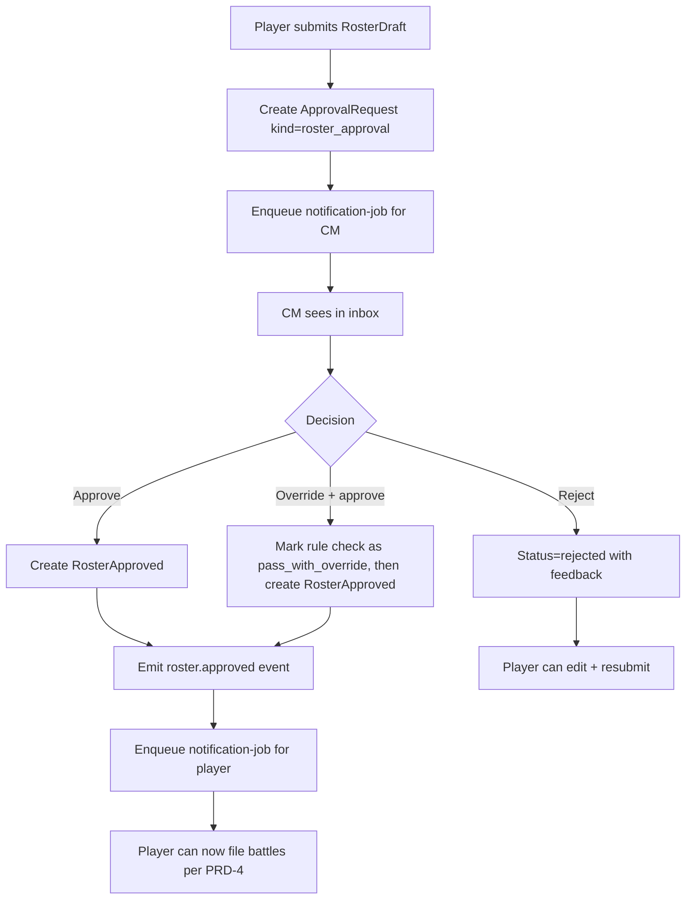

# PRD-5: Approval System (v3)

> Unified approval pipeline. v3: feeds from rule-check results emitted by the worker; first-class `roster_approval` kind.

---

## 1. Goals

One consistent pipeline for every approval-worthy action. The CM's inbox is the single view of "what needs my attention."

**Success metric**: 95% of approval decisions made within 24 hours of submission.

---

## 2. Approval-Routed Actions

### 2.1 Approval-Gating Principle

Per PRD-0 §4b: any operation that mutates shared campaign state or affects the narrative **must be gateable by CM approval**. The approval system is the load-bearing mechanism for narrative integrity in this app. Auto-approve is a per-campaign CM choice, never the default; the *capability* is what's required.

### 2.2 Action Categories

The v1 categories of narrative-affecting actions routed through the approval queue:

| Category | Concrete actions | Approval required? | Approver |
|---|---|---|---|
| **Army roster changes** | Player submits RosterDraft; manual roster edit; requisition purchase; roster revert | **Yes** | CM (or co-CM) |
| **Crusade points** | RP grants/deducts from narrative events; requisition costs; manual RP adjustments | **Yes** | CM (or co-CM) |
| **All-player effects** | Campaign-wide announcements; mass narrative events; point-cap changes; rule pack promotion (builtin → campaign) | **Yes** | CM (or co-CM) |
| **Battle updates** | Per-unit XP, honours, scars, OoA tests, agenda ticks | **Yes** | CM (or co-CM) |
| **Team / faction changes** | Team switch; faction switch mid-campaign | **Yes** | CM (or co-CM) |

### 2.3 Self-Serve (Not Approval-Gated)

Some actions are player-internal and don't enter the approval queue:

| Action | Self-served by | Why no approval |
|---|---|---|
| Player imports RosterDraft (upload JSON) | Player | Draft is private until submitted |
| BullMQ parse completes | System | Idempotent state transition |
| Player acknowledges rule-check issues | Player | Per-player decision, no shared state mutation |
| Player edits draft before submission | Player | Draft is private to the player |
| Player UI preferences | Player | No shared state |
| Player per-unit cosmetics (paint color, custom name draft) | Player | No shared state |

### 2.4 Full Action × Approval Matrix

| Action | Approval required? | Approver |
|---|---|---|
| Player imports RosterDraft (upload JSON) | No (player self-serves upload) | n/a — draft becomes `parsing` |
| BullMQ parse completes | No (system) | n/a — draft becomes `pending_review` |
| Player acknowledges rule-check issues | No (player self-serves) | n/a — draft becomes `pending_approval` |
| **Player submits RosterDraft for approval** | **Yes** | CM (or co-CM) |
| Player files post-battle update | Yes | CM |
| Player files manual roster edit | Yes | CM |
| Player purchases Requisition | Yes | CM |
| Player requests roster revert | Yes | CM |
| Player switches faction mid-campaign | Yes | CM |
| Player switches team mid-campaign | Yes | CM |
| CM edits campaign settings | No (CM is authority) | n/a |
| CM triggers narrative event (single-team scope) | No (CM is authority) | n/a |
| CM triggers narrative event (campaign-wide, RP-affecting) | Optional co-CM approval (campaign setting) | Co-CM if enabled; otherwise CM alone |
| CM mass-rebans a unit mid-campaign | Yes | Co-CM (mandatory) |
| CM edits `CampaignTeam.expectedFactionIds` | No (CM is authority) | Audit-logged |
| CM rolls back a RosterApproval | No (CM is authority) | n/a |
| CM overrides a rule check | No (CM is authority) | n/a |
| CM grants or strips a co-CM role | No (primary CM only) | n/a |

A campaign setting `auto_approve_routine_battle_updates: bool` (default false) auto-approves battle updates with no anomalies. Anomalies that always require approval:
- OoA test failed
- Requisition purchased
- Honours / scars added beyond supplement's universal list
- Manual edits outside NR import
- Submitter is a new account (< 7 days)
- Submitter is the CM themselves (auto-routes to co-CM or self-approves with audit if no co-CM)

---

## 3. ApprovalRequest Schema

The `kind` enum is the canonical contract for narrative-affecting actions routed through the approval queue. Each kind maps to one of the categories in §2.2; new categories extend this enum (per PRD-0 §4b).

```ts
// v3.5 — canonical ApprovalKind enum. New categories extend this list;
// every addition MUST include a corresponding payload type below.
type ApprovalKind =
  // === Army roster changes ===
  | 'roster_approval'              // player submits a RosterDraft for CM approval (most common)
  | 'roster_manual_edit'            // CM-initiated ad-hoc change to a player's roster (e.g., dispute resolution)
  | 'requisition_purchase'         // player buys a requisition (replace destroyed unit, gain wargear, etc.)
  | 'roster_revert'                // player requests revert of a RosterApproved to a prior version

  // === Team / faction changes ===
  | 'team_switch'                  // player requests to switch campaign teams
  | 'faction_switch'               // player requests to switch their 40K faction mid-campaign

  // === Battle updates ===
  | 'post_battle_update'           // per-unit XP, honours, scars, OoA tests, agenda ticks

  // === Crusade points ===
  | 'rp_adjustment'                // CM-initiated manual RP grant/deduct (e.g., narrative reward, dispute resolution)
  | 'requisition_rp_override'      // CM waives the RP cost of a requisition (narrative gift)

  // === All-player effects (require co-CM approval) ===
  | 'mass_reban'                   // CM bans/unbans a unit catalog-wide mid-campaign
  | 'campaign_announcement'        // CM posts a campaign-wide narrative announcement that persists in the timeline
  | 'point_cap_change'             // CM changes the campaign's point cap mid-campaign

  // === Extension point ===
  | 'custom';                      // v2+ — for campaign-defined ad-hoc approval categories

interface ApprovalRequest {
  id: string;
  tenantId: string;
  campaignId: string;
  kind: ApprovalKind;
  submittedByUserId: string;
  submittedAt: timestamp;
  payload: Record<string, unknown>;  // typed per-kind via §3.1
  status: 'pending' | 'approved' | 'rejected' | 'changes_requested' | 'withdrawn';
  reviewerUserId: string | null;
  decidedAt: timestamp | null;
  decisionReason: string | null;
  contextHash: string;                // drift detection
  ruleCheckIds: string[];            // v3: rule checks attached at submission
  activeRosterApprovedId: string | null; // gating context

  // v3.7 — records HOW the request was approved. Required so future event
  // hooks (team view pages, Discord, narrative analytics) can filter or
  // count self-approved vs human-approved vs routine-auto-approved deltas.
  approvalSource:
    | 'cm_review'                   // a CM reviewed and approved
    | 'co_cm_review'                // a co-CM reviewed and approved
    | 'auto_approve_routine'        // campaign's auto-approve-routine-battle-updates setting fired
    | 'self_approved'               // CM-as-player submitted and self-approved (PRD-1 §5)
    | 'co_cm_required_unavailable'; // kind requires co-CM but none existed; fell back to self with audit
}
```

### 3.1 Per-Kind Payloads

Every `ApprovalKind` has a typed payload. The payload is the *contract* — the inbox UI and the application logic both consume it.

#### `roster_approval` (Army roster changes)
```ts
{
  rosterId: string,
  draftId: string,
  previousApprovedId: string | null,
  diffSummary: { added: int, removed: int, wargearChanged: int, crusadeChanged: int },
  ruleCheckIds: string[],            // from PRD-3 parse pipeline
  playerNote: string | null,
}
```

#### `roster_manual_edit` (Army roster changes — CM-initiated)
```ts
{
  rosterId: string,
  newCrusadeForceState: object,      // the new state after edit
  previousCrusadeForceState: object, // for the diff view
  reason: string,                    // mandatory; visible to the player
}
```

#### `requisition_purchase` (Army roster changes — costs RP)
```ts
{
  requisitionRuleKey: string,        // e.g., 'replace_destroyed_unit'
  currentRP: int,
  cost: int,
  affectedRosterId: string,
  previewDelta: object,              // what the roster will look like after purchase
}
```

#### `roster_revert` (Army roster changes)
```ts
{
  rosterId: string,
  targetRosterApprovedId: string,    // the prior version to revert to
  reason: string,                    // why revert
}
```

#### `team_switch` (Team/faction changes)
```ts
{
  fromTeamId: string,
  toTeamId: string,
  rosterDisposition: 'follow' | 'freeze_old' | 'create_new',
  reason: string,                    // narrative justification
}
```

#### `faction_switch` (Team/faction changes)
```ts
{
  fromFactionId: string,
  toFactionId: string,
  newRosterDraftId: string | null,   // if a new draft is being imported for the new faction
  reason: string,
}
```

#### `post_battle_update` (Battle updates)
```ts
{
  battleId: string,
  battleUpdateId: string,
  // Per-player form data — one BattleUpdate per player per battle.
  // A 1v1 game produces 2 BattleUpdates; a 4-player game produces 4.
  // Each is its own ApprovalRequest, batchable in the CM inbox.
  formData: object,                  // supplement-specific payload (PRD-4 §4.1, CrusadeSupplement.battleReportSchema)
  perUnitChanges: Array<{
    unitId: string,
    xpDelta: int,
    honourGained: string | null,
    scarGained: string | null,
    rankChange: { from: string, to: string } | null,
    ooATest: { roll: int, result: 'passed' | 'failed', effect: string } | null,
  }>,
  agendasAttempted: string[],
  agendasAchieved: string[],
  battleReport: string,              // markdown
  ruleCheckIds: string[],
  // Auto-detected if this player's BattleUpdate conflicts with another
  // player's for the same battle (e.g., both claim victory).
  disputed: boolean,
}
```

#### `rp_adjustment` (Crusade points — CM-initiated)
```ts
{
  targetUserId: string,
  amount: int,                       // positive = grant, negative = deduct
  reason: string,                    // mandatory; visible to the player and the team's narrative log
}
```

#### `requisition_rp_override` (Crusade points — CM gift)
```ts
{
  requisitionPurchaseApprovalId: string,  // the related requisition_purchase
  waiveFullCost: boolean,
  reason: string,
}
```

#### `mass_reban` (All-player effects — co-CM approval mandatory)
```ts
{
  catalogUnitIds: string[],
  action: 'ban' | 'unban',
  reason: string,
  effectiveImmediately: boolean,     // if false, applies to future roster approvals only
}
```

#### `campaign_announcement` (All-player effects — co-CM approval)
```ts
{
  message: string,                   // markdown, ≤ 2 KB
  pinnedToTimeline: boolean,
  visibility: 'all' | 'team' | 'private_to_cm',
  targetTeamId: string | null,       // when visibility = 'team'
}
```

#### `point_cap_change` (All-player effects — co-CM approval)
```ts
{
  fromCap: int,
  toCap: int,
  effectiveAt: timestamp,
  reason: string,
}
```

#### `custom` (Extension point)
```ts
{
  schemaRef: string,                 // URI to a JSON Schema describing the rest of the payload
  data: Record<string, unknown>,
  reason: string,
}
```

### 3.2 Routing Per Kind

Each kind has a default approver and (for high-impact kinds) a co-approval rule:

| Kind | Approver | Co-approval |
|---|---|---|
| `roster_approval` | CM | Optional (campaign setting) |
| `roster_manual_edit` | Co-CM (since the CM is the actor) | Mandatory — prevents CM self-edit abuse |
| `requisition_purchase` | CM | Optional |
| `roster_revert` | CM | Optional |
| `team_switch` | CM | Optional |
| `faction_switch` | CM | Optional |
| `post_battle_update` | CM | Optional |
| `rp_adjustment` | CM | Optional |
| `requisition_rp_override` | Co-CM | Mandatory |
| `mass_reban` | Co-CM | **Mandatory** (per PRD-5 §2.4) |
| `campaign_announcement` | CM | Optional (campaign setting — default off for routine, on for high-impact) |
| `point_cap_change` | Co-CM | **Mandatory** |
| `custom` | Per `schemaRef` | Per `schemaRef` |

### 3.3 CM-as-Player Auto-Approval (PRD-1 §5)

When the submitter is the campaign's only CM, every kind **auto-approves but the pipeline still runs**. The `approvalSource` field records which path fired:

| Scenario | `approvalSource` value |
|---|---|
| CM (or co-CM) reviewed and approved manually | `cm_review` or `co_cm_review` |
| Campaign's `auto_approve_routine_battle_updates` fired (no anomalies) | `auto_approve_routine` |
| CM-as-player submitted, no co-CM exists, kind allows CM-as-actor | `self_approved` |
| Kind requires co-CM but none exists (high-impact fallback) | `co_cm_required_unavailable` |

**Architectural rule:** auto-approval ≠ pipeline bypass. Every auto-approved request still:
1. Creates the `ApprovalRequest` row (with `approvalSource` populated)
2. Runs rule checks (including `team-narrative-alignment`, which gives the CM-as-player the same narrative-fit warn as any other player)
3. Creates the downstream state (`RosterApproved`, `BattleUpdate`, `CampaignMember` updates, etc.)
4. Emits the same events (`roster.approved`, `battle_update.filed`, `member.team_switched`, etc.)
5. Fires the same notifications (in-app toast + email + future Discord)

This guarantees future event hooks (team view pages, Discord integrations, narrative analytics, the audit trail itself) all work uniformly. The team view page example from PRD-1 §5 — Mike's deltas to Helsreach Defenders show up in the team's rollup because the events fired, not because the system special-cased Mike.

**Why this matters:** if the system special-cased CM-as-player to bypass the pipeline (e.g., directly mutating `RosterApproved` without an `ApprovalRequest`), every downstream consumer would have to special-case CM-as-player too. That's a permanent tax on every future feature. By keeping the pipeline uniform and varying only the `approvalSource`, the system stays clean.

---

## 4. Roster Approval Specifics

The most-used approval. Special handling:

- **CM sees**: the diff, the rule-check report, the player's optional note, the previously active RosterApproved for context
- **CM's options**:
  - **Approve** → creates RosterApproved, becomes active, emits `roster.approved` event
  - **Reject with feedback** → RosterDraft → `rejected` with CM notes; player can edit and resubmit (creates a new RosterDraft)
  - **Request changes** → same as reject, with structured change requests
  - **Override a specific rule** → marks a `fail` as `pass_with_override` with a reason. The override is itself an event (`rule_check.fail_overridden`)

### 4.1 Approval as the Source of Truth

When a roster is approved, `RosterApproved.snapshot` becomes the canonical state. Future imports diff against this snapshot. The Timeline (PRD-4) records what was approved when.

---

## 5. Inbox UX

```
┌─────────────────────────────────────────────────────┐
│ Inbox                              [Filter ▾] [⚙]  │
├─────────────────────────────────────────────────────┤
│ 7 pending · 0 claimed by you                        │
├─────────────────────────────────────────────────────┤
│ ☐ Roster approval — jake42                          │
│   Submitted 1h ago · Campaign: Aurelian Crusade    │
│   Diff: +2 units, −1 unit, 3 wargear swaps         │
│   Rule checks: 1 warn (Legends unit — needs override)
│   [View Diff] [Approve] [Reject] [Override & Approve] │
├─────────────────────────────────────────────────────┤
│ ☐ Post-battle update — sarah_k vs. mike_t            │
│   Submitted 2h ago · Battle 12                       │
│   Result: W · 1 unit promoted, 1 OoA test           │
│   [View] [Approve] [Reject] [Request Changes]      │
└─────────────────────────────────────────────────────┘
```

- **Filter**: by campaign, kind, submitter, age
- **Sort**: oldest first (FIFO)
- **Claim**: optional
- **Bulk actions**: only for `post_battle_update` with no anomalies

### 5.1 Detail View

Side panel with:
- Full proposed change with deltas highlighted
- Current state of affected entity
- Submitter's notes
- Recent related events
- For `roster_approval`: full diff view, rule check report
- Quick-approve / quick-reject buttons
- "Open in full view" link

---

## 6. Drift Detection

If the current state has changed since submission (e.g., the player imported a new RosterDraft while approval was pending), the CM sees a "Drift detected" warning. Side-by-side: original vs. recomputed.

Options:
- **Re-validate** — ask the player to resubmit
- **Force-apply** — apply the original intent anyway, with audit log
- **Reject** — reject as stale

---

## 7. Reversibility

Every approved change is reversible within a configurable window (default 7 days, per campaign setting). Rollback creates a new set of events that exactly invert the originals.

For destructive approvals (e.g., RosterApproval that included a unit that no longer has provenance), rollback requires typed confirmation.

---

## 8. Notifications

When a submission's status changes, the submitter is notified:

| Channel | MVP? |
|---------|------|
| In-app (toast + notifications list) | Yes |
| Email | Yes |

Notifications fire through a BullMQ `notification-job` to avoid blocking the approval flow.

---

## 9. Campaign-Level Approval Policies

| Policy | Effect |
|--------|--------|
| `auto_approve_routine_battle_updates: bool` | Auto-approve battle updates with no anomalies |
| `auto_approve_first_roster: bool` | First RosterApproved for a player is auto-approved; default off |
| `require_battle_report: bool` | Battle updates must include a markdown report ≥ 200 chars; default on |
| `lock_ooa_modifications: bool` | Players cannot manually edit OoA results |
| `bulk_approve_max_batch_size: int` | Cap on how many approvals the CM can act on in one bulk action (default 50); prevents accidental mega-actions |

### 9.1 Approval Batching Model

Per PRD-4 §4.1, each player in a battle files their own `BattleUpdate`. The batching model is **per-ApprovalRequest**, not per-battle:

- **1v1 battle** = 2 BattleUpdates = 2 ApprovalRequests (`post_battle_update` × 2)
- **4-player free-for-all** = 4 BattleUpdates = 4 ApprovalRequests
- Each `post_battle_update` approval carries the player's per-unit deltas for that battle only

The CM inbox treats each ApprovalRequest as a row. Batching happens via:

1. **Auto-approve** (`auto_approve_routine_battle_updates`): routine BattleUpdates (no OoA failures, no requisition, no disputes) auto-approve at submission time, never entering the inbox.
2. **Bulk approve (inbox)**: CM selects N rows and clicks "Approve N selected" (PRD-1 §6b Flow 2). The bulk action refuses if any selected item is non-routine; non-routine items are skipped with a clear reason. Max batch size capped by `bulk_approve_max_batch_size`.
3. **Battle-context grouping**: the inbox groups BattleUpdates from the same Battle under a "Battle 22" expandable row, so the CM sees them as one battle-context but approves them as separate requests. Disputed BattleUpdates (e.g., both players claim victory per `post_battle_update.disputed`) surface with a dispute flag.

**Why per-player approvals, not per-battle:** the user observed that battle updates are sent in via supplement-specific forms, and each player fills their own form (sometimes on a single shared sheet, sometimes separately). Modeling as per-player approvals keeps:
- The audit trail clean (who claimed what)
- Dispute detection automatic (system detects conflicting results)
- Bulk-approve ergonomic (a routine 1v1 battle's 2 approvals bulk-approve in one click; a routine 4-player game bulk-approves all 4 in one click)
- Future flexibility (Nachmund's 4-player BattleRecord Sheets map naturally to 4 ApprovalRequests)

**Batching does NOT collapse across kinds.** A CM cannot bulk-approve a mix of `post_battle_update` + `roster_approval` + `requisition_purchase` in one click — the inbox filters by kind, and the CM bulk-acts within one kind only.
| `require_two_approvals: bool` | Battle updates that destroy units need two CM approvals |
| `override_window_days: int` | Days within which an approval can be rolled back; default 7 |

---

## 10. User Flow: Roster Approval



---

## 11. Out of Scope

- Cross-campaign approvals
- AI auto-adjudication of disputes (future)
- Multi-CM voting / consensus

---

## 12. Dependencies

- **PRD-0**: `ApprovalRequest`, `ApprovalAuditEntry`, `User` (CM role)
- **PRD-1**: CM dashboard inbox link
- **PRD-3**: roster approval is the primary kind; rule-check engine output feeds the inbox
- **PRD-4**: every approved action produces events
- **Auth infra**: CM role gating
- **BullMQ**: notification jobs are async
- **Notifications infra**: SMTP for email

---

## 13. Success Metrics

| Metric | Target |
|--------|--------|
| Median time from submission to decision | < 2 hours |
| Inbox clearance rate within 24h | > 95% |
| Drift events detected and handled correctly | 100% |
| Approval rollback rate | < 1% of approvals |
| CM time per approval | < 30s for routine updates |
| Roster approval first-try rate | > 85% |

---

## 14. Edge Cases

1. **Two CMs approve the same request simultaneously**: optimistic locking via `contextHash`; second approver sees "already decided."
2. **Submitter withdraws while a CM has it claimed**: request closed.
3. **Approval is for a now-deleted entity**: apply step fails transactionally; CM is shown an error and asked to reject.
4. **CM is the submitter and no co-CM exists**: auto-approves via `approvalSource: 'self_approved'` (or `'co_cm_required_unavailable'` for high-impact kinds). The pipeline still runs — `ApprovalRequest` is created, rule checks fire, events emit, audit trail recorded. Per PRD-1 §5 and §3.3, the architectural rule is "auto-approve ≠ pipeline bypass" so future event hooks (team view pages, Discord, narrative analytics) work uniformly.
5. **Submitter suspended mid-approval**: pending requests auto-rejected with reason "submitter suspended."
6. **Active RosterApproved changes during approval**: drift detected; CM chooses re-validate, force-apply, or reject.
7. **Notification email bounces**: status queued for retry; if persistent, in-app notification only.
