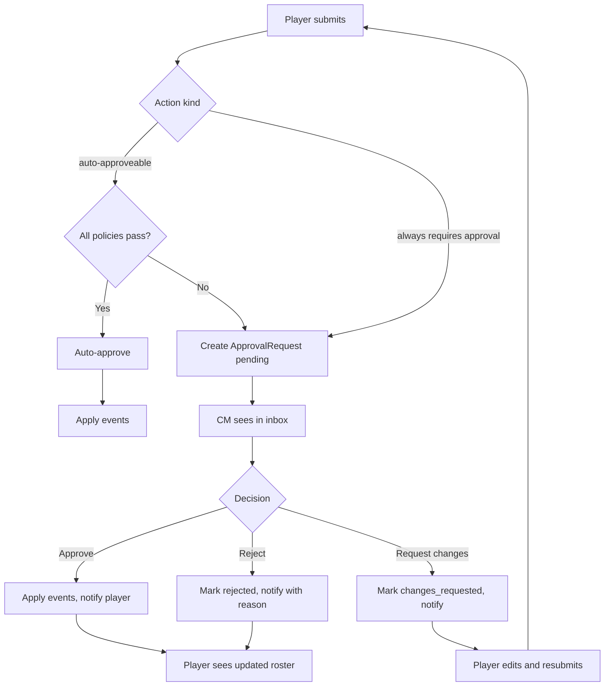

# PRD-5: Approval System

> All actions that change campaign state go through a unified approval pipeline. The CM is the default approver; co-CMs share the role.

---

## 1. Goals

One consistent pipeline for every approval-worthy action in the app, so the CM never has to learn a new flow for each subsystem. Approval is fast (target: < 30s for a routine update), auditable, and reversible.

**Success metric**: 95% of approval decisions made within 24 hours of submission.

---

## 2. User Stories

- **As a CM**, I have a single inbox that shows all pending approvals across all my campaigns.
- **As a CM**, I can approve, reject, or request changes on a submission. Rejections require a reason.
- **As a CM**, I can see context (the proposed change vs. current state) without leaving the inbox.
- **As a player**, I see the status of my submissions in real time.
- **As a co-CM**, I share the same approval rights as the primary CM.

---

## 3. Approval-Routed Actions

Not every action needs approval. The system distinguishes:

| Action | Approval required? | Approver | Auto-apply on approval? |
|--------|--------------------|----------|-------------------------|
| Player imports new RosterVersion | No (player self-serves) | n/a | Yes (on confirm) |
| Player files post-battle update | Yes | CM (or co-CM) | Yes |
| Player files manual edit to active roster | Yes | CM | Yes |
| Player purchases Requisition | Yes | CM | Yes |
| Player requests roster revert | Yes | CM | Yes |
| Player switches faction mid-campaign | Yes | CM | Yes |
| CM edits campaign settings | No (CM is the authority) | n/a | Yes |
| CM triggers narrative event | No (CM is the authority) | n/a | Yes |
| CM overrides a record | No (CM is the authority) | n/a | Yes (with audit) |
| CM grants or strips a co-CM role | No (primary CM only) | n/a | Yes |
| Member joins campaign | No (per PRD-2 self-serve) | n/a | Yes (with optional CM vetting mode) |
| Member removed by CM | No | n/a | Yes |

A campaign setting `auto_approve_known_actions` (default off) lets a CM skip approval for routine post-battle updates with no anomalies. When on, the system only routes updates to the inbox if any of the following triggers:
- An OoA test failed
- A Requisition was purchased
- Honours/scars were added beyond universal list
- Player was the loser of a battle and is requesting reversal
- Manual edits outside NR import
- Player is a new account (< 7 days)

---

## 4. ApprovalRequest Schema

```ts
type ApprovalKind =
  | 'post_battle_update'
  | 'roster_manual_edit'
  | 'requisition_purchase'
  | 'roster_revert'
  | 'faction_switch'
  | 'custom';

interface ApprovalRequest {
  id: string;
  campaignId: string;
  kind: ApprovalKind;
  submittedByUserId: string;
  submittedAt: timestamp;
  payload: Record<string, unknown>;  // kind-specific
  status: 'pending' | 'approved' | 'rejected' | 'changes_requested' | 'withdrawn';
  reviewerUserId: string | null;     // claimed by a CM
  decidedAt: timestamp | null;
  decisionReason: string | null;      // required if rejected or changes_requested
  contextHash: string;                // hash of current state to detect drift
}

interface ApprovalAuditEntry {
  id: string;
  approvalId: string;
  actorUserId: string;
  action: 'submitted' | 'claimed' | 'unclaimed' | 'approved' | 'rejected' | 'changes_requested' | 'auto_approved' | 'auto_rejected' | 'withdrawn';
  reason: string | null;
  occurredAt: timestamp;
}
```

---

## 5. Inbox UX

CM lands on a dedicated `/inbox` route. Layout:

```
┌─────────────────────────────────────────────────────┐
│ Inbox                              [Filter ▾] [⚙]  │
├─────────────────────────────────────────────────────┤
│ 5 pending · 0 claimed by you                        │
├─────────────────────────────────────────────────────┤
│ ☐ Post-battle update — jake42 vs. sarah_k           │
│   Submitted 2h ago · Battle 12: Cadian 67th vs. SW  │
│   Result: W · 1 unit promoted, 1 unit took OoA     │
│   [View] [Approve] [Reject] [Request Changes]      │
├─────────────────────────────────────────────────────┤
│ ☐ Requisition — mike_t                             │
│   Submitted 1d ago · Requesting: Reinforcements     │
│   Cost: 3 RP · Player current RP: 5                │
│   [View] [Approve] [Reject]                         │
└─────────────────────────────────────────────────────┘
```

- **Filter**: by campaign, kind, submitter, age
- **Sort**: oldest first by default (FIFO)
- **Claim**: optional — first CM to "claim" locks the request to them; another CM can override
- **Bulk actions**: select multiple → approve (only for routine post-battle updates with no anomalies)

### 5.1 Detail View

Clicking an item opens a side panel with:
- Full proposed change (with deltas highlighted)
- Current state of the affected entity
- Submitter's notes (if any)
- Recent related events
- Quick-approve / quick-reject buttons
- "Open in full view" link to the relevant subsystem

---

## 6. Drift Detection

When a CM opens a pending approval, the system recomputes the proposed change against the **current** state. If the current state has changed since submission (e.g., the player imported a new RosterVersion while approval was pending), the CM sees a "Drift detected" warning with a side-by-side of the original proposal vs. the recomputed proposal.

The CM can then:
- **Re-validate** — the player is asked to resubmit
- **Force-apply** — apply the original intent anyway (with audit log entry explaining the override)
- **Reject** — the submission is rejected as stale

---

## 7. Reversibility

Every approved change is reversible. The CM (or, in some cases, the player themselves) can roll back any approval within a configurable window (default 7 days). Rollback creates a new set of `Event` records that exactly invert the originals.

For destructive actions (e.g., `unit_destroyed` from an OoA fail), rollback is allowed but produces a "resurrection" event visible in the narrative log.

---

## 8. Notifications

When a submission's status changes, the submitter gets a notification:

| Channel | MVP? |
|---------|------|
| In-app (toast + notifications list) | Yes |
| Email | Yes |
| Push | No (post-MVP) |

Notification text is templated and versioned:
> "Your post-battle update for Cadian 67th vs. Space Wolves was approved by cm_jane 2h ago. 1 unit promoted, 1 OoA test applied."

---

## 9. Approval Policies (campaign-level setting)

CMs can configure campaign-level policies:

| Policy | Effect |
|--------|--------|
| `auto_approve_post_battle: true` | Auto-approve routine post-battle updates that have no anomalies (per trigger list above) |
| `require_two_approvals: true` | Battle updates that destroy units need two CM approvals |
| `lock_ooa_modifications: true` | Players cannot manually edit OoA results; must be CM-overridden |
| `require_battle_report: true` | Post-battle updates must include a markdown battle report of >= 200 chars |

Each policy is enforced at form-submit time and at apply time.

---

## 10. User Flow



---

## 11. Out of Scope

- Cross-campaign approval (e.g., a CM approves for another CM)
- Auto-adjudication of disputes (AI judge) — flagged as future
- Multi-CM voting (consensus requirements)

---

## 12. Dependencies

- **PRD-0**: `ApprovalRequest`, `ApprovalAuditEntry`, `User` (CM role)
- **PRD-1**: CM dashboard inbox link
- **PRD-3**: roster version drift detection
- **PRD-4**: every state change goes through this pipeline
- **Auth infra**: CM role gating
- **Notifications infra** (PRD-0, future): in-app + email delivery

---

## 13. Success Metrics

| Metric | Target |
|--------|--------|
| Median time from submission to decision | < 2 hours |
| Inbox clearance rate (within 24h) | > 95% |
| Drift events detected and handled correctly | 100% |
| Approval rollback rate | < 1% of approvals |
| CM time per approval | < 30s for routine updates |

---

## 14. Edge Cases

1. **Two CMs approve the same request simultaneously** (race condition): optimistic locking via `contextHash`; second approver sees a "already decided" message and is asked to refresh.
2. **Submitter withdraws request** while a CM has it claimed: CM sees a "withdrawn" banner on next interaction; the request is closed.
3. **Approval is for a now-deleted entity** (e.g., the unit was destroyed in a later update, then this approval references the destroyed unit): the apply step fails transactionally; CM is shown an error and asked to reject with explanation.
4. **CM is the submitter** (e.g., CM is also a player in their own campaign): approval auto-routes to the next co-CM, or auto-approves with audit log entry if no co-CM exists.
5. **Submitter is suspended mid-approval**: pending requests auto-rejected with reason "Submitter suspended"; CM can override.
