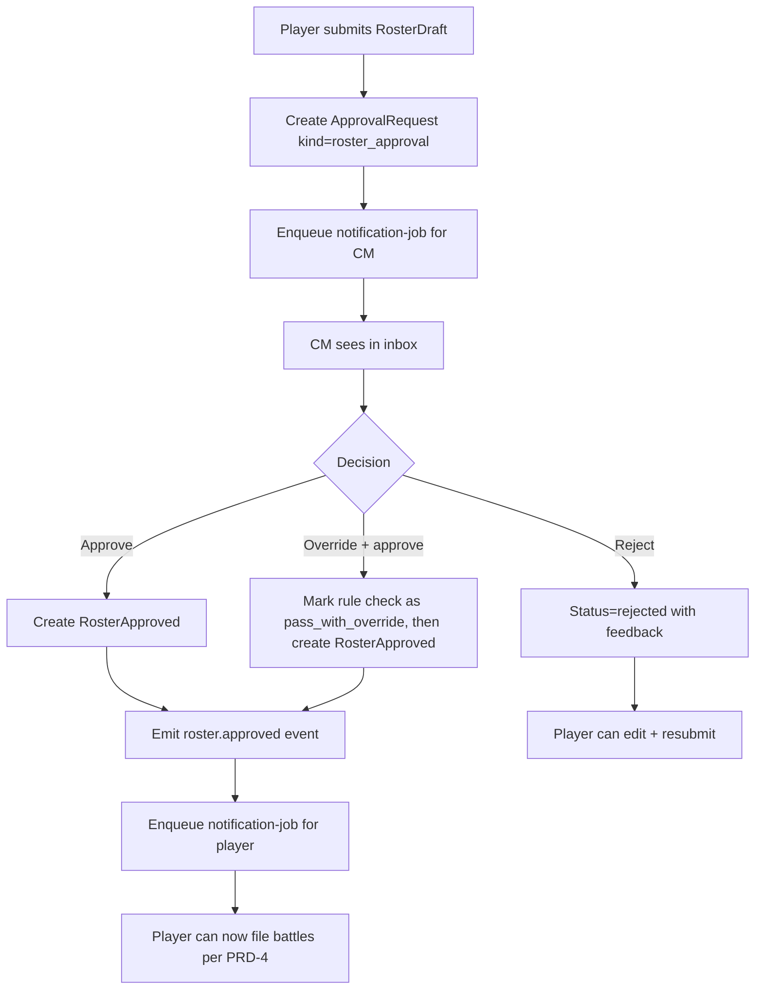

# PRD-5: Approval System (v3)

> Unified approval pipeline. v3: feeds from rule-check results emitted by the worker; first-class `roster_approval` kind.

---

## 1. Goals

One consistent pipeline for every approval-worthy action. The CM's inbox is the single view of "what needs my attention."

**Success metric**: 95% of approval decisions made within 24 hours of submission.

---

## 2. Approval-Routed Actions

### 2.1 Approval-Gating Principle

Per PRD-0 §4b: any operation that mutates shared campaign state or affects the narrative **must be gateable by CM approval**. The approval system is the load-bearing mechanism for narrative integrity in this app. Auto-approve is a per-campaign CM choice, never the default; the *capability* is what's required.

### 2.2 Action Categories

The v1 categories of narrative-affecting actions routed through the approval queue:

| Category | Concrete actions | Approval required? | Approver |
|---|---|---|---|
| **Army roster changes** | Player submits RosterDraft; manual roster edit; requisition purchase; roster revert | **Yes** | CM (or co-CM) |
| **Crusade points** | RP grants/deducts from narrative events; requisition costs; manual RP adjustments | **Yes** | CM (or co-CM) |
| **All-player effects** | Campaign-wide announcements; mass narrative events; point-cap changes; rule pack promotion (builtin → campaign) | **Yes** | CM (or co-CM) |
| **Battle updates** | Per-unit XP, honours, scars, OoA tests, agenda ticks | **Yes** | CM (or co-CM) |
| **Team / faction changes** | Team switch; faction switch mid-campaign | **Yes** | CM (or co-CM) |

### 2.3 Self-Serve (Not Approval-Gated)

Some actions are player-internal and don't enter the approval queue:

| Action | Self-served by | Why no approval |
|---|---|---|
| Player imports RosterDraft (upload JSON) | Player | Draft is private until submitted |
| BullMQ parse completes | System | Idempotent state transition |
| Player acknowledges rule-check issues | Player | Per-player decision, no shared state mutation |
| Player edits draft before submission | Player | Draft is private to the player |
| Player UI preferences | Player | No shared state |
| Player per-unit cosmetics (paint color, custom name draft) | Player | No shared state |

### 2.4 Full Action × Approval Matrix

| Action | Approval required? | Approver |
|---|---|---|
| Player imports RosterDraft (upload JSON) | No (player self-serves upload) | n/a — draft becomes `parsing` |
| BullMQ parse completes | No (system) | n/a — draft becomes `pending_review` |
| Player acknowledges rule-check issues | No (player self-serves) | n/a — draft becomes `pending_approval` |
| **Player submits RosterDraft for approval** | **Yes** | CM (or co-CM) |
| Player files post-battle update | Yes | CM |
| Player files manual roster edit | Yes | CM |
| Player purchases Requisition | Yes | CM |
| Player requests roster revert | Yes | CM |
| Player switches faction mid-campaign | Yes | CM |
| Player switches team mid-campaign | Yes | CM |
| CM edits campaign settings | No (CM is authority) | n/a |
| CM triggers narrative event (single-team scope) | No (CM is authority) | n/a |
| CM triggers narrative event (campaign-wide, RP-affecting) | Optional co-CM approval (campaign setting) | Co-CM if enabled; otherwise CM alone |
| CM mass-rebans a unit mid-campaign | Yes | Co-CM (mandatory) |
| CM edits `CampaignTeam.expectedFactionIds` | No (CM is authority) | Audit-logged |
| CM rolls back a RosterApproval | No (CM is authority) | n/a |
| CM overrides a rule check | No (CM is authority) | n/a |
| CM grants or strips a co-CM role | No (primary CM only) | n/a |

A campaign setting `auto_approve_routine_battle_updates: bool` (default false) auto-approves battle updates with no anomalies. Anomalies that always require approval:
- OoA test failed
- Requisition purchased
- Honours / scars added beyond supplement's universal list
- Manual edits outside NR import
- Submitter is a new account (< 7 days)
- Submitter is the CM themselves (auto-routes to co-CM or self-approves with audit if no co-CM)

---

## 3. ApprovalRequest Schema

```ts
type ApprovalKind =
  | 'roster_approval'                // most common
  | 'post_battle_update'
  | 'roster_manual_edit'
  | 'requisition_purchase'
  | 'roster_revert'
  | 'faction_switch'
  | 'custom';

interface ApprovalRequest {
  id: string;
  tenantId: string;
  campaignId: string;
  kind: ApprovalKind;
  submittedByUserId: string;
  submittedAt: timestamp;
  payload: Record<string, unknown>;
  status: 'pending' | 'approved' | 'rejected' | 'changes_requested' | 'withdrawn';
  reviewerUserId: string | null;
  decidedAt: timestamp | null;
  decisionReason: string | null;
  contextHash: string;                // drift detection
  ruleCheckIds: string[];            // v3: rule checks attached at submission
  activeRosterApprovedId: string | null; // gating context
}
```

### 3.1 Per-Kind Payloads

**`roster_approval`**:
```ts
{
  rosterId: string,
  draftId: string,
  previousApprovedId: string | null,
  diffSummary: { added: int, removed: int, wargearChanged: int, crusadeChanged: int },
  ruleCheckIds: string[],
  playerNote: string | null,
}
```

**`post_battle_update`**:
```ts
{
  battleId: string,
  battleUpdateId: string,
  perUnitChanges: ...,
  ruleCheckIds: string[],
}
```

---

## 4. Roster Approval Specifics

The most-used approval. Special handling:

- **CM sees**: the diff, the rule-check report, the player's optional note, the previously active RosterApproved for context
- **CM's options**:
  - **Approve** → creates RosterApproved, becomes active, emits `roster.approved` event
  - **Reject with feedback** → RosterDraft → `rejected` with CM notes; player can edit and resubmit (creates a new RosterDraft)
  - **Request changes** → same as reject, with structured change requests
  - **Override a specific rule** → marks a `fail` as `pass_with_override` with a reason. The override is itself an event (`rule_check.fail_overridden`)

### 4.1 Approval as the Source of Truth

When a roster is approved, `RosterApproved.snapshot` becomes the canonical state. Future imports diff against this snapshot. The Timeline (PRD-4) records what was approved when.

---

## 5. Inbox UX

```
┌─────────────────────────────────────────────────────┐
│ Inbox                              [Filter ▾] [⚙]  │
├─────────────────────────────────────────────────────┤
│ 7 pending · 0 claimed by you                        │
├─────────────────────────────────────────────────────┤
│ ☐ Roster approval — jake42                          │
│   Submitted 1h ago · Campaign: Aurelian Crusade    │
│   Diff: +2 units, −1 unit, 3 wargear swaps         │
│   Rule checks: 1 warn (Legends unit — needs override)
│   [View Diff] [Approve] [Reject] [Override & Approve] │
├─────────────────────────────────────────────────────┤
│ ☐ Post-battle update — sarah_k vs. mike_t            │
│   Submitted 2h ago · Battle 12                       │
│   Result: W · 1 unit promoted, 1 OoA test           │
│   [View] [Approve] [Reject] [Request Changes]      │
└─────────────────────────────────────────────────────┘
```

- **Filter**: by campaign, kind, submitter, age
- **Sort**: oldest first (FIFO)
- **Claim**: optional
- **Bulk actions**: only for `post_battle_update` with no anomalies

### 5.1 Detail View

Side panel with:
- Full proposed change with deltas highlighted
- Current state of affected entity
- Submitter's notes
- Recent related events
- For `roster_approval`: full diff view, rule check report
- Quick-approve / quick-reject buttons
- "Open in full view" link

---

## 6. Drift Detection

If the current state has changed since submission (e.g., the player imported a new RosterDraft while approval was pending), the CM sees a "Drift detected" warning. Side-by-side: original vs. recomputed.

Options:
- **Re-validate** — ask the player to resubmit
- **Force-apply** — apply the original intent anyway, with audit log
- **Reject** — reject as stale

---

## 7. Reversibility

Every approved change is reversible within a configurable window (default 7 days, per campaign setting). Rollback creates a new set of events that exactly invert the originals.

For destructive approvals (e.g., RosterApproval that included a unit that no longer has provenance), rollback requires typed confirmation.

---

## 8. Notifications

When a submission's status changes, the submitter is notified:

| Channel | MVP? |
|---------|------|
| In-app (toast + notifications list) | Yes |
| Email | Yes |

Notifications fire through a BullMQ `notification-job` to avoid blocking the approval flow.

---

## 9. Campaign-Level Approval Policies

| Policy | Effect |
|--------|--------|
| `auto_approve_routine_battle_updates: bool` | Auto-approve battle updates with no anomalies |
| `auto_approve_first_roster: bool` | First RosterApproved for a player is auto-approved; default off |
| `require_battle_report: bool` | Battle updates must include a markdown report ≥ 200 chars; default on |
| `lock_ooa_modifications: bool` | Players cannot manually edit OoA results |
| `require_two_approvals: bool` | Battle updates that destroy units need two CM approvals |
| `override_window_days: int` | Days within which an approval can be rolled back; default 7 |

---

## 10. User Flow: Roster Approval



---

## 11. Out of Scope

- Cross-campaign approvals
- AI auto-adjudication of disputes (future)
- Multi-CM voting / consensus

---

## 12. Dependencies

- **PRD-0**: `ApprovalRequest`, `ApprovalAuditEntry`, `User` (CM role)
- **PRD-1**: CM dashboard inbox link
- **PRD-3**: roster approval is the primary kind; rule-check engine output feeds the inbox
- **PRD-4**: every approved action produces events
- **Auth infra**: CM role gating
- **BullMQ**: notification jobs are async
- **Notifications infra**: SMTP for email

---

## 13. Success Metrics

| Metric | Target |
|--------|--------|
| Median time from submission to decision | < 2 hours |
| Inbox clearance rate within 24h | > 95% |
| Drift events detected and handled correctly | 100% |
| Approval rollback rate | < 1% of approvals |
| CM time per approval | < 30s for routine updates |
| Roster approval first-try rate | > 85% |

---

## 14. Edge Cases

1. **Two CMs approve the same request simultaneously**: optimistic locking via `contextHash`; second approver sees "already decided."
2. **Submitter withdraws while a CM has it claimed**: request closed.
3. **Approval is for a now-deleted entity**: apply step fails transactionally; CM is shown an error and asked to reject.
4. **CM is the submitter and no co-CM exists**: self-approves with audit-log entry `self_approved: true`.
5. **Submitter suspended mid-approval**: pending requests auto-rejected with reason "submitter suspended."
6. **Active RosterApproved changes during approval**: drift detected; CM chooses re-validate, force-apply, or reject.
7. **Notification email bounces**: status queued for retry; if persistent, in-app notification only.
