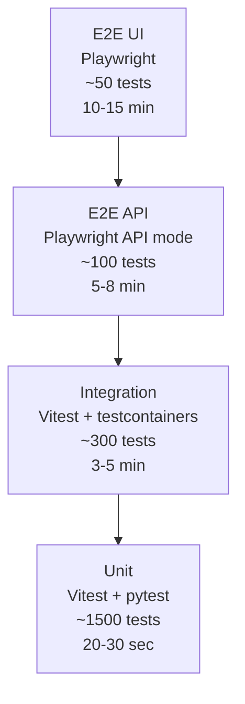
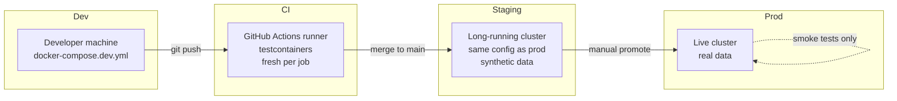
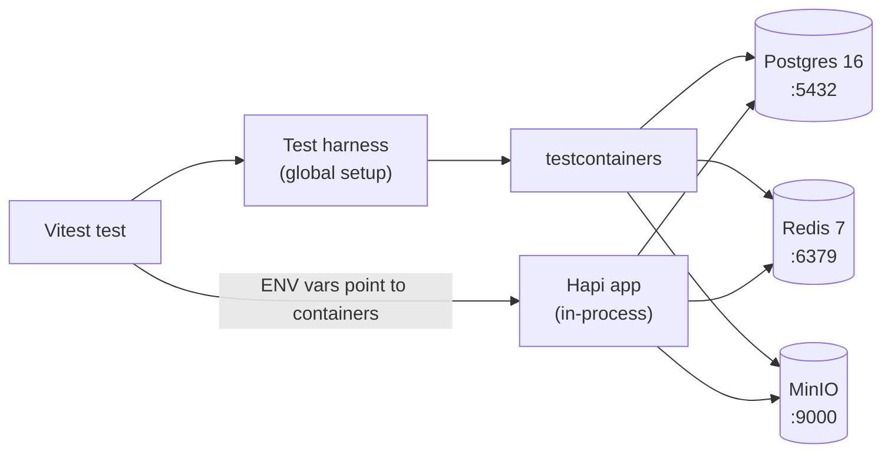
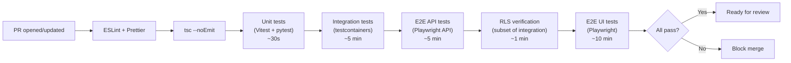

# PRD-7 — Testing Strategy

**Subsystem**: Test plan covering unit, integration, and end-to-end testing across dev, staging, and production environments. References all prior PRDs.

**Stack additions** (v3.24): Vitest (backend + frontend unit/integration), pytest (parser), Playwright (e2e API + UI), testcontainers (Postgres + Redis + MinIO for integration), GitHub Actions (CI).

**MVP scope**: every code path that ships to production must be covered by at least one test. Critical paths (auth, RLS, approval routing, parser pipeline) must have e2e coverage. UI coverage focuses on user flows, not every component variant.

---

## 0. Glossary (per PRD-0 §3b)

- **Unit test**: tests a single function or class in isolation. No I/O. Mocked dependencies.
- **Integration test**: tests a module boundary against real dependencies (DB, queue, storage) but in a hermetic test environment.
- **E2E test**: tests a full user journey from the UI through the API through the DB. Highest confidence, slowest to run.
- **Smoke test**: a small set of E2E tests run against the live production deployment to detect catastrophic failures.
- **Fixture**: a piece of pre-built test data (user, campaign, roster) used as the starting state for a test.
- **Factory**: a function that creates fresh test data on demand (often with overrides).
- **Hermetic**: a test environment with no external dependencies (no live OAuth, no live SMTP, no live Discord). Live Discord is used only in the PRD-8 §14.3 staging E2E test (skipped if `STAGING_DISCORD_WEBHOOK_URL` is unset).

---

## 1. Goals

1. **Catch regressions before merge.** Every PR must pass unit + integration + targeted E2E.
2. **Verify cross-cutting concerns explicitly.** RLS isolation, multi-tenancy, approval routing, and auth are easy to break with a single schema change. They get dedicated test suites.
3. **Enable confident refactoring.** When we restructure the approval pipeline, the existing tests should still pass without modification.
4. **Keep test maintenance low.** Tests should fail for the right reason. Avoid brittle selectors; prefer testing behavior over implementation.
5. **Stay fast.** Unit tests run in <30s total. Integration tests run in <5min. E2E tests run in <15min. If they get slower, split them.

**Non-goals** (v1): mutation testing, property-based testing (e.g., fast-check), formal verification. Defer to v2+.

---

## 2. The Test Pyramid



**Why this shape:** unit tests are cheap and give fast feedback; E2E tests are slow but cover real user value. The pyramid is wide at the bottom (many units) and narrow at the top (few E2E). Inverted pyramids (mostly E2E, few units) become flaky and slow.

**Per-PRD coverage targets:**

| Subsystem | Unit | Integration | E2E |
|---|---|---|---|
| PRD-0 (shared data model) | Schema validation | RLS policies, RLS bypass for system jobs | Multi-tenant isolation scenarios |
| PRD-1 (CM admin) | Routing logic, state machine guards | API endpoints against testcontainers | Full campaign lifecycle (create → start → end → archive) |
| PRD-2 (player signup) | OAuth state machine, magic-link token validation | Identity linking, tenant assignment | Sign-in via Discord test app + magic-link roundtrip |
| PRD-3 (roster pipeline) | Parser contract, diff logic, rule engine | Full BullMQ pipeline with real worker | Upload JSON → diff → rule check → approve flow |
| PRD-4 (events) | Event taxonomy, delta computation | Event-to-Notification fanout | Player timeline view |
| PRD-5 (approvals) | Routing decision logic (per PRD-5 §3.2) | Full approval request → decision → history | Approval inbox, CM-as-player auto-approve, TL approval flow |
| **PRD-8 (Discord webhooks, v4.0)** | **Embed renderer, visibility filter (PRD-8 §8.3)** | **BullMQ delivery pipeline with mock Discord receiver** | **Staging E2E: real Discord test channel round-trip** |

---

## 3. Test Environments

Three environments, with strict isolation between them.

| Environment | Purpose | Data | Infrastructure | External services |
|---|---|---|---|---|
| **dev** (developer machine) | Local development, TDD, manual testing | Synthetic (seeded per-developer) | `docker-compose.dev.yml` with hot reload | Discord test app, MailHog (fake SMTP) |
| **staging** (CI + pre-prod) | PR checks, full test suite, manual QA | Synthetic (fresh per test run) | Docker Compose + testcontainers in CI; long-running staging cluster mirrors prod | Discord test app, real SMTP (Mailgun sandbox), **Discord test channel webhook** (PRD-8 staging E2E only) |
| **prod** | Live users | Real | Docker Compose on instance | Real Discord OAuth, real SMTP |



**Key rules:**
- **No shared data between environments.** Each environment starts from a known seed.
- **Test data is NEVER migrated to prod.** Staging seeds are synthetic; prod is real user data.
- **Prod never runs the test suite.** Only smoke tests (subset of E2E) against prod.
- **External services are mocked or sandboxed in dev/CI.** Real OAuth/SMTP only in staging and prod.

---

## 4. Unit Tests

### 4.1 Backend (Vitest, Node/TS)

**Location**: `apps/api/src/**/*.test.ts` (co-located with source)

**Coverage targets**: 80% line coverage, 70% branch coverage.

**What's tested:**
- Pure functions (diff computation, delta generation, rule evaluation)
- Validation schemas (Joi) accept/reject
- State machine guards (`canTransition(from, to)`)
- Routing decisions (PRD-5 §3.2 routing logic in isolation)
- Authorization checks (does this user have permission to do X?)
- Event taxonomy validation (every emitted event has a known kind)

**What's NOT unit-tested** (covered by integration instead):
- Hapi route handlers (touch DB, queue, storage)
- Database queries (covered by integration tests against real Postgres)
- BullMQ job processors (covered by integration tests with real Redis)

**Example (routing decision):**

```ts
import { decide } from './routing';

describe('decide(roster_approval)', () => {
  it('routes to team leader when TL authority enabled', () => {
    const decision = decide({
      kind: 'roster_approval',
      submittedByUserId: 'player-1',
      campaign: { teamLeaderAuthority: { roster_approval: true } },
      teamLeaders: [{ teamId: 'team-a', userId: 'tl-1' }],
      affectedTeamId: 'team-a',
    });
    expect(decision.autoApprove).toBe(false);
    expect(decision.targetApprovers).toEqual(['tl-1']);
  });
  // ... 20 more cases covering each kind × each role × edge cases
});
```

### 4.2 Frontend (Vitest + @vue/test-utils, Vue 3)

**Location**: `apps/web/src/**/*.test.ts` (co-located)

**Coverage targets**: 70% line coverage. (UI is harder to test than logic; focus on critical paths.)

**What's tested:**
- Component logic (composables, computed properties, event handlers)
- Form validation (in isolation, not via UI)
- Store mutations (Pinia)
- Date/number formatting utilities
- Permission-gating logic (does this user see the right buttons?)

**What's NOT unit-tested:**
- Component rendering (covered by E2E + visual regression if needed)
- User interaction flows (covered by E2E)
- CSS / Tailwind classes (linted, not tested)

**Example:**

```ts
import { mount } from '@vue/test-utils';
import RosterDiff from './RosterDiff.vue';

describe('RosterDiff', () => {
  it('groups deltas by category', () => {
    const wrapper = mount(RosterDiff, {
      props: { deltas: sampleDeltas },
    });
    expect(wrapper.findAll('[data-testid="diff-group"]')).toHaveLength(3);
  });
});
```

### 4.3 Parser (pytest, Python)

**Location**: `apps/parser/tests/`

**Note**: The parser is the user's existing `bs-roster-parser` library, not our code. We test the **integration contract** (how we call it), not the library itself.

**Coverage targets**: 90% for the wrapper code (the subprocess invocation, stdout parsing, error handling).

**What's tested:**
- Subprocess invocation: correct args, timeout, signal handling
- stdout parsing: valid JSON, malformed JSON, partial output
- Error mapping: parser error codes → our error categories
- Determinism: same input → same output (within timestamp fields)

**Example:**

```python
def test_parse_handles_malformed_json():
    result = run_parser(b"not json at all")
    assert result.exit_code == 1
    assert result.error_category == "malformed_input"

def test_parse_handles_timeout():
    result = run_parser_with_timeout(b"...", timeout_ms=100)
    assert result.exit_code == 124  # timeout
    assert result.error_category == "timeout"
```

---

## 5. Integration Tests

### 5.1 Tooling: testcontainers

Use **testcontainers** (testcontainers-node for Hapi, testcontainers-python for parser) to spin up real Postgres, Redis, and MinIO containers per test file. The app is configured to talk to these containers via env vars set by the test harness.



**Harness responsibilities:**
- Before each test file: start containers, run migrations, seed fixtures
- After each test file: stop containers (faster than after each test)
- Provide a `getApp()` function that returns a configured Hapi server instance pointing at the containers

### 5.2 What integration tests cover

- **API endpoints** against real Postgres + Hapi in-process
  - Every endpoint, every status code, every error path
  - Auth: valid token, expired token, missing token, wrong tenant token (RLS), wrong role
  - Validation: missing required fields, wrong types, out-of-range values
- **BullMQ pipeline end-to-end** with real worker + real Redis
  - Upload → parse → diff → rule-check → notification
  - Failure modes: parser crash, queue timeout, malformed blob
- **MinIO operations**: blob upload, retrieval, deletion
- **RLS enforcement**: every test runs queries both as a user (should be filtered) and as a system job (should not be filtered)
- **OAuth callback flow** with a mock Discord OAuth server (using `oauth2-mock-server` npm package)
- **Discord webhook delivery** with a mock Discord receiver (`tests/helpers/mockDiscordReceiver.ts` per PRD-8 §14.4) that scripts 204/400/401/404/429/5xx responses per-test. Asserts on `DiscordWebhookDelivery` rows + auto-disable behavior.

### 5.3 RLS verification (critical — PRD-0 §4b)

This is its own test category because RLS bypass is a top-3 way to leak tenant data.

**Per-table test pattern:**

```ts
describe('RLS: campaigns table', () => {
  it('user in tenant A cannot SELECT campaigns in tenant B', async () => {
    // Setup: campaigns in tenant A and tenant B
    // Act: connect as user in tenant A, SELECT *
    // Assert: only tenant A campaigns returned
  });

  it('user in tenant A cannot INSERT a campaign for tenant B', async () => {
    // Setup: user in tenant A
    // Act: INSERT campaign with tenantId=B
    // Assert: error or no row created
  });

  it('system job can SELECT across tenants when RLS bypass enabled', async () => {
    // Setup: campaigns in A and B
    // Act: connect with role that has BYPASSRLS, SELECT *
    // Assert: both tenants returned
    // Audit log row created for the cross-tenant access
  });
});
```

**Every domain table gets these tests.** A schema change that drops RLS coverage breaks CI immediately.

### 5.4 Multi-tenant verification

Beyond RLS, verify:
- Same email can have User rows in two tenants (PRD-2 §3.1 design)
- Invite link with one tenant slug does not grant access to another tenant
- Audit log entries are tenant-scoped (cross-tenant reads blocked)

---

## 6. E2E API Tests (Playwright API mode)

**Tooling**: Playwright (`@playwright/test`) using its `request` API (no browser needed).

**Location**: `e2e/api/**/*.spec.ts`

**What's tested:**
- Full request/response cycles against a running Hapi instance (started by the test harness with `startServer()`)
- Auth flows that span multiple requests (OAuth callback, session refresh, magic-link roundtrip)
- Approval workflows end-to-end (player files → CM approves → history created → notification fired)
- Cross-tenant attack scenarios: a tenant-A token trying to read tenant-B resources → expect 403/404

**Example:**

```ts
import { test, expect } from '@playwright/test';

test('player files battle update; CM approves; event fires', async ({ request }) => {
  // Setup: create campaign, add player, file roster
  // Player files battle update
  const fileRes = await request.post(`/api/campaigns/${c.id}/battle-updates`, {
    headers: { Authorization: `Bearer ${playerToken}` },
    data: { battleId, ... },
  });
  expect(fileRes.status()).toBe(202);

  // CM sees it in inbox
  const inboxRes = await request.get(`/api/campaigns/${c.id}/inbox`, {
    headers: { Authorization: `Bearer ${cmToken}` },
  });
  expect(inboxRes.status()).toBe(200);
  const items = await inboxRes.json();
  expect(items.find(i => i.kind === 'post_battle_update')).toBeTruthy();

  // CM approves
  const approveRes = await request.post(`/api/approval-requests/${reqId}/approve`, {
    headers: { Authorization: `Bearer ${cmToken}` },
    data: { reason: 'looks good' },
  });
  expect(approveRes.status()).toBe(200);

  // Verify history entry created
  const historyRes = await request.get(`/api/campaigns/${c.id}/history?grouping=battle`, {
    headers: { Authorization: `Bearer ${playerToken}` },
  });
  const entries = await historyRes.json();
  expect(entries).toContainEqual(expect.objectContaining({ kind: 'battle_update.approved' }));
});
```

---

## 7. E2E UI Tests (Playwright)

**Tooling**: Playwright with browser contexts (Chromium, Firefox, WebKit).

**Location**: `e2e/ui/**/*.spec.ts`

**Coverage focus** (per v3.20's "empty UI surfaces visible only to users who can act"):
- **Critical user flows** — the 6 page surfaces (PRD-2 §5c, §5d):
  - Account page (settings, identity management)
  - Player dashboard (roster, battles, requisitions)
  - Roster page (diff view, rule check results)
  - Crusade Card (compact summary view)
  - Campaign inbox (CM/TL)
  - Crusade Administration panel
- **Permission-gated UI**: empty states are visible only to users who can act (v3.20)
- **OAuth login flow** (against Discord test app)
- **Magic-link flow** (against MailHog in dev/CI; check inbox via MailHog API)

**Example:**

```ts
import { test, expect } from '@playwright/test';

test('Sarah uploads a roster and sees diff', async ({ page }) => {
  await page.goto('/campaigns/aurelian');
  await page.click('[data-testid="import-roster"]');
  await page.setInputFiles('[data-testid="file-input"]', 'fixtures/sample-roster.json');
  await expect(page.locator('[data-testid="diff-summary"]')).toBeVisible({ timeout: 30_000 });
  await expect(page.locator('[data-testid="rule-check-pass"]')).toBeVisible();
});

test('empty state for requisitions is only shown to players who can buy', async ({ page }) => {
  // Login as a player who has no requisitions
  await loginAsPlayer(page, 'player-no-reqs');
  await expect(page.locator('[data-testid="empty-requisitions"]')).toBeVisible();

  // Login as a spectator — should NOT see the empty state
  await loginAsSpectator(page);
  await expect(page.locator('[data-testid="empty-requisitions"]')).not.toBeVisible();
});
```

**Browser matrix:**
- Chromium (primary)
- Firefox (regression coverage)
- WebKit / Safari (iOS user coverage)

**Test data:** Playwright fixtures (JSON files in `e2e/fixtures/`) committed to the repo. Each test that needs a campaign creates one fresh via API (faster than seeding via UI).

---

## 8. Load Tests (optional, deferred)

**Tooling**: k6 (Grafana k6, OSS)

**Status**: Deferred. v1 ships without formal load testing. We monitor staging CPU/memory/latency and rely on Hapi/BullMQ defaults.

**When we'd add load tests** (v1.x trigger):
- Pipeline p95 latency exceeds 30s under realistic staging load
- User reports of slow roster diffs
- Approaching connection-pool limits on Postgres

**What we'd test:** concurrent roster uploads (10, 50, 100 simultaneous), burst pattern (all players upload after a tournament), rule-check heavy campaign (many configured rules).

---

## 9. Security Tests

### 9.1 Auth tests

- OAuth state parameter is signed and expires
- Magic-link tokens are single-use and expire (default 15 min)
- Session cookies are httpOnly, secure (in prod), sameSite=lax
- Password-less (no passwords; OAuth + magic-link only)
- Replay attacks: same magic-link used twice → second fails

### 9.2 Authorization tests (RBAC + RLS)

- A `player` cannot access `/api/campaigns/:id/admin/*` endpoints
- A `crusade_team_leader` can only approve requests for their team
- A `spectator` cannot file any approval request
- Cross-tenant access always denied
- CM of campaign A cannot approve a request in campaign B

### 9.3 Input validation tests

- SQL injection: every string field tested with `'; DROP TABLE users; --`
- XSS: every user-input field tested with `<script>alert(1)</script>` (verify stored as text, not executed on render)
- Path traversal: blob keys with `../` rejected
- Oversized uploads: >10MB rejected at validation
- Malformed JSON: parser subprocess handles gracefully

### 9.4 Penetration testing (v1.x)

Not in v1. Use a third-party pen test before public release of v1.0. Internal security review only in v1 dev.

---

## 10. Test Data Seeding

### 10.1 Factories

TypeScript factories in `packages/test-utils/src/factories/`:

```ts
export const makeCampaign = (overrides?: Partial<Campaign>): Campaign => ({
  id: randomUUID(),
  tenantId: 'tenant-1',
  name: 'Test Campaign',
  supplementId: 'armageddon',
  cmUserId: 'cm-1',
  status: 'created',
  settings: defaultSettings(),
  createdAt: new Date(),
  // ...
  ...overrides,
});

export const makeRoster = (overrides?: Partial<Roster>): Roster => ({
  id: randomUUID(),
  campaignMemberId: 'member-1',
  factionId: 'astra_militarum',
  currentApprovedId: null,
  // ...
  ...overrides,
});
```

**Why factories, not fixtures:** tests can compose scenarios by combining factories; fixed fixtures constrain tests.

### 10.2 Fixture files

For things that are easier to read as JSON: `bs-roster-parser` output samples, complex battle reports, multi-team campaign setups. Stored in `e2e/fixtures/` and `packages/test-utils/src/fixtures/`.

### 10.3 Cleanup

- **Unit tests**: no cleanup needed (no shared state).
- **Integration tests**: per-test cleanup (each test starts with empty DB). Use a transaction wrapper that rolls back at end of test (faster than truncate).
- **E2E tests**: per-test-file cleanup. Each test file creates its own tenant in setup.

---

## 11. CI Gating (GitHub Actions)



**Per-job configuration:**

| Job | Triggers | Runs on | Duration |
|---|---|---|---|
| lint | every push | ubuntu-latest | 30s |
| typecheck | every push | ubuntu-latest | 1m |
| unit-tests | every push | ubuntu-latest | 30s |
| integration-tests | every push | ubuntu-latest | 5m |
| e2e-api | every push | ubuntu-latest | 5m |
| rls-verification | every push | ubuntu-latest | 1m |
| e2e-ui | every push | ubuntu-latest (with display server) | 10m |
| security-scan | every push + weekly cron | ubuntu-latest | 2m |
| coverage-report | every push | ubuntu-latest | 30s |

**Branch protection:** main requires lint + typecheck + unit + integration + e2e-api + rls-verification to pass before merge. e2e-ui runs as required check on main but advisory on PRs (too slow to gate every PR; PRs target a smaller smoke set).

**Pre-commit hooks** (husky):
- Prettier on staged files
- ESLint on staged files
- TypeScript typecheck on the whole project (fast enough)

---

## 12. Coverage Thresholds

**Enforced by Vitest's `coverage.thresholds` config:**

| Subsystem | Lines | Branches | Functions |
|---|---|---|---|
| Backend (`apps/api/src`) | 80% | 70% | 80% |
| Frontend (`apps/web/src`) | 70% | 60% | 70% |
| Parser wrapper (`apps/parser/src/wrapper`) | 90% | 85% | 90% |
| Shared types (`packages/shared-types`) | n/a (types only) | n/a | n/a |
| Test utilities (`packages/test-utils`) | excluded | excluded | excluded |

**Why these numbers:**
- Backend has the most logic and the highest regression cost (data corruption, RLS bypass) → high threshold
- Frontend is mostly UI glue; over-testing it is busywork → lower threshold
- Parser wrapper is critical (garbage in, garbage out) → highest threshold

**Coverage drops below threshold = CI fails.** Forced to either add tests or get explicit approval to exclude the line (with a comment explaining why).

---

## 13. Cross-PRD Test Scenarios

End-to-end scenarios that span multiple PRDs. These are the "did we wire it up correctly" tests.

### 13.1 "Player Sarah's journey" (PRD-2 + PRD-3 + PRD-5)

1. Sarah signs in via Discord OAuth (PRD-2)
2. Sarah accepts invite to Aurelian campaign, joins Helsreach Defenders, picks Astra Militarum (PRD-2)
3. Sarah uploads her first roster (PRD-3)
4. Pipeline parses, diffs vs. nothing (first time), runs rule checks (PRD-3)
5. Sarah submits for approval (PRD-5)
6. Mike (TL of Helsreach Defenders) sees in inbox, approves (PRD-5)
7. Sarah sees RosterApproved in her roster view (PRD-3)
8. Sarah files a battle update (PRD-4 §7b.1)
9. Mike approves; battle update becomes part of history (PRD-5)
10. Sarah views her Timeline (PRD-4 §7)

### 13.2 "CM Mike runs the campaign" (PRD-1 + PRD-3 + PRD-5)

1. Mike creates Aurelian campaign via 6-step wizard (PRD-1 §4.1)
2. Mike creates 4 teams, sets expected factions (PRD-1 §5b)
3. Mike invites players; they accept (PRD-2)
4. Mike promotes Sarah to TL of Helsreach Defenders (PRD-1 §4.2)
5. Mike starts the campaign (gate: every team has ≥1 TL) (PRD-1 §4.1)
6. Mike configures rules per PRD-1 §4.4 (PRD-3 §6)
7. Mike sees campaign inbox, approves various requests (PRD-5)
8. Mike changes a rule mid-campaign; system shows warning (PRD-1 §4.4, v3.17)
9. Mike ends campaign; everyone can read across teams (PRD-1 §4.1, post-crusade relaxation)

### 13.3 "Auto-approve + pipeline runs" (PRD-1 + PRD-5)

1. Mike is also a player on Helsreach Defenders (PRD-1 §5)
2. Mike files a battle update as a player
3. ApprovalRequest is created (not skipped); approvalSource = 'self_approved'
4. Rule checks run (PRD-5 §3.3)
5. History entry created
6. Event emitted; notification fired for Mike's own record
7. **v4.0:** PRD-8 Discord webhook fires automatically with no code changes to the pipeline — the future hook is now a present hook, validating the v3.28 architectural choice.

### 13.4 "RLS prevents cross-tenant access" (PRD-0)

1. Two tenants: Aurelian (instance's main) and Beta (test)
2. User in Beta has a valid token
3. User in Beta requests `/api/campaigns/<aurelian-campaign-id>`
4. RLS returns 404 (campaign not visible to Beta user)
5. Audit log records the access attempt

---

## 14. Open Questions

- **Snapshot testing for Vue components**: not adopted in v1; reconsider if UI regressions become common.
- **Mutation testing (Stryker)**: deferred to v2; would catch tests that don't actually verify behavior.
- **Property-based testing (fast-check)**: deferred; would be valuable for the parser contract (roundtrip JSON → parse → diff → parse again should be idempotent) but adds significant complexity.
- **Visual regression (Percy, Chromatic)**: deferred; we're a utility app, not a marketing site.
- **Contract testing (Pact)**: deferred; the front-end and back-end are owned by the same team, so consumer-driven contract tests are overkill in v1.

---

## 15. Dependencies

- **PRD-0**: data model, tenancy, RLS policies
- **PRD-1**: campaign lifecycle, CM-as-player
- **PRD-2**: auth, OAuth, magic-link
- **PRD-3**: roster pipeline
- **PRD-4**: events, history
- **PRD-5**: approval routing
- **PRD-6**: OpenAPI/Swagger spec (test data generation, request validation, e2e API test scaffolding)

---

## 16. References

- Vitest: https://vitest.dev
- @vue/test-utils: https://test-utils.vuejs.org
- Playwright: https://playwright.dev
- testcontainers-node: https://node.testcontainers.org
- testcontainers-python: https://github.com/testcontainers/testcontainers-python
- pytest: https://docs.pytest.org
- GitHub Actions: https://docs.github.com/actions
- oauth2-mock-server: https://github.com/ptavares/oauth2-mock-server
- MailHog (dev SMTP): https://github.com/mailhog/MailHog


## OKF Cross-References

This PRD's concepts are documented as first-class entities in the OKF bundle at [`okf/`](../okf). The most relevant:

- [Hapi](../okf/references/hapi.md) — test target for API tests
- [PostgreSQL](../okf/references/postgres.md) — RLS verification target
- [Redis](../okf/references/redis.md) — BullMQ queue health
- [MinIO](../okf/references/minio.md) — blob upload/download tests
- [BullMQ](../okf/references/bullmq.md) — pipeline integration tests
- [bs-roster-parser](../okf/references/bs-roster-parser.md) — Python parser integration tests

See [`okf/index.md`](../okf/index.md) for the full bundle.
