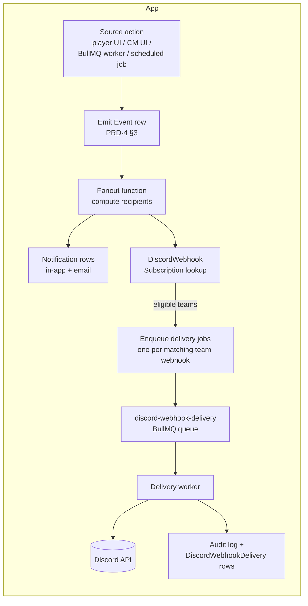
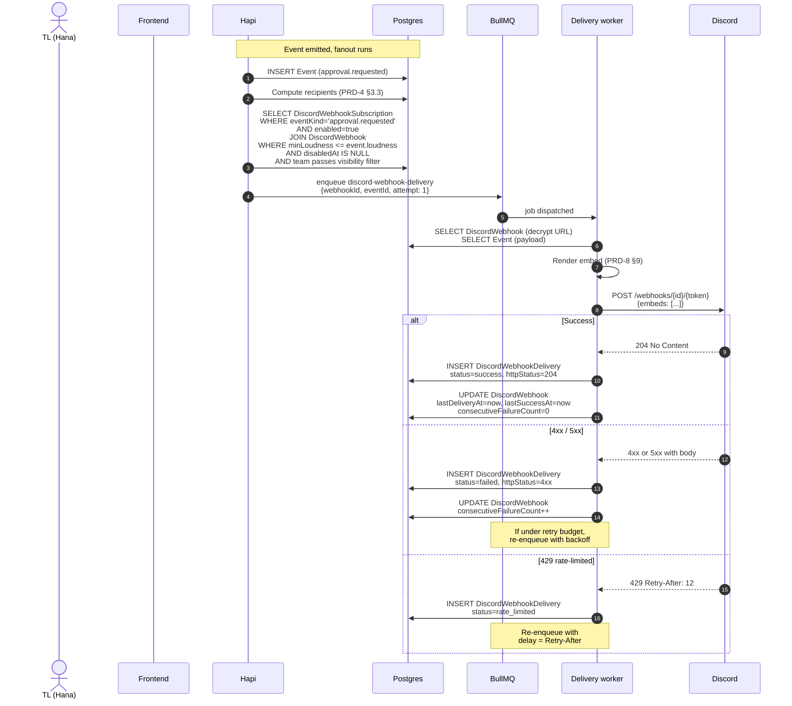

# PRD-8: Discord Integration via Webhooks

> Per-team Discord webhook forwarding for Crusade campaign events. Outgoing webhooks only — no bot, no DMs, no bidirectional sync. Each `CampaignTeam` registers at most one webhook URL; the team's Crusade Team Leader (or the primary CM) configures which `EventKind` values fire it. Delivery is async via BullMQ with retry, team-isolation enforced at the fanout step.

---

## 0. Glossary

- **Discord webhook** — an HTTPS endpoint of the form `https://discord.com/api/webhooks/{id}/{token}` that accepts `POST` requests with a JSON body to publish a message into a specific Discord guild channel. Owned by the channel; created via Discord's UI (Integrations → Webhooks). Anyone with the URL can post to that channel.
- **Webhook (this app)** — a `DiscordWebhook` row representing one registered Discord webhook URL, scoped to a single `CampaignTeam`. Owned/configured by the team's Crusade Team Leader (TL) or the primary CM.
- **Embed** — Discord's rich-message format: a JSON object with `title`, `description`, `fields[]`, `color`, `timestamp`, `author`, etc. Renders as a card in the channel.
- **Loudness** — borrowed from PRD-5 §8: `loud` / `normal` / `quiet` classification of how urgent a notification is. PRD-8 forwards team-eligible events at the loudness floor the team has configured (default: `normal`).
- **Team-isolation invariant** — PRD-0 §3b / §4b.3 guarantee. No `Event` row of any kind may leak across teams. PRD-8 implements this invariant at the event fanout step; the delivery worker is dumb pipe.
- **Subscription (this app)** — a per-`DiscordWebhook` row in `DiscordWebhookSubscription` declaring "this event kind triggers a delivery to this webhook." The TL configures subscriptions.
- **Delivery worker** — the BullMQ consumer for the `discord-webhook-delivery` queue. Decrypts the URL, renders the embed, `POST`s to Discord, records the result, retries with backoff.
- **429 (rate-limited)** — Discord's response when a webhook is over its quota (30/min per webhook, 5 concurrent per webhook). Response includes a `Retry-After` header.

**Roles used (per PRD-0 §3b + PRD-1 §0):**

| Role | What they are | Webhook authority |
|---|---|---|
| **Primary CM** | Full campaign authority | Full CRUD on any team's webhook (override) |
| **Crusade Team Leader (TL)** | Player on a team with delegated team-scoped approval authority | Full CRUD on **their team's** webhook |
| **Player** | Player on a team | Read-only view of **their team's** webhook (delivery status, test results, subscriptions). Cannot edit. |
| **Player on another team** | Different team in same campaign | Cannot see the webhook exists |
| **Spectator** | Read-only cross-team viewer | No webhook visibility |

---

## 1. Goals & Non-Goals

### 1.1 Goals

1. **CM or TL can wire up team-chat in <60 seconds.** Open panel → paste webhook URL → check "approval.requested" + "roster.approved" → save. Test-send fires a sample embed.
2. **Zero new infrastructure.** Webhooks are outbound HTTPS from the existing BullMQ worker. No bot token, no OAuth scope expansion, no new daemon.
3. **Team-isolation is preserved by construction.** PRD-0 §3b invariant enforced at the fanout step, not the delivery worker. No code path can leak `team`, `cm_only`-without-affected-teams, or `private` events to a Discord channel.
4. **Reliable delivery.** Discord 429s, transient network errors, and process restarts don't lose events. Failed deliveries retry with exponential backoff + `Retry-After` honoring.
5. **Auditable.** Every delivery attempt (success or failure) is in the audit log. CM can see "this webhook delivered 247 events in the last 7 days, 3 failed."
6. **Configurable without code changes.** TL enables/disables per-event-kind subscriptions via the UI; no redeploy required.

### 1.2 Non-Goals (v1)

- ❌ **Discord bot.** No bot token, no slash commands, no reactions, no DMs, no role-lookups, no guild verification. Webhooks are server→channel only.
- ❌ **Bidirectional sync.** Discord → app reads do not exist. We send; we don't listen.
- ❌ **Campaign-wide webhook.** Each team gets one; there is no separate "all campaign events to one channel" in v1. (Deferred to v1.x; see §16.)
- ❌ **Cross-tenant webhooks.** A webhook belongs to one tenant and one campaign.
- ❌ **Edit-message affordance.** Discord supports `PATCH /webhooks/{id}/{token}/messages/{message_id}`; we do not use it in v1.
- ❌ **Threaded messages.** Each event is one embed; no per-event thread.
- ❌ **Per-event-kind payload customization.** Embed layout is templated from `EventKind`; the TL cannot edit templates.
- ❌ **Custom Discord embeds (markdown links, images, etc.) in event fields.** Embeds are structured; free-text content goes into `description` only.
- ❌ **Per-user opt-out.** If a webhook is registered for the team and an event matches, it fires. PRD-2 §5d does **not** add an `echoToDiscord` preference. Players who don't want their actions in a guild channel should discuss with their TL.

---

## 2. Background & User Stories

### 2.1 Background

The 40K Crusade community runs most of its conversation in Discord guilds. The PRD-1 §6b Flow 5 pain point articulates this directly:

> He runs a Discord server for the group; the in-app notifications live in a different tool from the conversation.
> — Mike's persona, PRD-1 §6b

The current PRD-1 §5c placeholder explicitly anticipates webhook-based forwarding:

> Webhook-based Discord integration is a high-value v2 feature (community runs most 40K conversation in Discord). The system will emit events that can be forwarded to Discord channels; the wiring lives in v2.

This PRD makes that wiring live.

**Why per-team (not per-campaign)?** Teams have separate narrative arcs, separate `#crusade-helsreach` channels, and separate conversational context. Forcing all events into one campaign channel conflates teams; team-specific channels are how 40K groups actually organize. The CM doesn't want Team Gorgutz's roster-approval notifications cluttering the Helsreach Defenders' chat.

**Why one webhook per team?** The Discord side has one channel per team; one URL maps cleanly. Multiple webhooks per team would multiply URLs without a clean semantic split (events still need team-isolation, subscriptions, delivery guarantees — same machinery). Limit is enforced as a unique constraint on `(campaignId, teamId)`.

### 2.2 User Stories

**Mike (Primary CM of "Aurelian" campaign):**
- I want to wire Helsreach Defenders' `#crusade-chat` to my app so the team sees roster-approval notifications without opening the app.
- I want Team Gorgutz's webhook to receive ONLY battle reports and requisition purchases — they get noisy about approvals.
- If a webhook goes down or Discord rate-limits me, I want to know which webhook failed and why, and I want failed events to retry, not vanish.

**Hana (Team Leader of Helsreach Defenders):**
- I want to register my team's webhook and pick which events fire it.
- I want to test-fire a sample embed before saving, so I know my URL works.
- If a delivery fails repeatedly, I want a notification in my inbox saying "your team's webhook is disabled — fix it."

**Sarah (Player on Helsreach Defenders):**
- I want to see the delivery status of my team's webhook (last delivered, recent failures) — so I know whether to expect notifications in Discord.
- If a webhook misconfiguration causes my action to leak to the wrong channel, I want to flag it to the CM via the audit log.

**Instance Admin:**
- I want to see aggregate webhook health across all tenants and campaigns (delivery rate, top failing webhooks) on the instance metrics page.

---

## 3. Architecture Overview



The **fanout function** is the single chokepoint where team-isolation is enforced. The delivery worker is dumb pipe — it trusts whatever the fanout function queued and ships it.

---

## 4. Data Model

### 4.1 New Tables (added to PRD-0 §4 shared data model)

```ts
// PRD-0 §4 additions

// Per-team Discord webhook registration.
// Unique on (campaignId, teamId) — at most one active webhook per team per campaign.
DiscordWebhook {
  id,
  tenantId,
  campaignId,
  teamId,                          // FK to CampaignTeam; one webhook per team per campaign
  name,                            // friendly label for UI ("Helsreach #crusade-chat")
  urlEncrypted,                    // servocrypt-encrypted Discord webhook URL
  urlFingerprint,                  // SHA-256 of the URL — used for audit logs without leaking the secret
  createdByUserId,
  createdAt,
  updatedAt,
  // Disabled state: when set, deliveries are skipped (event still emitted + in-app + email).
  // Set automatically after N consecutive failures (PRD-8 §10); cleared by rotate or test-send success.
  disabledAt?,
  disabledReason?,
  consecutiveFailureCount: int,
  // Rolling counters used by the auto-disable logic (PRD-8 §10).
  lastDeliveryAt?,
  lastSuccessAt?,
  // Loudness floor: events below this loudness do NOT fire this webhook.
  // Default 'normal'. TL-configurable per webhook.
  minLoudness: 'loud' | 'normal' | 'quiet'
}

// Per-webhook subscription: which EventKind values trigger a delivery.
// TL-configurable via the Integrations UI (PRD-8 §6).
DiscordWebhookSubscription {
  webhookId,
  eventKind: EventKind,            // from PRD-4 §3 taxonomy
  enabled: bool,
  enabledAt?,
  enabledByUserId?
}

// Delivery log: one row per delivery ATTEMPT (success or failure).
// Used for the in-app delivery status UI + audit log.
DiscordWebhookDelivery {
  id,
  webhookId,
  eventId,                         // FK to Event
  attempt,                         // 1..maxAttempts (default max=5)
  status: 'pending' | 'success' | 'failed' | 'rate_limited' | 'gave_up',
  httpStatus?,
  errorMessage?,                   // truncated Discord error body or network error
  durationMs?,
  enqueuedAt,
  deliveredAt?,
  // Rendered embed JSON — kept for "show me what was sent" debug UI.
  // Redacted of any private fields per PRD-0 §4b.3.
  embedJson?
}

// Unique constraints
// - DiscordWebhook: UNIQUE (campaignId, teamId) WHERE disabledAt IS NULL
//   (allows a "soft-retired" disabled row to exist alongside a new one after rotation; see §6.5)
// - DiscordWebhookSubscription: UNIQUE (webhookId, eventKind)
```

### 4.2 Relationships

- `DiscordWebhook.teamId → CampaignTeam.id`
- `DiscordWebhook.createdByUserId → User.id`
- `DiscordWebhookSubscription.webhookId → DiscordWebhook.id`
- `DiscordWebhookDelivery.webhookId → DiscordWebhook.id`
- `DiscordWebhookDelivery.eventId → Event.id`

### 4.3 RLS Policies (extends PRD-0 §3b)

| Table | Visible to | Editable by |
|---|---|---|
| `DiscordWebhook` | TL of the team; CM of the campaign; players on the team (read-only) | TL of the team; CM of the campaign |
| `DiscordWebhookSubscription` | Same as parent `DiscordWebhook` | Same as parent `DiscordWebhook` |
| `DiscordWebhookDelivery` | Same as parent `DiscordWebhook` | System only (no user edits) |

Other teams in the campaign: cannot see the table exists. Players on other teams' SELECT on `DiscordWebhook WHERE teamId = X` returns no rows.

Instance Admin: read-only across all tenants for debugging; not exposed in v1 UI.

---

## 5. Event Subscription Model

### 5.1 TL-Configurable Subscriptions

A team's TL configures which `EventKind` values trigger their team's webhook. The default subscription set is curated for "team updates" — events that a team typically cares about:

**Default-enabled (recommended starter set):**

| EventKind | Why default-on |
|---|---|
| `roster.parse_succeeded` | TL knows when a player finishes an import |
| `roster.parse_failed` | TL can ping the player to fix and retry |
| `roster.approved` | TL sees the result of their own approvals land |
| `roster.rejected` | TL sees when their own rejection triggered further action |
| `approval.requested` | **Primary reason for the webhook** — TL's inbox mirror |
| `approval.approved` | TL's own approvals succeeding |
| `approval.rejected` | TL's own decisions getting overridden (e.g., by CM) |
| `approval.changes_requested` | CM asked for changes on a request the TL had been tracking |
| `battle.filed` | Team member filed a battle report |
| `battle.approved` | TL sees battles they approved land |
| `crusade.rp_gained` | RP ticks from approved battles |
| `crusade.req_purchased` | CM-gifted requisitions land |
| `member.joined` | New player on the team |
| `member.left` | Player left the team |
| `member.role_changed` | TL grants/revokes |

**Default-disabled (TL must opt in):**

| EventKind | Why default-off |
|---|---|
| `roster.draft_submitted` | High-frequency; TL usually sees this in their inbox already |
| `roster.draft_reviewed` | Player action; not actionable by TL |
| `roster.draft_acknowledged` | Player action |
| `battle.disputed` | Rare; usually handled out-of-band |
| `crusade.rp_lost` | Less common; TL may or may not care |
| `crusade.alignment_changed` | Cosmetic; can be noisy |
| `roster.rolled_back` | Rare and important; TL should opt in to be notified |
| `rule_check.run` | High-frequency; noisy |
| `rule_check.warn_acknowledged` | Player action |
| `system.*` | Almost always noise; opt-in for diagnostics |

**Always blocked (regardless of subscription):**

| EventKind | Why blocked |
|---|---|
| Any `private` event | Would leak player-private actions to a guild channel |
| Any event with `visibility = 'private'` | Same |
| Any event with `visibility = 'cm_only'` AND `affectedTeamIds` does NOT include this team's id | Would leak CM's private audit content |
| `roster.override_applied` | CM's override audit — surface only to CM's UI, not team channels |
| `approval.overridden` | Same |

### 5.2 Loudness Floor

Each webhook has a `minLoudness` field. Events whose loudness (per PRD-5 §8) is below the floor are NOT fired even if subscribed. Default `normal`.

```ts
// Loudness assignment per EventKind (extends PRD-5 §8 table)
const DEFAULT_LOUDNESS: Record<EventKind, 'loud' | 'normal' | 'quiet'> = {
  'approval.requested': 'loud',
  'approval.rejected': 'loud',
  'roster.rejected': 'loud',
  'roster.parse_failed': 'loud',
  'battle.filed': 'normal',
  'battle.approved': 'normal',
  'roster.approved': 'normal',
  'approval.approved': 'normal',
  'crusade.rp_gained': 'normal',
  'crusade.req_purchased': 'normal',
  'member.joined': 'normal',
  'member.left': 'normal',
  'member.role_changed': 'normal',
  'roster.parse_succeeded': 'quiet',
  'rule_check.run': 'quiet',
  // ... etc
}
```

This is a **separate** loudness assignment from PRD-5 §8's in-app loudness. PRD-5 controls in-app toast vs notification-list-only; PRD-8 controls Discord eligibility. They share the same enum but the table is independently editable by the TL.

---

## 6. Configuration UI

### 6.1 Location

`Crusade Administration panel → Teams → {Team Name} → Integrations tab → Discord Webhook`

Players on the team see a read-only summary on the same tab (no edit controls).

CMs see this tab on every team (read + write via the override authority).

### 6.2 List View (no webhook registered)

```
+----------------------------------------------------------+
| Discord Webhook                            [+ Register]  |
+----------------------------------------------------------+
| No webhook configured for this team.                     |
|                                                          |
| Registering a webhook sends notifications about your     |
| team's events to a Discord channel. Useful for keeping   |
| team chat in sync with the app. See PRD-8 for details.   |
+----------------------------------------------------------+
```

### 6.3 Register / Edit Form

```
+----------------------------------------------------------+
| Register Discord Webhook                                 |
+----------------------------------------------------------+
| Webhook URL *                                            |
| [https://discord.com/api/webhooks/xxxxxx/yyyyyy]         |
| Create one in Discord: Channel Settings → Integrations   |
| → Webhooks → New Webhook. Copy the URL here.             |
|                                                          |
| Friendly name (UI only, not sent to Discord)            |
| [Helsreach #crusade-chat                              ]  |
|                                                          |
| Minimum loudness                                         |
| ( ) loud only    (•) normal and above                    |
| ( ) quiet and above                                     |
|                                                          |
| Events to forward (16 of 42 kinds enabled)               |
|                                                          |
|   [✓] approval.requested (loud) — TL inbox mirror        |
|   [✓] approval.approved (normal)                         |
|   [✓] approval.rejected (loud)                           |
|   [✓] roster.parse_succeeded (quiet)                     |
|   [✓] roster.parse_failed (loud)                         |
|   ... (expand for full list)                             |
|                                                          |
|   [Enable all defaults]   [Disable all]                  |
|                                                          |
| [Send test embed]   [Cancel]   [Save]                    |
+----------------------------------------------------------+
```

`Send test embed` posts a synthetic `approval.requested` event (clearly marked as a test in the embed footer) to the URL. Result appears inline:

```
[Send test embed] → ✓ Delivered (HTTP 204, 142ms)
                  → ✗ Failed (HTTP 401, check that the URL is valid)
                  → ✗ Rate-limited (retry after 12s)
```

### 6.4 List View (webhook registered)

```
+----------------------------------------------------------+
| Discord Webhook — Helsreach #crusade-chat                |
| Status: ✓ Active  · Last delivery: 2 min ago             |
|                                                          |
| Subscriptions: 16 enabled · Loudness floor: normal       |
| URL: https://discord.com/api/webhooks/****/**** (redacted)|
| Created by: Hana (TL) on 2026-06-15                      |
|                                                          |
| [Edit subscriptions]  [Edit name/loudness]               |
| [Rotate URL]           [Send test]                       |
| [View delivery log]    [Disable]                         |
+----------------------------------------------------------+
```

Disabled webhooks show their `disabledReason` ("Auto-disabled after 10 consecutive failures starting 2026-06-28 14:22") and a `Re-enable` button (which clears `disabledAt` and resets `consecutiveFailureCount`).

### 6.5 Rotation

`Rotate URL` regenerates the URL by:
1. Prompting the TL: "Paste the new webhook URL. Subscriptions and name will be preserved."
2. Replacing `urlEncrypted` and `urlFingerprint`.
3. Resetting `consecutiveFailureCount` to 0 (a rotation implies the old URL was compromised; we start fresh).
4. Audit-logging the rotation (actor, timestamp, new URL fingerprint).

The old `DiscordWebhookSubscription` rows and `DiscordWebhookDelivery` history are preserved. The `name` is also preserved.

**Why not soft-delete + recreate?** PRD-0 §4 audit-trail principle: don't destroy history. A rotation that preserved subscriptions and delivery history is more useful than one that wiped and started fresh. The unique constraint `UNIQUE (campaignId, teamId) WHERE disabledAt IS NULL` lets a rotated-out webhook exist as a soft-retired row alongside a new one.

---

## 7. Authorization Model

| Action | TL of team | CM of campaign | Player on team | Player on other team |
|---|---|---|---|---|
| View webhook status | ✓ | ✓ (all teams) | ✓ (own team only) | ✗ |
| View subscriptions | ✓ | ✓ | ✓ | ✗ |
| Edit subscriptions | ✓ | ✓ | ✗ | ✗ |
| Edit name + loudness floor | ✓ | ✓ | ✗ | ✗ |
| Rotate URL | ✓ | ✓ | ✗ | ✗ |
| Send test embed | ✓ | ✓ | ✗ | ✗ |
| View delivery log | ✓ | ✓ | ✓ | ✗ |
| Disable / Re-enable | ✓ | ✓ | ✗ | ✗ |
| Delete (hard) | CM only | ✓ | ✗ | ✗ |

**Policy (mirrors PRD-1 §0):** "Only the CM can grant or revoke team-leader authority; players cannot self-promote." Extended here: only the TL of the team (or CM) can configure that team's webhook.

**Audit:** every change to `DiscordWebhook` or `DiscordWebhookSubscription` writes an entry to the campaign's audit log with `actorUserId`, `beforeValue`, `afterValue`, `reason` (optional free text).

---

## 8. Delivery Pipeline

### 8.1 Sequence (happy path)



### 8.2 BullMQ Job Configuration

```ts
// apps/worker/src/queues/discordWebhookDelivery.ts
export const discordWebhookDeliveryQueue = new Queue('discord-webhook-delivery', {
  connection: redis,
  defaultJobOptions: {
    attempts: 5,                            // initial + 4 retries
    backoff: {
      type: 'exponential',
      delay: 5_000,                         // first retry after 5s
    },
    removeOnComplete: { age: 86_400, count: 1_000 },   // 24h retention
    removeOnFail: { age: 7 * 86_400 },                // 7d retention for failures
  },
});
```

**Retry schedule:** 5s → 25s → 2m05s → 10m25s → give up (matches Discord's typical 429 cooldown curve for sustained bursts).

### 8.3 Visibility Filter (the team-isolation rule)

Enforced in the fanout function (single chokepoint), not the delivery worker. Pseudocode:

```ts
function isWebhookEligible(event: Event, team: CampaignTeam, webhook: DiscordWebhook): boolean {
  // 1. Loudness floor
  if (loudnessRank(event.loudness) < loudnessRank(webhook.minLoudness)) return false;

  // 2. Visibility check — the heart of team-isolation
  if (event.visibility === 'private') return false;        // never forward
  if (event.visibility === 'public' || event.visibility === 'campaign') return true;
  if (event.visibility === 'team') {
    // Forward only if the event is scoped to this team
    return event.affectedTeamIds?.includes(team.id) ?? false;
  }
  if (event.visibility === 'cm_only') {
    // Forward only if CM marked the event as relevant to this team
    return event.affectedTeamIds?.includes(team.id) ?? false;
  }
  return false;
}
```

`affectedTeamIds` is an optional field added to `Event` (PRD-4 §3 schema extension):

```ts
interface Event {
  // ... existing fields per PRD-4 §3 ...
  affectedTeamIds?: string[];   // present when event is scoped to specific teams
}
```

Existing events that don't have `affectedTeamIds` are treated as not team-scoped (only `public`/`campaign` visibility forwards them).

### 8.4 Worker Implementation Notes

The delivery worker:

1. **Decrypts the URL** via the same `servocrypt` envelope pattern as the rest of the app. The plaintext URL lives only in this worker's process memory for the duration of the HTTP call.
2. **Renders the embed** from the event's `kind` + `payload` per the templates in §9. Embed generation is a pure function — testable in isolation.
3. **POSTs to Discord** with a 5-second `AbortController` timeout (Discord's typical response is <500ms; timeout means network problem).
4. **Records the delivery** to `DiscordWebhookDelivery` regardless of outcome.
5. **Updates the webhook's rolling counters** atomically (single UPDATE statement).
6. **Triggers auto-disable** if `consecutiveFailureCount` reaches the threshold (default 10, per-webhook configurable; PRD-8 §10).

The worker MUST NOT do visibility filtering — that decision was made at the fanout step. The worker trusts its input.

---

## 9. Embed Format

### 9.1 Common Structure

Every embed has the same skeleton; event-specific fields vary:

```json
{
  "username": "Crusade Master — Aurelian",
  "avatar_url": "<tenant or campaign avatar>",
  "embeds": [{
    "title": "<event-specific title>",
    "description": "<event-specific description>",
    "color": <loudness color: loud=0xE74C3C, normal=0x3498DB, quiet=0x95A5A6>,
    "author": {
      "name": "<actor display name, or 'System'>",
      "icon_url": "<actor avatar URL>"
    },
    "fields": [
      { "name": "Campaign", "value": "Aurelian", "inline": true },
      { "name": "Team", "value": "Helsreach Defenders", "inline": true },
      { "name": "Submitted by", "value": "Sarah K.", "inline": true }
    ],
    "footer": {
      "text": "Crusade Master · view in app"
    },
    "timestamp": "<ISO 8601 of event.occurredAt>"
  }]
}
```

`view in app` footer includes a link: `${PUBLIC_BASE_URL}/campaigns/${campaignId}/events/${eventId}`. The link is the **only** thing sent to Discord that includes a tenant-specific URL; the URL itself is not sensitive.

### 9.2 Per-Event-Kind Templates

```ts
// apps/worker/src/embeds/discord/templates.ts

export const embedTemplates: Record<EventKind, (event: Event, ctx: EmbedContext) => Embed> = {
  'approval.requested': (e, ctx) => ({
    title: `📥 New approval request: ${e.payload.kind}`,
    description: e.payload.summary ?? 'Awaiting review',
    color: COLOR_LOUD,
    fields: [
      { name: 'Submitted by', value: e.actorDisplayName, inline: true },
      { name: 'Campaign', value: ctx.campaignName, inline: true },
      { name: 'Team', value: ctx.teamName, inline: true }
    ],
    footer: { text: 'Crusade Master · view in app' },
    timestamp: e.occurredAt
  }),

  'approval.approved': (e, ctx) => ({
    title: `✓ Approved: ${e.payload.kind}`,
    description: e.payload.decisionReason ?? '',
    color: COLOR_NORMAL,
    fields: [
      { name: 'Reviewer', value: e.payload.reviewerDisplayName ?? 'System', inline: true },
      { name: 'Campaign', value: ctx.campaignName, inline: true },
      { name: 'Team', value: ctx.teamName, inline: true }
    ],
    timestamp: e.occurredAt
  }),

  'roster.parse_succeeded': (e, ctx) => ({
    title: `📋 Roster parsed: ${e.payload.forceName}`,
    description: `${e.payload.unitCount} units, ${e.payload.totalPoints} pts`,
    color: COLOR_QUIET,
    timestamp: e.occurredAt
  }),

  'roster.parse_failed': (e, ctx) => ({
    title: `❌ Roster parse failed: ${e.payload.forceName}`,
    description: `\`\`\`${truncate(e.payload.error, 500)}\`\`\``,
    color: COLOR_LOUD,
    timestamp: e.occurredAt
  }),

  'battle.filed': (e, ctx) => ({
    title: `⚔️ Battle filed: ${e.payload.missionName}`,
    description: `Result: **${e.payload.result}** · Agenda: ${e.payload.agendasAchieved}/${e.payload.agendasAttempted}`,
    color: COLOR_NORMAL,
    fields: [
      { name: 'Player', value: e.actorDisplayName, inline: true },
      { name: 'Opponent', value: e.payload.opponentDisplayName, inline: true }
    ],
    timestamp: e.occurredAt
  }),

  // ... etc for each subscribed EventKind
}
```

Templates are pure functions of `(event, context)`. The `context` provides campaign name, team name, etc. — looked up once when the job is enqueued and passed in the job payload.

### 9.3 Truncation

Discord enforces 6000 chars total per embed and 1024 chars per field. The worker truncates with a `[truncated — view in app]` marker:

```ts
function truncate(s: string, max: number): string {
  if (s.length <= max) return s;
  return s.slice(0, max - 25) + '... [truncated]';
}
```

Fields like `description` (max 4096) and individual `fields[].value` (max 1024) are truncated independently.

---

## 10. Failure Modes & Auto-Disable

### 10.1 Retry Behavior

| Discord response | Worker action |
|---|---|
| `204 No Content` | Success. Reset `consecutiveFailureCount` to 0. |
| `429 Too Many Requests` | Rate-limited. Honor `Retry-After` header (seconds). Re-enqueue with that delay. Increment failure counter for visibility but do NOT count toward auto-disable (rate-limiting is transient and recoverable). |
| `400 Bad Request` | Permanent failure (bad embed JSON). Log error, mark `status=failed`, **do not retry** — give up immediately. Reset consecutiveFailureCount (a 400 means our embed is broken, not that the webhook is down). |
| `401 Unauthorized` | Permanent failure (URL revoked or invalid). Mark failed. Increment failure counter toward auto-disable. |
| `404 Not Found` | Same as 401 — webhook deleted. Mark failed. Increment. |
| `5xx Server Error` | Transient. Retry with exponential backoff. Increment. |
| Network timeout (5s) | Transient. Retry. Increment. |

### 10.2 Auto-Disable Threshold

Per webhook, configurable (default 10):

```ts
DiscordWebhook {
  // ... existing fields ...
  autoDisableThreshold: int    // default 10; TL-configurable 5–50
}
```

When `consecutiveFailureCount >= autoDisableThreshold`:
1. Set `disabledAt = now()`, `disabledReason = 'auto_disabled_after_n_failures'`.
2. Emit `system.parse_pipeline_alert`-style notification to the TL + CM (in-app + email; not Discord, since Discord is the broken channel).
3. Audit log entry: "Auto-disabled after N consecutive failures starting at {first_failure_at}."
4. Subsequent events still emit, fan out, deliver in-app + email — just skip Discord delivery.

`Re-enable` button in the UI clears `disabledAt`, resets `consecutiveFailureCount`, fires a synthetic test embed to verify the URL works before re-enabling.

### 10.3 Persistent Failure Cleanup

Failed `DiscordWebhookDelivery` rows are retained 7 days (BullMQ `removeOnFail` config), then garbage-collected. The aggregate counters on `DiscordWebhook` (lastDeliveryAt, consecutiveFailureCount) persist for the lifetime of the webhook row.

---

## 11. Security

### 11.1 URL Encryption at Rest

`urlEncrypted` uses the same envelope encryption as `Identity.providerData` and other app secrets:

```ts
// Per PRD-0 §3.4 secret management
DiscordWebhook {
  urlEncrypted: bytea,   // servocrypt envelope-encrypted URL
  urlFingerprint: text   // SHA-256 of the plaintext URL; safe for audit logs
}
```

**Never** log the plaintext URL. Workers fetch the URL, decrypt in-memory, POST, discard.

**Never** return the URL in API responses after creation. The URL is shown ONCE on creation (when the TL pastes it) and never again. API responses return `urlRedacted: 'https://discord.com/api/webhooks/****/****'` for already-registered webhooks.

### 11.2 Rate-Limit Defense

Beyond honoring `Retry-After`, the delivery worker has a per-webhook concurrency limiter:

```ts
// apps/worker/src/queues/discordWebhookDelivery.ts
export const discordWebhookDeliveryWorker = new Worker(
  'discord-webhook-delivery',
  processJob,
  {
    connection: redis,
    concurrency: 50,                    // global worker concurrency
    limiter: {
      max: 25,                          // max jobs per duration per process
      duration: 60_000                  // 25 deliveries per minute per worker process
    }
  }
);
```

Plus per-webhook throttling in BullMQ (group key):

```ts
enqueueDiscordDelivery({ webhookId, eventId }) {
  return discordWebhookDeliveryQueue.add(
    'deliver',
    { webhookId, eventId },
    {
      jobId: `${webhookId}:${eventId}`,           // idempotent enqueue
      // BullMQ rate-limiter per group key — Discord's 30/min/webhook
      // (we stay slightly under to leave headroom for retries)
      // ... (BullMQ doesn't have native per-group rate limit; we use the worker's limiter + a Redis-side token bucket)
    }
  );
}
```

The exact token-bucket implementation lives in the worker; the design intent is **no more than 25 deliveries per minute per webhook** (vs Discord's 30/min hard cap).

### 11.3 Input Validation

The TL-provided URL is validated on save:
- Must match `^https://discord\.com/api/webhooks/\d+/[\w-]+$` or `^https://discordapp\.com/api/webhooks/\d+/[\w-]+$`
- HTTPS only
- The numeric ID portion is extracted and stored as `urlFingerprint` along with the SHA-256

A webhook URL that fails validation is rejected with a clear error: "URL must look like `https://discord.com/api/webhooks/1234567890/abc...`."

---

## 12. OpenAPI Surface

PRD-6 §4.1 has a placeholder:

> Webhooks (if we add outbound webhooks in v2): document as `webhooks` block

PRD-8 implements that block:

```yaml
# apps/api/src/routes/teams/webhooks.ts

tags:
  - name: Team Discord Webhooks
    description: |
      Per-team Discord webhook configuration. At most one active webhook per team
      per campaign. See PRD-8 for the full specification.

paths:
  /api/campaigns/{campaignId}/teams/{teamId}/webhook:
    get:
      tags: [Team Discord Webhooks]
      summary: Get the team's Discord webhook
      # returns 404 if no webhook registered
      # returns DiscordWebhook with urlRedacted
    post:
      tags: [Team Discord Webhooks]
      summary: Register a new Discord webhook for the team
      requestBody: { url, name, minLoudness, subscriptions }
      responses:
        201: { description: Webhook created }
        409: { description: Webhook already exists for this team }
    patch:
      tags: [Team Discord Webhooks]
      summary: Update webhook config (name, loudness floor, subscriptions)
      # Note: URL rotation is a separate endpoint
    delete:
      tags: [Team Discord Webhooks]
      summary: Delete the team's webhook (CM only)

  /api/campaigns/{campaignId}/teams/{teamId}/webhook/rotate:
    post:
      tags: [Team Discord Webhooks]
      summary: Rotate the webhook URL (preserves subscriptions + history)
      requestBody: { newUrl }

  /api/campaigns/{campaignId}/teams/{teamId}/webhook/test:
    post:
      tags: [Team Discord Webhooks]
      summary: Send a synthetic test embed to verify the URL works

  /api/campaigns/{campaignId}/teams/{teamId}/webhook/deliveries:
    get:
      tags: [Team Discord Webhooks]
      summary: List recent delivery attempts (paginated)
      parameters:
        - { name: limit, in: query, schema: { type: integer, default: 50, maximum: 200 } }
        - { name: status, in: query, schema: { type: string, enum: [success, failed, rate_limited, gave_up] } }
```

All endpoints documented per PRD-6 §4 conventions: JSDoc → Joi schema → OpenAPI metadata. Drift detection (PRD-6 §6) catches any divergence.

---

## 13. Cross-PRD Touch Points

PRD-8 introduces changes that touch the following existing PRDs. Each is small and additive.

| Doc | Section | Change |
|---|---|---|
| `prd-0-overview.md` | §4 (data model) | Add `DiscordWebhook*` tables per §4.1 above. Extend `Event` interface with `affectedTeamIds?` per §8.3. |
| `prd-1-crusade-master-admin.md` | §5c | **Replace the 2-line placeholder** with a one-liner + link to PRD-8. The placeholder's intent ("high-value v2 feature") is now implemented in PRD-8. |
| `prd-1-crusade-master-admin.md` | §6b Flow 5 | Remove the "Mike can copy text from here to post in Discord" workaround — it's now automated via PRD-8. |
| `prd-4-events-deltas.md` | §3 (Event schema) | Add `affectedTeamIds?` field. |
| `prd-4-events-deltas.md` | §3.3 (fanout) | Add a side branch: after Notification fanout, also enqueue Discord deliveries per PRD-8 §8. |
| `prd-5-approval-system.md` | §8 (Notifications UX) | Add a sub-section noting that Discord is a 4th delivery channel per PRD-8; loudness assignments for Discord eligibility live in PRD-8 §5.2 (separate from in-app loudness). |
| `prd-6-technical-architecture.md` | §4.1 | Implement the `webhooks` OpenAPI block per PRD-8 §12. |
| `prd-7-testing-strategy.md` | §5 (integration tests) | Add mock Discord webhook receiver (httptest server); add `discord-webhook-delivery-job` to the test matrix table. |
| `prd-7-testing-strategy.md` | env table | The `dev` and `staging` rows already list Discord; clarify the staging Discord is a **test channel**, and we now also test the webhook delivery path against a mock receiver in unit/integration tests. |
| `prd-2-player-signup.md` | §5d (account page) | **No change.** PRD-8 deliberately does not add a per-user opt-out (per §1.2). |
| `okf/concepts/notification.md` | description + `channels` field | Flip Discord from "future" to "delivered to Discord when team's webhook is registered (PRD-8)." Update tags to remove `v3.26` only / future-only framing. |
| `okf/concepts/` | NEW | `discord-webhook.md` — domain concept doc for `DiscordWebhook` family, mirroring the format of `crusade-team-leader.md`. |
| `README.md` | Documents table + CHANGELOG | Add PRD-8 row. Add v4.0 (or whatever version) CHANGELOG entry. |

---

## 14. Testing Strategy

### 14.1 Unit Tests

- **Embed renderer** (PRD-8 §9): per-`EventKind` template, with `event` + `context` fixtures → expected JSON. 100% branch coverage.
- **Visibility filter** (PRD-8 §8.3): matrix of `(event.visibility, event.affectedTeamIds, team.id) → boolean`. Every "blocked" case must be covered.
- **URL validator**: valid Discord URL formats pass; non-Discord URLs fail; malformed URLs fail with clear error.
- **Encryption envelope**: encrypt/decrypt roundtrip; URL never appears in logs.

### 14.2 Integration Tests

- **BullMQ pipeline end-to-end:** seed event → enqueue delivery → worker processes → `DiscordWebhookDelivery` row written with `status=success`. Mock Discord receiver accepts and returns 204.
- **Retry on 429:** mock Discord returns 429 with `Retry-After: 12` once, then 204. Assert 2 `DiscordWebhookDelivery` rows (one `rate_limited`, one `success`).
- **Auto-disable:** seed webhook with `consecutiveFailureCount = 9`. Emit 1 event. Mock Discord returns 500. Assert webhook is now `disabledAt` set + audit entry written + notification fired to TL.
- **Idempotent enqueue:** enqueue same `(webhookId, eventId)` twice. Assert only 1 delivery attempt recorded (BullMQ jobId-based dedup).
- **RLS isolation:** Player on Team A's session queries `DiscordWebhook WHERE teamId = teamB.id` → returns 0 rows. Same query as TL of Team A → returns Team A's webhook. Same query as CM → returns all teams' webhooks.

### 14.3 E2E Tests

- **Real Discord test channel** (staging only): A test guild + test channel are set up in Discord. A staging-only webhook URL points at the test channel. Test fires an event, then asserts the message arrived in the test channel via Discord's bot API (read-back). This is the only test that exercises real Discord; runs in staging, not CI.
- **PRD-13.3 "Mike's CM-as-player journey"** (PRD-7) gets one extra step: PRD-8 webhook receives the event, delivery row is recorded.

### 14.4 Test Fixtures

- `tests/fixtures/discord-webhook-events/` — synthetic events covering each subscribed EventKind
- `tests/fixtures/discord-webhook-responses/` — recorded Discord responses (success, 429, 400, 500, etc.) replayed by the mock receiver
- `tests/helpers/mockDiscordReceiver.ts` — httptest server that scripts Discord responses per-test

### 14.5 Hermetic Property

Per PRD-7 §0 ("hermetic: a test environment with no external dependencies — no live OAuth, no live SMTP, no live Discord"), **unit and integration tests use the mock receiver exclusively**. Live Discord is only used in the staging E2E test above, and that test is annotated as requiring a live test guild (skipped if `STAGING_DISCORD_WEBHOOK_URL` is unset).

---

## 15. Migration & Rollout

### 15.1 Database Migration

Standard PRD-3 migration pattern: 4 new tables (`DiscordWebhook`, `DiscordWebhookSubscription`, `DiscordWebhookDelivery`, plus the `Event.affectedTeamIds` column add). Idempotent; backwards-compatible (new column is nullable; existing events without `affectedTeamIds` are treated as not team-scoped).

### 15.2 Feature Flag

`Campaign.settings.enableDiscordWebhooks: bool` (default `true` for new campaigns; default `false` for existing campaigns at migration time so the rollout is opt-in initially).

CMs enable per-campaign via `Crusade Administration panel → Integrations → Discord`. Once enabled, the per-team registration UI surfaces for TLs.

### 15.3 Rollout Sequence

1. **Internal testing** — Instance Admin + a couple of CM friends enable the flag, register webhooks, validate end-to-end.
2. **Beta cohort** — Opt-in CMs (a checkbox in the Crusade Administration panel: "I'd like to try the Discord webhook integration"). 5–10 campaigns.
3. **GA** — Feature flag defaults to `true` for new campaigns; existing CMs see a banner inviting them to opt in.

### 15.4 Backwards Compatibility

PRD-2 §5d (account page) does NOT gain an `echoToDiscord` preference in PRD-8. Players who don't want their actions in a guild channel must talk to their TL. Adding the preference is documented as deferred to v1.x (see §16).

---

## 16. Deferred to v1.x / Future

- **Campaign-wide webhook** for the primary CM. Conceptually clean: one webhook receives all events the CM would see in their inbox. Skipped in v1 because the team-level model is sufficient and adding a campaign-wide channel complicates the team-isolation story.
- **Edit-message affordance** (Discord `PATCH /webhooks/.../messages/...`). Useful for "edit message when approval is later rejected" but adds state-management complexity.
- **Threaded messages per event** — pin a follow-up thread to each approval request embed. Discord's UX for this is improving but the API is still cumbersome.
- **Per-user opt-out** — adding `echoToDiscord` to PRD-2 §5d. Deferred per §1.2; can be added later without schema changes (the visibility filter becomes "AND user.echoToDiscord" per-recipient).
- **Multi-webhook per team** with event-routing rules (e.g., "send approvals to #mods and battles to #chat"). Defer until a CM actually asks.
- **Discord guild verification** — link a Discord guild to the tenant; verify TL/CM roles via the Discord API. Heavy lift; defer to v2+.
- **Slash commands / interactive embeds** — requires a bot. Out of scope for the foreseeable future.
- **Slack / Teams / Matrix adapters** — the `DiscordWebhook` + `DiscordWebhookSubscription` + `DiscordWebhookDelivery` data model is generic enough that adding `SlackWebhook` is a copy-paste + adapter. Defer to v2+ when there's actual demand.

---

## 17. Open Questions (resolved during drafting)

- ✅ Webhook rotation: yes, preserves subscriptions + history.
- ✅ Raw event payload in delivery log: yes, redacted of private fields.
- ✅ Edit-message: deferred.
- ✅ Per-team naming: TL-supplied friendly label, UI-only, never sent to Discord.
- ✅ Disabled webhook behavior: event still emitted, in-app + email unaffected, Discord delivery skipped with audit entry.

---

## 18. Acceptance Criteria

PRD-8 ships when:

1. **A TL can register a webhook, enable 3+ subscriptions, and see test embeds arrive in Discord within 5 seconds.** Manual QA on staging.
2. **Team-isolation test passes:** Player on Team B sees zero rows when querying Team A's `DiscordWebhook`. Automated test in CI.
3. **Retry on 429 works:** 429 → re-enqueue with `Retry-After` honored → eventual success. Automated test.
4. **Auto-disable triggers after threshold:** webhook with N consecutive failures becomes disabled + audit entry + TL notification. Automated test.
5. **URL never leaks in logs:** grep the entire worker log output across an integration test run; assert no `discord.com/api/webhooks/1234567890/` literal appears. Automated test.
6. **OpenAPI spec matches routes:** drift detection (PRD-6 §6) passes for the new `webhooks` block. CI gate.
7. **OKF bundle lints clean:** `validate.js`, `lint-frontmatter.js`, `check-orphans.js`, `check-index-sync.js` all return 0. CI gate.

---

## 19. Cross-References

- [PRD-0 — Overview](/prds/prd-0-overview.md) — `Event` schema, shared data model, RLS policies
- [PRD-1 — CM Admin](/prds/prd-1-crusade-master-admin.md) — TL authority model, Crusade Administration panel
- [PRD-2 — Player Sign-Up](/prds/prd-2-player-signup.md) — Account page (no opt-out per §1.2)
- [PRD-3 — Roster Pipeline](/prds/prd-3-army-export-versioning.md) — BullMQ pipeline pattern (parallels delivery pipeline)
- [PRD-4 — Events & Timeline](/prds/prd-4-events-deltas.md) — Event taxonomy, fanout function, visibility levels
- [PRD-5 — Approval System](/prds/prd-5-approval-system.md) — Loudness assignment reference
- [PRD-6 — Technical Architecture](/prds/prd-6-technical-architecture.md) — OpenAPI/Swagger, `webhooks` block (§4.1 placeholder implemented here)
- [PRD-7 — Testing Strategy](/prds/prd-7-testing-strategy.md) — Test pyramid, env matrix, mock pattern
- [CrusadeTeamLeader](/concepts/crusade-team-leader.md) — Authorization basis for webhook config
- [Notification](/concepts/notification.md) — Adjacent delivery channel (in-app + email); PRD-8 adds Discord as a 4th
- [DiscordWebhook](/concepts/discord-webhook.md) — Domain concept for the new schema family